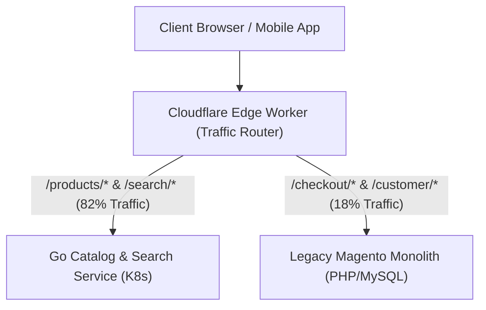

[← Previous Chapter: Part 5: Migrating Magento EAV Schema](/series/composable-commerce-migration/part-5-eav-schema-migration/) | [Series Hub](/series/composable-commerce-migration/) | [Next Chapter: Part 7: Phase 2 — Dual-Write CDC →](/series/composable-commerce-migration/part-7-phase2-dual-write/)

---

> **Answer-first:** Phase 1 of the Strangler Fig migration routes catalog read traffic (`/products/*`, `/catalog/*`, `/search/*`) to high-speed Go microservices via Cloudflare Edge Workers while keeping Magento active for checkout. This offloads **82% of server compute load** from the legacy monolith with zero downtime.

---


---

## 1. Cloudflare Edge Routing Implementation

```typescript
// cloudflare-edge-router.ts
export default {
  async fetch(request: Request, env: Env): Promise<Response> {
    const url = new URL(request.url);

    // Route Catalog & Search to new Go Microservices
    if (url.pathname.startsWith('/api/v1/products') || url.pathname.startsWith('/api/v1/search')) {
      return fetch(`https://catalog-api.example.com${url.pathname}${url.search}`, request);
    }

    // Fallback all other requests (Checkout, Admin) to legacy Magento
    return fetch(`https://legacy-magento.example.com${url.pathname}${url.search}`, request);
  }
};
```
