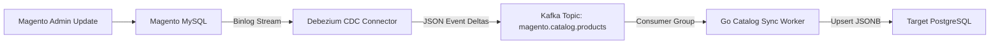

[← Previous Chapter: Part 6: Phase 1 — Strangler Fig](/series/composable-commerce-migration/part-6-phase1-strangler-fig/) | [Series Hub](/series/composable-commerce-migration/) | [Next Chapter: Part 8: Phase 3 — Full Cutover →](/series/composable-commerce-migration/part-8-phase3-full-cutover/)

---

> **Answer-first:** Dual-writing at the application layer creates race conditions and split-brain states. Instead, Phase 2 implements **Change Data Capture (CDC)** via Debezium reading the MySQL binlog directly, streaming event deltas through Apache Kafka to populate PostgreSQL microservice databases asynchronously.

---

