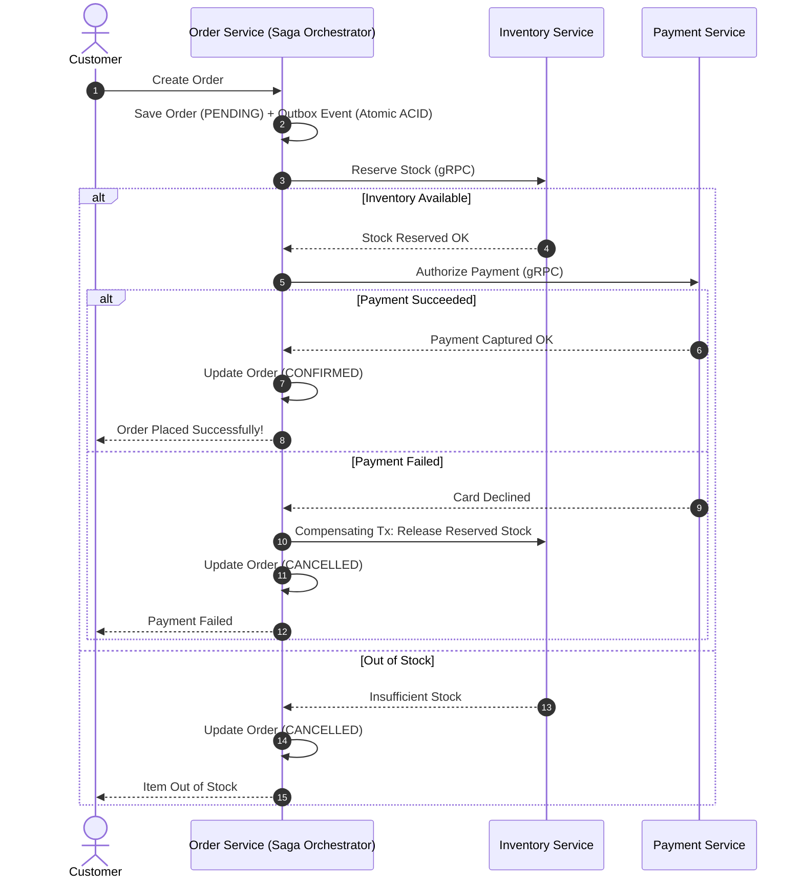

[← Previous Chapter: Part 8: Phase 3 — Full Cutover](/series/composable-commerce-migration/part-8-phase3-full-cutover/) | [Series Hub](/series/composable-commerce-migration/) | [Next Chapter: Part 10: ADR Walkthrough — 24 Architecture Decisions →](/series/composable-commerce-migration/part-10-adr-walkthrough/)

---

> **Answer-first:** In a distributed e-commerce architecture without 2-Phase Commit (2PC), distributed consistency is achieved via the **Transactional Outbox Pattern** (saving domain events in the same SQL ACID transaction as business state) and **Orchestrated Sagas** (executing compensating transactions upon payment or inventory failure).

---

