[📖 Bản tiếng Việt (Vietnamese Edition)](https://learn.tanhdev.com/series/core-banking-architecture/)

---

# Core Banking Systems Architecture Masterclass Guide

**Answer-first:** Modern cloud-native core banking architecture replaces brittle mainframe monoliths with decoupled, distributed primitives: deterministic append-only double-entry ledgers, multi-region distributed SQL with bounded consensus latency, event-sourced CQRS projections, orchestrated compensation Sagas, zero-allocation ISO 20022 parsing, FAPI 2.0 sender-constrained security, and real-time streaming Complex Event Processing (CEP). This masterclass delivers actionable architecture specifications, production DDL schemas, low-latency benchmarks, and zero-downtime resilience blueprints.

---

## 1. The Architectural Paradigm Shift in Modern Banking

The global banking sector is transitioning from batch-driven, monolithic core systems (such as legacy IBM mainframes or monolithic Temenos T24/Finacle deployments) toward **autonomous, composable, event-driven distributed platforms**. Historically, end-of-day (EOD) batch processing halted digital banking operations to rebalance general ledgers. Modern digital banking demands continuous 24/7/365 active-active operation with sub-25ms P99 latency and strict Zero Data Loss ($\text{RPO} = 0, \text{RTO} < 10\text{s}$).

---

## 2. Masterclass Curriculum & Modular Roadmap

This masterclass is structured as an eight-part engineering journey spanning every tier of the financial technology stack, moving systematically from storage engine mechanics to distributed consensus, event streaming, interbank protocols, security, and verification testing:

```mermaid
graph LR
    Part1["Part 1: Double-Entry Ledger Schema"] --> Part2["Part 2: Distributed SQL & Latency"]
    Part2 --> Part3["Part 3: Event Sourcing & CQRS"]
    Part3 --> Part4["Part 4: Saga Distributed Transactions"]
    Part4 --> Part5["Part 5: ISO 20022 Payment Gateways"]
    Part5 --> Part6["Part 6: FAPI 2.0 Security & mTLS"]
    Part6 --> Part7["Part 7: Streaming Fraud Detection"]
    Part7 --> Part8["Part 8: QA & SDET Testing Handbook"]
```

### Complete Chapter Breakdown

1. **[Part 1: Double-Entry Ledger: Schema, Immutability & Locking](/series/core-banking-architecture/part-1-double-entry-ledger-schema/)**  
   *Deep dive into database schema design for financial ledgers. Explores 128-byte TigerBeetle structs, PostgreSQL 17 append-only journal tables, atomic debit-credit balance constraints, and optimistic vs pessimistic locking under high concurrency.*

2. **[Part 2: Distributed SQL & ACID Latency: TiDB vs CockroachDB vs Spanner](/series/core-banking-architecture/part-2-distributed-sql-acid-latency/)**  
   *Consensus latency budgets under multi-region replication. Evaluates Google Spanner TrueTime, CockroachDB Hybrid Logical Clocks (HLC), and TiDB Percolator TSO for financial transaction serializability.*

3. **[Part 3: Event Sourcing & CQRS: Immutable Ledger Design for Microservices](/series/core-banking-architecture/part-3-event-sourcing-cqrs/)**  
   *Separating write-side command models from high-speed read projections. Covers Kafka transactional outbox with Debezium CDC, Protobuf schema registries, and balance state hydration.*

4. **[Part 4: Saga Pattern: Distributed Transactions Without 2PC](/series/core-banking-architecture/part-4-saga-pattern/)**  
   *Eliminating blocking Two-Phase Commit across autonomous microservices. Implements durable workflow orchestration via Temporal and Go, deterministic state machines, and idempotent compensation routines.*

5. **[Part 5: ISO 20022 & Payment Gateways: Parsing pacs.008, Idempotency, and Gateway Latency](/series/core-banking-architecture/part-5-iso-20022-payment-gateways/)**  
   *High-throughput interbank clearing engines. Dissects ISO 20022 XML schemas (`pacs.008`, `pacs.002`, `camt.053`), zero-allocation streaming parsers in Go, and NAPAS 24/7 / VietQR gateway routing.*

6. **[Part 6: FAPI 2.0 & API Security: DPoP, mTLS, and Sender-Constrained Tokens](/series/core-banking-architecture/part-6-fapi-2-api-security/)**  
   *Financial-Grade API specifications for Open Banking. Details RFC 9449 Demonstrating Proof-of-Possession (DPoP), RFC 8705 mutual TLS, PKCS#11 Hardware Security Module (HSM) attestation, and SBV regulatory compliance.*

7. **[Part 7: Streaming Fraud Detection: Apache Flink CEP, RocksDB & ML Inference](/series/core-banking-architecture/part-7-streaming-fraud-detection/)**  
   *Real-time risk scoring and anomalous pattern detection. Implements Apache Flink Complex Event Processing with incremental RocksDB state backends, sliding velocity windows, and sub-10ms online feature stores.*

8. **[Part 8: QA & SDET Handbook: Testing Distributed Financial Systems](/series/core-banking-architecture/part-8-qa-sdet-handbook/)**  
   *Industrial-strength reliability engineering. Harnesses Jepsen linearizability tests, Chaos Mesh network partition injections, Go 1.24 virtual-time concurrency testing (`testing/synctest`), and shadow traffic replay.*

---

## 3. Financial Systems Engineering Matrix

The technical matrix below outlines the core components, key software stacks, and primary non-functional requirements (NFR) evaluated throughout this series:

| Architectural Tier | Primary Technologies | SOTA Engineering Pattern | Key Performance Metric |
| :--- | :--- | :--- | :--- |
| **Ledger Storage** | TigerBeetle, PostgreSQL 17 | Append-only immutable journals; minor integer units | $\sum \text{Debits} \equiv \sum \text{Credits}$; 0 round-off drift |
| **Distributed SQL** | TiDB, CockroachDB, Spanner | Multi-Raft consensus, locality-aware range leases | P99 latency < 25ms local, < 60ms cross-region |
| **Event Streaming** | Kafka, Debezium, EventStoreDB | CQRS outbox CDC; immutable event sourcing | Consumer projection lag < 50ms |
| **Workflows & Sagas** | Temporal, Go SDK | Orchestrated state machine with semantic rollbacks | 100% idempotent compensation execution |
| **Interbank Rails** | ISO 20022 XML, NAPAS VietQR | Zero-alloc streaming parsing, deduplication bloom filters | Message ingestion < 2ms per packet |
| **Security & Auth** | FAPI 2.0, DPoP, CloudHSM | Sender-constrained token binding, PKCS#11 key attestation | Zero bearer-token replay vulnerability |
| **Fraud & Risk** | Apache Flink CEP, RocksDB, Redis | Stateful sliding windows, real-time ML feature store | End-to-end evaluation latency < 10ms |
| **Resilience & QA** | Chaos Mesh, Jepsen, Go synctest | Automated partition injection, invariant fuzzing | Continuous zero-loss verification ($\text{RPO} = 0$) |

---

## Frequently Asked Questions (FAQ)


Legacy core banking platforms relied on centralized monolithic mainframes with nightly end-of-day (EOD) batch processing windows that blocked real-time customer transfers. Modern cloud-native core banking decouples accounting ledgers, account management, and payment execution into autonomous microservices that operate 24/7/365 without downtime. They leverage distributed SQL, immutable event sourcing, and orchestrated Sagas to guarantee serializable ACID transactions across geographically separated regions.



Enforcing double-entry invariants in application code leaves the financial system vulnerable to concurrent race conditions, uncaught application crashes, and partial database writes. By encoding $\sum \text{Debits} = \sum \text{Credits}$ into database schema check constraints, deferred triggers, or specialized ledger engines like TigerBeetle, the database guarantees that mathematically unbalanced transactions are rejected at the atomic commit stage, eliminating balance drift and audit failures.



Two-Phase Commit (2PC) creates tight availability coupling, holds database locks across network boundaries, and stalls during network partitions. Modern banking architectures replace 2PC with centralized Saga Orchestration (e.g., using Temporal). In an orchestrated Saga, each microservice executes a local ACID transaction, and the workflow coordinator tracks state transitions. If a downstream step fails, the orchestrator triggers idempotent compensating transactions to semantically reverse preceding operations without holding distributed locks.

