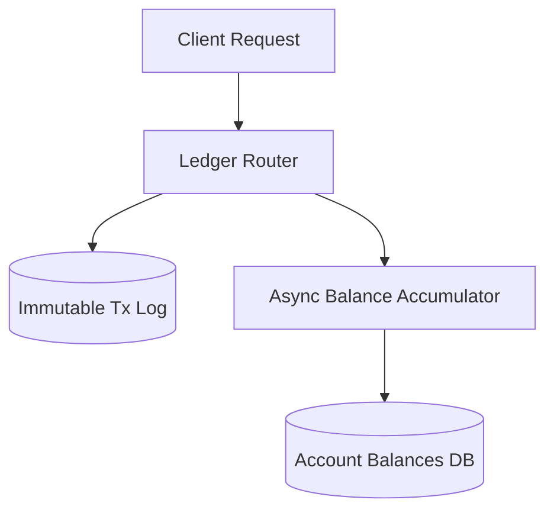

# Double-Entry Ledger: Immutable Schema & Concurrency

**Answer-first:** A production-grade double-entry ledger enforces immutable, append-only transaction logs decoupled from balance state updates. By using fixed-size C-aligned memory structs or PostgreSQL check constraints and triggers, the schema guarantees strict debit-credit mathematical invariants, prevents hot-row lock contention, and eliminates double-spend risks in high-concurrency core banking architectures.

> **Executive Summary & Quick Answer**: Ultra-high-throughput ledger systems require specialized schema layouts like TigerBeetle's 128-byte fixed structures or PostgreSQL partition tables decoupling balance accumulation from transaction insertion. Isolating transaction logging from balance state eliminates hot-row lock contention, enabling 10,000+ TPS.

> **Pillar Architecture Guide:** This article is part of the **[Architecting 21-Service E-commerce with Golang & DDD](/posts/architecting-21-service-ecommerce-golang-ddd/)** series. Please refer to the original article for an in-depth overview of the architecture.

> **Series (Part 1 of 8):** This series analyzes production-grade Core Banking architecture. This article focuses on the most critical foundation: schema design for a Double-Entry Ledger and concurrency locking strategies. If you are new to Core Banking, please read the [Core Banking Developer Series](/series/core-banking-developer/) first.

> **⚠️ Note:** This article is synthesized from official documentation, engineering blogs, and published benchmark papers. The latency figures and schema designs reflect the source material at the time of writing. Always verify with your team's architect or lead engineer before applying them to a production system.

## What is a Double-Entry Ledger Database Schema?

**Answer-first:** A double-entry ledger schema enforces strict debit and credit transaction pairing in append-only tables, preventing silent balance drift.

A database schema for a double-entry ledger requires immutability, ACID guarantees, and precise locking mechanisms to avoid race conditions. Modern systems like TigerBeetle eliminate traditional pessimistic locking by using a single-threaded state machine, achieving 1,000,000 TPS on a single CPU core. For scaling into a distributed environment, see [Part 2 — Distributed SQL & ACID Latency](/series/core-banking-architecture/part-2-distributed-sql-acid-latency/) for a comparison between TiDB, CockroachDB, and Spanner.

The following architecture diagram illustrates how high-throughput banking ledgers decouple client transaction insertion into an append-only write log while asynchronously updating balance records:



---

## The Core Problem: Why is a Ledger Schema More Complex Than You Think?

**Answer-first:** Ledger schemas must guarantee ACID balance invariants under extreme concurrency, eliminating deadlocks and double-spend race conditions.

Most developers entering Fintech think a ledger simply consists of two operations:

The following SQL snippet illustrates the naive balance update anti-pattern that leads to severe concurrency race conditions and loss of audit trails:

```sql
UPDATE accounts SET balance = balance - 1000000 WHERE id = 'A';
UPDATE accounts SET balance = balance + 1000000 WHERE id = 'B';
```

This is a **completely flawed design** for three reasons:

1. **No audit trail**: It is impossible to know which transactions formed the current balance.
2. **Not immutable**: Any `UPDATE` destroys accounting history — violating GAAP standards and Central Bank regulations.
3. **Race condition**: Two concurrent transactions reading the same balance → overwriting each other → double-spend.

The correct standard is to write **journal entries** into a ledger table, where each transaction creates at least two Debit/Credit entries (double-entry), and the sum must equal zero.

---

## Mambu GL Schema: A Real-World Production Schema

**Answer-first:** Mambu General Ledger schema partitions accounts into multi-currency sub-ledgers with explicit audit journal entries for all balance mutations.

[Mambu](https://api.mambu.com/) — one of the leading Core Banking SaaS platforms — designs their GL (General Ledger) table with explicit immutability principles.

The table below outlines the core schema structure and column attributes required for enterprise General Ledger entry logging:

| Column | Type | Meaning |
|--------|------|---------|
| `entryid` | `BIGINT AUTO_INCREMENT` | Sequential primary key |
| `encodedkey` | `VARCHAR(36) UNIQUE` | Immutable UUID of the entry — never changes |
| `transactionid` | `VARCHAR(36)` | Link to the origin transaction |
| `accountkey` | `VARCHAR(36)` | The affected account |
| `type` | `ENUM('DEBIT','CREDIT')` | Entry type |
| `amount` | `DECIMAL(18,4)` | The amount (non-negative) |
| `reversalentrykey` | `VARCHAR(36) NULL` | Points back to the origin entry if this is a reversal |
| `created_at` | `TIMESTAMPTZ` | Immutable timestamp |

**Mambu's Immutability Principle**: Once an `entryid` is written to the database, no `UPDATE` or `DELETE` is permitted. To correct a mistake, the system creates a **new reversal entry** pointing to the flawed entry's `encodedkey` via the `reversalentrykey` column. This is the true mechanism of an audit trail.

---

## TigerBeetle: The 1,000,000 TPS Ledger Architecture

**Answer-first:** TigerBeetle achieves 1,000,000 TPS by storing 128-byte fixed-size ledger structs in memory-mapped static memory arrays without CGO overhead.

[TigerBeetle](https://docs.tigerbeetle.com/concepts/performance/) is a purpose-built database for financial ledgers, written in Zig. It achieves **1,000,000 TPS on a single CPU core** by completely avoiding database locking through a single-threaded state machine architecture.

### TigerBeetle Account Struct (128 bytes, C ABI aligned)

The Zig source code snippet below defines TigerBeetle's CPU cache-line aligned Account and Transfer byte structures:

```zig
// TigerBeetle Account Struct — exactly 128 bytes, CPU cache-line aligned
pub const Account = extern struct {
    id: u128,                 // 16 bytes: Unique identifier (UUIDv4/v7 or custom monotonic ID)
    debits_pending: u128,     // 16 bytes: Amount reserved in pending transfers
    debits_posted: u128,      // 16 bytes: Total debit fully committed
    credits_pending: u128,    // 16 bytes: Amount reserved on the credit side
    credits_posted: u128,     // 16 bytes: Total credit fully committed
    user_data_128: u128,      // 16 bytes: Custom metadata (e.g., customer_id)
    user_data_64: u64,        //  8 bytes: Custom metadata
    user_data_32: u32,        //  4 bytes: Custom metadata
    reserved: u32 = 0,        //  4 bytes: Padding to hit exactly 128 bytes
    ledger: u32,              //  4 bytes: Grouping accounts by currency / asset type
    code: u16,                //  2 bytes: Chart of Accounts code (e.g., 1001 = cash)
    flags: u16,               //  2 bytes: Business rules flags
    timestamp: u64,           //  8 bytes: Nanosecond timestamp (managed by the cluster)
};

// TigerBeetle Transfer Struct — 128 bytes, same alignment
pub const Transfer = extern struct {
    id: u128,                 // 16 bytes: Unique transfer ID
    debit_account_id: u128,   // 16 bytes: Account being debited
    credit_account_id: u128,  // 16 bytes: Account being credited
    amount: u128,             // 16 bytes: Asset amount to transfer
    pending_id: u128,         // 16 bytes: ID of the pending transfer (used in two-phase)
    user_data_128: u128,      // 16 bytes: Custom metadata
    user_data_64: u64,        //  8 bytes: Custom metadata
    user_data_32: u32,        //  4 bytes: Custom metadata
    timeout: u32 = 0,         //  4 bytes: Auto-void timeout in seconds
    ledger: u32,              //  4 bytes: Must match the ledger of both accounts
    code: u16,                //  2 bytes: Custom category code
    flags: u16,               //  2 bytes: Config flags (pending, post_pending, void_pending)
    timestamp: u64,           //  8 bytes: Nanosecond timestamp upon commit to log
};
```

**Why 128 bytes?** So each struct occupies exactly one CPU cache line (64–128 bytes depending on architecture), maximizing throughput during batch processing. TigerBeetle batches up to **8,190 requests** per call to kernel I/O (`io_uring`).

### Two-Phase Transfer: The Real Math

When a `Transfer` has the `pending` flag, the database reserves the funds but does not post them to final balances:

The state mutations for Phase 1 pending fund reservations are calculated as follows:

```
debit_account.debits_pending  += transfer.amount
credit_account.credits_pending += transfer.amount
```

Upon successful transfer authorization, the Phase 2A commit state transformations execute:

```
debit_account.debits_pending  -= transfer.amount
debit_account.debits_posted   += transfer.amount
credit_account.credits_pending -= transfer.amount
credit_account.credits_posted  += transfer.amount
```

If the pending transaction times out or fails authorization, Phase 2B voiding releases the reserved funds:

```
debit_account.debits_pending  -= transfer.amount
credit_account.credits_pending -= transfer.amount
```

---

## PostgreSQL DDL: Double-Entry Schema With Enforcement

**Answer-first:** PostgreSQL double-entry DDL uses check constraints, trigger verification functions, and NUMERIC data types to guarantee zero balance discrepancy.

The following SQL DDL script configures production tables, indexes, and an automatic balance assertion trigger:

```sql
-- Accounts Table: Defines accounts within the Chart of Accounts
CREATE TABLE accounts (
    id              UUID PRIMARY KEY,
    name            VARCHAR(100) NOT NULL,
    currency        CHAR(3) NOT NULL,           -- ISO 4217: 'VND', 'USD', 'JPY'
    debit_balance   NUMERIC(18, 4) DEFAULT 0.0000 NOT NULL 
                    CHECK (debit_balance >= 0),
    credit_balance  NUMERIC(18, 4) DEFAULT 0.0000 NOT NULL 
                    CHECK (credit_balance >= 0),
    type            VARCHAR(20) NOT NULL 
                    CHECK (type IN ('ASSET', 'LIABILITY', 'EQUITY', 'REVENUE', 'EXPENSE')),
    created_at      TIMESTAMP WITH TIME ZONE DEFAULT CURRENT_TIMESTAMP
);

-- Transactions Table: Header for each group of journal entries
CREATE TABLE transactions (
    id              UUID PRIMARY KEY,
    description     VARCHAR(255),
    posted_at       TIMESTAMP WITH TIME ZONE NOT NULL
);

-- Entries Table: Individual Debit/Credit lines (the "legs" of a transaction)
CREATE TABLE entries (
    transaction_id  UUID NOT NULL REFERENCES transactions(id) ON DELETE CASCADE,
    account_id      UUID NOT NULL REFERENCES accounts(id),
    amount          NUMERIC(18, 4) NOT NULL CHECK (amount <> 0),
    direction       VARCHAR(6) NOT NULL CHECK (direction IN ('DEBIT', 'CREDIT'))
);

-- Indexes to speed up balance lookups
CREATE INDEX idx_entries_account_id     ON entries(account_id);
CREATE INDEX idx_entries_transaction_id ON entries(transaction_id);

-- Trigger: Enforce balance invariant — total DEBIT must = total CREDIT in the same transaction
CREATE OR REPLACE FUNCTION verify_transaction_balance()
RETURNS TRIGGER AS $$
DECLARE
    balance_sum NUMERIC(18, 4);
BEGIN
    SELECT COALESCE(
        SUM(CASE WHEN direction = 'DEBIT' THEN amount ELSE -amount END),
        0
    )
    INTO balance_sum
    FROM entries
    WHERE transaction_id = NEW.transaction_id;

    IF balance_sum <> 0 THEN
        RAISE EXCEPTION 
            'Transaction unbalanced: SUM(DEBIT) - SUM(CREDIT) = %. Transaction ID: %',
            balance_sum, NEW.transaction_id;
    END IF;
    RETURN NEW;
END;
$$ LANGUAGE plpgsql;

CREATE TRIGGER trg_verify_balance
AFTER INSERT ON entries
FOR EACH ROW EXECUTE FUNCTION verify_transaction_balance();
```

> **Note:** Always use `NUMERIC(18, 4)` or `BIGINT` (for the smallest denomination, e.g., cents). **Never use `FLOAT` or `DOUBLE`** — floating-point precision errors will accumulate over millions of transactions and cause the ledger to unbalance.

---

## Balance Invariants: Three Mathematical Rules

**Answer-first:** Three fundamental ledger invariants demand equal debits and credits per transaction, non-negative available balances, and immutable history.

Modern banking engines maintain strict zero-trust balance assertions across every transaction cycle. Beyond basic double-entry balance equality ($\sum \text{Debits} = \sum \text{Credits}$), accounting ledgers continuously enforce three core mathematical constraints across account categories:

**1. Basic Non-Negative Balance Invariant:**
All pending and committed balance accumulations must remain non-negative:
$$\text{debits\_pending} + \text{debits\_posted} \ge 0$$
$$\text{credits\_pending} + \text{credits\_posted} \ge 0$$

**2. Asset Account Invariant (Deposit & Checking Accounts):**
Customer deposit balances represent bank liabilities. Total pending and committed debits cannot exceed total posted credits without an authorized overdraft limit:
$$\text{debits\_pending} + \text{debits\_posted} \le \text{credits\_posted}$$

**3. Liability & Equity Invariant (Bank Capital Accounts):**
Bank operational accounts enforce that total credit obligations do not exceed allocated debit capital reserves:
$$\text{credits\_pending} + \text{credits\_posted} \le \text{debits\_posted}$$

---

## Concurrency Locking: Pessimistic vs Optimistic vs TigerBeetle

**Answer-first:** Comparing concurrency strategies shows pessimistic row locks prevent race conditions, while TigerBeetle uses static batching for speed.

The benchmark table below compares transaction throughput, latency degradation under high contention, and failure risks across primary database concurrency control strategies:

| Strategy | TPS (low contention) | TPS (high contention, 1000+ TPS) | Risks |
|----------|---------------------|----------------------------------|--------|
| **Pessimistic Locking** (SELECT FOR UPDATE) | ~5,000 TPS | <100 TPS (deadlock risk) | Deadlocks if not locked in order |
| **Optimistic Locking** (version column) | ~20,000 TPS | Retry rate >90% | Retry storms, livelocks |
| **TigerBeetle Single-Threaded** | 1,000,000 TPS | 1,000,000 TPS (unchanged) | No locking — sequential by design |

Source: [TigerBeetle Concepts](https://docs.tigerbeetle.com/concepts/performance/), ACM benchmark papers.

### PostgreSQL Pessimistic Locking (Production Pattern)

The following SQL transaction block demonstrates deterministic account locking by sorting target account IDs prior to acquiring exclusive row locks:

```sql
BEGIN;

-- Lock both accounts in ID order to avoid deadlocks
-- Rule: ALWAYS lock the account with the smaller ID first
SELECT id, debit_balance, credit_balance
FROM accounts
WHERE id IN ('account-A', 'account-B')
ORDER BY id  -- Deterministic order — prevents deadlocks
FOR UPDATE;

-- Check if balance is sufficient
-- INSERT into transactions
-- INSERT into entries (Debit and Credit)
-- UPDATE account balances

COMMIT;
```

### Why Doesn't TigerBeetle Need Locking?

TigerBeetle uses a **single-threaded state machine** — the entire ledger runs on a single CPU core with `io_uring` for async I/O. No concurrent writes, no locks, no deadlocks. All requests are **batched** and processed sequentially with deterministic execution.

---

## Lessons from Production Systems

**Answer-first:** Production ledger lessons highlight using append-only transaction logs, numeric ID sorting for deadlock prevention, and async projections.

**Immutable rules for a Double-Entry Ledger:**

1. **Only INSERT, never UPDATE/DELETE** on committed ledger entries.
2. **Every transaction must be atomic** — all entries commit together or rollback together.
3. **Store money as integers** (BIGINT or NUMERIC) — never FLOAT.
4. **Verify invariants periodically** using reconciliation queries.
5. **Lock in deterministic order** when pessimistically locking multiple accounts.

The SQL health check query below runs on a 5-minute cron schedule to verify zero global debit-credit discrepancies across committed transactions:

```sql
-- Detect any transaction where SUM(DEBIT) != SUM(CREDIT)
SELECT
    transaction_id,
    SUM(CASE WHEN direction = 'DEBIT' THEN amount ELSE -amount END) AS discrepancy
FROM entries
GROUP BY transaction_id
HAVING SUM(CASE WHEN direction = 'DEBIT' THEN amount ELSE -amount END) <> 0;

-- Expected result: 0 rows. If rows exist -> trigger P1 alert immediately.
```

---

## QA & SDET Testing Strategy

**Answer-first:** Ledger QA testing strategies run automated invariant checks across concurrent money transfers to verify zero balance discrepancy.

### Test 1: Concurrent Double-Spend Prevention

The Go unit test below launches 100 concurrent goroutines against a single account to verify that pessimistic locking prevents overdrawing available funds:

```go
// Run 100 concurrent goroutines to withdraw $10 from an account with a $100 balance
func TestConcurrentWithdrawal(t *testing.T) {
    const (
        numWorkers     = 100
        withdrawAmount = 10_000   // $10 in cents
        initialBalance = 100_000  // $100 in cents
    )
    
    var (
        successCount atomic.Int64
        wg           sync.WaitGroup
    )
    
    for i := 0; i < numWorkers; i++ {
        wg.Add(1)
        go func() {
            defer wg.Done()
            err := withdrawFunds("account-A", withdrawAmount)
            if err == nil {
                successCount.Add(1)
            }
        }()
    }
    wg.Wait()
    
    // Exactly 10 requests should succeed
    assert.Equal(t, int64(10), successCount.Load(),
        "Only 10 withdrawals permitted with a $100 balance")
    
    // No double-spend: final balance must be $0
    balance := getBalance("account-A")
    assert.Equal(t, int64(0), balance, "Balance after all funds withdrawn must be 0")
}
```

### Test 2: Continuous Reconciliation Job

The Go function below queries the transaction database for unbalanced journal entries and raises automated alerts if discrepancies are detected:

```go
type UnbalancedTx struct {
    TransactionID string
    Discrepancy   int64
}

func reconcileAllTransactions(db *sql.DB) ([]UnbalancedTx, error) {
    query := `
        SELECT transaction_id, 
               SUM(CASE WHEN direction = 'DEBIT' THEN amount ELSE -amount END) AS discrepancy
        FROM entries
        GROUP BY transaction_id
        HAVING SUM(CASE WHEN direction = 'DEBIT' THEN amount ELSE -amount END) <> 0
    `
    rows, err := db.Query(query)
    if err != nil {
        return nil, err
    }
    defer rows.Close()

    var unbalanced []UnbalancedTx
    for rows.Next() {
        var tx UnbalancedTx
        if err := rows.Scan(&tx.TransactionID, &tx.Discrepancy); err != nil {
            return nil, err
        }
        unbalanced = append(unbalanced, tx)
    }
    return unbalanced, nil
}
```

---

### High-Throughput Ledger Sharding and Row Locking Contention

In transactional systems, row-level locking on balance tables is a primary cause of latency bottlenecks. When a popular merchant account (such as a major utility provider or e-commerce merchant) receives thousands of payments simultaneously, database transactions queue up waiting for an exclusive write lock on the merchant's balance row. This resource contention degrades database performance and leads to transaction timeout failures.

To eliminate this hot-spot contention, core banking ledgers implement the Split-Balance (or Shared-Balance) Pattern:
- **Balance Sharding:** Instead of representing an account balance as a single row in the database, the system splits the balance record into N distinct shard rows (for example, shard 1 through N allocated by account ID hash mod).
- **Distributed Writes:** When depositing funds to the merchant account, the application randomly selects one of the N shards to update. This distributes the row-level write locks across N independent records, reducing locking contention by a factor of N.
- **Aggregated Reads:** To retrieve the total account balance, the query aggregates the balance values across all N shard rows, aggregating them on read.
- **Reconciliation:** An offline cron job periodically consolidates the balance shards back into a single record during low-traffic windows to clean up the database index.

## Ledger Partitioning Strategies and Multi-Tenant Ledger Isolation Patterns

**Answer-first:** Partitioning ledgers by tenant or account range distributes database I/O while preserving isolated transaction isolation boundaries.

In high-throughput financial core banking systems, ledger databases scale by implementing partition models. This isolates transactional data, reducing row-level locks and distributing storage.

### Ledger Database Partitioning Models

To maintain sub-10ms response times while executing millions of transactions, ledger tables are partitioned:
1. **Range Partitioning by Date:** Ledger entries are partitioned horizontally by month (e.g., `entries_2026_05`). Active writes only target the current month's partition, keeping index trees small. Historical partitions are set to read-only, allowing partition pruning during audits.
2. **Hash Partitioning by Account ID:** For balance tables, rows are sharded using hash partition models (e.g., `account_id % partition_count`). This distributes balance updates across multiple database nodes, eliminating write bottlenecks on hot account records.

### Cryptographic Audit-Trail Security

Ledger integrity is guaranteed using cryptographic block hashing:
- **Chained Entry Hashes:** Each ledger entry contains a cryptographic hash of the current record concatenated with the hash of the preceding entry:
  $$\text{Hash}_{N} = \text{HMAC-SHA256}\left(\text{Record}_{N} \parallel \text{Hash}_{N-1}\right)$$
- **Immutable Log Auditing:** Security agents verify the ledger periodically by re-calculating the hash chain. Any unauthorized row modification breaks the cryptographic chain, triggering real-time alerts.

### Multi-Tenant Isolation Patterns

For enterprise core systems hosting multiple banks or branches, ledger tables enforce multi-tenant isolation:
- **Logical Isolation:** Shared tables using tenant identifier columns. PostgreSQL Row-Level Security (RLS) policies filter records automatically based on connection contexts.
- **Physical Isolation:** Dedicated schemas or databases per tenant. This guarantees complete database resource isolation and simplifies compliance with local data residency laws.

## Frequently Asked Questions (FAQ)

**Answer-first:** Building production-grade ledgers requires enforcing double-entry invariants, immutable transaction logs, and pessimistic row locking.


Not necessarily. TigerBeetle is optimized specifically for high-throughput financial ledgers exceeding 100,000 transactions per second, but it does not support generalized SQL queries or complex relational joins. If your application requires rich reporting queries, dynamic ORM integrations, or custom relational joins, combining a PostgreSQL double-entry schema with read-side indexing is a more appropriate choice.



Floating-point numbers based on the IEEE 754 standard cannot represent base-10 decimal fractions precisely in binary formats. For instance, computing simple additions like 0.1 plus 0.2 yields precision artifacts such as 0.30000000000000004. Over millions of aggregated financial transactions, these fractional rounding errors compound rapidly, creating severe accounting discrepancies and invalidating debit-credit ledger balance invariants. Always store currency values using exact NUMERIC data types or 64-bit integers representing fractional minor units like cents.



A Reversal Entry is a permanent accounting operation that creates a new debit or credit record pointing back to a previously committed transaction via a reversal key to correct settled ledger states without altering history. In contrast, a Void Entry cancels an unsettled pending transfer during two-phase commit reservation, releasing locked credit or debit limits without adding permanent posting entries to the General Ledger.


To learn more about foundational accounting structures, read [Part 1: Double-Entry Ledger Core Banking Guide](/series/core-banking-developer/part-1-double-entry-ledger/) or consult our core banking engineering practice via [Architecture Consultation & Engineering Services](/hire/).
---

*Up Next: [Part 2 — Distributed SQL & ACID Latency: TiDB vs CockroachDB vs Spanner](/series/core-banking-architecture/part-2-distributed-sql-acid-latency/) — Detailed analysis of 2PC overhead, TrueTime math, and Percolator lock recovery.*


