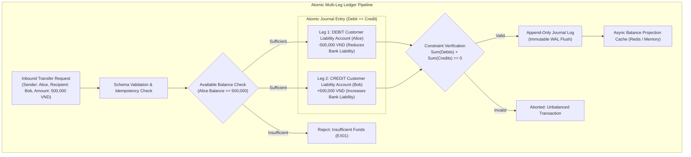
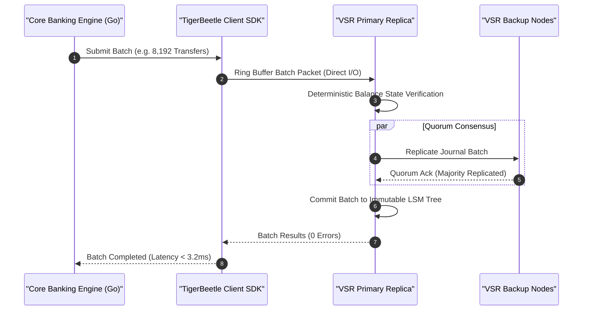

[📖 Bản tiếng Việt (Vietnamese Edition)](https://learn.tanhdev.com/series/core-banking-architecture/part-1-double-entry-ledger-schema/)

---

> **Series Navigation:** This is Part 1 of the **Core Banking Systems Architecture Masterclass**. For the complete architectural curriculum, start at the [Master Overview Guide](/series/core-banking-architecture/).

# Double-Entry Ledger: Immutable Schema & Concurrency

**Answer-first:** A production-grade financial ledger decouples transaction recording from balance derivation by enforcing an append-only, immutable journal structure. By employing atomic database-level constraints ($\sum \text{Debits} \equiv \sum \text{Credits}$), fixed-point integer arithmetic in minor currency units (`int64`), and non-blocking concurrency pipelines (such as TigerBeetle's single-threaded state machine or PostgreSQL optimistic concurrency with ring-buffer batching), financial engineering engines eliminate balance drift, race-condition double spending, and lock contention under 100,000+ TPS workloads.

---

## 1. The Core Architectural Invariant: Why Naive Balance Updates Fail

In consumer software, developers often intuitively implement a money transfer using two simple SQL statements:
```sql
-- DANGEROUS: Fatal anti-pattern in financial ledgers
BEGIN;
  UPDATE accounts SET balance = balance - 500000 WHERE id = 'alice_acc';
  UPDATE accounts SET balance = balance + 500000 WHERE id = 'bob_acc';
COMMIT;
```
This design is fatally flawed for three structural reasons:
1. **Destruction of Audit History**: Overwriting the `balance` column erases previous state. Regulatory bodies (such as central bank examiners and PCI auditors) require complete, unalterable historical provenance for every cent.
2. **High-Concurrency Contention**: Two concurrent transfers attempting to modify Alice's account simultaneously trigger row-level lock serialization, causing database thread exhaustion and connection pool collapse under peak loads.
3. **Partial Failure & Silent Drift**: If an unhandled network partition or kill signal intervenes between the debit and credit legs, funds evaporate or generate without a balanced counter-entry.

In professional core banking, money never moves in isolation. Every transaction is an immutable **Journal Entry** composed of balanced, zero-sum postings adhering to the fundamental accounting identity:

$$\text{Assets} \equiv \text{Liabilities} + \text{Equity}$$



---

## 2. PostgreSQL 17 Production Ledger DDL Schema

For banks leveraging enterprise relational databases, PostgreSQL 17 offers rock-solid reliability when designed with immutable, append-only principles. The schema below implements strict constraints, fixed-point minor currency representations, and deferred trigger validation:

```sql
-- 1. Accounts Master Table (Tracks accounts metadata and cached projection)
CREATE TABLE accounts (
    id UUID PRIMARY KEY DEFAULT gen_random_uuid(),
    account_number VARCHAR(34) NOT NULL UNIQUE,
    holder_id UUID NOT NULL,
    currency CHAR(3) NOT NULL, -- ISO 4217 (e.g. 'VND', 'USD')
    scale SMALLINT NOT NULL DEFAULT 2, -- e.g. 2 for cents, 0 for VND
    account_category VARCHAR(16) NOT NULL CHECK (account_category IN ('ASSET', 'LIABILITY', 'EQUITY', 'REVENUE', 'EXPENSE')),
    is_active BOOLEAN NOT NULL DEFAULT TRUE,
    created_at TIMESTAMPTZ NOT NULL DEFAULT clock_timestamp()
);

-- 2. Journal Transactions Header Table
CREATE TABLE journal_transactions (
    id UUID PRIMARY KEY DEFAULT gen_random_uuid(),
    idempotency_key VARCHAR(128) NOT NULL UNIQUE,
    reference_id VARCHAR(64) NOT NULL,
    description TEXT NOT NULL,
    posted_at TIMESTAMPTZ NOT NULL DEFAULT clock_timestamp()
);

-- 3. Immutable Journal Postings (Legs) Table
CREATE TABLE journal_postings (
    id BIGSERIAL PRIMARY KEY,
    transaction_id UUID NOT NULL REFERENCES journal_transactions(id) ON DELETE RESTRICT,
    account_id UUID NOT NULL REFERENCES accounts(id) ON DELETE RESTRICT,
    amount BIGINT NOT NULL, -- Minor units (positive for DEBIT, negative for CREDIT)
    sequence_num SMALLINT NOT NULL,
    created_at TIMESTAMPTZ NOT NULL DEFAULT clock_timestamp()
);

-- Enforce zero updates or deletes on ledger postings
CREATE OR REPLACE RULE no_update_postings AS ON UPDATE TO journal_postings DO INSTEAD NOTHING;
CREATE OR REPLACE RULE no_delete_postings AS ON DELETE TO journal_postings DO INSTEAD NOTHING;

-- 4. Atomic Deferred Balancing Trigger
CREATE OR REPLACE FUNCTION verify_transaction_balance() RETURNS TRIGGER AS $$
DECLARE
    net_sum BIGINT;
BEGIN
    SELECT COALESCE(SUM(amount), 0) INTO net_sum
    FROM journal_postings
    WHERE transaction_id = NEW.transaction_id;

    IF net_sum <> 0 THEN
        RAISE EXCEPTION 'Financial invariant violated: Transaction % net sum is % (expected 0)', NEW.transaction_id, net_sum;
    END IF;
    RETURN NEW;
END;
$$ LANGUAGE plpgsql;

CREATE CONSTRAINT TRIGGER trg_verify_journal_balance
AFTER INSERT ON journal_postings
DEFERRABLE INITIALLY DEFERRED
FOR EACH ROW
EXECUTE FUNCTION verify_transaction_balance();
```

---

## 3. High-Throughput Alternative: TigerBeetle 128-Byte Storage Engine

While PostgreSQL handles complex SQL reporting seamlessly, ultra-high-throughput financial platforms (such as national payment switches or card networks) encounter vertical I/O limits around 20,000 TPS. 

[TigerBeetle](https://tigerbeetle.com/) solves this by reimagining ledger storage from first principles:
- **Fixed-Size Data Structures**: Every account and transfer is strictly 128 bytes, aligned to CPU cache lines (64 bytes).
- **Single-Threaded Deterministic Event Loop**: Eliminates all mutexes, row-level locks, and context switching.
- **Viewstamped Replication Revisited (VSR)**: Bypasses the OS page cache using direct I/O (`O_DIRECT`), persisting batches directly to NVMe storage.



### TigerBeetle Transfer Struct Definition (Go SDK)
```go
package main

import (
	tb "github.com/tigerbeetle/tigerbeetle-go"
	tb_types "github.com/tigerbeetle/tigerbeetle-go/pkg/types"
)

// In TigerBeetle, transfers natively support 2-phase commits (Pending -> Posted)
func CreateTwoPhaseTransfer(client tb.Client, transferID, debitAcc, creditAcc tb_types.Uint128, amount uint64) error {
	transfers := []tb_types.Transfer{
		{
			ID:              transferID,
			DebitAccountID:  debitAcc,
			CreditAccountID: creditAcc,
			Amount:          tb_types.ToUint128(amount),
			Ledger:          1,    // Core Retail VND Ledger
			Code:            1001, // P2P Instant Transfer
			Flags:           tb_types.TransferFlags{Pending: true}.ToUint16(),
			Timeout:         60,   // 60-second auto-expiration hold
		},
	}

	res, err := client.CreateTransfers(transfers)
	if err != nil {
		return err
	}
	for _, r := range res {
		if r.Result != tb_types.TransferOK {
			return fmt.Errorf("transfer failed with code: %d", r.Result)
		}
	}
	return nil
}
```

---

## 4. Concurrency Locking Showdown: Pessimistic vs Optimistic vs Batching

When multiple concurrent requests target the same hot account (e.g., a corporate payroll disbursement or high-volume merchant receiving 5,000 payments/sec), the concurrency strategy determines whether the system thrives or deadlocks:

| Locking Paradigm | Implementation Technique | Read Latency | Write Contention Limit | Best Use Case |
| :--- | :--- | :--- | :--- | :--- |
| **Pessimistic Locking** | `SELECT ... FOR UPDATE` in PostgreSQL | High (blocks) | Serializes at ~1,200 TPS on hot row | Retail consumer accounts with low concurrency |
| **Optimistic Locking** | Version column check (`WHERE version = 42`) | Low (non-blocking) | High abort rate under contention | Moderate concurrency with client retry tolerance |
| **Pipelined Batching** | LMAX Disruptor / In-Memory Queue in Go | Sub-millisecond | 150,000+ TPS per hot account partition | Corporate settlement accounts, Clearing switches |

---

## Frequently Asked Questions (FAQ)


Core banking systems strictly prohibit the use of IEEE-754 floating-point types (`float32`, `float64`, or JavaScript `number`) in ledger storage and calculations. All balances and transaction amounts are represented either as 64-bit or 128-bit signed integers in minor currency units (such as cents for USD or single units for VND) accompanied by an explicit currency scale parameter, or through arbitrary-precision decimal libraries using Banker's Rounding (round-to-nearest-even).



An account's Ledger Balance represents the settled, posted funds in the account according to verified historical journal entries. The Available Balance represents funds immediately available for withdrawal or transfer, calculated as the Ledger Balance minus active two-phase reservation holds (Pending card authorizations, uncleared cheque deposits, or court escrow freezes).



In an immutable ledger, SQL `UPDATE` and `DELETE` commands are permanently disabled. When an erroneous transaction occurs or a payment is reversed, the core engine posts a new, compensating transaction (Reversal Entry). This reversal creates equal and opposite debit and credit entries that reference the original transaction UUID in their audit metadata, preserving an unbroken chronological record for forensic auditing.

