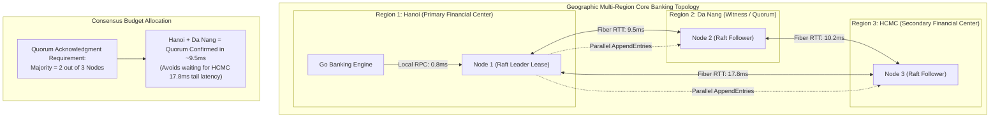
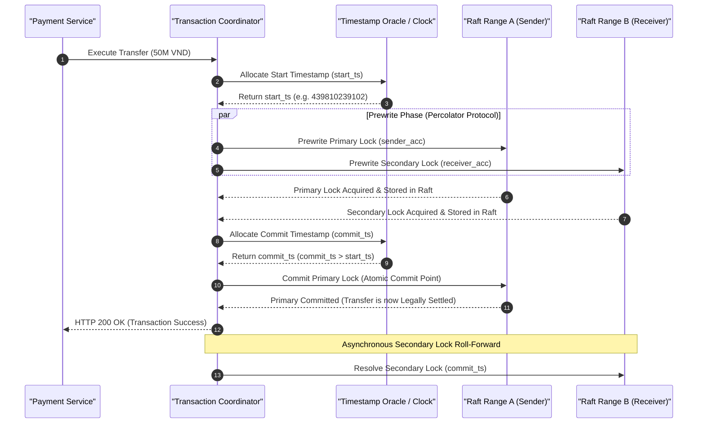

[📖 Bản tiếng Việt (Vietnamese Edition)](https://learn.tanhdev.com/series/core-banking-architecture/part-2-distributed-sql-acid-latency/)

---

> **Series Navigation:** This is Part 2 of the **Core Banking Systems Architecture Masterclass**. For the complete architectural curriculum, start at the [Master Overview Guide](/series/core-banking-architecture/).

# Distributed SQL ACID Latency: TiDB, CockroachDB & Spanner

**Answer-first:** Distributed SQL engines achieve horizontal write scalability and multi-datacenter fault tolerance by pairing Multi-Raft or Paxos replication with bounded distributed clock synchronization. However, cross-node consensus introduces unavoidable speed-of-light physical latency penalties. While local metro Raft commits complete in 2ms to 5ms, cross-region transactions (such as cross-region WAN links between financial centers) require 15ms to 45ms per commit round trip. Core banking platforms mitigate this through locality-aware range leasing, pipelined Percolator commit protocols, and asynchronous inter-region Saga choreography.

---

## 1. The Speed-of-Light Problem in Financial Multi-Region Clusters

Traditional monolithic databases rely on a single primary node with shared local storage, providing microsecond write commits at the cost of vertical scalability limits and catastrophic failover downtimes. Distributed SQL architectures (such as TiDB, CockroachDB, and Google Cloud Spanner) eliminate single-point failures by partitioning data into discrete ranges replicated across consensus quorums.

However, the laws of physics impose strict latency constraints. In a distributed deployment spanning data centers (for example, Hanoi to Da Nang to Ho Chi Minh City over ~1,100 km of optical fiber), a single network round trip incurs approximately **14ms to 18ms** of fiber transit time alone:



---

## 2. Distributed Clock Architectures: TrueTime vs HLC vs TSO

In distributed serializable transactions, determining the exact causal sequence of two balance transfers without a single centralized bottleneck requires distributed time synchronization:



### Deep Dive into the Three Major Clock Architectures

1. **Google Spanner TrueTime**:  
   Utilizes synchronized atomic clocks and GPS receivers installed in every datacenter. TrueTime represents time not as a point, but as an interval $[t.earliest, t.latest]$ with bounded uncertainty $\epsilon \approx 1\text{ms}$ to $4\text{ms}$. To guarantee strict linearizability, Spanner employs **Commit Wait**: the coordinator intentionally delays returning the response to the client for $2\epsilon$ to ensure that no subsequent transaction can receive a timestamp earlier than the committed transaction.

2. **CockroachDB Hybrid Logical Clocks (HLC)**:  
   Combines physical NTP time with logical Lamport counters. When physical clock drift between nodes stays within a configured threshold (typically 500ms max offset), HLC preserves causality. When a transaction encounters a record with a timestamp in its uncertainty window, it performs an **Uncertainty Restart**, pushing its read timestamp forward to avoid reading stale data.

3. **TiDB Placement Driver (PD) / Timestamp Oracle (TSO)**:  
   Centralizes timestamp allocation in a highly available, Raft-replicated cluster (Placement Driver). The TSO dispenses monotonically increasing 64-bit timestamps. Clients pre-allocate batches of timestamps to eliminate network latency for internal steps, achieving sub-millisecond local timestamp acquisition.

---

## 3. Distributed Transaction Protocols: The Percolator Architecture

TiDB implements the **Percolator 2-Phase Commit** model (originally designed by Google for Bigtable), which distributes transactional state across storage engines without requiring a separate, single-point-of-failure coordinator:

### Production Go Benchmark: TiDB vs CockroachDB under Banking Write Loads

```go
package main

import (
	"context"
	"database/sql"
	"fmt"
	"time"

	_ "github.com/go-sql-driver/mysql"
	_ "github.com/jackc/pgx/v5/stdlib"
)

// BenchmarkTransfer executes an atomic inter-account transfer and measures commit latency
func BenchmarkTransfer(ctx context.Context, db *sql.DB, fromAcc, toAcc string, amount int64) (time.Duration, error) {
	start := time.Now()

	tx, err := db.BeginTx(ctx, &sql.TxOptions{Isolation: sql.LevelSerializable})
	if err != nil {
		return 0, err
	}
	defer tx.Rollback()

	// 1. Deduct sender
	res, err := tx.ExecContext(ctx, 
		"UPDATE accounts SET balance = balance - ?, version = version + 1 WHERE id = ? AND balance >= ?", 
		amount, fromAcc, amount)
	if err != nil {
		return 0, err
	}
	if rows, _ := res.RowsAffected(); rows == 0 {
		return 0, fmt.Errorf("insufficient funds or concurrent conflict")
	}

	// 2. Credit receiver
	_, err = tx.ExecContext(ctx, 
		"UPDATE accounts SET balance = balance + ?, version = version + 1 WHERE id = ?", 
		amount, toAcc)
	if err != nil {
		return 0, err
	}

	// 3. Commit distributed transaction (triggers 2PC consensus)
	if err := tx.Commit(); err != nil {
		return 0, err
	}

	return time.Since(start), nil
}
```

---

## 4. Latency Mitigation Strategies in Production Banking

To sustain 20,000+ TPS across multi-region banking topologies without running into consensus latency walls, architects implement three core design patterns:

1. **Locality-Aware Range Leases**: Configure CockroachDB or TiDB to pin range leases for Hanoi-based customer accounts to nodes in Hanoi. Writes and reads execute with local Raft quorums without waiting for southern replicas.
2. **Follower Reads for Non-Transactional Queries**: Balance inquiry screens and mobile banking UI feeds read from local followers using historical timestamps (`AS OF SYSTEM TIME` in CockroachDB or `tidb_read_staleness`), bypassing consensus round trips entirely.
3. **Partitioned In-Memory Sequencing**: Segregate high-volume clearing accounts from standard customer accounts, routing clearing writes through dedicated asynchronous ledger queues to prevent global lock serialization.

---

## Frequently Asked Questions (FAQ)


Google Spanner enforces Commit Wait to guarantee strict external consistency (linearizability) across global clusters without requiring global locking. Because physical clocks experience uncertainty ($\epsilon$), Spanner intentionally pauses the transaction completion for $2\epsilon$ (typically 2ms to 7ms). This guarantees that any transaction initiated anywhere in the world after the commit completes is assigned a timestamp strictly greater than the committed transaction.



In the Percolator protocol, the moment the Primary lock is successfully transformed into a commit record, the transaction is legally committed. If the client or coordinator crashes before rolling forward the Secondary locks, subsequent concurrent transactions reading the Secondary keys will detect the lingering locks. The reading transaction queries the status of the Primary key: seeing that the Primary is committed, it automatically resolves and rolls forward the Secondary key on the fly.



Serializable Snapshot Isolation (SSI) detects read-write conflicts optimistically without acquiring row locks. When thousands of concurrent transactions attempt to debit or credit a single hot account (such as a merchant escrow or payroll disbursement account) within the same millisecond, SSI flags anti-dependency cycles and automatically aborts all but one transaction. This triggers cascading client retries and transaction storms, requiring banking systems to handle hot accounts via pipelined queues or dedicated batching.

