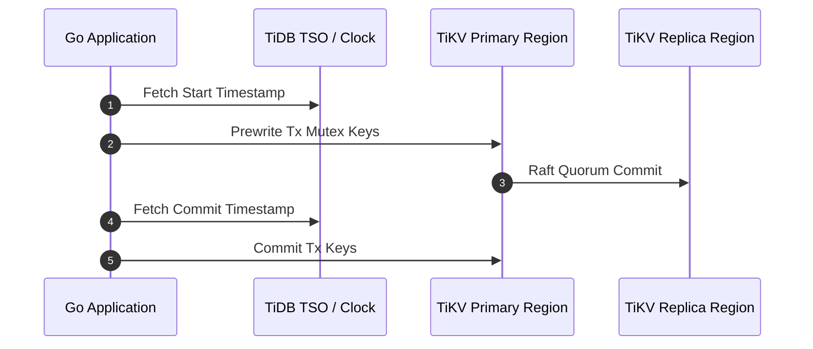

# Distributed SQL ACID Latency: TiDB, CockroachDB & Spanner

**Answer-first:** Distributed SQL engines preserve multi-region ACID serializability by combining Raft/Paxos consensus with bounded clock synchronization protocols such as Spanner TrueTime, CockroachDB HLC, or TiDB Percolator TSO. Selecting optimal commit-wait delays and timestamp allocation strategies minimizes two-phase commit overhead, achieving low transaction latencies across cross-region core banking nodes.

> **Executive Summary & Quick Answer**: Distributed SQL engines (TiDB Percolator, CockroachDB HLC, Google Spanner TrueTime) balance multi-region ACID compliance with low-latency commitments. Understanding clock drift bounds (TrueTime 2-7ms wait) vs TSO central allocator overhead is critical for tuning financial transaction latency under cross-region replication.

> **Pillar Architecture Guide:** This article is part of the **[Architecting 21-Service E-commerce with Golang & DDD](/posts/architecting-21-service-ecommerce-golang-ddd/)** series. Please refer to the original article for an in-depth overview of the architecture.

> **Series (Part 2 of 8):** This article assumes you are familiar with the Double-Entry Ledger from [Part 1](/series/core-banking-architecture/part-1-double-entry-ledger-schema/). We will analyze why a PostgreSQL monolith hits limitations at scale and how Distributed SQL options solve that problem.

> **⚠️ Note:** This article is synthesized from official documentation, engineering blogs, and published benchmark papers. The latency figures and schema designs reflect the source material at the time of writing. Always verify with your team's architect or lead engineer before applying them to a production system.

The sequence diagram below details the multi-step network interaction during a distributed ACID commit in TiDB, showing how client applications request timestamps from the Placement Driver while writing keys to primary and secondary TiKV nodes:



## What is Distributed SQL Transaction Latency?

**Answer-first:** Distributed SQL latency measures round-trip time for cross-node 2PC consensus, consensus log replication, and clock synchronization wait times.

Distributed SQL databases like TiDB, Spanner, and CockroachDB incur network latency overheads for ACID transactions due to distributed consensus and time synchronization. In high-concurrency 2026 core banking platforms, executing two-phase commits (2PC) across multi-region datacenters introduces non-trivial network round-trip times (RTT). Timestamp allocation, write-ahead log (WAL) Raft replication across majority nodes, and clock synchronization waits typically add **1-3ms of latency** per transaction locally and **15-50ms** across geographic cloud regions — a critical factor when managing millions of high-frequency balance mutations.

---

## Why Does PostgreSQL Hit Limits at Large Scale?

**Answer-first:** Single-node PostgreSQL hits write bottlenecks when transaction throughput exceeds single-disk I/O and connection pool limits.

PostgreSQL is a great choice for most Fintech startups. But at scales of **10,000+ TPS with datasets in the hundreds of millions of records**, the limitations become apparent:

- **Vertical scaling ceiling**: A physical server can only be upgraded with CPU/RAM up to a certain point.
- **Write bottleneck**: All writes must go through a single Primary node — you cannot horizontally scale writes.
- **Sharding complexity**: Manual PostgreSQL sharding requires complex application-layer routing logic, easily leading to **cross-shard transaction anomalies**.
- **Migration pain**: WeBank and Shopee Pay both migrated from sharded MySQL to TiDB to solve exactly this problem.

The decision matrix below summarizes critical architecture indicators that signal when a core banking ledger must migrate from a monolithic database to a distributed SQL cluster:


Financial institutions should migrate from single-node relational databases to distributed SQL clusters when sustained write throughput exceeds single-node hardware limits, typically around 10,000 transactions per second. Additionally, migration becomes necessary when manual database sharding creates unacceptable cross-shard transaction complexity and operational overhead for core banking ledgers.

| Indicator | Action |
|----------|-----------|
| Write TPS > 10,000 on a single node | Consider TiDB or CockroachDB |
| P99 latency > 100ms due to table scans | Add read replicas or CQRS |
| Shard count > 16 with manual routing | Migrate to distributed SQL |
| Cross-shard transactions > 20% of workload | Distributed ACID (2PC) is required |



---

## Google Spanner TrueTime: The Exact Math

**Answer-first:** Google Spanner TrueTime uses atomic clocks and GPS receivers to bound clock uncertainty, enforcing commit-wait delays of 2-7ms for serializability.

[Google Spanner](https://cloud.google.com/spanner/docs/transactions) uses GPS receivers and atomic clocks to provide external consistency (linearizability). This is the mathematical mechanism behind the commit wait:

### TrueTime API

Each Spanner datacenter has GPS clocks + atomic clocks. The TrueTime API returns an interval of uncertainty:

$$\text{TT.now()} = [\text{earliest}, \text{latest}]$$

Where $\epsilon$ is the uncertainty interval (typically **1–7ms** depending on the datacenter):

$$\text{latest} - \text{earliest} = 2\epsilon$$

### Commit Wait Protocol

When transaction $T_1$ wants to commit with timestamp $s$:

1. Spanner assigns $s = \text{TT.now().latest}$
2. **Waits** until: $\text{TT.now().earliest} > s$
3. Only then are the results exposed to clients

**Commit wait time:**
$$\text{Wait} = s - \text{TT.now().earliest} \approx 2\epsilon \approx 2\text{–}14\text{ms}$$

**Meaning**: This is why Spanner writes have a baseline latency of **~4ms** even for the simplest queries — this is the cost of external consistency with hardware clocks.

### Paxos Lock Table Recovery

Unlike traditional 2PC (where a coordinator crash leads to permanent transaction lockouts), Spanner stores active lock tables **inside each Paxos replica group**:

1. When a lock is acquired on a partition, it is written to the **memory lock table of the Paxos Leader** for that partition.
2. Lock state is replicated via the **Paxos consensus log**.
3. If the leader crashes, a new leader is elected by Paxos and **automatically restores the lock table** from the log.
4. Distributed commit continues safely — without being permanently stuck.

---

## CockroachDB Hybrid Logical Clocks (HLC)

**Answer-first:** CockroachDB Hybrid Logical Clocks combine physical NTP timestamps with logical counters to order distributed transactions without hardware atomic clocks.

CockroachDB runs on commodity hardware — no GPS or atomic clocks. It uses **HLC** combining a physical wall clock and a logical counter to ensure causal ordering:

### HLC Update Rules

When event $e$ occurs locally on Node $i$:
- If $P_i > \text{HLC.physical}$: set $\text{HLC.physical} = P_i$, reset $\text{HLC.logical} = 0$
- If $P_i = \text{HLC.physical}$: increment $\text{HLC.logical}$

When Node $i$ receives a message from Node $j$ containing timestamp $T_j$:
$$\text{HLC.physical} = \max(P_i, \text{HLC.physical}, T_j\text{.physical})$$

Logical counters are incremented if physical times are equal.

### Uncertainty Interval

CockroachDB uses a **max clock offset parameter** (default **500ms**). If a transaction reads a value with a timestamp within the uncertainty interval, it triggers a **retry with a pushed timestamp**.

**Practical Consequence**: With NTP-synchronized clocks (±50ms accuracy), CockroachDB can trigger retry storms in high-contention environments. Therefore, using **PTP** (Precision Time Protocol) to reduce clock offset below <1ms is highly recommended.

---

## TiDB Percolator: Distributed Transactions with TSO

**Answer-first:** TiDB implements the Percolator 2PC protocol with a centralized Timestamp Oracle (TSO), achieving sub-3ms transaction timestamp allocation.

TiDB implements distributed transactions using the **Percolator** model (from Google) on top of the TiKV key-value store.

### Three-Column Logic

The table below describes how TiDB maps transactional state and key locks across three distinct KV storage column families:

| Column | Format | Meaning |
|--------|--------|---------|
| `data` | `key + start_ts → value` | Actual data |
| `lock` | `key → start_ts + primary_key` | Active locks |
| `write` | `key + commit_ts → start_ts` | Committed transaction metadata |

### TSO Overhead: 1-3ms Per Transaction

Each distributed transaction must contact the **Placement Driver (PD) Timestamp Oracle (TSO)** to get `start_ts` and `commit_ts`. Network RTT to PD is **1-3ms**, plus:

- **Async Commit** (TiDB 5.0+): Allows parallel writes to secondary keys, reducing total latency to **2-5ms**.
- **1PC optimization**: Single-region transactions can commit in **one network round trip** instead of two.

The timeline diagram below traces the exact message exchanges and round-trip delays between the client application, PD TSO, and TiKV storage nodes:

```
Percolator 2PC Timeline:

Client           PD (TSO)         TiKV (Primary)    TiKV (Secondary)
  │────get_ts────▶│                    │                   │
  │◀──start_ts────│                    │                   │
  │                                    │                   │
  │────prewrite(primary)───────────────▶│                   │
  │────prewrite(secondary)────────────────────────────────▶│
  │◀──prewrite_ok──────────────────────│                   │
  │◀──prewrite_ok──────────────────────────────────────────│
  │────get_ts────▶│                    │                   │
  │◀──commit_ts───│                    │                   │
  │────commit(primary, commit_ts)──────▶│                   │
  │◀──commit_ok────────────────────────│                   │
  │    (async cleanup secondary locks in background)
  
Total latency: start_ts RTT (1-3ms) + prewrite RTTs + commit_ts RTT = ~5-15ms
```

### Percolator Lock Recovery Algorithm

When transaction $T_2$ encounters a stale lock from $T_1$:

1. $T_2$ reads the **primary lock metadata** of $T_1$ (referenced by the secondary lock).
2. If the primary key of $T_1$ has a record in the `write` column → $T_1$ has committed: $T_2$ **rolls forward** by writing a `write` record at $T_1$'s `commit_ts` and deleting the secondary lock.
3. If the primary key has no lock AND no `write` record → $T_1$ has aborted: $T_2$ deletes the secondary lock.
4. If $T_1$'s primary lock is still active → $T_2$ checks the TTL. If expired: $T_2$ deletes the primary lock (aborting $T_1$) and cleans up secondary locks.

---

## Redlock Is Not Safe for Fintech

**Answer-first:** Redis Redlock fails during network partitions or process pauses; financial systems require distributed SQL with Raft/Paxos consensus.

[Martin Kleppmann](https://martin.kleppmann.com/2016/02/08/how-to-do-distributed-locking.html) has proven that **Redlock is unsafe** for correctness-critical systems because:

1. **GC Pauses**: JVM Garbage Collection pauses can last hundreds of milliseconds, causing the lock TTL to expire while the worker is still executing DB writes.
2. **Clock Skew**: NTP clock synchronization can drift enough to make Redis nodes disagree on whether a lock is still valid.
3. **Network Partitions**: A minority Redis node might grant a lock to a second client after a split-brain event.

**Result**: Two workers could simultaneously hold the same lock → double-processing → **double-spend or ledger imbalance**.

The comparison table below evaluates production-grade locking alternatives based on latency, consensus algorithms, and suitability for financial applications:

| Solution | Latency | Guarantee | Use Case |
|----------|---------|-----------|----------|
| **etcd** (Raft-based) | 1-5ms | Strong consistency | Production distributed locks |
| **ZooKeeper** | 1-5ms | Strong consistency | Legacy systems |
| **PostgreSQL SELECT FOR UPDATE** | <1ms | Serializable | Single-node ledger |
| **TiKV** (Percolator) | 1-3ms | ACID | TiDB transactions |

---

## Migration Case Studies

**Answer-first:** Migration case studies detail shifting monolithic core databases to TiDB or CockroachDB for multi-region active-active transaction scaling.

Migrating legacy core banking databases to modern distributed SQL platforms requires zero-downtime execution strategies. Banks deploy Change Data Capture (CDC) pipelines (e.g., Debezium or TiCDC) combined with dual-writing microservices and automated reconciliation engines to validate data consistency prior to traffic cutover.

### WeBank: MySQL Sharding → TiDB

WeBank (2021) migrated from **sharded MySQL** to TiDB to handle transaction history scale:
- **Before**: 16 MySQL shards with complex application-layer routing logic
- **After**: TiDB cluster, automatic horizontal scaling
- **Result**: Eliminated cross-shard JOIN problems and reduced ops complexity

### Groww (India): MySQL → CockroachDB

Groww (an Indian fintech) migrated from MySQL to CockroachDB using **MOLT** (Migrate Off Legacy Technologies):
- **Motive**: Needed multi-region deployment with strong consistency
- **Result**: Distributed ACID transactions across 3 AWS regions

---

## Latency Comparison Matrix

**Answer-first:** The latency matrix compares 2PC commit-wait times, consensus replication delays, and throughput across Spanner, CockroachDB, and TiDB.

The performance matrix below details single-operation write latencies, cross-region capabilities, and consistency models across leading relational and distributed engines:

| Database | Write Latency (single op) | Cross-region | Consistency Model |
|----------|--------------------------|--------------|-------------------|
| PostgreSQL (single node) | <1ms | N/A | Serializable |
| MySQL + Sharding | <1ms + routing | N/A | Per-shard Serializable |
| **TiDB** | **3-8ms** (Percolator + TSO) | Optional | External Consistency |
| **CockroachDB** | **2-10ms** (HLC uncertainty) | Yes (multi-region) | Serializable |
| **Spanner** | **4-14ms** (TrueTime commit wait) | Yes (global) | External Consistency |

---

## QA & SDET Testing Strategy

**Answer-first:** Testing distributed SQL resilience requires injecting network latency jitter, clock skew, and node partitions during active transfers.

### Test 1: Network Split-Brain Simulation

The shell script below uses Linux Traffic Control (`tc`) to inject 100% packet loss on minority cluster nodes, validating that majority Raft quorums preserve ACID consistency:

```bash
# Use tc (traffic control) to simulate network partitions
# Split a 5-node cluster into 3 + 2 partitions

# On minority nodes (2 nodes):
sudo tc qdisc add dev eth0 root netem loss 100%

# Expectation:
# - Writes on majority (3 nodes) → SUCCESS
# - Writes on minority (2 nodes) → FAIL with "leader not available"
# - After healing partition: consistency auto-recovers
```

### Test 2: Clock Skew Injection (libfaketime)

The command below uses `libfaketime` to simulate physical clock offset exceeding CockroachDB's 500ms safety threshold, verifying that the database safely aborts inconsistent reads:

```bash
# Inject clock drift exceeding CockroachDB's max_clock_offset (500ms)
LD_PRELOAD=/usr/lib/x86_64-linux-gnu/faketime/libfaketime.so.1 \
FAKETIME="+0.6s" \
go test ./ledger/store -run TestClockSkewResilience

# Expectation:
# - CockroachDB detects clock skew > 500ms
# - Database auto-triggers transaction retries or aborts
# - DOES NOT return stale/out-of-order data
```

### Test 3: TSO Latency Measurement

The Go benchmark test below measures end-to-end P99 transaction latency under parallel load to detect Timestamp Oracle bottlenecks in TiDB deployments:

```go
package main

import (
	"testing"
	"time"
)

// Measure TSO round trip overhead in TiDB
func BenchmarkTiDBTransactionLatency(b *testing.B) {
    db := openTiDBConnection()
    b.ResetTimer()
    
    b.RunParallel(func(pb *testing.PB) {
        for pb.Next() {
            start := time.Now()
            tx, _ := db.Begin()
            // Simple single-row update
            tx.Exec("UPDATE accounts SET balance = balance - 1 WHERE id = $1", "acc-001")
            tx.Commit()
            latency := time.Since(start)
            
            // P99 must be < 15ms under normal conditions
            if latency > 15*time.Millisecond {
                b.Logf("High latency detected: %v", latency)
            }
        }
    })
}
```

---

> 💡 **Read more:** [PayPay Architecture — TiDB at Scale](/series/paypay-architecture/) — TiDB architecture in practice.

## Frequently Asked Questions (FAQ)

**Answer-first:** Distributed SQL databases achieve ACID compliance across region nodes by combining Raft/Paxos consensus with bounded clock synchronization.


TiDB has extensive adoption and documentation across Asian fintech systems including WeBank, Shopee Pay, and ZaloPay, making it an excellent fit for regional banking deployments. CockroachDB is better suited for multi-region global deployments that require active-active cross-datacenter topologies with localized data residency controls.



Adopting Google Spanner is recommended primarily if your infrastructure is hosted on Google Cloud Platform and demands out-of-the-box global scale. For self-managed hybrid cloud or multi-cloud environments, self-hosted TiDB or CockroachDB provides significantly lower operational overhead and cost efficiency.



To minimize Timestamp Oracle overhead in TiDB, enable Async Commit to execute secondary key mutations in parallel during two-phase commit. In addition, co-locating Placement Driver instances with core TiKV nodes and enforcing one-phase commit for single-region transactions eliminates unnecessary network round trips.

---

*Up Next: [Part 3 — Event Sourcing & CQRS](/series/core-banking-architecture/part-3-event-sourcing-cqrs/) — Designing an immutable ledger with event store schemas, CQRS read models, and the Transactional Outbox pattern to avoid dual-writes.*

For distributed SQL deployment assistance or tuning TiDB latency in cloud environments, consult our team via [Distributed Systems & Database Consulting](/hire/).


