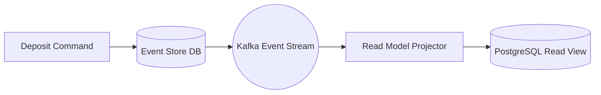

> **Prerequisite:** Familiarity with the concepts introduced in [Part 2 — Distributed Sql Acid Latency](/series/core-banking-architecture/part-2-distributed-sql-acid-latency/). Review it first if the terminology in this part is unfamiliar.

**Answer-first:** Event sourcing and CQRS replace mutable database updates with an immutable append-only event log. Core banking systems record financial state changes as domain events, projecting read models asynchronously while guaranteeing auditability and zero data loss.

> **Series (Part 3 of 8):** This article builds upon the ACID transactions foundation from [Part 2](/series/core-banking-architecture/part-2-distributed-sql-acid-latency/). We will design a ledger using Event Sourcing — the exact solution that Monzo, Starling Bank, and many large neo-banks use to scale.

## What are Event Sourcing & CQRS in Fintech?

Event Sourcing stores financial ledger state as an append-only event stream, while CQRS projects read models for sub-millisecond query access.

The architectural sequence diagram below illustrates the asynchronous propagation of financial events from the command-side database to dedicated PostgreSQL query models.



Fintech microservice systems use Event Sourcing and CQRS patterns to maintain distributed data consistency without distributed locks. To avoid dual-write failures, the Transactional Outbox pattern is applied in combination with CDC tools like Debezium. Pre-calculated CQRS balance lookups achieve **<1ms** latency, whereas on-the-fly `SUM()` aggregates degrade from **2ms to 200ms** at $O(N)$ with account history length.

---

## Why Was the Ledger Always Event Sourcing?

Financial ledgers have historically operated as event sources, recording immutable journal entries rather than overwriting current balances.

Double-entry bookkeeping — invented in the 15th century — is essentially Event Sourcing in its purest form:

- **Traditional approach**: Store **current state** (current balance) → history is lost
- **Event Sourcing**: Store an **immutable sequence of events** → current state is the result of a replay

The textual journal representation below demonstrates how event streams retain full context compared to simple current-state overwrites.

```
Traditional:  accounts.balance = 500,000 VND   (no idea how it got there)

Event Sourcing:
  Event 1: AccountOpened        → balance = 0
  Event 2: MoneyDeposited(1M)   → balance = 1,000,000
  Event 3: MoneyWithdrawn(200K) → balance = 800,000
  Event 4: InterestAccrued(50K) → balance = 850,000
  Event 5: FeeCharged(350K)     → balance = 500,000
```

This is exactly how an accounting ledger works — every entry is an undeletable event. **Balance = replaying all events from the beginning** (or from the latest snapshot).

---

## Event Store Schema: PostgreSQL Production Design

PostgreSQL event stores use append-only tables with optimistic concurrency control, sequence numbers, and JSONB event payload schemas.

### Core Event Store Table

The PostgreSQL DDL statement below defines an immutable `event_store` table with strict optimistic concurrency control to handle high-volume banking streams.

```sql
-- Event Store: Central table storing all system events
CREATE TABLE event_store (
    event_id        UUID PRIMARY KEY DEFAULT gen_random_uuid(),
    stream_id       UUID NOT NULL,         -- Account/Entity ID (aggregate boundary)
    sequence_number BIGINT NOT NULL,       -- Monotonic counter PER stream
    event_type      VARCHAR(100) NOT NULL, -- 'MoneyDeposited', 'MoneyWithdrawn', etc.
    event_data      JSONB NOT NULL,        -- Event payload
    metadata        JSONB,                 -- correlation_id, causation_id, user_id, etc.
    created_at      TIMESTAMP WITH TIME ZONE DEFAULT CURRENT_TIMESTAMP,

    -- Mandatory: Prevent concurrent race conditions — each stream has its own sequence
    CONSTRAINT uq_stream_sequence UNIQUE (stream_id, sequence_number)
);

-- Index for event replay per account
CREATE INDEX idx_event_store_stream ON event_store (stream_id, sequence_number ASC);
-- Index for CDC/Outbox polling
CREATE INDEX idx_event_store_created ON event_store (created_at ASC);
```

**`sequence_number`** is the key to Optimistic Concurrency Control (OCC). The Go function below demonstrates how optimistic locking detects race conditions during append operations:

```go
// Append event with OCC — prevents concurrent writes to the same stream
func appendEvent(db *sql.DB, streamID uuid.UUID, expectedSeq int64, event Event) error {
    query := `
        INSERT INTO event_store (stream_id, sequence_number, event_type, event_data, metadata)
        VALUES ($1, $2, $3, $4, $5)
    `
    // sequence_number = expectedSeq + 1
    // If sequence already exists → UNIQUE constraint violation → conflict detected
    _, err := db.Exec(query,
        streamID,
        expectedSeq+1,
        event.Type,
        event.Data,
        event.Metadata,
    )
    if isUniqueViolation(err) {
        return ErrConcurrentModification // Retry or return conflict
    }
    return err
}
```

### Event Snapshots: Avoiding O(N) Replays

For accounts with a history of **millions of transactions**, replaying the entire event store becomes extremely slow. The solution: periodic snapshots.

The SQL schema below creates a snapshot view storing pre-calculated balances at specific event sequences.

```sql
-- Snapshot Table: Stores pre-computed state at a specific sequence point
CREATE TABLE event_snapshots (
    stream_id            UUID PRIMARY KEY,
    last_sequence_number BIGINT NOT NULL,
    state                JSONB NOT NULL,  -- Pre-computed balance at this point
    updated_at           TIMESTAMP WITH TIME ZONE DEFAULT CURRENT_TIMESTAMP
);
```

**Pattern for reading balance with a snapshot:**

The Go code below illustrates how loading a baseline snapshot minimizes the event log replay count for hot accounts.

```go
// 1. Load the latest snapshot
snapshot, err := loadSnapshot(db, accountID)

// 2. Load ONLY events AFTER the snapshot
events, err := loadEventsAfter(db, accountID, snapshot.LastSequenceNumber)

// 3. Apply events to the snapshot state
balance := snapshot.State.Balance
for _, event := range events {
    balance = applyEvent(balance, event)
}

// Instead of replaying 5 million events → only replay N events since the snapshot
```

**Snapshot Rule**: Create a snapshot every 100-1000 events (depending on throughput). A background job can automatically generate snapshots for "hot accounts".

---

## Monzo's Event Sourcing Architecture

Monzo digital bank uses Go microservices with event-sourced account state and Cassandra read projections to scale transaction processing.

[Monzo Engineering](https://monzo.com/blog/2018/03/09/shipping-kafka-at-monzo/) published the details of their architecture:

- **Write Path**: Go microservices write ledger postings to PostgreSQL (the primary source of truth).
- **Distribution**: Kafka pub/sub distributes events to various read models.
- **Read Models**:
  - **Cassandra**: Primary read database, optimized for time-series lookups.
  - **Elasticsearch**: Full-text search, transaction search.
  - **BigQuery**: Analytics and reporting.
- **Consistency**: Offline reconciliation systems check data periodically.

**Monzo Transaction Flow (simplified):**

The pipeline diagram below illustrates how Monzo coordinates transaction posting across PostgreSQL, Debezium CDC, Kafka topics, and multi-model projection stores.

```
Mobile App Request
       │
       ▼
Account Service (Go)
       │
  ┌────┴─────────────────────────────┐
  │  PostgreSQL Transaction          │
  │  1. INSERT into event_store      │
  │  2. INSERT into outbox_events    │
  └────┬─────────────────────────────┘
       │ commit
       ▼
Debezium CDC Connector
       │ reads WAL
       ▼
Apache Kafka
       │
  ┌────┼─────────────────────────────┐
  │    │                             │
  ▼    ▼                             ▼
Cassandra  Elasticsearch          BigQuery
(balance)  (search)               (analytics)
```

---

## CQRS Latency: <1ms vs O(N) SUM()

CQRS read projections serve current balances in under 1ms, eliminating slow `O(N)` SQL `SUM()` aggregations over historical ledger entries.

**CQRS (Command Query Responsibility Segregation)** separates the write path (commands) from the read path (queries):

### On-the-fly Aggregation: An O(N) Disaster

The SQL query below demonstrates an expensive dynamic aggregation that degrades exponentially as account entry counts grow.

```sql
-- BAD: Calculating balance using SUM() directly from the ledger
SELECT SUM(CASE WHEN direction = 'CREDIT' THEN amount ELSE -amount END) AS balance
FROM entries
WHERE account_id = 'acc-001';

-- Latency: 2ms for 1K entries → 50ms for 100K → 200ms for 1M entries
```

### CQRS Pre-computed Read Model: <1ms

The SQL query below shows an optimized indexed point lookup against a materialized read model table.

```sql
-- GOOD: Reading pre-computed balance from a materialized view / Redis
SELECT balance, available_balance, last_updated_at
FROM account_balances  -- CQRS read model
WHERE account_id = 'acc-001';

-- Latency: <1ms (point lookup, indexed)
-- Redis: <0.5ms (in-memory)
```

**CQRS Write/Read Flow:**

The diagram below contrasts command-side HTTP state updates with decoupled query-side read cache lookups.

```
WRITE SIDE (Command)                READ SIDE (Query)
────────────────────────            ──────────────────────────
POST /transfers            →        account_balances table
POST /accounts             →        Elasticsearch index
PUT /loans/repay           →        Redis balance cache

↓ Event Published ↓                ↑ Subscribe & Update ↑
         └──────────────────────────┘
               (Kafka event stream)
```

---

## Transactional Outbox Pattern: Solving Dual-Writes

Transactional outbox patterns write domain events to an outbox table in the same DB transaction as state mutations, guaranteeing event delivery.

### The Dual-Write Problem

The flow below details the vulnerability of dual-write operations where network glitches prevent downstream notification delivery.

```
❌ WRONG — Not atomic:
1. db.Update(account)     ← SUCCESS
2. kafka.Publish(event)   ← FAIL (network error)
→ Database is updated but downstream services never receive the event
→ Balances are incorrect, notifications not sent, read models are stale
```

### Outbox Pattern Solution

Write the event into the same database transaction as the business logic, and use a background worker to publish it to Kafka. The DDL script below creates a dedicated outbox table for event staging.

```sql
-- PostgreSQL Transactional Outbox Table
CREATE TABLE outbox_events (
    id              UUID PRIMARY KEY DEFAULT gen_random_uuid(),
    aggregate_type  VARCHAR(100) NOT NULL,  -- 'Account', 'Transfer', 'Loan'
    aggregate_id    VARCHAR(100) NOT NULL,  -- Entity ID
    event_type      VARCHAR(100) NOT NULL,  -- 'MoneyTransferred', 'AccountOpened'
    payload         JSONB NOT NULL,
    status          VARCHAR(20) NOT NULL DEFAULT 'PENDING',  -- PENDING, PUBLISHED
    created_at      TIMESTAMP WITH TIME ZONE DEFAULT CURRENT_TIMESTAMP,
    published_at    TIMESTAMP WITH TIME ZONE
);

CREATE INDEX idx_outbox_status_created ON outbox_events (status, created_at ASC);
```

**Application code — inside the same DB transaction:**

The Go snippet below demonstrates atomic transaction writing for both ledger entries and outbox payload events.

```go
func (s *AccountService) Transfer(ctx context.Context, req TransferRequest) error {
    return s.db.WithTransaction(ctx, func(tx *sql.Tx) error {
        // 1. Business logic: Write ledger entries
        if err := insertLedgerEntries(tx, req); err != nil {
            return err
        }

        // 2. SAME transaction: Write outbox event
        outboxPayload, _ := json.Marshal(map[string]interface{}{
            "from_account": req.FromAccount,
            "to_account":   req.ToAccount,
            "amount":       req.Amount,
            "currency":     req.Currency,
        })
        _, err := tx.Exec(`
            INSERT INTO outbox_events (aggregate_type, aggregate_id, event_type, payload)
            VALUES ($1, $2, $3, $4)
        `, "Account", req.FromAccount, "MoneyTransferred", outboxPayload)
        return err
        // If commit is successful: BOTH ledger AND outbox event are written
        // If rollback occurs: NEITHER is written → perfect atomicity
    })
}
```

**Debezium CDC Connector** reads the PostgreSQL WAL and forwards events to Kafka. The JSON configuration snippet below sets up Debezium for outbox routing:

```json
// Debezium connector config (connector.json)
{
  "name": "outbox-connector",
  "config": {
    "connector.class": "io.debezium.connector.postgresql.PostgresConnector",
    "database.hostname": "postgres.internal",
    "database.port": "5432",
    "database.user": "debezium",
    "database.dbname": "core_banking",
    "table.include.list": "public.outbox_events",
    "transforms": "outbox",
    "transforms.outbox.type": "io.debezium.transforms.outbox.EventRouter",
    "transforms.outbox.table.field.event.id": "id",
    "transforms.outbox.table.field.event.key": "aggregate_id",
    "transforms.outbox.table.field.event.payload": "payload",
    "transforms.outbox.table.field.event.type": "event_type"
  }
}
```

---

## Event Versioning: Handling Schema Evolution

Handling event schema evolution requires upcaster functions to transform legacy event payloads into current domain schema versions.

An Event Store is immutable — you cannot modify the schema of old events. The Go code block below implements an upcaster mapping function that converts legacy floating-point structures into integer-based cent values:

```go
// Upcaster: Convert event v1 → v2 when reading
type MoneyDepositedV1 struct {
    AccountID string  `json:"account_id"`
    Amount    float64 `json:"amount"`  // v1 uses float (WRONG)
}

type MoneyDepositedV2 struct {
    AccountID string `json:"account_id"`
    AmountCents int64  `json:"amount_cents"` // v2 uses integer (CORRECT)
    Currency    string `json:"currency"`
}

func upcaster(eventType string, version int, data json.RawMessage) (interface{}, error) {
    switch {
    case eventType == "MoneyDeposited" && version == 1:
        var v1 MoneyDepositedV1
        json.Unmarshal(data, &v1)
        return MoneyDepositedV2{
            AccountID:   v1.AccountID,
            AmountCents: int64(v1.Amount * 100), // Convert
            Currency:    "VND",                   // Default
        }, nil
    default:
        return nil, fmt.Errorf("unsupported event type %s version %d", eventType, version)
    }
}
```

---

## QA & SDET Testing Strategy

Event sourcing QA tests verify snapshot consistency, out-of-order event handling, and idempotent projection replay.

### Test 1: Event Replay Consistency

The Go test case below verifies that rebuilding CQRS read models from scratch produces exact state parity with live balance records.

```go
// Scenario: Drop read model → replay from event store → verify balance match
func TestEventReplayConsistency(t *testing.T) {
    ctx := context.Background()
    
    // 1. Get "live" balance from read model BEFORE
    liveBalance := getReadModelBalance(ctx, "account-001")
    
    // 2. Drop and rebuild read model from event store
    dropAccountBalancesTable(ctx)
    replayAllEventsFromEventStore(ctx)
    
    // 3. Get balance after replay
    replayedBalance := getReadModelBalance(ctx, "account-001")
    
    // 4. Must match exactly
    assert.Equal(t, liveBalance, replayedBalance,
        "Replayed balance must match live balance exactly")
}
```

### Test 2: Outbox Atomicity Under Failure

The Go test case below simulates message broker outages to confirm that local database transactions persist correctly while outbox processing retries automatically.

```go
// Inject failure BETWEEN database commit and Kafka publish
func TestOutboxAtomicityUnderFailure(t *testing.T) {
    // Mock Kafka publisher to fail
    mockKafka := &FailingKafkaPublisher{}
    
    // Execute transfer
    err := transferService.Transfer(ctx, TransferRequest{
        From: "acc-A", To: "acc-B", Amount: 1000000,
    })
    
    // Transfer still succeeds (DB is committed)
    assert.NoError(t, err)
    
    // Outbox event is still in PENDING state (Kafka failed)
    pendingEvents := countOutboxPending()
    assert.Greater(t, pendingEvents, 0)
    
    // After Kafka recovers, the outbox worker retries and publishes successfully
    fixKafka()
    waitForOutboxProcessing()
    
    // Balance of both accounts must be accurate
    assert.Equal(t, expectedBalanceA, getBalance("acc-A"))
    assert.Equal(t, expectedBalanceB, getBalance("acc-B"))
}
```

---

> 💡 **Read more:** [Saga Pattern](/series/core-banking-architecture/part-4-saga-pattern/) — Saga Pattern to handle distributed failures.

### Handling Schema Evolution in Event Sourced Ledgers

Event sourcing relies on the immutability of historical events. However, as business requirements change, the schemas of these events must evolve. For example, regulatory updates may require adding a mandatory customer tax identifier field to all historical Account Created events. Since historical events cannot be modified, developers must design strategies to deserialize legacy event schemas into updated application models without corrupting database state.

There are three primary patterns for managing schema evolution in event stores:
1. **Event Upcasting:** This is an in-memory transformation pattern. The event store reads the raw legacy JSON/XML event from disk and routes it through an upcaster class before deserialization. The upcaster intercepts the event payload, injects default values for new fields or maps deprecated parameters, and returns the updated schema representation to the application engine. This ensures the application code only interacts with the latest schema version.
2. **Event Transformation (Migration):** This pattern involves writing a migration script that reads the entire event log, applies the schema changes, and writes the transformed events to a new event store database. While this provides clean data on disk, it requires system downtime and carries high operational risk during validation.
3. **Dual-Schema Serialization:** The application parser maintains multiple versions of the event classes. The deserializer inspects an event metadata version field and routes the payload to the corresponding class version. This avoids upcasting overhead but increases code complexity.

### Read Model Synchronization Patterns and Event Handling Rules

To keep CQRS projection databases consistent, developers implement idempotency checks on the consumer side. When a projection consumer processes an event, it stores the event's unique ID and version number in a local database transaction. If the consumer receives a duplicate event due to network retries, the local database transaction fails or ignores the insert, preventing duplicate balance updates.

Additionally, projection databases can use specialized index structures to optimize read performance. For example, read databases can partition query tables by account holder region, ensuring that local bank queries do not scan global tables. Running asynchronous database indexing scripts during low-traffic windows ensures that query indexes remain clean and compact, maintaining low latency queries even under high transactional load.

### Event Store Pruning and Archiving Policies

While event stores are theoretically infinite, keeping all historical events on active disks is costly and degrades recovery performance. Banking systems split event stores into hot and cold tiers. Events older than seven years are migrated to cold object storage (such as AWS S3 Glacier or Google Cloud Storage Archive) in compressed Apache Parquet format. This satisfies regulatory compliance for historical records while keeping the active event store disk usage and indexing costs optimized.

## Frequently Asked Questions (FAQ)

Event sourcing guarantees complete financial auditability by preserving every balance-changing event in an immutable event store.


Yes — Event Sourcing optimizes for writes and auditing, but complicates reads. This is exactly why CQRS exists. The write side stores events; the read side builds materialized views optimized for queries. You should not use pure Event Sourcing without CQRS read models.



PostgreSQL handles Event Sourcing well up to **thousands of events/sec** using an append-only `event_store` table. Choose EventStoreDB or Kafka if you require **>50,000 events/sec**, native gRPC streaming, or distributed topic routing out of the box.



It depends on average event size and acceptable replay time. Rule of thumb: snapshot every **500 events**. With an average event size of 1KB → snapshot file ~500KB. Replaying from a snapshot (0 events) up to the max (500 events) will never exceed a few dozen milliseconds.



Schema modifications use upcasters—transformer functions that map legacy event JSON structures to current event versions during event stream deserialization. Upcaster pipelines intercept historical payload versions upon reading from the database and transform them to match the active domain model in memory. This strategy allows systems to support new schema fields without performing risky, destructive updates on immutable past events.


## Event-Store Compaction, CQRS Version Lag, and Out-of-Order Events

Compaction strategies periodic snapshot event streams, while CQRS handlers manage version lag using sequence numbers and vector clocks.

Event sourcing captures every transaction as an immutable event. While this provides a complete audit trail, query performance degrades as event history grows. Compaction and snapshotting resolve this bottleneck.

### Event-Store Compaction and Snapshotting

To calculate an account balance, the system reconstructs the state by reading and applying all historical events. For accounts with millions of transactions, this is highly inefficient.
- **Snapshots:** The system generates account state snapshots every $K$ events (e.g., every 100 events).
- **Compaction Pipeline:** When querying the balance, the application loads the latest snapshot and replays only the events that occurred after the snapshot timestamp:

The diagram below shows how state snapshots decouple historical compaction from live balance replay logic.

```
[Events 1 to 100]  ──►  Compiled into Snapshot #1 (Balance: $500)
[Event 101: +$50]  ──►  Replayed over Snapshot #1
Current Balance    ──►  $500 + $50 = $550
```

### CQRS Projection Synchronization and Version Lag

Write operations append events to the Event Store, while read operations query specialized read databases. Because projections update asynchronously, there is a delay (version lag) before read models reflect changes.
- **Read-Your-Own-Writes Consistency:** To prevent a customer from seeing an outdated balance after depositing funds, write responses include the latest event version number (e.g., `version: 402`). Client read requests include this version number. The read service blocks the request until the projection database updates to at least version 402.
- **Optimistic Concurrency Control:** Write operations verify the account version before appending events, rejecting changes if the target version has shifted.

### Out-of-Order Event Sequence Buffering

In distributed networks, events may arrive at the projection engine out of order:
- **Sequence Buffering:** The projection engine maintains an in-memory buffer. If event $N+1$ arrives before event $N$, the engine queues it in the buffer and waits for event $N$ before executing updates.
- **Idempotency Keys:** Projections track processed event IDs to prevent duplicate updates.

To read about event-driven banking microservices patterns in Go, consult [Part 4: Modern Event-Driven Core Banking Architecture](/series/core-banking-developer/part-4-modern-core-banking-architecture/). For dedicated event-driven architecture design, connect with [FinTech Solutions Engineers](/hire/).
---

*Up Next: [Part 4 — Saga Pattern](/series/core-banking-architecture/part-4-saga-pattern/) — Choreography vs Orchestration Saga, failure transition matrices, and implementation with Temporal workflow engine.*



🔗 **Next Step:** Continue to [Part 4 — Saga Pattern](/series/core-banking-architecture/part-4-saga-pattern/) for the following module in the series.
