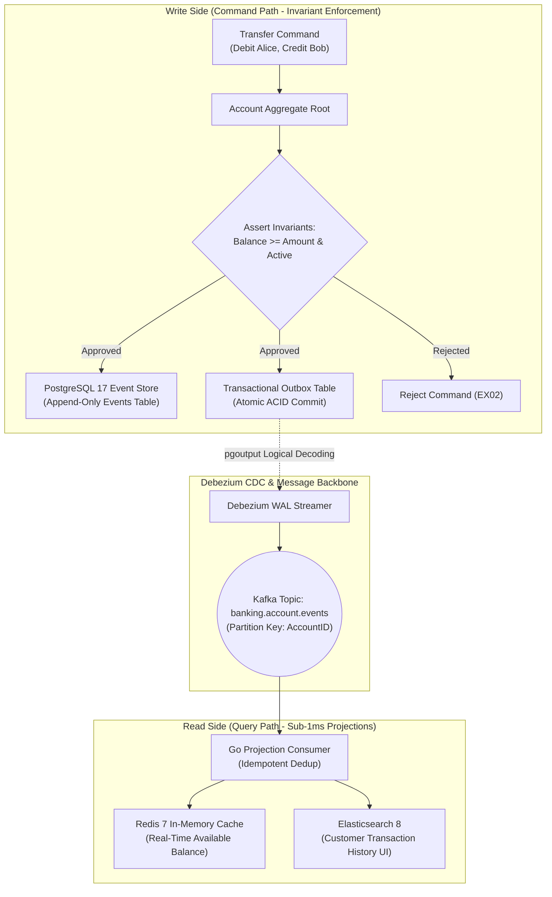
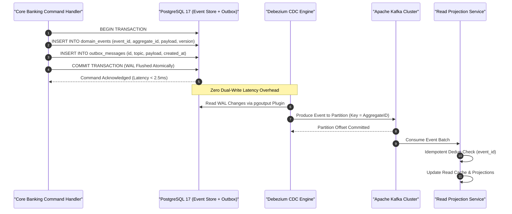

[📖 Bản tiếng Việt (Vietnamese Edition)](https://learn.tanhdev.com/series/core-banking-architecture/part-3-event-sourcing-cqrs/)

---

> **Series Navigation:** This is Part 3 of the **Core Banking Systems Architecture Masterclass**. For the complete architectural curriculum, start at the [Master Overview Guide](/series/core-banking-architecture/).

# Event Sourcing & CQRS: Immutable Ledger for Microservices

**Answer-first:** Event Sourcing and CQRS (Command Query Responsibility Segregation) solve the fundamental tension in core banking between write-side audit immutability and read-side low-latency queries. By treating an append-only event log as the authoritative System of Record (SoR) and deriving balance read models asynchronously via transactional outbox Change Data Capture (CDC), financial platforms eliminate dual-write hazards, maintain mathematical auditability, and deliver sub-millisecond account balance lookups under massive concurrent workloads.

---

## 1. Why Banking Ledgers Are Naturally Event-Sourced

In standard enterprise applications, databases store current state, discarding the intermediate transitions that led to that state. In financial accounting, however, current state has zero legal authority without the complete chronological chain of mutations that generated it. 

Double-entry bookkeeping is the historical progenitor of Event Sourcing:

$$\text{Current Account Balance}(t) = \text{Initial Balance} + \sum_{i=1}^{n} \text{JournalEvent}_i$$



---

## 2. Eliminating Dual-Write Hazards: The Transactional Outbox Pattern

A common anti-pattern in distributed fintech microservices is attempting to write to the primary database and publish to Apache Kafka within the same application handler:

```go
// FATAL ANTI-PATTERN: Dual-Write Risk
func (s *PaymentService) HandleDeposit(ctx context.Context, cmd DepositCommand) error {
    // 1. Commit to PostgreSQL
    if err := s.repo.SaveEvent(ctx, event); err != nil {
        return err
    }
    // 2. Publish to Kafka -> If app crashes here, Kafka NEVER receives the event!
    return s.kafkaProducer.Send("account-events", event)
}
```

If the application container terminates or suffers a network timeout after writing to PostgreSQL but before publishing to Kafka, downstream read models (and fraud detection engines) drift out of sync forever.

The **Transactional Outbox Pattern** solves this by inserting the event into an `outbox` table within the same local database transaction. An independent log reader (Debezium via PostgreSQL `pgoutput` plugin) tails the Write-Ahead Log (WAL), guaranteeing at-least-once delivery to Kafka with zero dual-write vulnerabilities.



---

## 3. Snapshotting & High-Performance Event Replay

When reconstructing an account aggregate with 500,000 historical transactions, replaying every historical event from inception creates unacceptable latency:
- $O(N)$ event replay over 500,000 events: **~1,200ms** (unacceptable for an online payment API).
- Replay with **EOD Snapshotting** (snapshot every 1,000 events or daily at midnight): **< 1.8ms**.

```sql
-- Production DDL for Snapshot Store
CREATE TABLE account_snapshots (
    account_id UUID NOT NULL,
    version BIGINT NOT NULL,
    balance BIGINT NOT NULL, -- Minor units (e.g. cents)
    reserved_holds BIGINT NOT NULL,
    status VARCHAR(16) NOT NULL,
    snapshot_data JSONB NOT NULL,
    created_at TIMESTAMPTZ NOT NULL DEFAULT clock_timestamp(),
    PRIMARY KEY (account_id, version)
);

-- Query to rehydrate aggregate: Fetch latest snapshot + subsequent events only
SELECT * FROM account_snapshots 
WHERE account_id = 'c4b8b4b2-2975-4c07-9b2f-7c152a5c5a01' 
ORDER BY version DESC LIMIT 1;

-- Then replay delta events:
SELECT * FROM domain_events 
WHERE aggregate_id = 'c4b8b4b2-2975-4c07-9b2f-7c152a5c5a01' 
  AND version > 45000 
ORDER BY version ASC;
```

---

## 4. Optimistic Concurrency Control (OCC) in Event Stores

To protect against race-condition double-spending in event stores, event streams enforce strict monotonic versioning:

```sql
-- Appending event with Optimistic Concurrency Control
INSERT INTO domain_events (aggregate_id, event_type, payload, version)
VALUES ('c4b8b4b2-2975-4c07-9b2f-7c152a5c5a01', 'MoneyDebited', '{"amount": 50000}', 45001);
-- If another transaction committed version 45001 first, PostgreSQL throws:
-- ERROR: duplicate key value violates unique constraint "domain_events_agg_ver_idx"
```
When this unique violation occurs, the command handler simply reloads the latest snapshot, re-verifies business invariants against the updated balance, and retries the command.

---

## Frequently Asked Questions (FAQ)


Event Sourcing stores every financial mutation as an immutable, permanent domain event with strict metadata (originator timestamp, operator identity, IP, and reason code). Because events are never overwritten or deleted, regulatory examiners can reconstruct the complete mathematical state of any customer account down to the exact millisecond, satisfying Basel III, PCI-DSS, and central bank forensic standards.



While the write-side event store is immediately consistent, read-side projections in Redis or Elasticsearch update asynchronously with a typical lag of 10ms to 40ms. Banking mobile applications mitigate this by applying optimistic UI updates (displaying the predicted balance immediately) or utilizing read-your-own-writes session tokens: the API gateway returns the committed event version, and query endpoints read from the primary database or block until the projection catches up.



Financial events must remain readable for decades. Banks manage event schema evolution by using Protobuf or Apache Avro paired with a Confluent Schema Registry that enforces backward and forward compatibility rules (e.g., fields can never be deleted or renamed, and new fields must have default values). For legacy events with fundamentally obsolete schemas, event upcasters intercept events during deserialization in memory, translating older payloads into current domain models on the fly without mutating on-disk event records.

