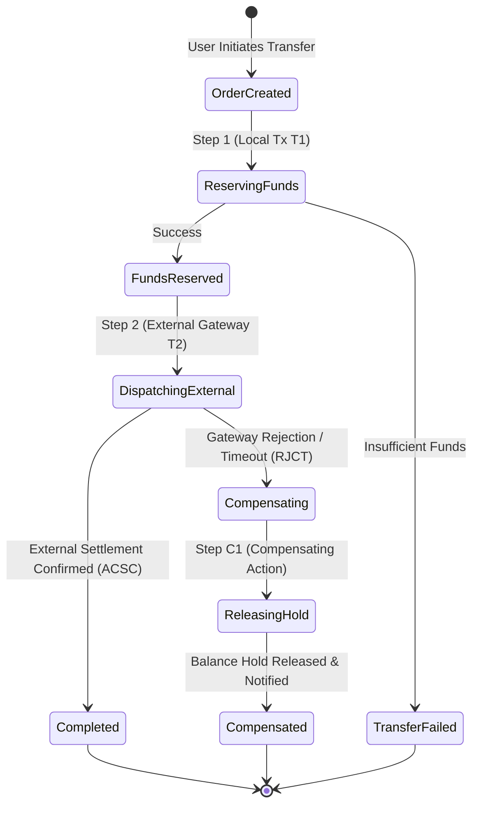
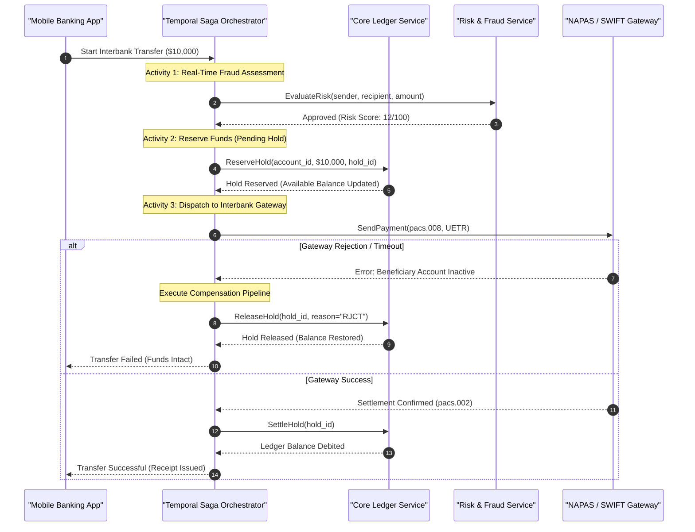

[📖 Bản tiếng Việt (Vietnamese Edition)](https://learn.tanhdev.com/series/core-banking-architecture/part-4-saga-pattern/)

---

> **Series Navigation:** This is Part 4 of the **Core Banking Systems Architecture Masterclass**. For the event-driven foundation, read [Part 3: Event Sourcing & CQRS](/series/core-banking-architecture/part-3-event-sourcing-cqrs/).

# Saga Pattern: Distributed Transactions Without 2PC

**Answer-first:** The Saga pattern replaces fragile, blocking Two-Phase Commit (2PC) protocols in distributed core banking microservices with a coordinated sequence of local ACID transactions and idempotent compensating actions. By centralizing execution state in durable workflow orchestrators like Temporal, financial architectures guarantee eventual consistency, eliminate distributed lock deadlocks during network partitions, and reliably isolate intermediate state using semantic reservation holds without sacrificing system availability.

---

## 1. Why Two-Phase Commit (2PC) Fails in Banking Microservices

In traditional relational database clusters, Two-Phase Commit (2PC) coordinates atomic commits across multiple nodes. However, attempting to apply 2PC across independent microservices communicating over HTTP or gRPC introduces fatal vulnerabilities:

1. **System Availability Degradation**: The availability of a 2PC transaction is the product of all participating services ($A_{sys} = \prod_{i=1}^n A_i$). If any single downstream service (or interbank gateway) pauses or drops a packet, the entire transaction stalls.
2. **Distributed Lock Monopolization**: 2PC holds local database row locks across network round trips. If the coordinator crashes during the prepare phase, participating databases remain locked indefinitely until manual administrator intervention.
3. **Impossibility of Cross-Organization 2PC**: External clearing rails (such as SWIFT, Visa, Mastercard, or NAPAS 24/7) will never expose local database prepare hooks to commercial banking applications.

The **Saga Pattern** eliminates distributed locks by executing a sequence of independent local transactions $T_1, T_2, \dots, T_n$. If step $T_i$ fails, the orchestrator triggers a compensating sequence $C_{i-1}, \dots, C_1$ to semantically undo previous mutations:



---

## 2. Orchestration vs Choreography: The Banking Imperative

While choreographed Sagas (where microservices listen to Kafka events and blindly publish next-step events) work for simple eCommerce flows, **they are strictly unacceptable in mission-critical banking**:
- **Lack of Central Observability**: Tracking where millions of dollars are stuck during a clearing outage requires inspecting dozens of disparate consumer group offsets.
- **Complex Failure Scenarios**: Handling timeouts, partial responses, and regulatory compliance holds in a choreographed mesh creates spaghetti event topologies.

Modern core banking mandates **Saga Orchestration**, where a centralized workflow engine (such as [Temporal](https://temporal.io/)) maintains a durable, event-sourced state machine:



---

## 3. Production Temporal Go SDK Workflow Implementation

The Go code below demonstrates a production-grade durable workflow coordinating an interbank payment with automated exponential backoff and compensation:

```go
package banking

import (
	"time"
	"go.temporal.io/sdk/temporal"
	"go.temporal.io/sdk/workflow"
)

type InterbankTransferWorkflowInput struct {
	TransferID   string
	SenderAcc    string
	ReceiverAcc  string
	Amount       int64
	Currency     string
}

func InterbankTransferWorkflow(ctx workflow.Context, input InterbankTransferWorkflowInput) (err error) {
	ao := workflow.ActivityOptions{
		StartToCloseTimeout: 10 * time.Second,
		RetryPolicy: &temporal.RetryPolicy{
			InitialInterval:    time.Second,
			BackoffCoefficient: 2.0,
			MaximumInterval:    30 * time.Second,
			MaximumAttempts:    5,
		},
	}
	ctx = workflow.WithActivityOptions(ctx, ao)

	var holdID string
	// Step 1: Reserve Funds
	err = workflow.ExecuteActivity(ctx, ReserveFundsActivity, input.SenderAcc, input.Amount).Get(ctx, &holdID)
	if err != nil {
		return err // Direct failure, nothing to compensate
	}

	// Defer Compensation if any subsequent activity fails
	defer func() {
		if err != nil {
			// Disconnected context ensures compensation runs even if workflow is cancelled
			compCtx, _ := workflow.NewDisconnectedContext(ctx)
			_ = workflow.ExecuteActivity(compCtx, ReleaseFundsHoldActivity, holdID).Get(compCtx, nil)
		}
	}()

	// Step 2: Dispatch to Interbank Rail (ISO 20022 Gateway)
	var gatewayResponse GatewayResult
	err = workflow.ExecuteActivity(ctx, DispatchInterbankPaymentActivity, input.ReceiverAcc, input.Amount, input.Currency).Get(ctx, &gatewayResponse)
	if err != nil || gatewayResponse.Status != "SUCCESS" {
		err = temporal.NewApplicationError("payment rejected by receiving institution", "INTERBANK_REJECT")
		return err // Triggers deferred compensation
	}

	// Step 3: Final Settlement (Post Ledger)
	err = workflow.ExecuteActivity(ctx, FinalizeSettlementActivity, holdID).Get(ctx, nil)
	return err
}
```

---

## 4. Mitigating Semantic Anomalies & Zombie Transactions

Because Sagas execute independent local commits, they lack the Isolation (I) property of ACID. Two primary hazards require strict engineering countermeasures:

1. **Dirty Reads & Double Spending**: If an account's balance is decremented without reservations, other concurrent transactions might view incorrect intermediate balances. Banking architectures enforce **Semantic Locking**: funds are placed in a `PENDING_HOLD` state that decrements available balance immediately while keeping the ledger balance intact until final settlement.
2. **Zombie Transactions (Split-Brain Timeouts)**: When an interbank gateway times out, the orchestrator cannot blindly assume failure and compensate, because the beneficiary may have already received the funds. The orchestrator transitions the Saga into `PENDING_INVESTIGATION`, executing automated query polling (`camt.056` inquiry or gateway status query) before initiating any compensation.

---

## Frequently Asked Questions (FAQ)


Saga patterns sacrifice database-level isolation in exchange for high availability and scalability. Core banking systems compensate for this by implementing semantic isolation mechanisms. Instead of directly altering finalized balances during intermediate steps, the system creates explicit balance holds (e.g., `reserved_amount`). The available balance calculation immediately reflects the deduction, preventing double-spending, while the ledger balance remains unchanged until the final settlement step commits.



Backward recovery executes compensating actions in reverse order to return the system to its original state after a business or technical failure (e.g., releasing a hold when an external payment is rejected). Forward recovery, by contrast, continues retrying the failed step or routes the workflow to an alternative execution path until it succeeds. In banking, forward recovery is mandatory for settlement steps where money has already departed the institution and cannot be unilaterally reversed.



Durable workflow engines like Temporal maintain an event-sourced history of every state transition in the database. When an orchestrator worker node crashes, another worker automatically resumes the workflow from the exact point of interruption by replaying the execution history. Because activity executions are recorded in the event log, already-completed activities are not re-executed, preventing duplicate payments while guaranteeing workflow completion.

