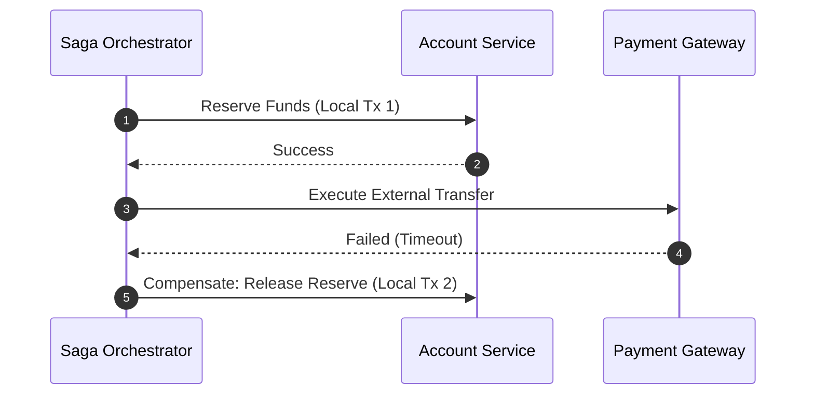

> **Prerequisite:** Familiarity with the concepts introduced in [Part 3 — Event Sourcing Cqrs](/series/core-banking-architecture/part-3-event-sourcing-cqrs/). Review it first if the terminology in this part is unfamiliar.

**Answer-first:** The Saga pattern coordinates distributed transactions across core banking microservices without two-phase commit (2PC). By executing local transactions and defining compensating actions for failures, Sagas ensure eventual consistency across payment and ledger services.

> **Series (Part 4 of 8):** This article builds upon Event Sourcing from [Part 3](/series/core-banking-architecture/part-3-event-sourcing-cqrs/). The Saga Pattern solves the problem: "How do we ensure consistency when a transaction must coordinate across multiple microservices without using distributed locks or 2PC?"

## What is the Saga Pattern in Fintech?

The Saga pattern coordinates distributed financial transactions across microservices using a sequence of local transactions and compensating actions.

The sequence diagram below illustrates how an orchestrator issues compensation commands when downstream payment processing fails.



A Saga is a sequence of local transactions. Each local transaction updates the database of its respective service and publishes an event or message to trigger the next local transaction. If any step fails, the Saga executes **compensating transactions** to undo the preceding steps — ensuring eventual consistency without the need for distributed locks.

**Real-world example**: Interbank money transfers require coordination:
1. **Account Service**: Deduct funds from the source account (hold/debit)
2. **Payment Gateway Service**: Dispatch the instruction via SWIFT/NAPAS
3. **Notification Service**: Send an SMS/Push notification to the customer

If step 2 fails after step 1 succeeds → **compensation** is required to refund the money.

---

## Choreography vs Orchestration: When to Use Which?

Choreography suits simple 2-3 step event flows, while Orchestration with Temporal is required for complex multi-step payment workflows.

### Choreography Saga (Event-Driven)

Services communicate via events — there is no central coordinator. The diagram below illustrates event broadcast paths during standard execution and failure compensation.

```
Account Service          Payment Service         Notification Service
      │                         │                        │
      │──TransferInitiated──────▶│                        │
      │                          │──PaymentSubmitted──────▶│
      │                          │                        │── SMS Sent
      │◀──PaymentCompleted───────│                        │
      │                          │                        │
   (release hold)                                     (done)

Failure case:
      │◀──PaymentFailed──────────│
      │                          │
   (refund source account)
```

**Typical latency**: **<5ms per hop** because there is no central coordinator network call.

**Drawbacks**: Difficult to track the overall saga state, debugging distributed failures is complex, and distributed tracing is mandatory.

### Orchestration Saga (Central Coordinator)

An Orchestrator coordinates the entire flow. The topology diagram below details how microservices operate under central workflow control.

```
       Orchestrator (Temporal/Conductor)
              │
         ┌────┼────────────────┐
         ▼    ▼                ▼
  Account Svc  Payment Svc   Notif Svc
```

**Typical latency**: **10-50ms per hop** due to the additional network calls to the Orchestrator. But in return:
- The entire saga state is stored centrally.
- Easy to debug (simply query the orchestrator state).
- Retry/timeout logic is managed in one place.

### Comparison Matrix

The comparison matrix below evaluates key architectural trade-offs between Choreographed Sagas and Orchestrated Sagas in financial distributed systems. It highlights performance differences across execution latency, operational debugging complexity, component coupling, failure management, and target financial use cases.

| Criteria | Choreography | Orchestration |
|----------|-------------|---------------|
| **Latency** | <5ms/hop | 10-50ms/hop |
| **Debugging** | Hard (distributed tracing required) | Easy (central state) |
| **Coupling** | Loose coupling | Tighter (services are aware of the orchestrator) |
| **Failure handling** | Complex (who is responsible?) | Clear (orchestrator handles retries) |
| **Best suited for** | Simple flows (<3 steps) | Complex flows (≥3 steps with compensation) |

**Recommendation for Fintech**: Use **Orchestration** for business-critical flows like money transfers. The 10-50ms latency cost is worth trading for clear visibility and a safe compensation chain.

---

## Temporal Workflow: Go Implementation

Temporal Go SDK implements durable Saga workflows, managing state persistence, retries, and compensation execution automatically.

[Temporal](https://temporal.io/) is among the most widely adopted orchestration engines for Saga patterns (as of this writing). The Go implementation below manages multi-step payment execution, automated retry policies, and compensation rollbacks:

```go
package workflows

import (
    "fmt"
    "time"
    
    "go.temporal.io/sdk/temporal"
    "go.temporal.io/sdk/workflow"
)

// TransferRequest — Input for the saga
type TransferRequest struct {
    TransferID    string
    FromAccountID string
    ToAccountID   string
    Amount        int64  // Stored in cents/smallest unit
    Currency      string
    IdempotencyKey string
}

// TransferWorkflow — Orchestrator Saga
func TransferWorkflow(ctx workflow.Context, req TransferRequest) error {
    logger := workflow.GetLogger(ctx)
    
    // Activity options: timeout + retry policy
    activityOpts := workflow.ActivityOptions{
        StartToCloseTimeout: 5 * time.Second,
        RetryPolicy: &temporal.RetryPolicy{
            InitialInterval:    time.Second,
            BackoffCoefficient: 2.0,
            MaximumInterval:    30 * time.Second,
            MaximumAttempts:    3,
            // Do not retry business errors (insufficient funds, etc.)
            NonRetryableErrorTypes: []string{
                "InsufficientFundsError",
                "AccountFrozenError",
                "InvalidAccountError",
            },
        },
    }
    ctx = workflow.WithActivityOptions(ctx, activityOpts)
    
    // === STEP 1: Debit source account (hold funds) ===
    var debitResult DebitResult
    err := workflow.ExecuteActivity(ctx, DebitAccountActivity, req).Get(ctx, &debitResult)
    if err != nil {
        // Step 1 failed — no compensation needed, saga aborted cleanly
        logger.Error("Debit failed, saga aborted", "transferID", req.TransferID, "error", err)
        return fmt.Errorf("debit failed: %w", err)
    }
    
    // === STEP 2: Submit payment through gateway ===
    var paymentResult PaymentResult
    err = workflow.ExecuteActivity(ctx, SubmitPaymentActivity, req).Get(ctx, &paymentResult)
    if err != nil {
        // Step 2 failed — MUST compensate step 1
        logger.Error("Payment failed, executing compensation", "transferID", req.TransferID)
        
        // Execute compensation ASYNC (do not block main flow)
        compensationCtx := workflow.WithActivityOptions(ctx, workflow.ActivityOptions{
            StartToCloseTimeout: 10 * time.Second,
            RetryPolicy: &temporal.RetryPolicy{
                MaximumAttempts: 5, // Try harder for compensations
            },
        })
        compErr := workflow.ExecuteActivity(
            compensationCtx,
            RefundAccountActivity,
            req,
        ).Get(ctx, nil)
        
        if compErr != nil {
            // CRITICAL: Compensation itself failed
            // Log to DLQ and fire human alert
            logger.Error("CRITICAL: Compensation failed",
                "transferID", req.TransferID,
                "compensation_error", compErr)
            // Return special error to trigger DLQ routing
            return fmt.Errorf("compensation_failed: %w", compErr)
        }
        
        return fmt.Errorf("payment failed (refunded): %w", err)
    }
    
    // === STEP 3: Send notification (non-critical, best effort) ===
    notifCtx := workflow.WithActivityOptions(ctx, workflow.ActivityOptions{
        StartToCloseTimeout: 3 * time.Second,
            MaximumAttempts: 2,
        },
    })
    // Best effort — do not fail the workflow if notification fails
    _ = workflow.ExecuteActivity(notifCtx, SendNotificationActivity, req).Get(ctx, nil)
    
    logger.Info("Transfer completed successfully", "transferID", req.TransferID)
    return nil
}
```

---

## Saga Failure Transition Matrix

Saga failure transition matrices define explicit compensating triggers for every possible failure point in a multi-service transfer.

Here is a detailed analysis of failure scenarios and how they are handled:

| Step | Failure Point | Orchestration Saga | Choreography Saga |
|------|--------------|--------------------|--------------------|
| **Step 1 Fail** (Debit) | Account has insufficient funds | Orchestrator receives error → marks saga **Aborted**. No compensation needed. | Service A publishes `TransferFailed` event. No compensation. |
| **Step 2 Fail** (Payment) | Network timeout to NAPAS/SWIFT | Orchestrator receives error → triggers **RefundActivity** async to revert Step 1. | Service B publishes `PaymentFailed` → Service A consumes and refunds. |
| **Step 3 Fail** (Notification) | SMS gateway down | Marks notification as best-effort. Workflow completes successfully. | Service C fails silently; payment has already completed. |
| **Compensation Fail** | Refund service down | Orchestrator retries with exponential backoff → routes to **DLQ** → alerts ops team. | Refund event sits in DLQ or is lost; requires distributed tracing to detect. |
| **Orchestrator Crash** | Temporal node goes down | Temporal persists saga state to durable storage → auto-resumes on recovery. | N/A (no orchestrator) |

---

## Idempotency Keys in Sagas

Idempotency keys passed across Saga steps prevent double execution of financial debits during network retries.

Every step in a Saga requires idempotency to ensure safe retries. The Go activity implementation below checks Redis result locks before executing account debits:

```go
// Activity with idempotency key
func DebitAccountActivity(ctx context.Context, req TransferRequest) (DebitResult, error) {
    // Check: has this idempotency key been processed?
    existing, err := checkIdempotencyKey(ctx, req.IdempotencyKey + "_debit")
    if err == nil && existing != nil {
        // Already processed — return cached result
        return *existing, nil
    }
    
    // Begin processing
    result, err := performDebit(ctx, req.FromAccountID, req.Amount)
    if err != nil {
        return DebitResult{}, err
    }
    
    // Store result in idempotency store (Redis, 24h TTL)
    storeIdempotencyResult(ctx, req.IdempotencyKey + "_debit", result, 24*time.Hour)
    
    return result, nil
}
```

**Tiered lock strategy for webhook idempotency:**

The timeline breakdown below outlines the lock TTL tiers used to manage active processing locks versus cached responses.

```
5 minutes: pending lock (prevents concurrent processing)
24-48 hours: result cache (returns cached response for duplicate requests)
```

---

## Choreography Implementation: Kafka-based

Kafka-based choreography routes domain events between microservices, executing local debits and publishing compensation events on errors.

The Go event handlers below show how services consume topic messages and publish failure events during errors:

```go
// Account Service — publishes event when step 1 completes
func (s *AccountService) HandleTransferRequest(ctx context.Context, req TransferRequest) {
    // Within the same DB transaction:
    err := s.db.WithTransaction(ctx, func(tx *sql.Tx) error {
        // 1. Debit account
        holdFunds(tx, req.FromAccountID, req.Amount)
        
        // 2. Write outbox event
        insertOutboxEvent(tx, "TransferInitiated", req)
        return nil
    })
    
    if err != nil {
        // Publish TransferFailed event
        s.eventBus.Publish("payment.events", TransferFailedEvent{
            TransferID: req.TransferID,
            Reason:     err.Error(),
        })
    }
}

// Payment Service — listens for TransferInitiated event
func (s *PaymentService) HandleTransferInitiated(ctx context.Context, event TransferInitiatedEvent) {
    err := submitToGateway(ctx, event)
    if err != nil {
        // Publish failure — Account Service will refund
        s.eventBus.Publish("payment.events", PaymentFailedEvent{
            TransferID: event.TransferID,
            Reason:     err.Error(),
        })
        return
    }
    s.eventBus.Publish("payment.events", PaymentCompletedEvent{
        TransferID: event.TransferID,
    })
}
```

---

## Dead Letter Queue Strategy

Dead-letter queues capture un-compensable Saga failures, triggering operator war room alerts and manual remediation procedures.

When the compensation chain fails, the event must be routed to a DLQ. The Go implementation below writes unrecoverable failures to an audit log and triggers P1 alerts:

```go
// DLQ handler — receives failed compensation events
type DLQHandler struct {
    alertManager AlertManager
    auditLog     AuditLogger
}

func (h *DLQHandler) HandleFailedCompensation(ctx context.Context, event FailedCompensationEvent) {
    // 1. Write to immutable audit log
    h.auditLog.LogCritical(ctx, AuditEntry{
        EventType:  "CompensationFailed",
        TransferID: event.TransferID,
        Reason:     event.Reason,
        Timestamp:  time.Now(),
    })
    
    // 2. Fire P1 alert immediately
    h.alertManager.FireP1Alert(ctx, P1Alert{
        Title:   "CRITICAL: Transfer Compensation Failed",
        Message: fmt.Sprintf("Transfer %s failed compensation. Manual intervention required.", event.TransferID),
        Details: event,
    })
    
    // 3. Do not auto-retry — wait for manual review from the ops team
}
```

---

## QA & SDET Testing Strategy

Testing Sagas requires injecting service failures at every step to verify that compensating transactions execute cleanly and restore balance.

### Test 1: Step 2 Failure + Compensation Verification

The Go unit test below mocks gateway errors to verify that compensating refund activities return source accounts to original balance state.

```go
// Scenario: Mock Payment Service to fail at step 2
func TestStep2FailureCompensation(t *testing.T) {
    // Setup: Mock Payment Service to fail at step 2
    mockPaymentSvc := &MockPaymentService{ShouldFail: true}
    
    initialBalanceA := getBalance("account-A")
    
    // Execute saga
    err := transferWorkflow.Execute(ctx, TransferRequest{
        From: "account-A", To: "account-B", Amount: 1000000,
    })
    
    // Workflow must return an error
    assert.Error(t, err)
    assert.Contains(t, err.Error(), "payment failed")
    
    // But compensation must succeed: balance A returns to normal
    finalBalanceA := getBalance("account-A")
    assert.Equal(t, initialBalanceA, finalBalanceA,
        "Compensation must refund money back to account A")
    
    // Balance B must remain unchanged
    assert.Equal(t, originalBalanceB, getBalance("account-B"))
}
```

### Test 2: Double Failure — Step 2 + Compensation

The failure injection test below confirms that double-fault scenarios route state records to the Dead Letter Queue for operator triage.

```go
func TestDoubleFaultCompensationDLQ(t *testing.T) {
    // Mock: step 2 fails AND compensation activity also fails
    mockPaymentSvc := &MockPaymentService{ShouldFail: true}
    mockRefundSvc := &MockRefundService{ShouldFail: true}
    
    dlqEvents := captureDeadLetterQueue()
    
    // Execute saga
    executeTransferWorkflow(ctx, transferReq)
    
    // Wait for retries to exhaust
    waitForRetryExhaustion()
    
    // There must be an event in the DLQ
    assert.Greater(t, len(dlqEvents), 0,
        "Failed compensation must be routed to DLQ")
    
    // A P1 alert must have been fired
    assert.True(t, alertManager.P1AlertFired(),
        "P1 alert must be fired for failed compensation")
}
```

---

> 💡 **Read more:** [Event Sourcing & CQRS](/series/core-banking-architecture/part-3-event-sourcing-cqrs/) — Event Sourcing serves as the foundation for the Saga.

### Compensating Transaction Failures and Out-of-Order Execution in Sagas

A critical vulnerability of the Saga pattern is the handling of compensation failures. Sagas do not hold global database locks. If a multi-step transaction fails midway, the Saga coordinator executes compensations to roll back the completed steps. However, a compensation transaction itself can fail due to network timeouts, database outages, or insufficient funds.

To guarantee eventual consistency, systems implement the following resilience patterns:
- **Exponential Backoff and Retry:** If a compensation fails (e.g., releasing reserved funds in a ledger), the coordinator retries the operation with exponential backoff. The target service must be designed to be idempotent to handle these retries safely.
- **Dead Letter Queues (DLQ) and Manual Intervention:** If a compensation fails repeatedly after a maximum number of retries, the coordinator writes the transaction state to a DLQ and alerts the operations team for manual reconciliation.
- **The Out-of-Order Compensation Trap:** In highly congested distributed networks, a compensation event (e.g., Cancel Order) might arrive at a microservice before the corresponding forward event (Create Order) due to network routing delays. If the service processes the compensation first, it might create a duplicate record or fail. To prevent this, the service must write a Compensated tombstone record using the Saga session ID. When the late-arriving forward event finally arrives, the service detects the tombstone and rejects the transaction.

### Saga Orchestrator High Availability and Recovery Workflow

To prevent the Saga coordinator from becoming a single point of failure, it is deployed as a stateless service behind an active-active load balancer, with its session state persisted in a distributed database. If a coordinator node crashes mid-transaction, another coordinator node retrieves the active session from the database and resumes the Saga sequence from the last recorded state.

Additionally, the coordinator implements a reconciliation engine that runs continuously in the background. This engine scans the active Saga database for sessions that have been in a pending state longer than a specified timeout (e.g., 30 seconds). When it detects a stalled transaction, it automatically triggers a query to the participant microservices to verify the status of the local transactions, resolving the Saga state by either executing the remaining steps or initiating the compensation chain.

## Saga Latency, Compensation Atomicity, and Timeout Ambiguity

Managing Saga latencies demands bounded execution timeouts and explicit handling of ambiguous HTTP 504 gateway responses.

Executing transactions across multiple microservices (e.g., reserving funds, calling payment networks, and updating ledgers) requires distributed transaction coordination. Core banking architectures use the Saga pattern to manage these workflows.

### Orchestration vs. Choreography Saga Latency

1. **Choreography-Based Sagas:** Services communicate using event pub-sub models, triggering local transactions independently. This approach has low latency but is difficult to audit and debug.
2. **Orchestration-Based Sagas:** A dedicated orchestrator service manages the transaction sequence. While this introduces network hop latency, it provides centralized control and clear auditability.

The flow diagram below traces the cumulative network hop latency incurred during an orchestrated transaction sequence.

```
Orchestration Pattern Latency Path:
  Orchestrator ──► Ledger Service (Reserve Funds) ──► Orchestrator
  Orchestrator ──► Payment Service (Debit Card)   ──► Orchestrator
  Total Network Hops: 4 (linear execution latency)
```

### Compensational Transaction Atomicity

Sagas do not use database-level locks across services. If a step fails, the orchestrator executes compensations to roll back changes.
- **Backward Recovery:** Undoing completed steps (e.g., releasing reserved funds). Compensations must be idempotent; if a network failure occurs during rollback, the orchestrator retries until successful.
- **Forward Recovery:** Continuing the saga despite failures, routing to manual review or automated fallbacks.

### Timeout Ambiguity and Idempotent Coordinators

Network failures introduce state ambiguity. If a service call times out, the orchestrator cannot verify if the transaction succeeded or failed.
- **Idempotency Locks:** Services lock the target account during transactions using unique saga session IDs. If the orchestrator retries a request, the service returns the cached outcome rather than executing a duplicate transaction.
- **Reconciliation Loops:** Out-of-band reconciliation jobs compare service logs daily, resolving any pending or unresolved saga states automatically.

## Frequently Asked Questions (FAQ)

Saga patterns achieve eventual consistency in banking microservices by executing compensating rollback steps when downstream calls fail.


Orchestration centralizes saga workflow logic in a dedicated state machine, preventing brittle, hard-to-trace circular event dependencies between microservices. It also simplifies compliance auditing by maintaining an explicit, queryable log of transaction states and compensation histories.



Compensating actions must be retryable and idempotent to handle transient network outages safely. If persistent failures exhaust retry limits, the transaction state is escalated to a Dead Letter Queue (DLQ) for operator intervention and manual ledger reconciliation.



When network calls time out, the orchestrator issues idempotent status query requests to verify whether the downstream transaction succeeded before deciding to retry or compensate. By using unique idempotency keys across all attempts, downstream services return cached execution status without performing duplicate ledger mutations.


For deeper architecture insight into distributed transaction patterns, read [Part 3: Event Sourcing & CQRS](/series/core-banking-architecture/part-3-event-sourcing-cqrs/) or connect with our team via [Saga Architecture Services](/hire/).
---

*Up Next: [Part 5 — ISO 20022 & Payment Gateways](/series/core-banking-architecture/part-5-iso-20022-payment-gateways/) — Efficiently parsing pacs.008 XML, mapping XPath to SQL columns, and webhook idempotency strategies.*



🔗 **Next Step:** Continue to [Part 5 — Iso 20022 Payment Gateways](/series/core-banking-architecture/part-5-iso-20022-payment-gateways/) for the following module in the series.
