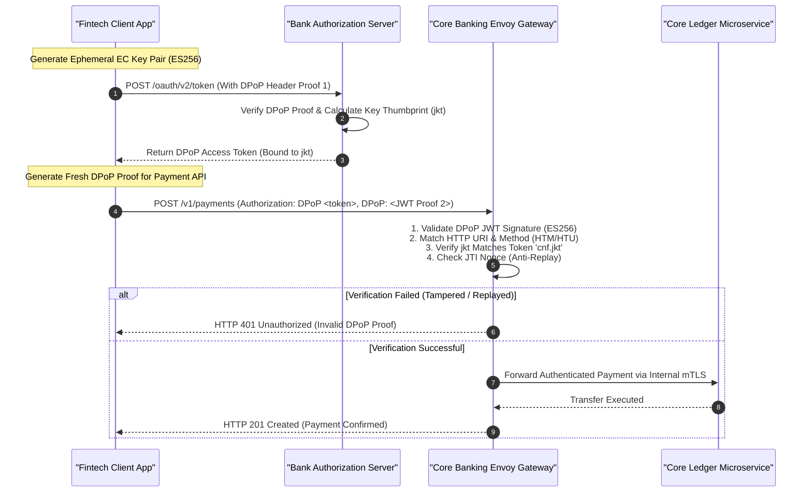

[📖 Bản tiếng Việt (Vietnamese Edition)](https://learn.tanhdev.com/series/core-banking-architecture/part-6-fapi-2-api-security/)

---

> **Series Navigation:** This is Part 6 of the **Core Banking Systems Architecture Masterclass**. For interbank rails, read [Part 5: ISO 20022 Payment Gateways](/series/core-banking-architecture/part-5-iso-20022-payment-gateways/).

# FAPI 2.0 Security: DPoP, mTLS & Sender-Constrained Tokens

**Answer-first:** Financial-Grade API (FAPI) 2.0 establishes the zero-trust security baseline for open banking and payment initiation services by completely eliminating bearer token vulnerabilities. By mandating sender-constrained tokens via Demonstrating Proof-of-Possession (DPoP, RFC 9449) or mutual TLS certificate binding (RFC 8705), alongside Pushed Authorization Requests (PAR) and Hardware Security Module (HSM) attestation, financial platforms ensure that intercepted access tokens cannot be replayed by adversaries, guaranteeing cryptographically provable non-repudiation across all external and internal API interactions.

---

## 1. Why Standard OAuth 2.0 Bearer Tokens Fail in Banking

In standard web applications, OAuth 2.0 bearer tokens function like cash: whoever holds the token possesses the authority to spend funds or read private account balances. If an attacker intercepts a bearer token from reverse proxy logs, memory dumps, or network sniffing:
1. **Unrestricted Replay**: The token can be replayed from any unauthorized client IP worldwide until expiration.
2. **Lack of Non-Repudiation**: The bank cannot legally prove whether an unauthorized transfer was executed by the legitimate customer or a compromised third-party proxy.

**FAPI 2.0 mandates Sender-Constrained Tokens**: the token is cryptographically bound to a private key held exclusively by the legitimate client. A stolen access token is completely useless without the corresponding private key to generate a per-request cryptographic proof:



---

## 2. DPoP Mathematical Verification Engine in Go

Under RFC 9449, every API call carries a `DPoP` HTTP header containing a signed JSON Web Token (JWT) with the following claims:
- `htm`: The HTTP method (e.g. `POST`).
- `htu`: The HTTP URI target (e.g. `https://api.bank.com/v1/payments`).
- `iat`: Timestamp (must be within $\pm 60$ seconds clock drift).
- `jti`: Unique token identifier (stored in Redis with a 120s TTL to block replay).
- `ath`: Base64URL-encoded SHA-256 hash of the access token string.

```go
package security

import (
	"crypto/sha256"
	"encoding/base64"
	"errors"
	"fmt"
	"time"

	"github.com/golang-jwt/jwt/v5"
)

type DPoPClaims struct {
	HTTPMethod string `json:"htm"`
	HTTPURI    string `json:"htu"`
	Nonce      string `json:"nonce,omitempty"`
	AccessTokenHash string `json:"ath"`
	jwt.RegisteredClaims
}

// VerifyDPoPProof validates the sender-constrained cryptographic proof
func VerifyDPoPProof(dpopJWT, rawAccessToken, expectedMethod, expectedURI string) error {
	token, err := jwt.ParseWithClaims(dpopJWT, &DPoPClaims{}, func(t *jwt.Token) (interface{}, error) {
		// Extract embedded public JWK from JWT header
		jwkHeader, ok := t.Header["jwk"].(map[string]interface{})
		if !ok {
			return nil, errors.New("missing jwk in DPoP header")
		}
		return parseECDSAPublicKey(jwkHeader)
	})
	if err != nil || !token.Valid {
		return fmt.Errorf("invalid DPoP proof token: %w", err)
	}

	claims, ok := token.Claims.(*DPoPClaims)
	if !ok {
		return errors.New("invalid claims type")
	}

	// 1. Assert HTTP method and URI match
	if claims.HTTPMethod != expectedMethod || claims.HTTPURI != expectedURI {
		return errors.New("DPoP method or URI mismatch")
	}

	// 2. Assert timestamp within 60-second window
	if time.Since(claims.IssuedAt.Time).Abs() > 60*time.Second {
		return errors.New("DPoP proof expired or clock skew exceeded")
	}

	// 3. Verify access token hash (ath)
	hasher := sha256.New()
	hasher.Write([]byte(rawAccessToken))
	expectedAth := base64.RawURLEncoding.EncodeToString(hasher.Sum(nil))
	if claims.AccessTokenHash != expectedAth {
		return errors.New("ath claim does not match access token hash")
	}

	return nil
}
```

---

## 3. Defense-in-Depth Architecture: Edge to Hardware Security Module (HSM)

Enterprise banking security cannot rely solely on edge token validation. True financial-grade security implements strict defense-in-depth across the entire infrastructure topology:

```mermaid
flowchart TD
    subgraph Edge_Zone ["Public Demilitarized Zone (DMZ)"]
        Consumer["Consumer Mobile / Open Banking Client"]
        WAF["Envoy Gateway + Behavioral WAF<br/>(Rate Limiting & DDoS Shield)"]
        DPoPFilter["DPoP & FAPI 2.0 Validator Filter"]
        Consumer -->|HTTPS + DPoP (RFC 9449)| WAF
        WAF --> DPoPFilter
    end

    subgraph Internal_Mesh ["Secure Kubernetes Cluster (Zero-Trust VPC)"]
        mTLS_Sidecar["SPIFFE/SPIRE Mutual TLS Sidecar<br/>(Rotated X.509 SVIDs Every 60m)"]
        CoreAPI["Core Banking Go Microservice"]
        DPoPFilter -->|Internal Mutual TLS| mTLS_Sidecar
        mTLS_Sidecar --> CoreAPI
    end

    subgraph Cryptographic_Core ["Hardware Security Appliance (FIPS 140-3 Level 3)"]
        HSM["Hardware Security Module (HSM)<br/>Thales Luna / AWS CloudHSM"]
        PKCS11["PKCS#11 C/Go Wrapper<br/>Master Key Derivation (LMK/ZMK)"]
        DB["PostgreSQL 17 Database<br/>Column-Level AES-256-GCM Encryption"]

        CoreAPI -->|PKCS#11 API| PKCS11
        PKCS11 --> HSM
        CoreAPI -->|Persist Encrypted Ciphertext| DB
    end
```

---

## 4. Hardware Security Modules (HSM) & PIN Block Translation

In core banking card networks and ATM processing, plain customer PINs are never permitted in application memory. They must be translated inside a certified Hardware Security Module (HSM) using PKCS#11:

1. **PIN Block ISO 9564 Format 0**: Customer PIN is XORed with the Primary Account Number (PAN) at the point-of-sale:
   $$\text{PIN Block} = \text{Plaintext PIN Block} \oplus \text{PAN Field}$$
2. **Zone Key Translation**: The incoming PIN block encrypted under the terminal Master Key (ZPK) is ingested by the HSM. The HSM decrypts the PIN block within its tamper-responsive physical boundary and re-encrypts it under the interbank Zone Key (ZAK) before dispatching to NAPAS, guaranteeing zero plaintext exposure.

---

## Frequently Asked Questions (FAQ)


Traditional bearer tokens grant unconditional access to whoever holds the token string. DPoP (RFC 9449) eliminates this vulnerability by cryptographically binding the access token to the client's public key (via a `cnf.jkt` claim). On every API request, the client must generate and sign a fresh, single-use DPoP proof using its private key, embedding the specific HTTP method, URI, and timestamp. Even if an attacker steals the bearer token, they cannot generate valid DPoP proofs without the client's private key.



An initial mTLS handshake incurs approximately 1ms to 3ms of latency due to asymmetric certificate verification and CPU-intensive key exchange. In modern banking microservice meshes (e.g. Envoy and Istio with SPIFFE/SPIRE), persistent HTTP/2 and gRPC connection pooling amortize this cost across thousands of requests. Once the TCP connection and TLS session are established, per-request overhead drops to less than 0.05ms (symmetric AES-GCM encryption), delivering near-native performance.



In international banking, FAPI 2.0 is mandated by Open Banking UK, European Union PSD3 guidelines, and Australia's Consumer Data Right (CDR). In Vietnam, the State Bank of Vietnam (SBV) mandates strict data protection under Circular 18/2018/TT-NHNN, Circular 09/2020/TT-NHNN, and Decree 13/2023/ND-CP on Personal Data Protection, requiring field-level encryption for sensitive account data, Hardware Security Modules (HSM) for financial key derivation, and multi-factor biometric authentication for high-value payments.

