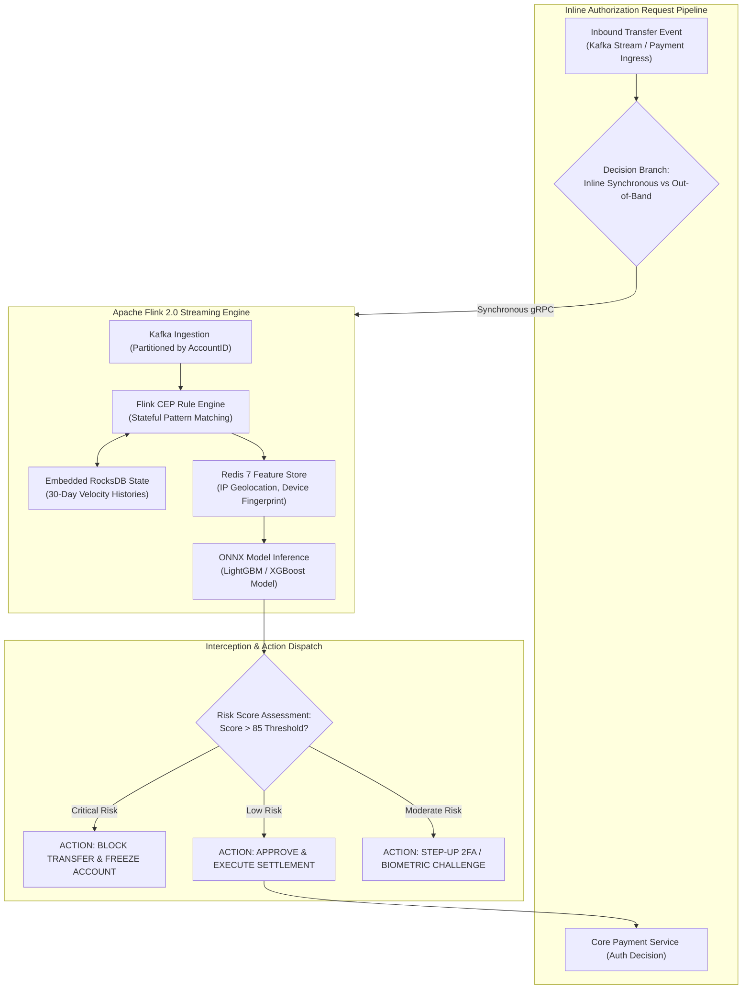
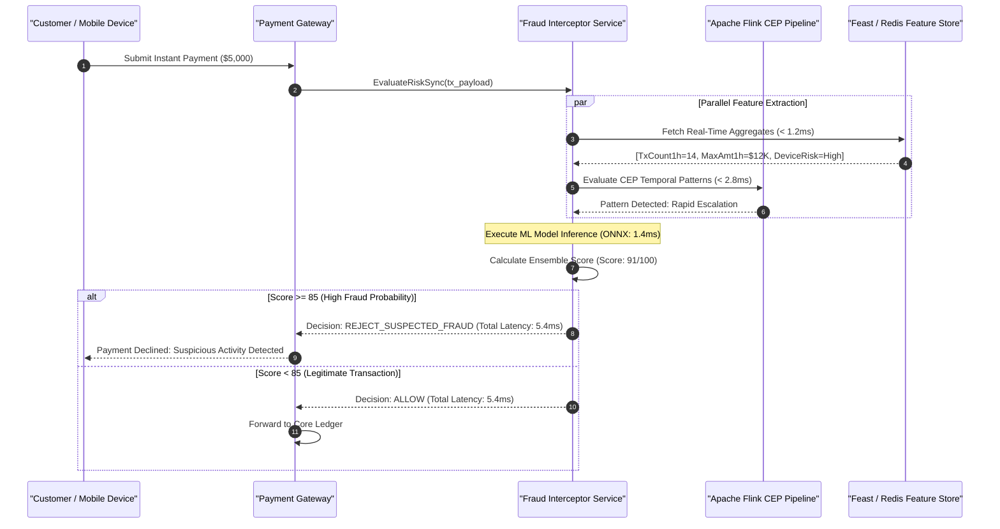

[📖 Bản tiếng Việt (Vietnamese Edition)](https://learn.tanhdev.com/series/core-banking-architecture/part-7-streaming-fraud-detection/)

---

> **Series Navigation:** This is Part 7 of the **Core Banking Systems Architecture Masterclass**. For API security profiles, read [Part 6: FAPI 2.0 Security](/series/core-banking-architecture/part-6-fapi-2-api-security/).

# Streaming Fraud Detection: Flink CEP, RocksDB & ML

**Answer-first:** Real-time financial fraud detection architectures replace post-settlement batch analytics with inline streaming Complex Event Processing (CEP) and low-latency machine learning inference. By combining Apache Flink's stateful stream processing with embedded RocksDB state backends, real-time sliding velocity windows, and an in-memory feature store (Redis/Dragonfly), modern core banking platforms intercept account takeover (ATO), card cloning, and mule account routing inline within a strict sub-10ms latency budget before funds depart the institution.

---

## 1. The Streaming Defense Architecture: Sub-10ms Inline Evaluation

Traditional fraud monitoring systems operated as asynchronous, post-facto batch pipelines running nightly against transaction databases. While useful for regulatory reporting, post-settlement detection cannot prevent instantaneous fund loss on modern 24/7 clearing rails (such as NAPAS 24/7 or FedNow), where payments settle irreversibly within seconds.

The 2027 SOTA fraud architecture embeds streaming evaluation directly into the payment authorization path:



---

## 2. Apache Flink CEP Pattern Definitions

Complex Event Processing (CEP) detects suspicious behavioral sequences across time. A quintessential banking fraud pattern is the **Impossible Velocity / Geolocation Jump** (e.g., a card physically presented in Hanoi, followed by an ATM cash withdrawal in Ho Chi Minh City 5 minutes later):



### Production Flink Java CEP Rule Definition
```java
// Definition of rapid high-volume velocity attack followed by account drain
Pattern<TransactionEvent, ?> accountDrainPattern = Pattern.<TransactionEvent>begin("small_probing")
    .where(new SimpleCondition<TransactionEvent>() {
        @Override
        public boolean filter(TransactionEvent tx) {
            return tx.getAmount() < 50_000; // Small probing transaction (< 50,000 VND)
        }
    })
    .followedBy("massive_withdrawal")
    .where(new IteratingCondition<TransactionEvent>() {
        @Override
        public boolean filter(TransactionEvent tx, Context<TransactionEvent> ctx) throws Exception {
            double currentAmount = tx.getAmount();
            // Compare against 30-day moving average stored in state
            double averageAmount = ctx.getEventsForPattern("small_probing").iterator().next().getHistoricalAverage();
            return currentAmount > 20_000_000 && (currentAmount / averageAmount) > 10.0;
        }
    })
    .within(Time.minutes(5)); // Occurring within a 5-minute sliding window
```

---

## 3. RocksDB State Backend & Fault-Tolerant Checkpointing

Tracking 30-day transaction velocity across 20,000,000 active bank accounts requires gigabytes of state data. Keeping this state purely in JVM heap memory causes fatal Garbage Collection pauses.

Apache Flink delegates state management to **embedded RocksDB**:
- **Out-of-Core Storage**: Active state resides in fast NVMe SSD storage with an in-memory block cache, bypassing JVM garbage collection entirely.
- **Incremental Checkpointing**: Flink uploads only newly flushed RocksDB SST files (SSTables) to S3/MinIO every 10 seconds. In the event of a TaskManager failure, the cluster recovers state in under 2 seconds without stream reprocessing gaps.

---

## 4. Online Feature Stores: Feast & Redis Integration

Machine learning models require real-time feature vectors calculated over historical time horizons. Querying an analytical SQL warehouse inline during a payment request is completely impossible due to multi-second latency.

Modern banking uses an **Online Feature Store**:
- **Real-Time Accumulators**: Flink continuously computes sliding metrics (`tx_count_5m`, `total_amount_1h`, `ratio_vs_30d_avg`) and pushes them directly to an in-memory Redis cluster.
- **Sub-2ms Inference**: When an authorization request arrives, the payment gateway retrieves the complete pre-computed feature vector from Redis in under 1.5ms, feeding it directly into an ONNX-optimized LightGBM model for instantaneous risk classification.

---

## Frequently Asked Questions (FAQ)


Platforms implement a tiered risk evaluation strategy. Low-latency synchronous checks (evaluating hard rules, velocity counters, and lightweight ML models in Redis) execute inline within a strict 8ms budget. If the transaction falls into an ambiguous risk band (e.g. score between 65 and 84), the system triggers an interactive step-up authentication challenge (such as biometric facial verification or SMS OTP). Meanwhile, complex deep-learning graph analytics and sanctions screening run asynchronously out-of-band to prevent checkout friction.



The default Heap StateBackend stores streaming state as Java objects on the JVM heap. For large banking workloads tracking tens of millions of customer profiles and multi-week sliding windows, heap size exceeds hundreds of gigabytes, leading to unpredictable Stop-The-World GC pauses that violate banking SLA latencies. RocksDB offloads state to local NVMe storage using C++ off-heap memory, providing predictable low latency and supporting incremental checkpointing for instant disaster recovery.



Distributed networks and mobile connectivity issues frequently deliver transaction events out of chronological sequence. Apache Flink handles this through Event Time processing and Bounded-Out-Of-Orderness Watermarks. The engine extracts the true creation timestamp (`CreDtTm`) from the transaction payload and permits a configurable lateness window (e.g. 5 seconds). Events arriving within the watermark window are correctly ordered into their proper sliding time windows before triggering CEP rule evaluation.

