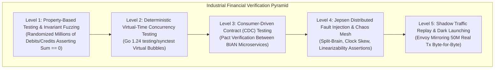
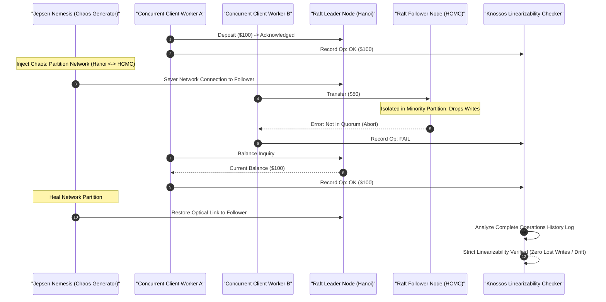

[📖 Bản tiếng Việt (Vietnamese Edition)](https://learn.tanhdev.com/series/core-banking-architecture/part-8-qa-sdet-handbook/)

---

> **Series Navigation:** This is Part 8 (Final Chapter) of the **Core Banking Systems Architecture Masterclass**. For the complete architectural curriculum, revisit the [Master Overview Guide](/series/core-banking-architecture/).

# QA & SDET Handbook: Testing Distributed Core Banking

**Answer-first:** Testing distributed core banking engines requires moving far beyond conventional mock-driven unit tests. Because financial systems must guarantee strict linearizability, zero silent balance drift, and fault-tolerant continuous availability under arbitrary network partitions, Software Development Engineers in Test (SDETs) implement multi-tiered verification harnesses: deterministic concurrency testing via Go 1.24 `testing/synctest`, automated ledger invariant fuzzing, Consumer-Driven Contract (CDC) testing with Pact, Jepsen split-brain chaos verification, and production shadow traffic replay.

---

## 1. The Financial Systems Testing Pyramid

In consumer software, occasional race conditions result in minor UI glitches. In core banking, a single concurrency bug can corrupt general ledgers, trigger unauthorized overdrafts, or violate central bank solvency ratios. 

The 2027 SOTA banking testing pyramid replaces shallow integration tests with formal mathematical verification gates:



---

## 2. Jepsen Chaos Injection & Linearizability Verification

Distributed SQL and consensus ledger engines (such as CockroachDB, TiDB, or custom Raft clusters) must be subjected to formal adversarial testing using [Jepsen](https://jepsen.io/). 

The test harness introduces aggressive physical network disruptions while concurrent workers submit financial transfers, asserting linearizability via the Knossos history checker:



---

## 3. Deterministic Concurrency Testing with Go 1.24 `testing/synctest`

Prior to Go 1.24, testing multi-goroutine race conditions in financial engines relied on flaky `time.Sleep()` delays, leading to non-deterministic CI test failures.

Go 1.24 introduces **`testing/synctest`**, which executes goroutines inside an isolated virtual time bubble. Virtual time advances deterministically only when all goroutines in the bubble are blocked:

```go
package ledger_test

import (
	"context"
	"sync"
	"testing"
	"testing/synctest"
)

// TestConcurrentTransfersDeterministic asserts ledger balance under race conditions
func TestConcurrentTransfersDeterministic(t *testing.T) {
	synctest.Run(func() {
		ledger := NewInMemoryLedger(10_000_000) // Initial balance: 10M VND
		var wg sync.WaitGroup

		// Spawn 100 concurrent withdrawal goroutines attempting to debit 200K VND each
		for i := 0; i < 100; i++ {
			wg.Add(1)
			go func() {
				defer wg.Done()
				_ = ledger.DebitAccount(context.Background(), "alice", 200_000)
			}()
		}

		wg.Wait()

		// Verify absolute mathematical invariant
		finalBalance := ledger.GetBalance("alice")
		expectedBalance := int64(10_000_000 - (100 * 200_000))
		if finalBalance != -10_000_000 && finalBalance != expectedBalance {
			t.Fatalf("Mathematical invariant broken: expected %d, got %d", expectedBalance, finalBalance)
		}
	})
}
```

---

## 4. Shadow Traffic Replay at Scale

Before promoting a release candidate build of a core banking engine to production, banking SDETs deploy **Envoy Request Shadowing (Traffic Mirroring)**:
- **Zero Production Impact**: Live client requests entering the API gateway are duplicated asynchronously. The production response is returned to the user, while the cloned payload is fired at a dark shadow cluster.
- **Byte-for-Byte Ledger Parity**: A continuous verification worker intercepts database journal outputs from both clusters. Over a 30-day soak period processing 50,000,000 transactions, the verification harness asserts that $100\%$ of journal postings, fee deductions, and EOD interest calculations produce identical byte-level results.

---

## Frequently Asked Questions (FAQ)


Jepsen is an open-source distributed systems verification framework that tests databases under simulated catastrophic failures. It injects network splits, packet delays, clock drift, and sudden node termination while concurrent clients execute operations. It records the chronological operations log and verifies whether the system adheres to formal consistency models like Linearizability or Strict Serializability. For core banking, Jepsen testing proves that network partitions cannot cause duplicate deposits, lost transfers, or phantom balances.



Traditional concurrent tests rely on real-world wall-clock sleeps, which are inherently flaky and slow down CI/CD pipelines. Go 1.24 `testing/synctest` runs code inside an isolated "virtual time bubble." The runtime knows when all goroutines are blocked waiting on channels, mutexes, or timers, and advances virtual time instantly without waiting for real-world time to elapse. This allows testing thousands of complex concurrent transfers and timeout scenarios in a few milliseconds with 100% deterministic repeatability.



In large composable core banking environments with dozens of microservices, end-to-end integration environments are fragile and slow. Consumer-Driven Contract (CDC) testing (using tools like Pact) allows API consumers (e.g. Mobile BFF or Payment Switch) to define the exact request-response contracts they require. These contracts are verified automatically against the provider microservice's API during CI builds, catching schema breaks, missing fields, or semantic changes before code is deployed to staging.

