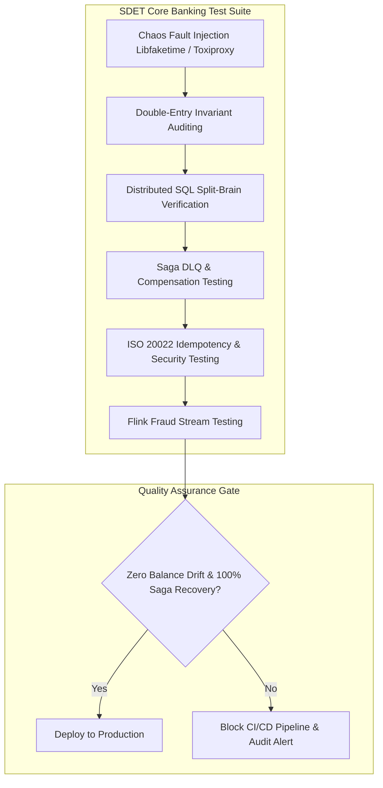

> **Prerequisite:** Familiarity with the concepts introduced in [Part 7 — Streaming Fraud Detection](/series/core-banking-architecture/part-7-streaming-fraud-detection/). Review it first if the terminology in this part is unfamiliar.

**Answer-first:** Core banking SDET testing validates financial transactions through automated double-entry invariant assertions, chaos fault injection, and split-brain partition simulation. Dedicated test suites ensure ledger immutability, zero balance drift, and deterministic recovery under peak workloads.

> **Series (Part 8 of 8):** This concluding article compiles a thorough testing strategy specifically tailored for each layer of the Core Banking Architecture covered in previous parts — from ledger consistency to distributed SQL, Sagas, ISO 20022, API Security, and Streaming Fraud Detection.

## Why Does Core Banking Need a Dedicated SDET?

Core banking systems handle real money, demanding dedicated SDET leads to verify double-entry invariants, distributed ACID, and security.

Testing high-availability financial systems demands specialized Software Development Engineers in Test (SDET) who construct specialized test suites for financial transaction safety. Standard web application unit tests cannot catch critical concurrency flaws, edge-case financial race conditions, or partial distributed failures. Critical financial bugs—such as duplicate fund transfers, unbalanced general ledger entries, or stale read anomalies—typically emerge only under high concurrent loads, network partitions, NTP clock drift, or unexpected pod terminations.

SDET teams operating in modern core banking environments design automated chaos engineering pipelines, consumer-driven contract verification (using Pact), and continuous balance reconciliation systems. These testing suites validate strict mathematical balance invariants (`SUM(DEBIT) == SUM(CREDIT)`) across every ledger account, simulate split-brain Raft partition scenarios using Linux `tc` and `iptables`, inject clock offset drift using `libfaketime`, and enforce sub-50ms latency performance gates in CI/CD pipelines before deployment.

The **6 test strategy categories** correspond directly to each part of the series:

| Test Category | Corresponds to Part | Risk if ignored |
|--------------|-------------------|----------------|
| **Double-Entry Invariant** | Part 1 (Ledger) | Double-spend, unbalanced GL |
| **Distributed SQL & Clock** | Part 2 (Distributed SQL) | Split-brain, stale reads |
| **Event Replay & Outbox** | Part 3 (Event Sourcing) | Data inconsistency, lost events |
| **Saga Compensation** | Part 4 (Saga) | Orphaned holds, money stuck |
| **Idempotency & API** | Parts 5, 6 (ISO 20022, Security) | Double-charge, token theft |
| **Flink State & SLA** | Part 7 (Fraud Detection) | Undetected fraud, false positives |

---

## Category 1: Double-Entry Invariant Auditing

Double-entry test suites execute concurrent money transfers while continuously asserting that total debits match total credits across all accounts.

### Test 1.1: Concurrent Double-Spend Prevention

To verify that concurrent withdrawals from the same account cannot cause negative balances or double-spending, SDET teams run stress tests with parallel goroutines. The Go unit test below spawns 100 concurrent workers against an account balance of 100,000 VND and asserts that exactly 10 withdrawals succeed while maintaining zero ledger imbalance.

**Objective**: 100 goroutines concurrently withdrawing money from an account — only a number of requests equal to the available balance are allowed to succeed.

```go
func TestConcurrentDoubleSpend(t *testing.T) {
    const (
        numWorkers     = 100
        withdrawAmount = 10_000   // 10,000 VND
        initialBalance = 100_000  // 100,000 VND
    )
    
    // Setup: create account with fixed balance
    accountID := createTestAccount(initialBalance)
    
    var (
        successCount atomic.Int64
        wg           sync.WaitGroup
    )
    
    // Run 100 concurrent withdrawals
    for i := 0; i < numWorkers; i++ {
        wg.Add(1)
        go func() {
            defer wg.Done()
            err := withdrawFromAccount(accountID, withdrawAmount)
            if err == nil {
                successCount.Add(1)
            }
        }()
    }
    wg.Wait()
    
    // Exactly 10 requests should be allowed to succeed
    assert.Equal(t, int64(10), successCount.Load(),
        "Exactly 10 withdrawals are allowed with a balance of 100,000 VND")
    
    // Final balance must be 0 — no negative balance, no double-counting
    finalBalance := getAccountBalance(accountID)
    assert.Equal(t, int64(0), finalBalance,
        "Balance after all funds withdrawn must be 0, not negative")
    
    // Ledger invariant: SUM(DEBIT) = SUM(CREDIT)
    imbalance := checkLedgerBalance(accountID)
    assert.Equal(t, int64(0), imbalance,
        "Ledger must be balanced: SUM(DEBIT) = SUM(CREDIT)")
}
```

### Test 1.2: Continuous Reconciliation Job

Continuous reconciliation background jobs continuously aggregate transactional journal entries to verify that double-entry balance invariants hold true in production. The Go reconciliation query function below scans for unbalanced transactions and triggers P1 alerts if debit and credit totals deviate.

```go
// Run every 5 minutes in production monitoring
func RunLedgerReconciliation(ctx context.Context, db *sql.DB) ([]DiscrepancyReport, error) {
    query := `
        SELECT
            transaction_id,
            SUM(CASE WHEN direction = 'DEBIT' THEN amount ELSE -amount END) AS discrepancy
        FROM entries
        GROUP BY transaction_id
        HAVING SUM(CASE WHEN direction = 'DEBIT' THEN amount ELSE -amount END) <> 0
        LIMIT 100
    `
    
    rows, err := db.QueryContext(ctx, query)
    if err != nil {
        return nil, err
    }
    defer rows.Close()
    
    var reports []DiscrepancyReport
    for rows.Next() {
        var report DiscrepancyReport
        rows.Scan(&report.TransactionID, &report.Discrepancy)
        reports = append(reports, report)
    }
    
    if len(reports) > 0 {
        // CRITICAL: Fire P1 alert — ledger balance violated
        fireP1Alert(ctx, "LEDGER_IMBALANCE", reports)
    }
    
    return reports, nil
}
```

### Test 1.3: Deadlock Prevention Verification

Bi-directional payment transfers between accounts can trigger database deadlocks if lock acquisition orders are non-deterministic. The Go unit test below executes concurrent cross-transfers between two accounts and asserts that transfers complete without deadlock timeouts.

```go
func TestDeadlockFreeTransfers(t *testing.T) {
    // Create 2 accounts
    accountA := createTestAccount(1_000_000)
    accountB := createTestAccount(1_000_000)
    
    var wg sync.WaitGroup
    errs := make(chan error, 100)
    
    // 50 goroutines: A → B
    for i := 0; i < 50; i++ {
        wg.Add(1)
        go func() {
            defer wg.Done()
            err := transferBetween(accountA, accountB, 1000)
            if err != nil {
                errs <- err
            }
        }()
    }
    
    // 50 goroutines: B → A (creates a deadlock condition if lock order is wrong)
    for i := 0; i < 50; i++ {
        wg.Add(1)
        go func() {
            defer wg.Done()
            err := transferBetween(accountB, accountA, 1000)
            if err != nil {
                errs <- err
            }
        }()
    }
    
    // Run with timeout to detect deadlocks
    done := make(chan struct{})
    go func() { wg.Wait(); close(done) }()
    
    select {
    case <-done:
        // No deadlock — all goroutines finished
    case <-time.After(10 * time.Second):
        t.Fatal("DEADLOCK DETECTED: transfers did not finish in 10s")
    }
    
    // Total balance must remain unchanged
    totalBalance := getAccountBalance(accountA) + getAccountBalance(accountB)
    assert.Equal(t, int64(2_000_000), totalBalance,
        "Total balance must remain unchanged after all transfers")
}
```

---

## Category 2: Distributed SQL & Clock Resilience Testing

Clock resilience tests inject NTP clock drift and network partitions to verify distributed SQL serializability and transaction rollback behavior.

### Test 2.1: Network Partition (Split-Brain) Simulation

Simulating network split-brain scenarios ensures that distributed SQL consensus layers (such as Raft in CockroachDB or TiDB) maintain quorum integrity during network isolation. The shell script below uses Traffic Control (`tc`) to isolate minority nodes and verify that write operations are rejected on minority partitions while succeeding on majority partitions.

```bash
#!/bin/bash
# Simulation: 5-node CockroachDB cluster partitioned into 3 + 2

MINORITY_NODES=("node4" "node5")
MAJORITY_NODES=("node1" "node2" "node3")

echo "=== Starting network partition simulation ==="

# Drop packets between minority and majority nodes
for node in "${MINORITY_NODES[@]}"; do
    # SSH into node and drop packets to majority
    ssh "$node" "sudo tc qdisc add dev eth0 root netem loss 100%"
    echo "Partitioned: $node disconnected from cluster"
done

sleep 5  # Wait for partition to take effect

echo "=== Testing write behavior during partition ==="

# Test: Write on majority side must succeed
echo "Testing majority write"
cockroach sql --host=node1:26257 --insecure \
    --execute="INSERT INTO test_transactions VALUES (gen_random_uuid(), 1000, 'VND', NOW())"
echo "Majority write: EXPECTED SUCCESS"

# Test: Write on minority side must fail
echo "Testing minority write"
cockroach sql --host=node4:26257 --insecure --timeout=5s \
    --execute="INSERT INTO test_transactions VALUES (gen_random_uuid(), 1000, 'VND', NOW())" \
    && echo "FAIL: Minority write succeeded (should have failed!)" \
    || echo "PASS: Minority write correctly rejected"

echo "=== Healing partition ==="
for node in "${MINORITY_NODES[@]}"; do
    ssh "$node" "sudo tc qdisc del dev eth0 root"
done

sleep 10  # Wait for cluster to sync

# Verify: Minority nodes must catch up to consistent state
cockroach node status --host=node1:26257 --insecure
echo "All nodes should show consistent RANGES count"
```

### Test 2.2: Clock Skew Injection (libfaketime)

In distributed databases relying on Hybrid Logical Clocks or TrueTime, clock drift across cluster nodes can corrupt transaction ordering. The test script below injects artificial clock drift exceeding the 500ms threshold via `libfaketime` to assert that the database correctly rejects stale reads.

```bash
#!/bin/bash
# Inject clock drift exceeding CockroachDB's max_clock_offset (500ms)

# Install libfaketime
apt-get install -y libfaketime

# Test with 600ms clock drift (exceeding 500ms threshold)
echo "=== Testing with 600ms clock drift ==="
LD_PRELOAD=/usr/lib/x86_64-linux-gnu/faketime/libfaketime.so.1 \
FAKETIME="+0.6s" \
go test ./distributed/raft -run TestClockSkewResilience -v 2>&1

# Expectation: Database must detect and reject or retry
# MUST NOT: return stale/out-of-order data

# Test with TiDB: inject drift > TSO timestamp
echo "=== Testing TiDB clock skew ==="
LD_PRELOAD=/usr/lib/x86_64-linux-gnu/faketime/libfaketime.so.1 \
FAKETIME="+2s" \
go test ./tidb/store -run TestTSOClockDrift -v 2>&1
```

Idempotency keys ensure that duplicate API requests resulting from network retries do not execute duplicate monetary transfers. The k6 performance script below fires 100 concurrent virtual users presenting identical idempotency keys to verify consistent response generation.

```javascript
// k6/idempotency-stress.js
import http from 'k6/http';
import { check } from 'k6';

export const options = {
  vus: 100, // 100 Virtual Users
  duration: '30s',
  thresholds: {
    'checks': ['rate==1.0'], // 100% checks must pass
  },
};

// A single unique idempotency_key for all VUs
const IDEMPOTENCY_KEY = `idem-stress-test-${Date.now()}`;
const results = new SharedArray('results', () => []);

export default function () {
  const res = http.post(
    `${__ENV.BASE_URL}/api/v1/transfers`,
    JSON.stringify({
      idempotency_key: IDEMPOTENCY_KEY,  // SAME key!
      source_account:  'ACC-001',
      target_account:  'ACC-002',
      amount:          50000,
      currency:        'VND',
    }),
    { headers: { 'Content-Type': 'application/json' } }
  );

  const body = JSON.parse(res.body);

  check(res, {
    // Only accept 201 (first create) or 200 (idempotent return)
    'valid status (201 or 200)': (r) => r.status === 201 || r.status === 200,
    // transaction_id must be consistent — cannot have 2 different values
    'same transaction_id always': () => {
      const txId = body.transaction_id;
      if (results.length === 0) {
        results.push(txId);
        return true;
      }
      return txId === results[0]; // Every response must have the same transaction_id
    },
  });
}
```

---

### Test 3: Payment Gateway Latency Profile (k6 + thresholds per endpoint)

High-performance payment gateways must strictly adhere to sub-100ms ISO 20022 message parsing SLAs under load. The k6 test script below configures per-endpoint latency thresholds for pacs.008 XML parsing, payment submission, and status queries.

```javascript
// k6/gateway-latency-profile.js
import http from 'k6/http';
import { check, group } from 'k6';

export const options = {
  vus: 200,
  duration: '5m',
  thresholds: {
    // Per-endpoint SLA based on ISO 20022 integration requirements
    'http_req_duration{endpoint:pacs008_parse}':  ['p(99)<100'], // XML parse < 100ms
    'http_req_duration{endpoint:transfer_submit}': ['p(99)<200'], // Submit < 200ms
    'http_req_duration{endpoint:status_query}':    ['p(95)<20'],  // Status check < 20ms (hot path)
    'http_req_failed': ['rate<0.001'],
  },
};

export default function () {
  group('pacs.008 Parse', () => {
    const res = http.post(
      `${__ENV.BASE_URL}/api/v1/payments/parse`,
      open('./fixtures/pacs008-sample.xml'),
      {
        headers: { 'Content-Type': 'application/xml' },
        tags: { endpoint: 'pacs008_parse' },
      }
    );
    check(res, { 'parse ok': (r) => r.status === 200 });
  });

  group('Transfer Submit', () => {
    const res = http.post(
      `${__ENV.BASE_URL}/api/v1/transfers`,
      JSON.stringify({ /* transfer payload */ }),
      {
        headers: { 'Content-Type': 'application/json' },
        tags: { endpoint: 'transfer_submit' },
      }
    );
    check(res, { 'submit ok': (r) => r.status === 201 });
  });

  group('Status Query', () => {
    const txId = `test-${__VU}-${__ITER - 1}`;
    const res = http.get(
      `${__ENV.BASE_URL}/api/v1/transfers/${txId}/status`,
      { tags: { endpoint: 'status_query' } }
    );
    check(res, { 'status ok': (r) => r.status === 200 || r.status === 404 });
  });
}
```

---

### Pre-Production Load Testing Gates

Automated CI/CD release pipelines enforce pre-production quality gates by running load scenarios prior to deployment. The deployment script below executes k6 load profiles against staging environments and blocks release pipelines if latency or error thresholds are violated.

```bash
#!/bin/bash
# scripts/pre-prod-load-gate.sh
# Run in CI/CD pipeline before deploying to production

set -e

echo "=== Core Banking Load Testing Gate ==="

# 1. Ledger throughput SLA
k6 run --quiet \
  --env BASE_URL=$STAGING_URL \
  --env API_TOKEN=$STAGING_TOKEN \
  k6/ledger-throughput.js
echo "✅ Ledger throughput: P99 < 50ms"

# 2. Idempotency stress
k6 run --quiet \
  --env BASE_URL=$STAGING_URL \
  k6/idempotency-stress.js
echo "✅ Idempotency: no duplicate transactions under 100-VU storm"

# 3. Gateway latency profile
k6 run --quiet \
  --env BASE_URL=$STAGING_URL \
  k6/gateway-latency-profile.js
echo "✅ Gateway latency: pacs.008 parse < 100ms, transfer < 200ms, query < 20ms"

echo ""
echo "All load testing gates PASSED — safe to deploy to production"
```

**KPIs for the Load Testing phase:**

Before authorizing production deployment, core banking microservices must satisfy stringent load testing gates across throughput, latency, and failure resiliency metrics. The table below outlines the mandatory pass criteria for key performance indicators and the required remediation actions upon threshold violation.

| Metric | Pass Threshold | Fail → Action |
|--------|---------------|---------------|
| Transfer P99 | ≤ 50ms | Investigate DB locking, connection pool |
| Error Rate | ≤ 0.1% | Check idempotency logic, retry policy |
| Idempotency | 100% same tx_id | Bug in unique constraint / cache logic |
| pacs.008 parse P99 | ≤ 100ms | Profile XML streaming parser |
| Status query P95 | ≤ 20ms | Check Redis cache hit rate |

---

## Appendix: Testing Tools & Libraries

Recommended testing tools include Chaos Mesh for fault injection, Jepsen for consistency testing, and Go testify for unit assertions.

The following matrix summarizes the essential testing frameworks and utility libraries used across core banking quality engineering. These tools support fault injection, network partition simulation, stream operator validation, and automated performance benchmarking.

| Tool | Used For | Language |
|------|---------|----------|
| **libfaketime** | Clock drift injection | C/Linux |
| **tc (traffic control)** | Network partition simulation | Linux |
| **toxiproxy** | Programmable network conditions | Multi-language |
| **Flink TestHarness** | Operator unit testing | Java |
| **Flink MiniCluster** | Integration testing | Java |
| **Go testing/iotest** | I/O failure injection | Go |
| **testcontainers-go** | DB containers for integration tests | Go |
| **k6** | Load testing HTTP APIs | JavaScript |
| **chaos-mesh** | Kubernetes chaos engineering | YAML/Go |

---

### Simulating Network Partitions and Disk Contention in Distributed SQL Databases

Testing distributed databases (such as TiDB or CockroachDB) in core banking environments requires verifying that database consensus layers remain correct under severe infrastructure failures. Standard unit testing is insufficient. SDET teams build automated chaos testing pipelines using Jepsen-like frameworks.

These pipelines execute the following test scenarios:
- **Network Split-Brain Injections:** Using iptables rules, the chaos controller splits a 5-node database cluster into a majority partition of 3 nodes and a minority partition of 2 nodes. The test runner issues concurrent write transactions to both partitions. The test verifies that transactions on the majority partition continue successfully, while transactions on the minority partition fail with expected database availability errors. Once the partition heals, the runner verifies that no transaction data was lost or corrupted, and that the state reconciled automatically via the Raft consensus log.
- **Disk I/O Contention and Slowdowns:** Using Linux control groups (cgroups) or tools like stress-ng, the chaos agent injects disk write delays on database nodes. The test verifies that the database consensus layer handles the slow replica node by routing reads and writes to faster nodes, keeping P99 latency within acceptable SLAs and preventing transaction dropouts.

### Automated Clock Skew Verification

In distributed SQL databases, clock synchronization is critical for maintaining transaction consistency. If a database node's local clock drifts beyond the maximum threshold (e.g., 500ms), transaction isolation rules can fail, leading to stale reads. SDET teams build automated tests that inject clock drift into database containers using Linux namespaces or system calls. The test suite verifies that the database node detects the drift, automatically exits the consensus group, and rejects new writes to prevent data inconsistency.

### Performance Benchmarking Pipelines

Validating banking systems requires running continuous performance benchmarking in CI/CD pipelines. The test suite runs daily runs of JMeter or k6 scripts, generating transactional loads that mimic real-world bank operations. The performance telemetry is sent to a central Prometheus dashboard, which compares the P99 latency against baseline runs. If a new code change increases database lock times or decreases throughput by more than 5%, the pipeline automatically fails, preventing performance regressions from reaching production.

### Automated Schema Migration Tests

Database migrations in core banking systems must be executed without downtime. SDET pipelines run automated migration tests that apply database schema upgrades (using tools like Liquibase or Flyway) while simulating active transaction workloads. The test verifies that the migration runs concurrently without locking the main tables or dropping transactions.

## FAQ

SDET engineers ensure core banking reliability by building automated chaos test suites that validate double-entry balance invariants under failure.


Determining test coverage in core banking systems relies on following the 3-layer rule rather than raw line percentage. Engineering teams require at least 90% unit test coverage for ledger calculation logic, complete integration test coverage for failure modes across API endpoints, and mandatory chaos injection runs covering network partitions and clock drift.



Flink TestHarness is engineered specifically for isolating operator-level unit testing within stream processing pipelines. To validate complete end-to-end data flows—including Kafka ingestion, CEP pattern evaluation, gRPC model inference, and sink execution—teams deploy Flink MiniCluster integration suites in automated test environments.



Database interactions in core banking ledger tests must never be replaced with mock objects. SDET teams use testcontainers-go to instantiate real PostgreSQL or TiDB containers in Docker, ensuring tests accurately capture distributed ACID transactions, row-level locks, and race conditions.



Detecting silent data corruption in production core banking ledgers requires executing continuous background reconciliation jobs. These reconciliation tasks recompute balance states from event logs and compare them against read models every five minutes, firing immediate P1 alerts whenever balance discrepancies are detected.


## Chaos Fault Injection, Hotspot Performance Testing, and Transaction Mocks

Chaos testing injects pod kills and network delays during peak transfer benchmarks to verify automatic failover without data corruption.

Validating core banking systems requires rigorous testing under simulated stress conditions to ensure the system prevents data loss and remains resilient.

### Consumer-Driven Contract Testing

Core banking microservices communicate through strict API contracts. SDET teams deploy contract testing tools (such as Pact) to verify compatibility:
- **Consumer Contracts:** Service consumers define expected API request/response structures.
- **Provider Verification:** The provider service runs tests against these contracts in CI pipelines, preventing breaking changes from being deployed.

### Chaos Fault Injection and Stress Testing

SRE teams inject faults to verify resilience:
- **Network Partition Injections:** Using tools like Chaos Mesh, SREs simulate network partitions between database regions, verifying that consensus layers (Raft) fail over without corrupting transaction states.
- **Connection Exhaustion:** Injecting resource constraints on database connection pools to verify that core ledgers queue transactions gracefully rather than dropping transactions.

### Synthetic Transaction Simulation

SDET teams deploy load generators that simulate real-world transaction patterns:
- **Concurrent Load Profiles:** Generating thousands of concurrent payments per second to identify resource bottlenecks.
- **Mock Service Endpoints:** Using high-performance mock gateways to simulate external card networks and clearing houses (e.g., Visa, SWIFT), enabling isolated end-to-end performance audits.

---

## Series Conclusion: Core Banking Architecture

Building resilient core banking systems requires combining double-entry accounting, distributed SQL, Saga orchestration, and rigorous SDET testing.

Throughout the 8 parts of this series, we have traversed the entire stack of a production-grade Core Banking system:

| Part | Core Concepts | Key Benchmarks |
|------|------------------|---------------------|
| 1 | Double-Entry Ledger Schema, TigerBeetle Zig | 1M TPS single-threaded |
| 2 | Distributed SQL, TrueTime, HLC, Percolator | 1-3ms TSO overhead |
| 3 | Event Sourcing, CQRS, Outbox Pattern | <1ms vs 200ms balance lookup |
| 4 | Saga Orchestration, Temporal, DLQ | 10-50ms per orchestration hop |
| 5 | ISO 20022, XML streaming parser | JSON 10-30x faster than XML |
| 6 | FAPI 2.0, DPoP, mTLS | <0.1ms pooled mTLS overhead |
| 7 | Flink CEP, RocksDB, ML inference | 50-100ms fraud scoring SLA |
| 8 | SDET handbook, chaos engineering | 0 double-spends, 0 imbalances |

**Related Content to Explore Next:**
- [Composable Banking Architecture](/posts/composable-banking-architecture/) — From monolith to modular core
- [PayPay Architecture](/series/paypay-architecture/) — Scaling to 70M users with TiDB and Kafka idempotency
- [High Concurrency Systems](/series/high-concurrency-systems/) — Distributed locking and idempotency APIs
---



The flowchart diagram below summarizes the complete SDET financial QA pipeline, illustrating how chaos injection, invariant auditing, split-brain testing, and SLA metrics form automated pre-deployment quality gates.



🔗 **Next Step:** You have reached the final part of this series. Revisit the series index at [/series/core-banking-architecture/](/series/core-banking-architecture/) or explore other series linked below.
