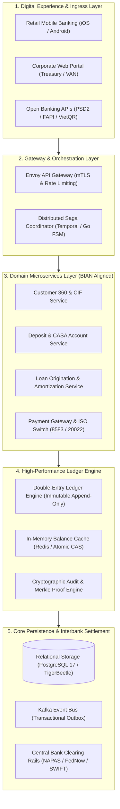

[📖 Bản tiếng Việt (Vietnamese Edition)](https://learn.tanhdev.com/series/core-banking-developer/)

---

Core banking software engineering represents the most demanding intersection of computer science, distributed systems, and financial accounting. Unlike consumer web applications where eventual consistency is an acceptable compromise, a core banking platform governs sovereign currency ledgers, inter-bank clearing rails, and mission-critical customer deposits. A single undetected race condition, integer overflow, or dropped compensating transaction can cause irreversible balance corruption, regulatory sanctions from central banks, and millions of dollars in direct financial losses.

This 9-part developer masterclass provides a complete, production-hardened engineering curriculum for building, architecting, and operating modern cloud-native core banking engines.

---

## 1. Core Banking 5-Layer System Architecture

Modern banking architectures follow the **BIAN (Banking Industry Architecture Network)** framework, decoupling digital channels from immutable financial ledger engines:

---

## 2. Developer Knowledge & Competency Roadmap

Transitioning into a senior core banking software engineer requires mastering four interconnected technical domains:

```mermaid
flowchart LR
    subgraph Pillar1 ["Pillar 1: Financial Math"]
        P1A["Double-Entry Bookkeeping"]
        P1B["T-Accounts & GL Invariants"]
        P1C["Amortization & Interest Accrual"]
    end

    subgraph Pillar2 ["Pillar 2: Systems & Concurrency"]
        P2A["ACID & Strict Serializability"]
        P2B["Pessimistic vs Optimistic Locking"]
        P2C["Distributed Sagas & Idempotency"]
    end

    subgraph Pillar3 ["Pillar 3: Standards & Protocols"]
        P3A["ISO 8583 Card Bitmaps"]
        P3B["ISO 20022 MX Schemas"]
        P3C["VietQR & Real-Time Clearing"]
    end

    subgraph Pillar4 ["Pillar 4: Security & SRE"]
        P4A["HSM Integration & PIN Blocks"]
        P4B["PCI-DSS v4.0 & SBV Cir. 09"]
        P4C["EOD Batch & Five Nines (99.999%)"]
    end

    Pillar1 --> Pillar2
    Pillar2 --> Pillar3
    Pillar3 --> Pillar4
```

---

## 3. Masterclass Curriculum (9 Modules)

- **[Executive Summary: Core Banking Developer Roadmap & System Architecture](/series/core-banking-developer/executive-summary/)** — Market dynamics, engineering responsibilities, and total compensation benchmarks.
- **[Part 1: Double-Entry Bookkeeping: Core Banking Ledger Guide](/series/core-banking-developer/part-1-double-entry-ledger/)** — Debit/Credit rules, General Ledger (GL) balance invariant proofs, and integer currency representations.
- **[Part 2: Core Banking Domain Modeling: CIF, CASA & Lending Guide](/series/core-banking-developer/part-2-banking-domain-casa-lending/)** — Domain entities, customer hierarchies, daily interest accruals, and amortization engines.
- **[Part 3: ACID Transactions & Isolation Levels in Core Banking](/series/core-banking-developer/part-3-database-transactions-acid/)** — Serializability, row-level locking strategies, deadlock prevention, and exactly-once idempotency.
- **[Part 4: Banking Microservices Architecture: Event Sourcing & Saga](/series/core-banking-developer/part-4-modern-core-banking-architecture/)** — CQRS read/write separation, orchestrated Sagas in Go, and outbox event streaming via Kafka.
- **[Part 5: ISO 8583 & ISO 20022 Core Banking Standards](/series/core-banking-developer/part-5-iso-standards-integration/)** — Binary bitmap unpacking, XML MX streaming transformations, and NAPAS 24/7 retail rails.
- **[Part 6: Core Banking Security, PCI-DSS & Audit Trails](/series/core-banking-developer/part-6-security-compliance-audit/)** — Hardware Security Modules (HSM), ANSI X9.8 PIN blocks, field-level encryption, and regulatory audit compliance.
- **[Part 7: Build a Mini Core Banking System in Golang Engine Guide](/series/core-banking-developer/part-7-build-mini-core-banking/)** — Hands-on Go 1.24+ ledger implementation, concurrent transfer benchmarks, and invariant stress testing.
- **[Part 8: Writing a Core Banking PRD: Developer & PM Handbook](/series/core-banking-developer/part-8-core-banking-prd/)** — Engineering Product Requirement Documents, End-of-Day (EOD) batch processing, and Five Nines SRE runbooks.

---

## Frequently Asked Questions


Core banking systems handle trillions of dollars in transactional value with zero tolerance for calculation bugs, data corruption, or downtime. Engineers in this domain must possess a rare hybrid mastery of financial accounting mathematics, distributed systems concurrency, low-level database internals (ACID serializability), cryptographic security (HSM, PCI-DSS), and international clearing standards (ISO 20022). This scarcity of deep cross-domain expertise commands premium compensation across international financial institutions.



Legacy core banking platforms rely on tightly-coupled monolithic databases and proprietary COBOL/C/Java runtimes, requiring massive multi-hour batch windows for End-of-Day (EOD) processing where customer channels must be taken offline or frozen. In contrast, modern composable banking decomposes banking capabilities into autonomous microservices (aligned with BIAN service domains) communicating via gRPC and event buses, enabling continuous 24/7 real-time transaction processing with zero-downtime deployments.



Balance integrity is enforced through mathematical and architectural invariants: (1) An immutable double-entry ledger where every transaction consists of balanced debits and credits (`sum(amount) == 0`); (2) Atomic database transactions utilizing pessimistic row locks (`SELECT FOR UPDATE`) ordered deterministically by account ID to prevent deadlocks; and (3) Continuous background reconciliation engines that verify projected balances against the raw journal log, immediately alarming if balance drift exceeds zero cents.

