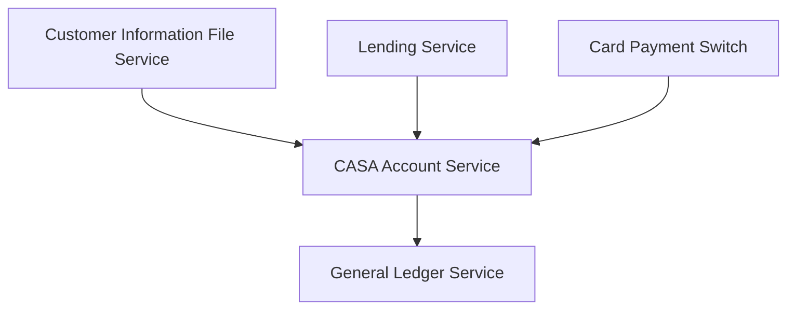
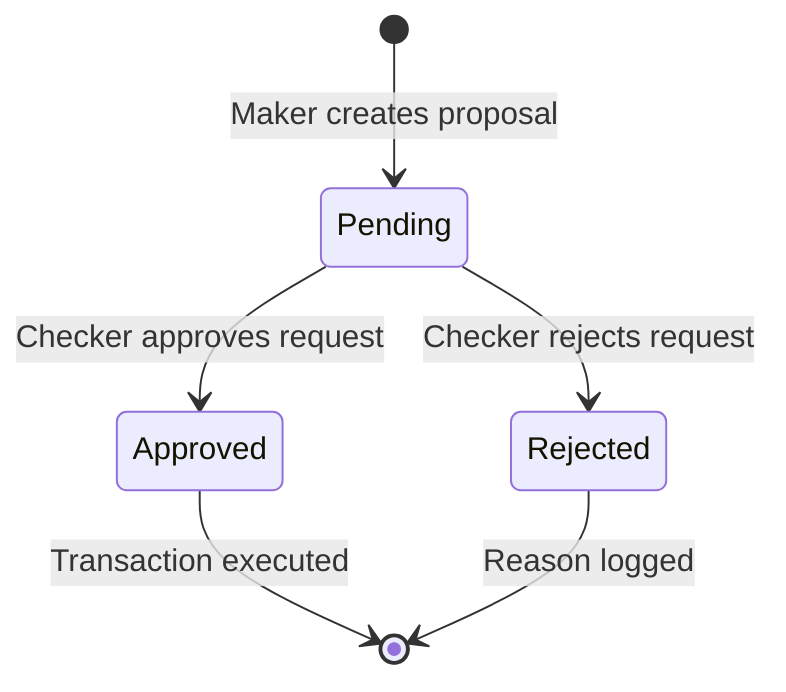
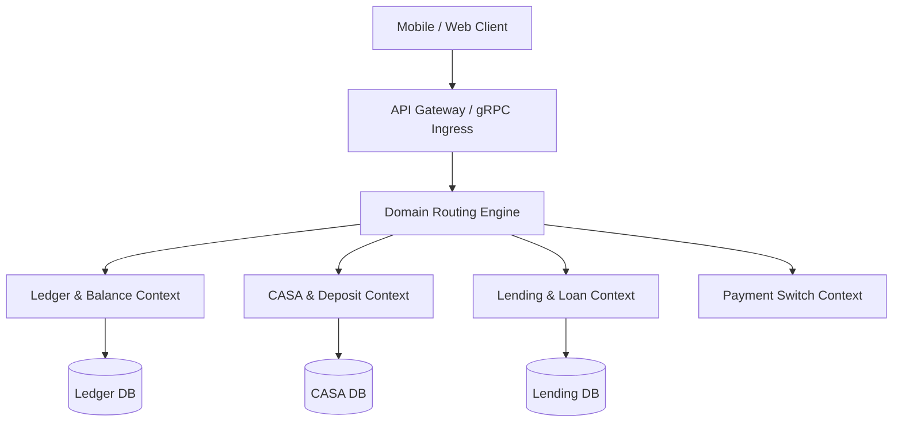

> **Prerequisite:** Baseline understanding of retail banking operations, transactional databases, and distributed ledger systems.

## Who is a Core Banking Developer?

A **Core Banking Developer** is a software engineer responsible for building, operating, and extending the system that processes all of a bank's core financial operations — from managing accounts, processing money transfers, and calculating interest rates, to ensuring every single penny is recorded with absolute accuracy.

Unlike a typical developer, a mistake for a Core Banking Developer doesn't just mean a 404 error page — it means **customers' money being lost, duplicated, or the general ledger becoming unbalanced**. This intense pressure defines their entire approach to writing code and designing systems.

## Why is this field special?

### 1. Absolute Accuracy
In regular software development, "eventual consistency" is often acceptable. In Core Banking, **a transaction either completely succeeds or does not happen at all**. There is no in-between state. This is why ACID database transactions are an indispensable foundation.

### 2. Extremely High Concurrency
Millions of users can perform transactions simultaneously within the same second. The system must handle concurrency without allowing race conditions that could lead to incorrect deductions or double credits.

### 3. Compliance and Legal Requirements
Every action in a Core Banking system must have an audit trail. The State Bank, tax authorities, and international organizations reserve the right to review the entire transaction history at any given time.

## The Knowledge Map of a Core Banking Developer

```
┌─────────────────────────────────────────────────────────────────┐
│                   CORE BANKING DEVELOPER                        │
│                                                                 │
│  DOMAIN KNOWLEDGE          TECHNICAL SKILLS                     │
│  ─────────────────          ────────────────                    │
│  • Double-Entry (GL)       • Database (ACID, Locking)           │
│  • CASA (Deposits)         • Distributed Transactions           │
│  • Lending (Credit)        • Event-Driven Architecture          │
│  • Payments & Clearing     • API Design (REST/gRPC)             │
│  • Trade Finance           • Security & Encryption              │
│                                                                 │
│  STANDARDS & PROTOCOLS     ARCHITECTURE PATTERNS                │
│  ─────────────────────     ─────────────────────                │
│  • ISO 8583 (Card/ATM)     • Saga Pattern                       │
│  • ISO 20022 (SWIFT)       • Outbox Pattern                     │
│  • BIAN Framework          • CQRS & Event Sourcing              │
│  • PCI-DSS                 • Idempotency Keys                   │
└─────────────────────────────────────────────────────────────────┘
```

## The Market Landscape

### Popular Core Banking Systems in Vietnam
| System | Core Technology | Banks Using It |
|---|---|---|
| **Temenos T24** | Java, jBASE/BASIC | Techcombank, VPBank, MB Bank, Sacombank |
| **Oracle Flexcube** | Java EE, Oracle DB | VietinBank, BIDV |
| **Infosys Finacle** | Java | Agribank (Under deployment) |
| **In-house (Custom)** | Go, Java, Kotlin | MoMo, ZaloPay, VCB Digibank |

### Next-Generation Trends
Digital banks and fintechs are no longer purchasing off-the-shelf Core Banking systems — they are **building their own Core Banking systems using Microservices**. This represents a massive opportunity for full-stack developers with a mindset for distributed systems.

## Learning Roadmap in this Series

```
Step 1 → Double-Entry Bookkeeping Mindset (Mandatory, cannot be skipped)
Step 2 → Banking Domain: CASA & Lending
Step 3 → Database Engineering: ACID, Locking, Concurrency
Step 4 → Modern Core Banking Architecture
Step 5 → International Integration Standards (ISO 8583, ISO 20022)
Step 6 → Security, Audit, and Legal Compliance
Step 7 → Practice: Building a Mini Core Banking System
```

> *Let's start from [Part 1 — The Double-Entry Ledger Foundation](/series/core-banking-developer/part-1-double-entry-ledger/). This is the mental foundation that every Core Banking Developer must master before writing a single line of code.*

---

**Related Reading:** To see these concepts applied at scale in a real production system, see [Microfinance Core Banking System: Architecture & Engineering Guide](/posts/deconstructing-microfinance-core-banking-architecture/) — a practical walkthrough of the 5-module CBS architecture. For the system-level architecture and ISO standards, see the [Core Banking Architecture series](/series/core-banking-architecture/). For real-world fintech scale patterns, [PayPay Architecture: Scaling Payments to 70M Users](/posts/paypay-architecture-scaling/) shows how global payment platforms apply these same ledger and idempotency fundamentals under extreme load.

## The Core Banking Architectural Roadmap

Transitioning from legacy monolithic systems to a modular, cloud-native Core Banking System (CBS) requires a highly structured roadmap. The modern CBS architecture decouples customer accounts, product definitions, and general ledger postings into independent, transactionally isolated services.



The table below outlines the core differences between a Monolithic Legacy CBS and a Modern Cloud-Native Core:

| Architectural Metric | Monolithic Legacy CBS (e.g. AS400) | Modern Cloud-Native CBS (e.g. Go-based) |
| :--- | :--- | :--- |
| **Concurrency Model** | Single-threaded batch processes | High-concurrency event loops |
| **Consistency** | Batch reconciliation | ACID-compliant transaction engines |
| **Deployment Model** | On-premise mainframe | Containerized Kubernetes pods |
| **Data Access** | Direct shared DB access | Decoupled DB-per-service via gRPC |
| **Ledger Immutability** | Often retroactively edited | Strictly immutable (reversal postings only) |

To handle transaction boundaries, the following Go code represents a simplified ledger posting manager:

```go
package main

import (
	"context"
	"errors"
	"fmt"
)

type Transaction struct {
	ID        string
	Amount    int64
	Currency  string
	Direction string // DEBIT or CREDIT
}

type BoundaryManager struct {
	LedgerBalance int64
}

func (bm *BoundaryManager) Post(ctx context.Context, tx Transaction) error {
	if tx.Amount <= 0 {
		return errors.New("invalid transaction amount")
	}
	if tx.Direction == "DEBIT" {
		if bm.LedgerBalance < tx.Amount {
			return errors.New("insufficient ledger balance")
		}
		bm.LedgerBalance -= tx.Amount
	} else if tx.Direction == "CREDIT" {
		bm.LedgerBalance += tx.Amount
	} else {
		return errors.New("unknown transaction direction")
	}
	fmt.Printf("[Ledger] Post successful: Tx %s direction %s amount %d\n", tx.ID, tx.Direction, tx.Amount)
	return nil
}

func main() {
	bm := &BoundaryManager{LedgerBalance: 100000}
	tx := Transaction{ID: "tx-7711", Amount: 25000, Currency: "VND", Direction: "DEBIT"}
	_ = bm.Post(context.Background(), tx)
}
```

## Complete Maker-Checker Workflow Specification

To guarantee operational security, high-value transactions must be routed through a multi-stage approval queue. The Maker constructs the proposal payload, which is saved to the pending queue. The Checker reviews the request parameters and either approves or rejects the execution. The active Maker is programmatically restricted from approving their own request.



This dual-authorization mechanism ensures that single-operator failures do not trigger catastrophic balance revisions. The database schema stores request details, maker identity, and checker approvals under strict audit rules. The service tier validates that segregation of duties is maintained programmatically before executing raw transaction payloads.

## Regulatory Reporting Requirements

CBS platforms must produce structured financial reports to satisfy local regulators (e.g. State Bank of Vietnam, Federal Reserve). These include:
- **Capital Adequacy Ratio (CAR):** Measures available capital relative to risk-weighted assets.
- **Liquidity Coverage Ratio (LCR):** Ensures the bank maintains adequate high-quality liquid assets.
- **Foreign Exchange Exposure:** Tracks currency imbalances across local sub-ledgers.

## Advanced Ledger Posting Architecture

General ledgers must record balance types in distinct buckets to satisfy international accounting standards. Assets, liabilities, equity, revenues, and expenses are structured in hierarchical charts of accounts. A financial transaction does not merely move money between two accounts; it posts journal entries to various general ledger accounts to record transaction fees, taxes, and interest accruals simultaneously. The engine ensures that every multi-leg ledger transaction reconciles to exactly zero before any changes are written to the database.

## Regulatory Compliance: Basel Accord Accruals and Controls

Modern bank ledgers must be designed to automatically track metrics required for Basel compliance:
1. **Risk-Weighted Assets (RWA):** Every loan account stores a risk factor based on the customer's credit score. The ledger aggregates RWAs daily to calculate CAR.
2. **High-Quality Liquid Assets (HQLA):** Cash reserves and government bonds are monitored in dedicated sub-ledgers to calculate LCR, ensuring the bank can survive a 30-day liquidity stress scenario.
3. **Anti-Money Laundering (AML) Rules:** Transaction handlers trigger automated events if single deposits exceed $10,000, routing details to compliance dashboards.

## Core Banking Context Isolation and gRPC Routing Engine

In a microservices core banking architecture, strict boundary isolation between bounded contexts (Ledger Engine, CIF, CASA Deposits, Lending, Payments) prevents cascading failures across domain boundaries. The gRPC transaction router decouples API client requests from internal database operations, enforcing zero-trust context propagation via metadata headers.

```go
package domain

import (
	"context"
	"fmt"
	"sync"
	"google.golang.org/grpc/metadata"
)

// TransactionContext encapsulates multi-tenant tenant isolation and tracing metadata.
type TransactionContext struct {
	TenantID      string
	CorrelationID string
	SourceDomain  string
	TargetDomain  string
}

// DomainRouter dispatches transactions across microservice bounded contexts with strict context validation.
type DomainRouter struct {
	mu     sync.RWMutex
	routes map[string]func(ctx context.Context, payload []byte) ([]byte, error)
}

// NewDomainRouter initializes the central domain routing registry.
func NewDomainRouter() *DomainRouter {
	return &DomainRouter{
		routes: make(map[string]func(ctx context.Context, payload []byte) ([]byte, error)),
	}
}

// RegisterDomainHandler registers a domain handler for a specific target context.
func (r *DomainRouter) RegisterDomainHandler(domain string, handler func(ctx context.Context, payload []byte) ([]byte, error)) {
	r.mu.Lock()
	defer r.mu.Unlock()
	r.routes[domain] = handler
}

// RouteTransaction extracts gRPC metadata and dispatches request to the bounded domain.
func (r *DomainRouter) RouteTransaction(ctx context.Context, targetDomain string, payload []byte) ([]byte, error) {
	md, ok := metadata.FromIncomingContext(ctx)
	if !ok {
		return nil, fmt.Errorf("missing gRPC transaction metadata")
	}

	tenantIDs := md.Get("x-tenant-id")
	if len(tenantIDs) == 0 || tenantIDs[0] == "" {
		return nil, fmt.Errorf("unauthorized transaction: missing tenant context")
	}

	r.mu.RLock()
	handler, exists := r.routes[targetDomain]
	r.mu.RUnlock()

	if !exists {
		return nil, fmt.Errorf("unsupported domain target: %s", targetDomain)
	}

	return handler(ctx, payload)
}
```



By enforcing metadata extraction and tenant isolation at the router layer, individual microservices operate independently without exposure to raw database connection pools across domain boundaries.

🔗 **Next Step:** Explore general ledger posting models in [Part 1: Double-Entry Ledger Schema Design]().

---

*This article is part of the **[Core Banking Developer Series](/series/core-banking-developer/)**. Check out the full index to see the complete architectural context.*

*Need help assessing the risks of your own platform migration? → [Book a 1:1 Architecture Consultation](/hire/)*

---

[Next Part: Part 1: Double-Entry Ledger Schema Design]()
