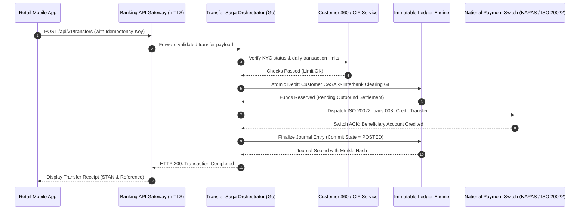
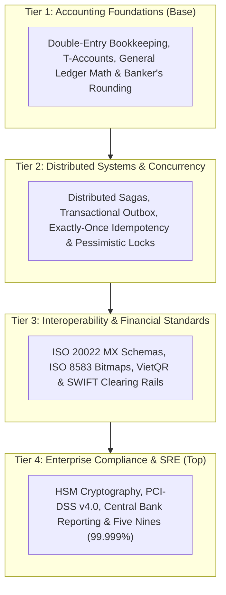

[📖 Bản tiếng Việt (Vietnamese Edition)](https://learn.tanhdev.com/series/core-banking-developer/executive-summary/)

---

> **Prerequisite:** Read the [Series Overview & Curriculum Index](/series/core-banking-developer/) for the full architectural syllabus.

# Core Banking Developer Roadmap & System Architecture

**Answer-first:** A Core Banking Developer designs, constructs, and maintains the mission-critical financial core of a bank—governing immutable double-entry general ledgers, real-time balance calculations, multi-currency deposit engines (CASA), loan amortization schedules, and high-security clearing integrations. Operating at the intersection of financial accounting and distributed systems engineering, core banking engineers enforce strict mathematical balance invariants ($\sum \text{Debits} = \sum \text{Credits}$), sub-50ms P99 latency SLAs, and absolute zero data loss under extreme transaction concurrency.

---

## 1. End-to-End Inter-Bank Financial Transaction Lifecycle

To understand the core banking developer's mandate, examine the lifecycle of a modern real-time fund transfer across external payment rails and internal double-entry ledgers:

```mermaid
sequenceDiagram
    autonumber
    participant Customer as Retail Mobile App
    participant Gateway as Banking API Gateway (mTLS)
    participant Orchestrator as Transfer Saga Orchestrator (Go)
    participant CIF as Customer 360 / CIF Service
    participant Ledger as Immutable Ledger Engine
    participant Switch as National Payment Switch (NAPAS / ISO 20022)

    Customer->>Gateway: POST /api/v1/transfers (with Idempotency-Key)
    Gateway->>Orchestrator: Forward validated transfer payload
    Orchestrator->>CIF: Verify KYC status & daily transaction limits
    CIF-->>Orchestrator: Checks Passed (Limit OK)
    
    Orchestrator->>Ledger: Atomic Debit: Customer CASA -> Interbank Clearing GL
    Ledger-->>Orchestrator: Funds Reserved (Pending Outbound Settlement)
    
    Orchestrator->>Switch: Dispatch ISO 20022 `pacs.008` Credit Transfer
    Switch-->>Orchestrator: Switch ACK: Beneficiary Account Credited
    
    Orchestrator->>Ledger: Finalize Journal Entry (Commit State = POSTED)
    Ledger-->>Orchestrator: Journal Sealed with Merkle Hash
    Orchestrator-->>Gateway: HTTP 200: Transaction Completed
    Gateway-->>Customer: Display Transfer Receipt (STAN & Reference)
```

---

## 2. The Core Banking Engineering Competency Pyramid

Unlike standard web backend engineering where frameworks abstract database interactions, core banking developers must master low-level operational fundamentals across four hierarchical tiers:

```mermaid
flowchart TD
    subgraph Tier4 ["Tier 4: Enterprise Compliance & SRE (Top)"]
        T4["HSM Cryptography, PCI-DSS v4.0, Central Bank Reporting & Five Nines (99.999%)"]
    end

    subgraph Tier3 ["Tier 3: Interoperability & Financial Standards"]
        T3["ISO 20022 MX Schemas, ISO 8583 Bitmaps, VietQR & SWIFT Clearing Rails"]
    end

    subgraph Tier2 ["Tier 2: Distributed Systems & Concurrency"]
        T2["Distributed Sagas, Transactional Outbox, Exactly-Once Idempotency & Pessimistic Locks"]
    end

    subgraph Tier1 ["Tier 1: Accounting Foundations (Base)"]
        T1["Double-Entry Bookkeeping, T-Accounts, General Ledger Math & Banker's Rounding"]
    end

    Tier1 --> Tier2
    Tier2 --> Tier3
    Tier3 --> Tier4
```

---

## 3. Core Banking Market Dynamics & Compensation Tiers

The global banking technology sector is undergoing an aggressive modernization wave. Legacy mainframe cores (COBOL, RPG, C) established in the 1980s and 1990s can no longer support real-time 24/7 payment velocity, Open Banking APIs, or sub-second fraud detection. Financial institutions worldwide are investing billions to decouple monolithic platforms into cloud-native microservices.

### Engineering Compensation Matrix (2026–2027 SOTA):

| Seniority Tier | Core Competencies | US / EU Onshore (Annual Base) | Singapore / HK (Annual Base) | Vietnam Top-Tier (Annual Base) |
| :--- | :--- | :--- | :--- | :--- |
| **Mid Backend Engineer** | Go / Java, SQL transactions, REST/gRPC | $130,000 – $165,000 | $85,000 – $115,000 | $24,000 – $36,000 |
| **Senior Core Banking Dev** | Double-entry GL, ACID concurrency, Saga | $175,000 – $220,000 | $120,000 – $160,000 | $42,000 – $60,000 |
| **Lead Banking Architect** | BIAN domain modeling, ISO 20022, HSM, SRE | $230,000 – $310,000 | $170,000 – $230,000 | $65,000 – $95,000 |

*Table 1: Global compensation benchmarks reflecting the specialized scarcity of banking ledger engineers.*

---

## 4. The Production Invariants of Financial Engineering

Every line of code deployed to a core banking runtime must uphold non-negotiable operational invariants:
1. **The Conservation of Money**: Money cannot be created or destroyed within a transfer. The sum of all debits must exactly equal the sum of all credits ($\sum \text{Debits} - \sum \text{Credits} = 0$).
2. **Immutability of the Past**: Financial ledgers are strictly append-only. Once a journal entry is committed, it is immutable. Errors are corrected exclusively through explicit reversing entries.
3. **Deterministic Idempotency**: Network retries, timeout reconnections, or user double-clicks must never produce duplicate transfers. Every transaction is keyed with a unique client `Idempotency-Key`.
4. **Zero Float Loss**: Calculations must avoid floating-point math entirely, using minor currency units (e.g. cents, hào, xu) represented as 64-bit signed integers.

---

## Frequently Asked Questions


Yes. While the domain involves accounting concepts, the mathematical foundation of double-entry bookkeeping (Assets = Liabilities + Equity) is straightforward and deterministic. Strong systems engineering skills—such as mastering database isolation levels, distributed locks, concurrency race conditions, and message queue semantics—are the primary prerequisites. The financial domain modeling rules can be acquired methodically through structured study.



The prevailing modern banking stack consists of: Golang 1.24+ for deterministic, high-throughput microservices; gRPC and Protocol Buffers for sub-millisecond internal RPCs; PostgreSQL 17 or TigerBeetle for ACID-compliant immutable ledgers; Apache Kafka / Redpanda for transactional outbox event distribution; Temporal for orchestrated Saga workflows; and OpenTelemetry for distributed end-to-end tracing.



In high-volume financial systems processing millions of daily transactions, external payment networks (Visa, Mastercard, central bank switches) can experience transient drops, network partitions, or delayed clearing files. Automated End-of-Day (EOD) three-way reconciliation jobs systematically compare the bank's internal ledger entries against external settlement logs, immediately isolating breaks and generating automated accounting adjustment tickets before books close.

