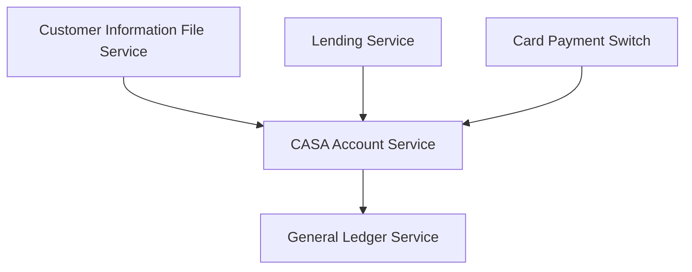
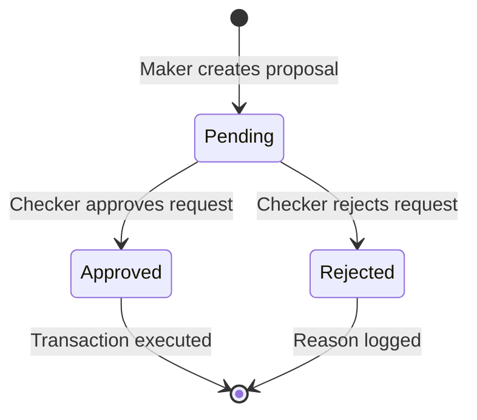
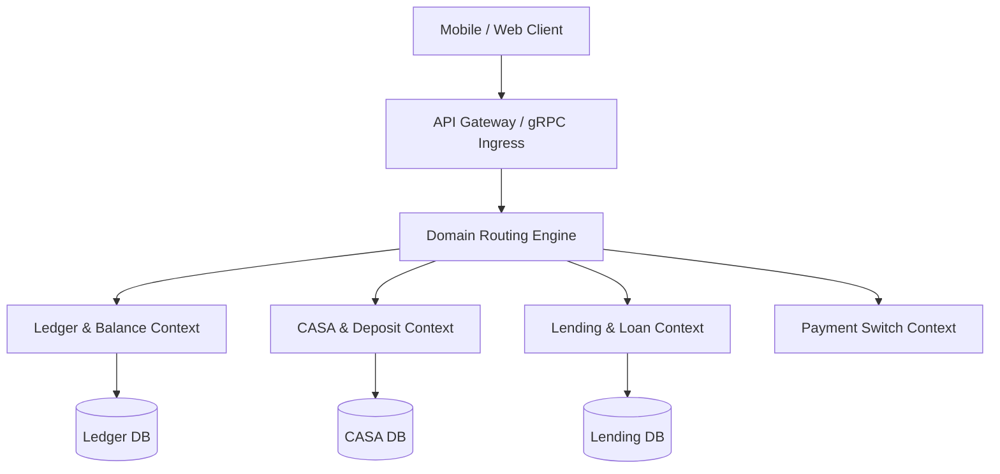

> **Answer-first:** A core banking developer designs and maintains mission-critical ledger systems, multi-currency deposit engines, ACID transaction frameworks, and regulatory reporting pipelines. Core banking software engineers ensure financial balance invariants ($\sum \text{Debits} = \sum \text{Credits}$) and zero-data-loss execution under high transaction concurrency.

> **Prerequisite:** Baseline understanding of retail banking operations, transactional databases, and distributed ledger systems.

## Who is a Core Banking Developer?

> **Answer-first:** Core banking developers specialize in building mission-critical double-entry accounting ledgers, transaction engines, and regulatory compliance systems.

A **Core Banking Developer** is a software engineer responsible for building, operating, and extending the core financial processing system of a bank — managing customer accounts, executing double-entry ledger postings, accruing daily interest, and maintaining strict regulatory compliance.

Unlike standard web backend development where transient errors result in temporary 500 status codes, core banking engineering errors risk **corrupting general ledger balances, losing customer funds, or violating central bank legal mandates**. This high-stakes environment demands absolute mathematical correctness, zero-data-loss database transactions, and deterministic event-sourced state machines.

## Why is this field special?

> **Answer-first:** Core banking engineering demands absolute zero data loss tolerance, strict ACID concurrency controls, and high-performance financial data processing.

The core banking domain operates under strict engineering constraints that differentiate it from general application development:

### 1. Absolute Accuracy & Atomicity
In standard application development, eventual consistency and eventual reconciliation are often acceptable trade-offs. In Core Banking, **every financial event must execute as an atomic transaction that strictly preserves ledger debits and credits**. Partial execution is unacceptable. Relational database transactions combined with strict double-entry ledger rules guarantee that money is never created or destroyed out of thin air.

### 2. High-Throughput ACID Concurrency
Modern digital banks handle tens of thousands of concurrent financial events per second during peak hours. The posting engine must execute pessimistic row locks (`SELECT ... FOR UPDATE`) or optimistic concurrency validation (`version` checks) to prevent race conditions, balance double-spending, and negative balance violations across customer accounts.

### 3. Compliance and Audit Trails
Every mutation in a Core Banking system must generate an immutable, tamper-evident audit record. Central banks (such as the State Bank of Vietnam or the Federal Reserve), external auditors, and tax authorities require complete historical lineage for every ledger entry, maker-checker authorization event, and interest calculation.

## The Knowledge Map of a Core Banking Developer

> **Answer-first:** The core banking developer knowledge map encompasses accounting math, distributed database isolation, ISO standards, and security threat modeling.

The diagram below maps the essential domain concepts, technical skills, integration protocols, and microservice architecture patterns required for modern core banking engineering:

```
┌─────────────────────────────────────────────────────────────────┐
│                   CORE BANKING DEVELOPER                        │
│                                                                 │
│  DOMAIN KNOWLEDGE          TECHNICAL SKILLS                     │
│  ─────────────────          ────────────────                    │
│  • Double-Entry (GL)       • Database (ACID, Locking)           │
│  • CASA (Deposits)         • Distributed Transactions           │
│  • Lending (Credit)        • Event-Driven Architecture          │
│  • Payments & Clearing     • API Design (REST/gRPC)             │
│  • Trade Finance           • Security & Encryption              │
│                                                                 │
│  STANDARDS & PROTOCOLS     ARCHITECTURE PATTERNS                │
│  ─────────────────────     ─────────────────────                │
│  • ISO 8583 (Card/ATM)     • Saga Pattern                       │
│  • ISO 20022 (SWIFT)       • Outbox Pattern                     │
│  • BIAN Framework          • CQRS & Event Sourcing              │
│  • PCI-DSS                 • Idempotency Keys                   │
└─────────────────────────────────────────────────────────────────┘
```

## Core Banking Market Dynamics

> **Answer-first:** Market demand for core banking developers is surging as traditional financial institutions modernize legacy mainframe ledgers into Go microservices.

Traditional core banking software (COBOL mainframes or monolithic Java platforms) faces severe limitations in scalability, real-time analytics, and cloud deployment. Modern financial institutions and digital banks are replacing monolithic core banking packages with modular, cloud-native microservices written in Go and Java.

### Popular Core Banking Systems

The table below lists widely adopted enterprise core banking engines alongside modern in-house microservice implementations:

| System | Core Technology | Banking Usage Context |
|---|---|---|
| **Temenos T24** | Java, jBASE/BASIC | Enterprise core banking deployments (Techcombank, VPBank, MB Bank) |
| **Oracle Flexcube** | Java EE, Oracle DB | Commercial banking operations (VietinBank, BIDV) |
| **Infosys Finacle** | Java | Retail and commercial core banking (Agribank) |
| **In-House Microservices** | Go, Java, Kotlin | Cloud-native digital banks and fintech platforms (MoMo, ZaloPay, VCB Digibank) |

### Next-Generation Microservices Trends
Modern fintech platforms build in-house core banking modules to achieve custom product flexibility, sub-10ms posting latency, and automated active-active multi-region failover. This shift drives demand for backend software engineers who combine deep distributed systems knowledge with core financial domain expertise.

## Learning Roadmap

> **Answer-first:** The learning roadmap guides developers through ledger domain modeling, CASA account management, ACID locking, and event-sourced microservices.

The learning roadmap below outlines the progressive technical sequence required to master core banking engineering:

```
Step 1 → Double-Entry Bookkeeping Mindset (Mandatory ledger invariants)
Step 2 → Banking Domain Modeling: CIF, CASA & Lending
Step 3 → Database Engineering: ACID Isolation, Row Locking, Concurrency
Step 4 → Modern Core Banking Architecture: Event-Driven Microservices
Step 5 → International Integration Standards: ISO 8583 & ISO 20022
Step 6 → Security, Audit Trails, and Regulatory Compliance
Step 7 → Practical Construction: Building a Mini Core Banking Engine in Go
```

> *Begin with [Part 1 — The Double-Entry Ledger Foundation](/series/core-banking-developer/part-1-double-entry-ledger/) to master the mathematical principles underlying general ledger posting engines.*

---

**Related Reading:** To see these concepts applied at scale in a real production system, see [Microfinance Core Banking System: Architecture & Engineering Guide](/posts/deconstructing-microfinance-core-banking-architecture/) — a practical walkthrough of the 5-module CBS architecture. For system-level architecture and ISO standards, see the [Core Banking Architecture series](/series/core-banking-architecture/). For real-world fintech scale patterns, [PayPay Architecture: Scaling Payments to 70M Users](/posts/paypay-architecture-scaling/) demonstrates how global payment platforms apply ledger balance invariants and idempotency controls under extreme load.

## The Core Banking Architectural Roadmap

> **Answer-first:** Architectural roadmaps structure core banking systems into domain microservices connected by event buses, ISO payment gateways, and audit loggers.

Modern cloud-native Core Banking Systems (CBS) decouple monolithic sub-systems into transactionally isolated microservices. Customer identities, deposit sub-ledgers, loan scheduling, and general ledger reconciliation operate as independent bounded contexts backed by dedicated database instances.

The diagram below shows how legacy core banking sub-systems are decoupled into transactionally isolated domain services:


```mermaid
graph TD
    CIF[Customer Information File Service] --> CASA[CASA Account Service]
    CASA --> GL[General Ledger Service]
    Lending[Lending Service] --> CASA
    CardSwitch[Card Payment Switch] --> CASA
```

The table below contrasts key architectural attributes of legacy mainframe core banking systems with modern event-sourced microservice architectures:

| Architectural Metric | Monolithic Legacy CBS (e.g. AS400) | Modern Cloud-Native CBS (e.g. Go-based) |
| :--- | :--- | :--- |
| **Concurrency Model** | Single-threaded batch processes | High-concurrency event loops and goroutines |
| **Consistency** | End-of-day batch reconciliation | Real-time ACID transaction engines |
| **Deployment Model** | On-premise mainframe hardware | Containerized Kubernetes clusters |
| **Data Access** | Shared monolithic database schemas | Database-per-service isolated via gRPC APIs |
| **Ledger Immutability** | Mutable balance rows | Strictly immutable journal entries (reversal postings only) |

The Go code example below demonstrates a basic transactional boundary manager validating ledger debits and credits before mutating account balances:

```go
package main

import (
	"context"
	"errors"
	"fmt"
)

type Transaction struct {
	ID        string
	Amount    int64
	Currency  string
	Direction string // DEBIT or CREDIT
}

type BoundaryManager struct {
	LedgerBalance int64
}

func (bm *BoundaryManager) Post(ctx context.Context, tx Transaction) error {
	if tx.Amount <= 0 {
		return errors.New("invalid transaction amount")
	}
	if tx.Direction == "DEBIT" {
		if bm.LedgerBalance < tx.Amount {
			return errors.New("insufficient ledger balance")
		}
		bm.LedgerBalance -= tx.Amount
	} else if tx.Direction == "CREDIT" {
		bm.LedgerBalance += tx.Amount
	} else {
		return errors.New("unknown transaction direction")
	}
	fmt.Printf("[Ledger] Post successful: Tx %s direction %s amount %d\n", tx.ID, tx.Direction, tx.Amount)
	return nil
}

func main() {
	bm := &BoundaryManager{LedgerBalance: 100000}
	tx := Transaction{ID: "tx-7711", Amount: 25000, Currency: "VND", Direction: "DEBIT"}
	_ = bm.Post(context.Background(), tx)
}
```

## Complete Maker-Checker Workflow Specification

> **Answer-first:** Maker-Checker workflow specifications enforce dual-authorization policies on high-value financial transfers before ledger posting.

Operational risk controls mandate dual-authorization policies for administrative overrides, large wire transfers, and manual ledger adjustments. The Maker initiates the proposal payload, which enters a pending state in the database queue. The Checker reviews the request parameters and executes either an approval or rejection step. The service enforces segregation of duties: the originating Maker cannot approve their own proposal.

The state diagram below illustrates the multi-stage lifecycle of a high-value financial transaction passing through Maker proposal, Checker review, and final execution:


```mermaid
stateDiagram-v2
    [*] --> Pending : Maker creates proposal
    Pending --> Approved : Checker approves request
    Pending --> Rejected : Checker rejects request
    Approved --> [*] : Transaction executed
    Rejected --> [*] : Reason logged
```

This authorization model prevents insider fraud and single-operator errors from corrupting general ledger balances. Audit logs record timestamps, cryptographically signed user tokens, and IP metadata for every state transition.

## Regulatory Reporting Requirements

> **Answer-first:** Regulatory reporting systems aggregate daily ledger transactions into structured XML submissions compliant with central bank standards.

Core banking platforms must extract daily metrics to generate compliance reports for regulatory institutions:
- **Capital Adequacy Ratio (CAR):** Measures Tier 1 and Tier 2 capital reserves relative to risk-weighted credit assets.
- **Liquidity Coverage Ratio (LCR):** Validates that high-quality liquid assets cover projected net cash outflows over a 30-day stress window.
- **Foreign Exchange Exposure Limits:** Monitors net open positions across foreign currencies to prevent unhedged currency risk.

## Advanced Ledger Posting Architecture

> **Answer-first:** Advanced posting architectures execute atomic debit/credit journal entries in PostgreSQL using serializable isolation and check constraints.

General ledgers structure financial transactions into five fundamental account classes: Assets, Liabilities, Equity, Revenues, and Expenses. Compound transactions (such as loan disbursements with origination fees or multi-currency wire transfers with tax withholding) involve multi-leg posting entries across multiple sub-ledgers. The posting engine verifies that $\sum \text{Debits} = \sum \text{Credits}$ across all entry legs within an atomic database transaction before persisting the record.

## Regulatory Compliance: Basel Accord Accruals and Controls

> **Answer-first:** Basel compliance frameworks enforce daily capital adequacy ratio calculations, risk-weighted asset tracking, and automated interest accrual controls.

Modern core banking engines integrate regulatory rule engines directly into the transaction posting pipeline:
1. **Risk-Weighted Assets (RWA):** Asset ledger items dynamically apply credit risk weights based on counterparty rating models.
2. **High-Quality Liquid Assets (HQLA):** Reserve account sub-ledgers track liquid asset allocations to fulfill Basel III/IV liquidity mandates.
3. **Anti-Money Laundering (AML) Triggers:** Event listeners intercept transactions exceeding regulatory thresholds (e.g. $10,000 equivalent), publishing alerts to compliance queues.

## Core Banking Context Isolation and gRPC Routing Engine

> **Answer-first:** Context isolation engines enforce tenant boundaries and route internal gRPC payment requests to specific ledger partition services.

In a microservices architecture, domain boundary isolation prevents cascading failures across services (Ledger Engine, CIF Identity, CASA Deposits, Lending, Payments). The gRPC transaction router extracts multi-tenant header context and dispatches payloads to specific service pods under strict RBAC policies.

The Go implementation below demonstrates a gRPC domain router extracting tenant context metadata to route requests to specific bounded contexts:

```go
package domain

import (
	"context"
	"fmt"
	"sync"
	"google.golang.org/grpc/metadata"
)

// TransactionContext encapsulates multi-tenant isolation and tracing metadata.
type TransactionContext struct {
	TenantID      string
	CorrelationID string
	SourceDomain  string
	TargetDomain  string
}

// DomainRouter dispatches transactions across microservice bounded contexts with strict context validation.
type DomainRouter struct {
	mu     sync.RWMutex
	routes map[string]func(ctx context.Context, payload []byte) ([]byte, error)
}

// NewDomainRouter initializes the central domain routing registry.
func NewDomainRouter() *DomainRouter {
	return &DomainRouter{
		routes: make(map[string]func(ctx context.Context, payload []byte) ([]byte, error)),
	}
}

// RegisterDomainHandler registers a domain handler for a specific target context.
func (r *DomainRouter) RegisterDomainHandler(domain string, handler func(ctx context.Context, payload []byte) ([]byte, error)) {
	r.mu.Lock()
	defer r.mu.Unlock()
	r.routes[domain] = handler
}

// RouteTransaction extracts gRPC metadata and dispatches request to the bounded domain.
func (r *DomainRouter) RouteTransaction(ctx context.Context, targetDomain string, payload []byte) ([]byte, error) {
	md, ok := metadata.FromIncomingContext(ctx)
	if !ok {
		return nil, fmt.Errorf("missing gRPC transaction metadata")
	}

	tenantIDs := md.Get("x-tenant-id")
	if len(tenantIDs) == 0 || tenantIDs[0] == "" {
		return nil, fmt.Errorf("unauthorized transaction: missing tenant context")
	}

	r.mu.RLock()
	handler, exists := r.routes[targetDomain]
	r.mu.RUnlock()

	if !exists {
		return nil, fmt.Errorf("unsupported domain target: %s", targetDomain)
	}

	return handler(ctx, payload)
}
```

The architecture diagram below details the client request flow through the API gateway, gRPC routing engine, and domain-isolated database schemas:


```mermaid
graph TD
    Client["Mobile / Web Client"] --> Ingress["API Gateway / gRPC Ingress"]
    Ingress --> Router[Domain Routing Engine]
    Router --> LedgerContext["Ledger & Balance Context"]
    Router --> CASAContext["CASA & Deposit Context"]
    Router --> LendingContext["Lending & Loan Context"]
    Router --> PaymentContext[Payment Switch Context]
    
    LedgerContext --> PostgresLedger[("Ledger DB")]
    CASAContext --> PostgresCASA[("CASA DB")]
    LendingContext --> PostgresLending[("Lending DB")]
```

By enforcing metadata validation and context routing at the API ingress layer, individual bounded services operate securely without exposing database connection pools across domain boundaries.

## Frequently Asked Questions

> **Answer-first:** Frequently asked questions addressing ledger double-entry mechanics, Maker-Checker security controls, and high-concurrency database locking strategies.


Direct balance updates (`UPDATE account SET balance = balance - X`) destroy transaction lineage and increase susceptibility to race conditions or unrecoverable system crashes. Double-entry posting creates immutable debit and credit journal entries, ensuring that every financial movement is fully auditable and mathematically balanced ($\sum \text{Debits} = \sum \text{Credits}$).



A Maker-Checker workflow separates transaction creation from transaction authorization by enforcing dual-control authorization queues. The service layer verifies programmatically that the approving Checker is a distinct authenticated entity from the originating Maker before executing ledger mutations.



Core banking architectures mitigate central cash account contention by implementing asynchronous batch posting and ledger partition accounts (sharded sub-ledgers). During high QPS bursts, transactions post against partition sub-accounts, which are periodically reconciled into the primary general ledger via automated background workers.


🔗 **Next Step:** Explore general ledger posting models in [Part 1: Double-Entry Ledger Schema Design](/series/core-banking-developer/part-1-double-entry-ledger/).

---

*This series is part of the **[Core Banking Developer Series](/series/core-banking-developer/)**. Check out the full index to see the complete architectural context.*

Implementing core banking architectures demands strict ACID transactional isolation and pessimistic row locking during balance or inventory updates. Distributed Saga orchestration coordinates multi-stage rollbacks, preventing partial state writes across heterogeneous databases.

---

[Next Part: Part 1: Double-Entry Ledger Schema Design](/series/core-banking-developer/part-1-double-entry-ledger/)

