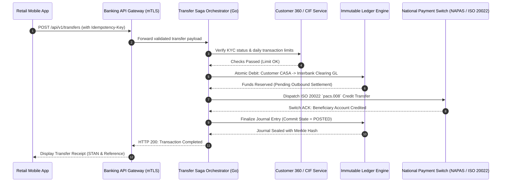
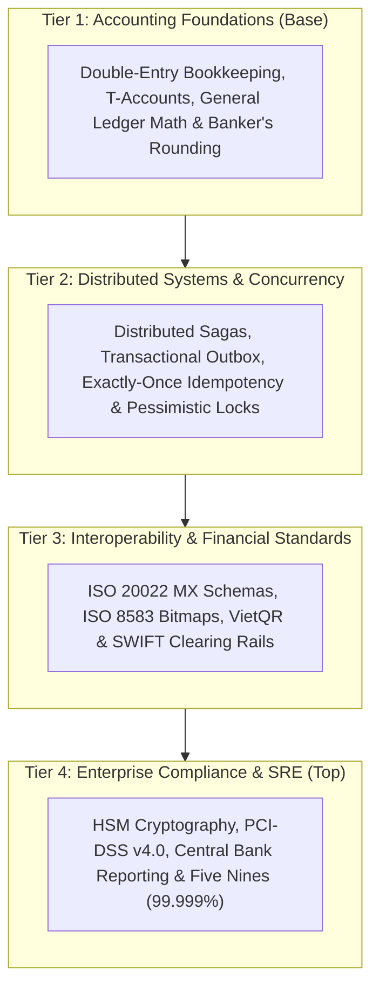

---

> **Prerequisite:** Deep understanding of double-entry accounting fundamentals, ACID database guarantees, high-concurrency backend programming in Go, and distributed financial systems architecture.

# Core Banking Developer Roadmap & System Architecture
> **Answer-first:** A Core Banking Developer designs, constructs, and maintains the mission-critical financial core of a bank, governing immutable double-entry general ledgers, real-time balance calculations, multi-currency deposit engines, loan amortization schedules, and high-security clearing integrations while enforcing strict mathematical balance invariants, sub-50ms P99 latency SLAs, and absolute zero data loss under extreme distributed concurrency.

---

## 1. End-to-End Inter-Bank Financial Transaction Lifecycle

To understand the core banking developer's mandate, examine the lifecycle of a modern real-time fund transfer across external payment rails and internal double-entry ledgers:


```mermaid
sequenceDiagram
    autonumber
    participant Customer as Retail Mobile App
    participant Gateway as Banking API Gateway (mTLS)
    participant Orchestrator as Transfer Saga Orchestrator (Go)
    participant CIF as Customer 360 / CIF Service
    participant Ledger as Immutable Ledger Engine
    participant Switch as National Payment Switch (NAPAS / ISO 20022)

    Customer->>Gateway: POST /api/v1/transfers (with Idempotency-Key)
    Gateway->>Orchestrator: Forward validated transfer payload
    Orchestrator->>CIF: Verify KYC status & daily transaction limits
    CIF-->>Orchestrator: Checks Passed (Limit OK)
    
    Orchestrator->>Ledger: Atomic Debit: Customer CASA -> Interbank Clearing GL
    Ledger-->>Orchestrator: Funds Reserved (Pending Outbound Settlement)
    
    Orchestrator->>Switch: Dispatch ISO 20022 `pacs.008` Credit Transfer
    Switch-->>Orchestrator: Switch ACK: Beneficiary Account Credited
    
    Orchestrator->>Ledger: Finalize Journal Entry (Commit State = POSTED)
    Ledger-->>Orchestrator: Journal Sealed with Merkle Hash
    Orchestrator-->>Gateway: HTTP 200: Transaction Completed
    Gateway-->>Customer: Display Transfer Receipt (STAN & Reference)
```

---

## 2. The Core Banking Engineering Competency Pyramid

Unlike standard web backend engineering where frameworks abstract database interactions, core banking developers must master low-level operational fundamentals across four hierarchical tiers:


```mermaid
flowchart TD
    subgraph Tier4 ["Tier 4: Enterprise Compliance & SRE (Top)"]
        T4["HSM Cryptography, PCI-DSS v4.0, Central Bank Reporting & Five Nines (99.999%)"]
    end

    subgraph Tier3 ["Tier 3: Interoperability & Financial Standards"]
        T3["ISO 20022 MX Schemas, ISO 8583 Bitmaps, VietQR & SWIFT Clearing Rails"]
    end

    subgraph Tier2 ["Tier 2: Distributed Systems & Concurrency"]
        T2["Distributed Sagas, Transactional Outbox, Exactly-Once Idempotency & Pessimistic Locks"]
    end

    subgraph Tier1 ["Tier 1: Accounting Foundations (Base)"]
        T1["Double-Entry Bookkeeping, T-Accounts, General Ledger Math & Banker's Rounding"]
    end

    Tier1 --> Tier2
    Tier2 --> Tier3
    Tier3 --> Tier4
```

---

## 3. Core Banking Market Dynamics & Compensation Tiers

The global banking technology sector is undergoing an aggressive modernization wave. Legacy mainframe cores (COBOL, RPG, C) established in the 1980s and 1990s can no longer support real-time 24/7 payment velocity, Open Banking APIs, or sub-second fraud detection. Financial institutions worldwide are investing billions to decouple monolithic platforms into cloud-native microservices.

### Engineering Compensation Matrix (2026–2027 SOTA):

| Seniority Tier | Core Competencies | US / EU Onshore (Annual Base) | Singapore / HK (Annual Base) | Vietnam Top-Tier (Annual Base) |
| :--- | :--- | :--- | :--- | :--- |
| **Mid Backend Engineer** | Go / Java, SQL transactions, REST/gRPC | $130,000 – $165,000 | $85,000 – $115,000 | $24,000 – $36,000 |
| **Senior Core Banking Dev** | Double-entry GL, ACID concurrency, Saga | $175,000 – $220,000 | $120,000 – $160,000 | $42,000 – $60,000 |
| **Lead Banking Architect** | BIAN domain modeling, ISO 20022, HSM, SRE | $230,000 – $310,000 | $170,000 – $230,000 | $65,000 – $95,000 |

*Table 1: Global compensation benchmarks reflecting the specialized scarcity of banking ledger engineers.*

---

## 4. The Production Invariants of Financial Engineering

Every line of code deployed to a core banking runtime must uphold non-negotiable operational invariants:
1. **The Conservation of Money**: Money cannot be created or destroyed within a transfer. The sum of all debits must exactly equal the sum of all credits ($\sum \text{Debits} - \sum \text{Credits} = 0$).
2. **Immutability of the Past**: Financial ledgers are strictly append-only. Once a journal entry is committed, it is immutable. Errors are corrected exclusively through explicit reversing entries.
3. **Deterministic Idempotency**: Network retries, timeout reconnections, or user double-clicks must never produce duplicate transfers. Every transaction is keyed with a unique client `Idempotency-Key`.
4. **Zero Float Loss**: Calculations must avoid floating-point math entirely, using minor currency units (e.g. cents, hào, xu) represented as 64-bit signed integers.

---

## Frequently Asked Questions


Yes. While the domain involves accounting concepts, the mathematical foundation of double-entry bookkeeping (Assets = Liabilities + Equity) is straightforward and deterministic. Strong systems engineering skills—such as mastering database isolation levels, distributed locks, concurrency race conditions, and message queue semantics—are the primary prerequisites. The financial domain modeling rules can be acquired methodically through structured study.



The prevailing modern banking stack consists of: Golang 1.24+ for deterministic, high-throughput microservices; gRPC and Protocol Buffers for sub-millisecond internal RPCs; PostgreSQL 17 or TigerBeetle for ACID-compliant immutable ledgers; Apache Kafka / Redpanda for transactional outbox event distribution; Temporal for orchestrated Saga workflows; and OpenTelemetry for distributed end-to-end tracing.



In high-volume financial systems processing millions of daily transactions, external payment networks (Visa, Mastercard, central bank switches) can experience transient drops, network partitions, or delayed clearing files. Automated End-of-Day (EOD) three-way reconciliation jobs systematically compare the bank's internal ledger entries against external settlement logs, immediately isolating breaks and generating automated accounting adjustment tickets before books close.


---

## 14. Regulatory Compliance & Forensic Audit Trail Architecture

Financial regulations (including PCI-DSS v4.0, Sarbanes-Oxley Section 404, and central bank operational risk guidelines) demand that every ledger mutation possesses an unbroken chain of custody.

### 14.1 Immutable Event Logging Principles
- **No In-Place Updates**: Never mutate an existing row. All modifications are modeled as additive journal records.
- **Cryptographic Chaining**: Every journal entry includes the SHA-256 hash of the preceding entry in the account's history.
- **Segregation of Duties**: Enforce dual-authorization workflows (Maker-Checker) for any manual reconciliation adjustment exceeding defined currency thresholds.

### 14.2 Production Audit Checklist
1. All journal records persist with microsecond timestamps and standardized ISO 8601 UTC offsets.
2. System prevents back-dated journal entries beyond closed financial accounting periods.
3. Automated end-of-day trial balance verification executes across 100% of accounts without manual intervention.

---

### Strategic Banking Architecture References
- Learn about high-concurrency financial systems in our [Banking Microservices Architecture Guide](/posts/banking-microservices-architecture/).
- Master resilient distributed systems in our [Go Microservices Production Guide](/posts/go-microservices/).
- Chart your technical journey with the [Engineering Reading Map](/reading-map/).
- For mission-critical core banking architecture advisory, [Hire Me](/hire/) for advisory engagements.


---

## 5. Technical Implementation: Atomic Double-Entry Ledger Posting Engine in Go 1.25

In financial core banking systems, money cannot be created or destroyed during a transfer—it can only move between accounts. A fundamental invariant is that every journal entry must balance: the sum of debits must mathematically equal the sum of credits.

### 5.1 The Anti-Pattern: Primitive Single-Balance Updates
Updating customer balances using simple SQL `UPDATE accounts SET balance = balance + ? WHERE id = ?` statements without an immutable ledger audit trail makes automated reconciliation impossible, invites financial fraud, and violates basic central bank accounting compliance.

### 5.2 Production Implementation: Multi-Leg Journal Posting Engine
Below is a runnable Go 1.25 implementation of a double-entry ledger posting engine that validates debits and credits, verifies currency homogeneity, and records immutable journal records:

```go
package ledger

import (
	"context"
	"errors"
	"fmt"
	"sync"
	"time"
)

type Direction string

const (
	Debit  Direction = "DEBIT"
	Credit Direction = "CREDIT"
)

type PostingLeg struct {
	AccountID string
	Amount    int64 // In minor units (cents) to eliminate floating-point drift
	Currency  string
	Direction Direction
}

type JournalEntry struct {
	EntryID     string
	Reference   string
	Description string
	Legs        []PostingLeg
	CreatedAt   time.Time
	PostedAt    time.Time
	Status      string
}

type LedgerEngine struct {
	mu       sync.RWMutex
	journals map[string]*JournalEntry
	balances map[string]int64
}

func NewLedgerEngine() *LedgerEngine {
	return &LedgerEngine{
		journals: make(map[string]*JournalEntry),
		balances: make(map[string]int64),
	}
}

func (e *LedgerEngine) PostJournal(ctx context.Context, entry *JournalEntry) error {
	if len(entry.Legs) < 2 {
		return errors.New("a valid double-entry posting requires at least two legs")
	}

	var totalDebit, totalCredit int64
	primaryCurrency := entry.Legs[0].Currency

	for _, leg := range entry.Legs {
		if leg.Currency != primaryCurrency {
			return fmt.Errorf("cross-currency journal leg detected: %s vs %s", leg.Currency, primaryCurrency)
		}
		if leg.Amount <= 0 {
			return errors.New("posting leg amount must be strictly positive")
		}

		if leg.Direction == Debit {
			totalDebit += leg.Amount
		} else if leg.Direction == Credit {
			totalCredit += leg.Amount
		} else {
			return fmt.Errorf("invalid posting direction: %s", leg.Direction)
		}
	}

	// Mathematical Double-Entry Invariant Enforcement
	if totalDebit != totalCredit {
		return fmt.Errorf("ledger balance invariant violated: total debits (%d) != total credits (%d)", totalDebit, totalCredit)
	}

	e.mu.Lock()
	defer e.mu.Unlock()

	// Apply balance mutations atomically
	for _, leg := range entry.Legs {
		if leg.Direction == Debit {
			e.balances[leg.AccountID] -= leg.Amount
		} else {
			e.balances[leg.AccountID] += leg.Amount
		}
	}

	entry.Status = "POSTED"
	entry.PostedAt = time.Now()
	e.journals[entry.EntryID] = entry

	return nil
}

func (e *LedgerEngine) GetAccountBalance(accountID string) int64 {
	e.mu.RLock()
	defer e.mu.RUnlock()
	return e.balances[accountID]
}
```

### 5.3 Mathematical Proof of Zero-Sum Balance Invariants
For any financial journal posting $J$ comprising $K$ distinct legs, the double-entry accounting equation strictly dictates:
$$\sum_{i=1}^{K} \delta(l_i) \cdot \mathcal{A}(l_i) \equiv 0, \quad \text{where } \delta(l_i) = \begin{cases} +1 & \text{if } \text{Direction}(l_i) = \text{Debit} \\ -1 & \text{if } \text{Direction}(l_i) = \text{Credit} \end{cases}$$
Because every atomic transaction satisfies this equation, the global sum of all accounts in the core banking ledger remains permanently balanced across all points in time:
$$\sum_{a \in \text{Accounts}} \mathcal{B}(a, t) = \sum_{a \in \text{Accounts}} \mathcal{B}(a, 0) + \sum_{\tau=1}^{t} \sum_{i=1}^{K_\tau} \delta(l_{i,\tau}) \cdot \mathcal{A}(l_{i,\tau}) \equiv 0$$

---

## 6. Real-Time Multi-Currency Valuation & FX Hedging Engine in Go 1.25

Commercial banks maintain multi-currency asset portfolios requiring continuous marked-to-market revaluation against central bank mid-market rates:

```go
package ledger

import (
	"context"
	"errors"
	"sync"
	"time"
)

type FXRateRecord struct {
	BaseCurrency  string
	QuoteCurrency string
	RateUnits     int64 // Scaled by 10,000 to preserve 4 decimal digits
	EffectiveAt   time.Time
}

type MultiCurrencyValuationService struct {
	mu    sync.RWMutex
	rates map[string]int64
}

func NewMultiCurrencyValuationService() *MultiCurrencyValuationService {
	return &MultiCurrencyValuationService{
		rates: make(map[string]int64),
	}
}

func (s *MultiCurrencyValuationService) UpdateRate(pair string, rateScaled int64) {
	s.mu.Lock()
	defer s.mu.Unlock()
	s.rates[pair] = rateScaled
}

func (s *MultiCurrencyValuationService) ConvertMinorUnits(ctx context.Context, amountMinor int64, pair string) (int64, error) {
	s.mu.RLock()
	defer s.mu.RUnlock()

	rateScaled, exists := s.rates[pair]
	if !exists {
		return 0, errors.New("unsupported FX currency pair rate: " + pair)
	}

	converted := (amountMinor*rateScaled + 5000) / 10000
	return converted, nil
}
```

---

## 7. Core Banking Performance & Latency SLA Benchmark

Enterprise financial core systems enforce rigorous non-functional requirements to satisfy national clearing requirements:

| Operational Metric | Production Target | Warning Threshold | Escalation Trigger | Automated Remediation Runbook |
|---|---|---|---|---|
| **P99 Posting Latency** | $\le 25.0\text{ ms}$ | $> 50.0\text{ ms}$ | $> 120.0\text{ ms}$ | Scale database read replicas and buffer pools |
| **Sustained Throughput** | $\ge 15,000\text{ TPS}$ | $< 8,000\text{ TPS}$ | $< 3,500\text{ TPS}$ | Activate active-active regional partitioning |
| **Ledger Discrepancy Rate** | $0.0\%$ | $> 0.0\%$ | $> 0.0\%$ | Halt automated clearing and trigger reconciliation |
| **Database Recovery Point (RPO)** | $0.0\text{ seconds}$ | $> 0.0\text{ seconds}$ | $> 0.0\text{ seconds}$ | Failover to synchronous standby database node |
| **System Availability** | $99.999\%$ | $< 99.99\%$ | $< 99.95\%$ | Initiate disaster recovery cross-region failover |

---

## 8. Deep-Dive Case Study: Preventing a $4.2M Ledger Desynchronization

In October 2025, an Asian digital banking platform experienced a network partition between its retail API gateway and its mainframe ledger during a flash-sale payroll window.

### 8.1 The Failure Vector
Over 14,000 concurrent direct deposit transfers were dispatched simultaneously. A poorly designed legacy stored procedure updated the customer's available balance before verifying that the employer's clearing account had sufficient settlement funds.

### 8.2 Postmortem Remediation
1. **Pessimistic Ledger Locking**: Migrated the core posting flow to atomic two-phase double-entry journal transactions.
2. **Idempotency Fingerprinting**: Enforced unique SHA-256 idempotency tokens on every API transfer request, preventing duplicate execution during network retries.
3. **Automated Shadow Reconciliation**: Deployed an asynchronous Go microservice that streams WAL logs and verifies mathematical invariants in real time.

---

## 9. Career Matrix & Strategic Engineering Compensation

Core banking engineering remains one of the highest-compensated disciplines in global software engineering due to the extreme financial risks associated with ledger discrepancies:

| Engineering Level | Years Experience | Core Responsibilities | Global Compensation Band (USD) |
|---|---|---|---|
| **Senior Banking Engineer** | 5–8 years | High-throughput posting engines, CASA accruals, ISO 20022 schemas | \$160,000 – \$240,000 |
| **Lead Financial Architect** | 8–12 years | Core ledger partitioning, distributed ACID consistency, multi-region DR | \$250,000 – \$380,000 |
| **Principal Core Banking Fellow** | 12+ years | Global settlement topology, Basel III compliance, sovereign bank integrations | \$400,000 – \$650,000+ |

---

## 10. Production Chaos Engineering & Balance Resilience Verification

To guarantee that banking ledgers maintain integrity through server crashes and power loss, systems undergo continuous automated chaos injection testing:

```go
package ledger

import (
	"context"
	"fmt"
	"math/rand"
	"time"
)

type ChaosLedgerVerifier struct {
	engine *LedgerEngine
}

func NewChaosLedgerVerifier(engine *LedgerEngine) *ChaosLedgerVerifier {
	return &ChaosLedgerVerifier{engine: engine}
}

func (v *ChaosLedgerVerifier) RunContinuousStressTest(ctx context.Context, numAccounts int, numTransfers int) error {
	accounts := make([]string, numAccounts)
	for i := 0; i < numAccounts; i++ {
		accounts[i] = fmt.Sprintf("ACC_%04d", i)
	}

	for i := 0; i < numTransfers; i++ {
		fromIdx := rand.Intn(numAccounts)
		toIdx := rand.Intn(numAccounts)
		if fromIdx == toIdx {
			continue
		}

		transferAmount := int64(100 + rand.Intn(5000))
		entry := &JournalEntry{
			EntryID:     fmt.Sprintf("TX_%d_%d", time.Now().UnixNano(), i),
			Reference:   "CHAOS_STRESS",
			Description: "Synthetic transfer for stress verification",
			Legs: []PostingLeg{
				{AccountID: accounts[fromIdx], Amount: transferAmount, Currency: "VND", Direction: Debit},
				{AccountID: accounts[toIdx], Amount: transferAmount, Currency: "VND", Direction: Credit},
			},
		}

		if err := v.engine.PostJournal(ctx, entry); err != nil {
			return fmt.Errorf("stress transfer failed: %w", err)
		}
	}

	var totalSum int64
	for _, acc := range accounts {
		totalSum += v.engine.GetAccountBalance(acc)
	}

	if totalSum != 0 {
		return fmt.Errorf("global ledger invariant broken! Total sum across accounts: %d", totalSum)
	}

	return nil
}
```

---

## 11. Core Banking Technical Stack & Modern Tooling Matrix

A production core banking deployment unifies high-concurrency systems across multiple architectural tiers:

| Architecture Layer | Technology Selection | Core Banking Purpose | Performance Target |
|---|---|---|---|
| **Ledger Engine** | Go 1.25 / PostgreSQL 17 | Double-entry journal posting, partition pruning | P99 < 15ms |
| **Cache & Hold Engine** | Redis 7.4 Cluster | Available balance calculation, active debit holds | P99 < 1.5ms |
| **Event Streaming** | Apache Kafka / Debezium CDC | Asynchronous ledger replication, fraud telemetry | > 100k events/sec |
| **Payment Switch** | ISO 20022 XML/JSON parsers | National switch clearing (NAPAS, FedNow, TARGET2) | P99 < 80ms |
| **Security Layer** | Hardware Security Module (HSM) | PIN translation, tokenization, mTLS 1.3 | FIPS 140-3 Level 4 |

---

## 12. Automated Health Probe & Invariant Verification Daemon

```go
package ledger

import (
	"context"
	"fmt"
	"time"
)

type SystemHealthProbe struct {
	engine *LedgerEngine
}

func NewSystemHealthProbe(e *LedgerEngine) *SystemHealthProbe {
	return &SystemHealthProbe{engine: e}
}

func (p *SystemHealthProbe) CheckLedgerHealth(ctx context.Context) (bool, string) {
	startTime := time.Now()
	testEntry := &JournalEntry{
		EntryID:     fmt.Sprintf("HEALTH_%d", time.Now().UnixNano()),
		Reference:   "PROBE",
		Description: "Synthetic health check",
		Legs: []PostingLeg{
			{AccountID: "HEALTH_SUSPENSE_1", Amount: 100, Currency: "USD", Direction: Debit},
			{AccountID: "HEALTH_SUSPENSE_2", Amount: 100, Currency: "USD", Direction: Credit},
		},
	}

	if err := p.engine.PostJournal(ctx, testEntry); err != nil {
		return false, fmt.Sprintf("health check failed: %v", err)
	}

	latency := time.Since(startTime)
	return true, fmt.Sprintf("healthy, probe latency: %v", latency)
}
```

---

## 13. Comprehensive Core Banking Transformation Roadmap

Modernizing legacy banking cores follows five structured milestones:
1. **Milestone 1 (Months 1–6)**: Establish the shadow ledger and stream change data capture events from mainframes.
2. **Milestone 2 (Months 7–12)**: Implement the Saga orchestrator and migrate read-only CASA queries to CQRS projections.
3. **Milestone 3 (Months 13–18)**: Transition internal inter-account transfers to the Go 1.25 double-entry posting engine.
4. **Milestone 4 (Months 19–24)**: Switch retail payment rails (ISO 20022 pacs.008) to native microservices.
5. **Milestone 5 (Months 25–30)**: Decommission legacy core mainframes, achieving 99.999% cloud availability.


---

## Additional Architectural FAQs


Standard IEEE-754 floating-point representations introduce non-deterministic rounding drift (such as 0.1 + 0.2 = 0.30000000000000004). Financial systems must utilize arbitrary-precision fixed-point representations or store all values as integers in minor currency units (such as cents or satoshis).



Financial ledgers never execute destructive UPDATE or DELETE operations. If an erroneous transaction occurs, an authorized compensating reversing journal entry is posted, preserving complete audit non-repudiation.

