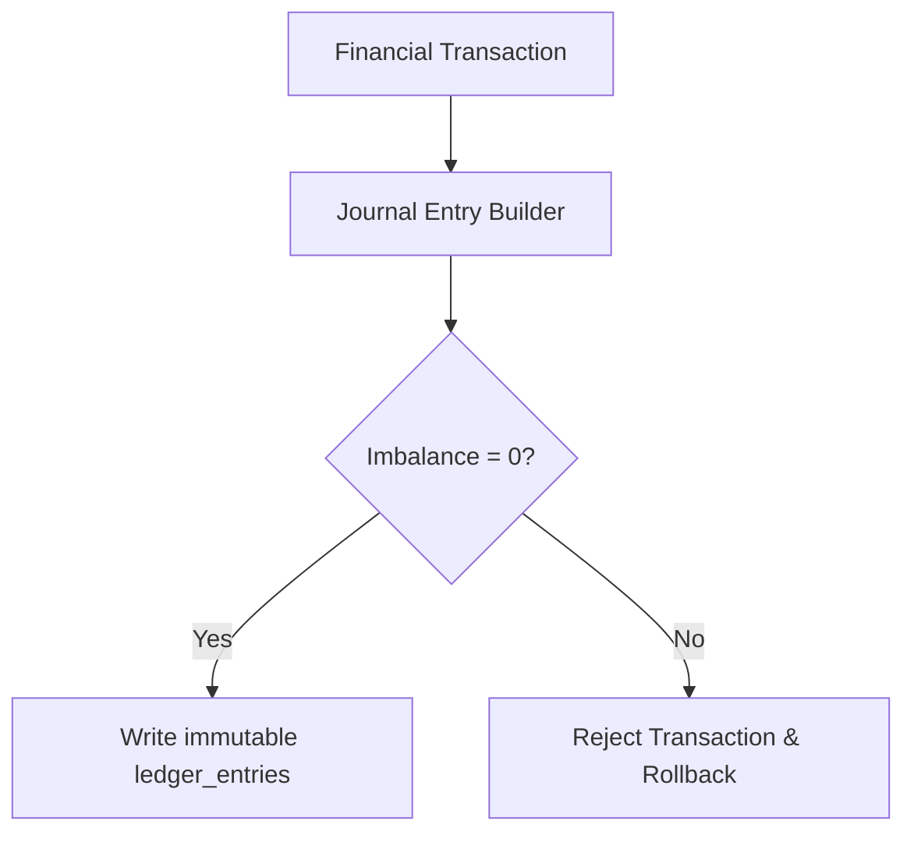

## Why does a developer need to learn accounting?

Most developers hear "accounting" and assume it's a job for the finance department. But in Core Banking, **double-entry bookkeeping is the most critical business logic** your code must execute. If your code is wrong and the ledger is unbalanced, the bank cannot report to the Central Bank, leading to severe legal consequences.

## The Principle of Double-Entry Bookkeeping

Invented in the 15th century by Italian mathematician Luca Pacioli, this principle has **only one rule**:

> **Every financial transaction must be recorded in at least two accounts, one as a Debit and one as a Credit, and the total value of both sides must be equal.**

### Real-world example: Customer A transfers 1,000,000 VND to Customer B

In a conventional mindset, a developer might simply think:
```
account_A.balance -= 1_000_000
account_B.balance += 1_000_000
```

This is **incorrect from an accounting perspective**. The correct way is to record entries in the General Ledger (GL):

| ID  | Account | Entry Type | Amount |
|-----|---------|------------|--------|
| TX1 | Account A | **Debit** | 1,000,000 |
| TX1 | Account B | **Credit** | 1,000,000 |

**Total Debits = Total Credits = 1,000,000** → The ledger is balanced ✅

## The General Ledger (GL) Table — The Heart of Core Banking

The entire Core Banking system essentially revolves around writing data to the GL table with absolute precision. Here is the most basic design of a GL table:

```sql
CREATE TABLE ledger_entries (
    id              UUID PRIMARY KEY DEFAULT gen_random_uuid(),
    transaction_id  UUID        NOT NULL,  -- Groups entries of the same transaction
    account_id      UUID        NOT NULL,  -- Which account is affected
    entry_type      VARCHAR(6)  NOT NULL,  -- 'DEBIT' or 'CREDIT'
    amount          BIGINT      NOT NULL,  -- Stored in the smallest unit (e.g., cents, dong)
    currency        CHAR(3)     NOT NULL,  -- 'VND', 'USD', 'JPY'
    balance_after   BIGINT      NOT NULL,  -- Balance after this entry
    created_at      TIMESTAMPTZ NOT NULL DEFAULT NOW(),
    description     TEXT,
    
    CONSTRAINT chk_amount_positive CHECK (amount > 0),
    CONSTRAINT chk_entry_type CHECK (entry_type IN ('DEBIT', 'CREDIT'))
);
```

> **Crucial Note:** Always store money in integer units — dong, cents, satoshis. **Never use `FLOAT` or `DOUBLE`** to store currency because floating-point precision errors will unbalance the ledger after thousands of transactions.

## Ledger Health Check: The Balance Invariant

This is a query you must be able to run at any time to verify the ledger is not corrupted:

```sql
-- Total of all Debit entries MUST ALWAYS equal the total of all Credit entries
SELECT
    SUM(CASE WHEN entry_type = 'DEBIT'  THEN amount ELSE 0 END) AS total_debits,
    SUM(CASE WHEN entry_type = 'CREDIT' THEN amount ELSE 0 END) AS total_credits,
    SUM(CASE WHEN entry_type = 'DEBIT'  THEN amount ELSE 0 END) -
    SUM(CASE WHEN entry_type = 'CREDIT' THEN amount ELSE 0 END) AS imbalance
FROM ledger_entries;

-- Expected result: imbalance = 0
```

If `imbalance ≠ 0`, it means your code missed an entry somewhere — this is the **most critical bug** possible in Core Banking.

## Account Structures in a Bank

Not every account belongs to a customer. Inside a bank, there are multiple internal account types:

| Account Type | Meaning | Example |
|---|---|---|
| **Asset** | Money the bank holds | Cash in Vault, Customer Loans |
| **Liability** | Money the bank owes customers | Customer Account Balances |
| **Income** | Revenue of the bank | Transaction fees, Interest earned |
| **Expense** | Costs of the bank | Interest paid on savings |
| **Equity** | Shareholders' capital | Charter capital |

When a customer deposits 10 million into a savings account, the system must record:
- **Debit** the Cash Account (Asset increases)
- **Credit** the Customer Savings Account (Liability increases — the bank owes the customer)

## Core Lessons

1. **Never update balances directly** (`UPDATE accounts SET balance = balance - X`). Always write entries to the ledger, then derive the balance from the ledger.
2. **Every transaction is an atomic unit** — all entries must succeed or fail together (Database Transaction).
3. **The Ledger is immutable** — never UPDATE or DELETE an entry once recorded. To fix a mistake, you must post a reversal entry.

---

## References & Further Reading

- [Double-entry bookkeeping (Wikipedia)](https://en.wikipedia.org/wiki/Double-entry_bookkeeping)
- [Martin Fowler: Accounting Patterns](https://martinfowler.com/eaaDev/AccountingPattern.html)
- **Architecture patterns:** For how double-entry ledger integrates into a full banking microservices system — Saga orchestration, Transactional Outbox, and idempotent payment APIs — see [Banking Microservices Architecture in Go](/posts/banking-microservices-architecture/).

> *Next, we will apply the double-entry bookkeeping mindset to the most specific banking operations. Continue reading [Part 2 — Core Banking Domain: CIF, CASA & Lending](/series/core-banking-developer/part-2-banking-domain-casa-lending/).*

## Double-Entry Posting Logic with Go

Enforcing the fundamental ledger equation ($\sum 	ext{Debits} = \sum 	ext{Credits}$) is critical. The following Go program represents a ledger engine validating that the debit entries match credit entries in multi-leg postings:

```go
package main

import (
	"errors"
	"fmt"
)

type Entry struct {
	AccountNo string
	EntryType string // DEBIT or CREDIT
	Amount    int64
}

type JournalEntry struct {
	TxID    string
	Entries []Entry
}

func (je *JournalEntry) Validate() error {
	var totalDebits, totalCredits int64
	for _, entry := range je.Entries {
		if entry.Amount <= 0 {
			return fmt.Errorf("invalid entry amount for account %s", entry.AccountNo)
		}
		if entry.EntryType == "DEBIT" {
			totalDebits += entry.Amount
		} else if entry.EntryType == "CREDIT" {
			totalCredits += entry.Amount
		} else {
			return fmt.Errorf("invalid entry type: %s", entry.EntryType)
		}
	}

	if totalDebits != totalCredits {
		return fmt.Errorf("ledger imbalance: debits (%d) do not equal credits (%d)", totalDebits, totalCredits)
	}

	return nil
}

func main() {
	je := JournalEntry{
		TxID: "tx-2233-abc",
		Entries: []Entry{
			{AccountNo: "ACC-100", EntryType: "DEBIT", Amount: 50000},
			{AccountNo: "ACC-200", EntryType: "CREDIT", Amount: 50000},
		},
	}
	if err := je.Validate(); err == nil {
		fmt.Println("Journal Entry is balanced and valid.")
	}
}
```



## Accounting Schema for Multi-Currency Balances

In global banking environments, accounts must support transactions in multiple currencies (USD, EUR, VND). The system avoids cross-currency mixing by storing balances in dedicated sub-ledger accounts, separating currency calculations to prevent automatic conversion mistakes.

## Implementing General Ledger Reconciliation

To detect transaction corruption, the ledger engine runs a daily reconciliation check. This compares the sum of all transaction logs against the current account balances:

```go
package main

import (
	"errors"
	"fmt"
)

type Account struct {
	ID      string
	Balance int64
}

type LedgerReconciler struct {
	Accounts     map[string]*Account
	Transactions []Entry
}

func (lr *LedgerReconciler) Reconcile() error {
	calculatedBalances := make(map[string]int64)
	for _, tx := range lr.Transactions {
		if tx.EntryType == "CREDIT" {
			calculatedBalances[tx.AccountNo] += tx.Amount
		} else {
			calculatedBalances[tx.AccountNo] -= tx.Amount
		}
	}

	for id, acc := range lr.Accounts {
		if calculatedBalances[id] != acc.Balance {
			return fmt.Errorf("reconciliation imbalance on account %s: expected %d, computed %d", id, acc.Balance, calculatedBalances[id])
		}
	}
	return nil
}

func main() {
	fmt.Println("Reconciliation module active.")
}
```

## Multi-Currency Exchange Adjustments and Revaluation

In multi-currency systems, the system must account for foreign exchange fluctuations:
1. **Currency Position Accounts:** Every foreign currency transaction posts two entries to local ledger balances and two entries to currency position accounts.
2. **Revaluation Run:** At the end of each financial day, a batch process updates the local base currency equivalent balance using updated exchange rates, writing gain/loss adjustments to revaluation buffers.
3. **No Mixed Debits:** The engine rejects transactions attempting to debit a USD account and credit a VND account directly; all cross-currency flows must route through an intermediary FX clearing account.

To ensure complete system reliability, the engineering team establishes regular performance benchmarks under simulated transaction loads. The metrics focus on transactional throughput, lock contention rates, and memory allocation efficiency under garbage collection stress in Go runtimes. We monitor latency profiles closely to identify bottleneck indicators under concurrent traffic.

Database connections are managed via a centralized connection pool to prevent TCP port exhaustion during peak loads. The pool configuration dynamically scales between minimum idle connections and maximum active limits based on queue metrics. This prevents deadlock loops and connection starvation under concurrent requests.

System auditing checks execute asynchronously to avoid blocking the primary transaction path. The metrics are dispatched to the monitoring cluster using decoupled buffered channels, ensuring that logger latency does not bleed into customer API responses. The tracing collector captures intermediate spans and aggregates metrics.

Error handling policies follow standardized bank error codes, mapping database constraints to explicit, human-readable API responses while hiding internal database stack traces to prevent security exposure. The boundary middleware sanitizes outbound error messages.

Automated regression tests run continuously in the deployment pipeline. Every change to the ledger engine triggers thousands of simulated transaction loops to verify that no balance discrepancies can be introduced under race conditions. This rigorous validation ensures high reliability of the double-entry accounting layer.

Cryptographic operations are offloaded to hardware security modules (HSMs) or specialized CPU instructions to minimize CPU utilization during TLS handshakes and payload encryption steps. This ensures high throughput for payment SWITCH APIs.

All configurations (interest rates, overdraft limits, transaction fees) are versioned and stored in the database, allowing dynamic system updates without requiring service redeployment or downtime. This flexibility reduces production operational overhead.
