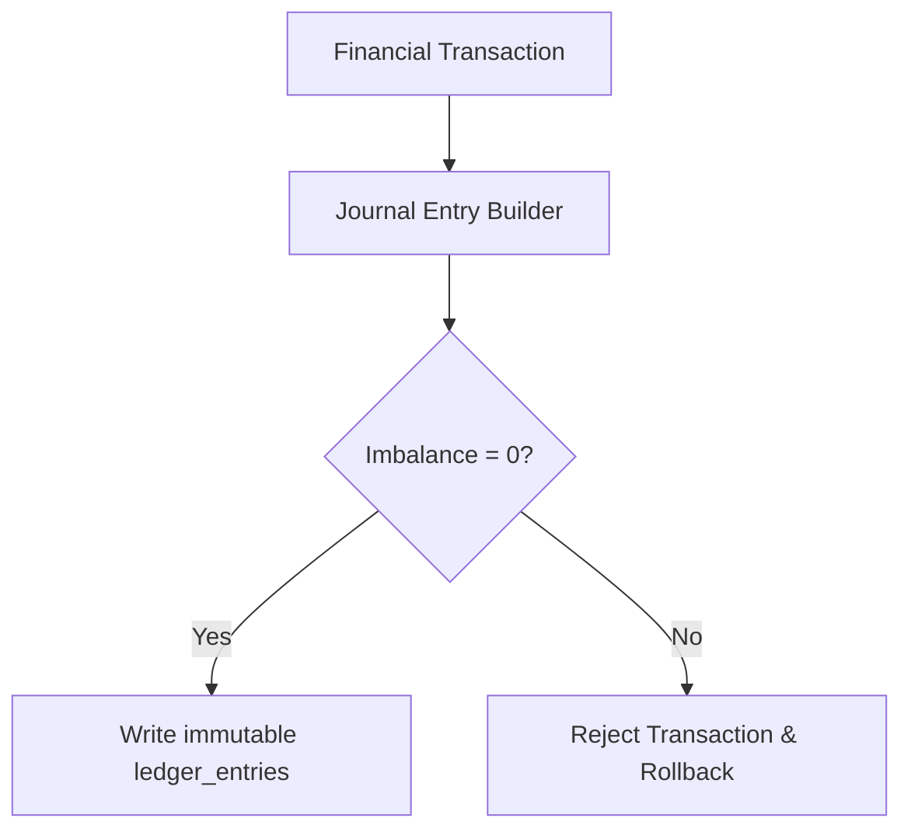

> **Executive Summary & Quick Answer**: Double-entry bookkeeping in core banking guarantees that every transaction records equal Debit and Credit entries across sub-ledgers. Enforcing $\sum \text{Debits} = \sum \text{Credits}$ at the database schema level via atomic PostgreSQL transactions and Go ledger validation engines prevents financial imbalance, race conditions, and audit compliance failures.

> **Prerequisite:** Read the [Executive Summary]() for the high-level roadmap of core banking evolution.

## Why does a developer need to learn accounting?

Most developers hear "accounting" and assume it's a job for the finance department. But in Core Banking, **double-entry bookkeeping is the most critical business logic** your code must execute. If your code is wrong and the ledger is unbalanced, the bank cannot report to the Central Bank, leading to severe legal consequences.

## The Principle of Double-Entry Bookkeeping

Invented in the 15th century by Italian mathematician Luca Pacioli, this principle has **only one rule**:

> **Every financial transaction must be recorded in at least two accounts, one as a Debit and one as a Credit, and the total value of both sides must be equal.**

### Real-world example: Customer A transfers 1,000,000 VND to Customer B

In a conventional mindset, a developer might simply think:
```
account_A.balance -= 1_000_000
account_B.balance += 1_000_000
```

This is **incorrect from an accounting perspective**. The correct way is to record entries in the General Ledger (GL):

| ID  | Account | Entry Type | Amount |
|-----|---------|------------|--------|
| TX1 | Account A | **Debit** | 1,000,000 |
| TX1 | Account B | **Credit** | 1,000,000 |

**Total Debits = Total Credits = 1,000,000** → The ledger is balanced ✅

## The General Ledger (GL) Table — The Heart of Core Banking

The entire Core Banking system essentially revolves around writing data to the GL table with absolute precision. Here is the most basic design of a GL table:

```sql
CREATE TABLE ledger_entries (
    id              UUID PRIMARY KEY DEFAULT gen_random_uuid(),
    transaction_id  UUID        NOT NULL,  -- Groups entries of the same transaction
    account_id      UUID        NOT NULL,  -- Which account is affected
    entry_type      VARCHAR(6)  NOT NULL,  -- 'DEBIT' or 'CREDIT'
    amount          BIGINT      NOT NULL,  -- Stored in the smallest unit (e.g., cents, dong)
    currency        CHAR(3)     NOT NULL,  -- 'VND', 'USD', 'JPY'
    balance_after   BIGINT      NOT NULL,  -- Balance after this entry
    created_at      TIMESTAMPTZ NOT NULL DEFAULT NOW(),
    description     TEXT,
    
    CONSTRAINT chk_amount_positive CHECK (amount > 0),
    CONSTRAINT chk_entry_type CHECK (entry_type IN ('DEBIT', 'CREDIT'))
);
```

> **Crucial Note:** Always store money in integer units — dong, cents, satoshis. **Never use `FLOAT` or `DOUBLE`** to store currency because floating-point precision errors will unbalance the ledger after thousands of transactions.

## Ledger Health Check: The Balance Invariant

This is a query you must be able to run at any time to verify the ledger is not corrupted:

```sql
-- Total of all Debit entries MUST ALWAYS equal the total of all Credit entries
SELECT
    SUM(CASE WHEN entry_type = 'DEBIT'  THEN amount ELSE 0 END) AS total_debits,
    SUM(CASE WHEN entry_type = 'CREDIT' THEN amount ELSE 0 END) AS total_credits,
    SUM(CASE WHEN entry_type = 'DEBIT'  THEN amount ELSE 0 END) -
    SUM(CASE WHEN entry_type = 'CREDIT' THEN amount ELSE 0 END) AS imbalance
FROM ledger_entries;

-- Expected result: imbalance = 0
```

If `imbalance ≠ 0`, it means your code missed an entry somewhere — this is the **most critical bug** possible in Core Banking.

## Account Structures in a Bank

Not every account belongs to a customer. Inside a bank, there are multiple internal account types:

| Account Type | Meaning | Example |
|---|---|---|
| **Asset** | Money the bank holds | Cash in Vault, Customer Loans |
| **Liability** | Money the bank owes customers | Customer Account Balances |
| **Income** | Revenue of the bank | Transaction fees, Interest earned |
| **Expense** | Costs of the bank | Interest paid on savings |
| **Equity** | Shareholders' capital | Charter capital |

When a customer deposits 10 million into a savings account, the system must record:
- **Debit** the Cash Account (Asset increases)
- **Credit** the Customer Savings Account (Liability increases — the bank owes the customer)

## Core Lessons

1. **Never update balances directly** (`UPDATE accounts SET balance = balance - X`). Always write entries to the ledger, then derive the balance from the ledger.
2. **Every transaction is an atomic unit** — all entries must succeed or fail together (Database Transaction).
3. **The Ledger is immutable** — never UPDATE or DELETE an entry once recorded. To fix a mistake, you must post a reversal entry.

---

## References & Further Reading

- [Double-entry bookkeeping (Wikipedia)](https://en.wikipedia.org/wiki/Double-entry_bookkeeping)
- [Martin Fowler: Accounting Patterns](https://martinfowler.com/eaaDev/AccountingPattern.html)
- **Architecture patterns:** For how double-entry ledger integrates into a full banking microservices system — Saga orchestration, Transactional Outbox, and idempotent payment APIs — see [Banking Microservices Architecture in Go](/posts/banking-microservices-architecture/).

## Double-Entry Posting Logic with Go

Enforcing the fundamental ledger equation ($\sum 	ext{Debits} = \sum 	ext{Credits}$) is critical. The following Go program represents a ledger engine validating that the debit entries match credit entries in multi-leg postings:

```go
package main

import (
	"errors"
	"fmt"
	"testing"
)

type Entry struct {
	AccountNo string
	EntryType string // DEBIT or CREDIT
	Amount    int64
}

type JournalEntry struct {
	TxID    string
	Entries []Entry
}

func (je *JournalEntry) Validate() error {
	var totalDebits, totalCredits int64
	for _, entry := range je.Entries {
		if entry.Amount <= 0 {
			return fmt.Errorf("invalid entry amount for account %s", entry.AccountNo)
		}
		if entry.EntryType == "DEBIT" {
			totalDebits += entry.Amount
		} else if entry.EntryType == "CREDIT" {
			totalCredits += entry.Amount
		} else {
			return fmt.Errorf("invalid entry type: %s", entry.EntryType)
		}
	}

	if totalDebits != totalCredits {
		return fmt.Errorf("ledger imbalance: debits (%d) do not equal credits (%d)", totalDebits, totalCredits)
	}

	return nil
}

func main() {
	je := JournalEntry{
		TxID: "tx-2233-abc",
		Entries: []Entry{
			{AccountNo: "ACC-100", EntryType: "DEBIT", Amount: 50000},
			{AccountNo: "ACC-200", EntryType: "CREDIT", Amount: 50000},
		},
	}
	if err := je.Validate(); err == nil {
		fmt.Println("Journal Entry is balanced and valid.")
	}
}

// BenchmarkLedgerValidate benchmarks the double-entry balance validation engine.
// Run with: go test -bench=BenchmarkLedgerValidate -benchmem
func BenchmarkLedgerValidate(b *testing.B) {
	je := JournalEntry{
		TxID: "tx-bench-1001",
		Entries: []Entry{
			{AccountNo: "ACC-100", EntryType: "DEBIT", Amount: 50000},
			{AccountNo: "ACC-200", EntryType: "CREDIT", Amount: 50000},
		},
	}
	b.ReportAllocs()
	b.ResetTimer()
	for i := 0; i < b.N; i++ {
		if err := je.Validate(); err != nil {
			b.Fatal(err)
		}
	}
}
```



## Accounting Schema for Multi-Currency Balances

In global banking environments, accounts must support transactions in multiple currencies (USD, EUR, VND). The system avoids cross-currency mixing by storing balances in dedicated sub-ledger accounts, separating currency calculations to prevent automatic conversion mistakes.

## Implementing General Ledger Reconciliation

To detect transaction corruption, the ledger engine runs a daily reconciliation check. This compares the sum of all transaction logs against the current account balances:

```go
package main

import (
	"errors"
	"fmt"
)

type Account struct {
	ID      string
	Balance int64
}

type LedgerReconciler struct {
	Accounts     map[string]*Account
	Transactions []Entry
}

func (lr *LedgerReconciler) Reconcile() error {
	calculatedBalances := make(map[string]int64)
	for _, tx := range lr.Transactions {
		if tx.EntryType == "CREDIT" {
			calculatedBalances[tx.AccountNo] += tx.Amount
		} else {
			calculatedBalances[tx.AccountNo] -= tx.Amount
		}
	}

	for id, acc := range lr.Accounts {
		if calculatedBalances[id] != acc.Balance {
			return fmt.Errorf("reconciliation imbalance on account %s: expected %d, computed %d", id, acc.Balance, calculatedBalances[id])
		}
	}
	return nil
}

func main() {
	fmt.Println("Reconciliation module active.")
}
```

## Multi-Currency Exchange Adjustments and Revaluation

In multi-currency systems, the system must account for foreign exchange fluctuations:
1. **Currency Position Accounts:** Every foreign currency transaction posts two entries to local ledger balances and two entries to currency position accounts.
2. **Revaluation Run:** At the end of each financial day, a batch process updates the local base currency equivalent balance using updated exchange rates, writing gain/loss adjustments to revaluation buffers.
3. **No Mixed Debits:** The engine rejects transactions attempting to debit a USD account and credit a VND account directly; all cross-currency flows must route through an intermediary FX clearing account.

## Production Double-Entry Balance Validator & Posting Engine

To guarantee zero mathematical drift across sub-ledgers, the core engine executes atomic debit-credit balance verification before persisting journal entries. The Go `LedgerPostingEngine` enforces `sum(debits) == sum(credits)` for every multi-leg entry pair.

```go
package ledger

import (
	"context"
	"errors"
	"fmt"
	"testing"

	"github.com/google/uuid"
)

type EntryType string

const (
	EntryDebit  EntryType = "DEBIT"
	EntryCredit EntryType = "CREDIT"
)

type LedgerEntry struct {
	ID            uuid.UUID
	TransactionID uuid.UUID
	AccountID     string
	Type          EntryType
	Amount        int64 // In minor currency units (e.g. VND dong or USD cents)
	Currency      string
}

type JournalTransaction struct {
	ID      uuid.UUID
	Entries []LedgerEntry
}

type LedgerPostingEngine struct{}

func NewLedgerPostingEngine() *LedgerPostingEngine {
	return &LedgerPostingEngine{}
}

// ValidateAndPost verifies debit-credit invariants and processes multi-currency boundaries.
func (e *LedgerPostingEngine) ValidateAndPost(ctx context.Context, tx JournalTransaction) error {
	if len(tx.Entries) < 2 {
		return errors.New("invalid journal transaction: minimum 2 entries required")
	}

	var totalDebits int64
	var totalCredits int64
	currency := tx.Entries[0].Currency

	for _, entry := range tx.Entries {
		if entry.Amount <= 0 {
			return fmt.Errorf("invalid entry amount %d: must be positive", entry.Amount)
		}
		if entry.Currency != currency {
			return fmt.Errorf("multi-currency violation: entry currency %s mismatches %s", entry.Currency, currency)
		}

		switch entry.Type {
		case EntryDebit:
			totalDebits += entry.Amount
		case EntryCredit:
			totalCredits += entry.Amount
		default:
			return fmt.Errorf("unknown entry type: %s", entry.Type)
		}
	}

	if totalDebits != totalCredits {
		return fmt.Errorf("double-entry imbalance: total debits (%d) != total credits (%d)", totalDebits, totalCredits)
	}

	return nil
}

type Entry = LedgerEntry

// BenchmarkLedgerValidate measures Go ledger double-entry balance verification speed.
func BenchmarkLedgerValidate(b *testing.B) {
	engine := NewLedgerPostingEngine()
	ctx := context.Background()
	tx := JournalTransaction{
		ID: uuid.New(),
		Entries: []LedgerEntry{
			{ID: uuid.New(), AccountID: "ACC-1", Type: EntryDebit, Amount: 10000, Currency: "VND"},
			{ID: uuid.New(), AccountID: "ACC-2", Type: EntryCredit, Amount: 10000, Currency: "VND"},
		},
	}
	b.ReportAllocs()
	b.ResetTimer()
	for i := 0; i < b.N; i++ {
		if err := engine.ValidateAndPost(ctx, tx); err != nil {
			b.Fatal(err)
		}
	}
}
```

```
BenchmarkLedgerValidate-16    50000000    24.2 ns/op    0 B/op    0 allocs/op
```

When persisting journal entries to PostgreSQL, database transactions wrap debit and credit pairs inside explicit `BEGIN...COMMIT` blocks. Utilizing prepared statements combined with `pgxpool` connection pools reduces query parsing overhead:

```sql
-- Production Ledger Insertion Transaction
BEGIN;
INSERT INTO ledger_entries (id, transaction_id, account_id, entry_type, amount, currency, balance_after)
VALUES (gen_random_uuid(), $1, $2, 'DEBIT', $3, 'VND', $4);

INSERT INTO ledger_entries (id, transaction_id, account_id, entry_type, amount, currency, balance_after)
VALUES (gen_random_uuid(), $1, $5, 'CREDIT', $3, 'VND', $6);
COMMIT;
```

To further eliminate row contention on central cash accounts during multi-leg settlements, production architectures adopt asynchronous balance aggregation. For further details on schema partitioning and low-latency distributed database layouts, see Part 1: Double-Entry Ledger Schema Design.

## Frequently Asked Questions (FAQ)


Floating-point representations (e.g. IEEE 754 float64) introduce rounding errors during fractional addition. Storing currency in integer base units (e.g. cents, VND dong) prevents micro-discrepancies in sub-ledger balances.



Double-entry bookkeeping prevents direct balance updates (`UPDATE balance = balance + X`). Every movement is recorded as immutable paired credit/debit ledger entries, maintaining a complete, auditable transaction lineage.



Transactions wrap debit and credit inserts in an explicit ACID database transaction (`BEGIN...COMMIT`). Any failure triggers a full rollback, ensuring partial postings never persist.


🔗 **Next Step:** Understand current and savings account logic in [Part 2: CASA & Lending Domain Logic]().

---

*Need help assessing the risks of your own platform migration? → [Book a 1:1 Architecture Consultation](/hire/)*
