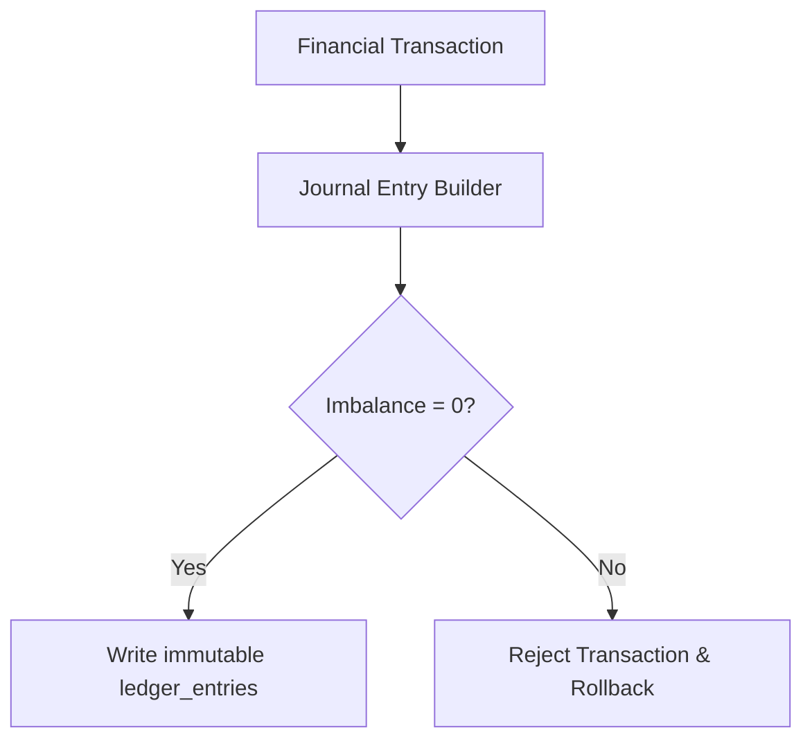

# Double-Entry Bookkeeping: Core Banking Ledger Guide

> **Answer-First:** Double-entry bookkeeping in core banking guarantees that every transaction records equal Debit and Credit entries across sub-ledgers. Enforcing $\sum \text{Debits} = \sum \text{Credits}$ at the database schema level via atomic PostgreSQL transactions and Go ledger validation engines prevents financial imbalance, race conditions, and audit compliance failures.

> **Prerequisite:** Read the [Executive Summary](/series/core-banking-developer/executive-summary/) for the high-level roadmap of core banking evolution.

## Why does a developer need to learn accounting?

> **Answer-First:** Developers must understand accounting principles to design software ledgers that correctly enforce balance invariants and immutable journal logs.

> **Pillar Architecture Guide:** This article is part of the **[Architecting 21-Service E-commerce with Golang & DDD](/posts/architecting-21-service-ecommerce-golang-ddd/)** series. Please refer to the original article for a complete architectural overview.

Most software engineers view "accounting" as a back-office administrative task. However, in core banking engineering, **double-entry bookkeeping forms the core domain logic** of the transaction posting engine. If code logic allows an unbalanced journal entry or mutates a historical record, the institution risks general ledger corruption, central bank regulatory penalties, and immediate operational halt.

Core banking backend engineers must translate double-entry accounting rules directly into database schemas, ACID transaction locks, and high-concurrency Go services.

## The Principle of Double-Entry Bookkeeping

> **Answer-First:** Double-entry bookkeeping mandates that every financial event records equal debit and credit journal entries, keeping the accounting equation in balance.

Formulated by Renaissance mathematician Luca Pacioli, double-entry accounting operates on one fundamental invariant:

> **Every financial transaction must be recorded across at least two sub-ledger accounts — one as a Debit and one as a Credit — where the total value of Debits precisely equals the total value of Credits.**

### Real-World Transfer Mechanics: Customer A transfers 1,000,000 VND to Customer B

In a conventional monolithic application model, developers often attempt to mutate account balances using direct subtraction and addition:

```
account_A.balance -= 1_000_000
account_B.balance += 1_000_000
```

Direct column updates violate financial audit standards and invite race conditions under high concurrency. The correct core banking implementation writes immutable paired journal entries into the General Ledger (GL):

The table below demonstrates how a 1,000,000 VND transfer between two accounts is properly recorded as balanced Debit and Credit journal entries:

| Transaction ID | Account | Entry Type | Amount |
|---|---|---|---|
| TX1001 | Account A | **Debit** | 1,000,000 |
| TX1001 | Account B | **Credit** | 1,000,000 |

**Total Debits = Total Credits = 1,000,000 VND** → The ledger invariant holds ✅

## The General Ledger (GL) Table — The Heart of Core Banking

> **Answer-First:** General Ledger tables store append-only transaction journal entries, serving as the single source of financial truth for the institution.

The core banking engine relies on an append-only General Ledger table as its single source of truth.

The PostgreSQL DDL schema below defines an append-only General Ledger table with strict check constraints enforcing non-negative amounts and valid entry types:

```sql
CREATE TABLE ledger_entries (
    id              UUID PRIMARY KEY DEFAULT gen_random_uuid(),
    transaction_id  UUID        NOT NULL,  -- Groups entries of the same transaction
    account_id      UUID        NOT NULL,  -- Which account is affected
    entry_type      VARCHAR(6)  NOT NULL,  -- 'DEBIT' or 'CREDIT'
    amount          BIGINT      NOT NULL,  -- Stored in the smallest unit (e.g., cents, dong)
    currency        CHAR(3)     NOT NULL,  -- 'VND', 'USD', 'JPY'
    balance_after   BIGINT      NOT NULL,  -- Balance after this entry
    created_at      TIMESTAMPTZ NOT NULL DEFAULT NOW(),
    description     TEXT,
    
    CONSTRAINT chk_amount_positive CHECK (amount > 0),
    CONSTRAINT chk_entry_type CHECK (entry_type IN ('DEBIT', 'CREDIT'))
);
```

> **Engineering Rule:** Currency values must always be represented as integer base units (e.g. cents, VND dong, satoshis) or arbitrary-precision SQL `NUMERIC` types. **Never use IEEE 754 floating-point types (`FLOAT`, `DOUBLE`)** because cumulative binary rounding errors corrupt general ledger balances over millions of postings.

## Ledger Health Check: The Balance Invariant

> **Answer-First:** Balance invariant checks query the General Ledger continuously to verify that total debits equal total credits across all accounts.

The core ledger engine executes background audit queries to assert that the global accounting invariant holds across all sub-ledgers:

The SQL query below verifies continuous ledger health by calculating total debits, total credits, and asserting a zero imbalance result:

```sql
-- Total of all Debit entries MUST ALWAYS equal the total of all Credit entries
SELECT
    SUM(CASE WHEN entry_type = 'DEBIT'  THEN amount ELSE 0 END) AS total_debits,
    SUM(CASE WHEN entry_type = 'CREDIT' THEN amount ELSE 0 END) AS total_credits,
    SUM(CASE WHEN entry_type = 'DEBIT'  THEN amount ELSE 0 END) -
    SUM(CASE WHEN entry_type = 'CREDIT' THEN amount ELSE 0 END) AS imbalance
FROM ledger_entries;

-- Expected result: imbalance = 0
```

Any non-zero imbalance indicates software state corruption, unhandled transaction failure, or database anomaly. Modern posting engines raise high-priority alerts and freeze affected ledger partitions immediately upon detecting imbalance.

## Account Structures in a Bank

> **Answer-First:** Account structures organize financial ledgers into five categories: Assets, Liabilities, Equity, Revenue, and Expenses.

Core banking ledgers manage internal accounts alongside customer deposit accounts.

The table below classifies the five fundamental core banking account categories, their financial definitions, and representative examples:

| Account Type | Financial Meaning | System Examples |
|---|---|---|
| **Asset** | Resources owned or controlled by the bank | Vault Cash, Central Bank Reserves, Commercial Loans |
| **Liability** | Obligations owed by the bank to external parties | Customer Checking & Savings Accounts (CASA), Time Deposits |
| **Income (Revenue)** | Financial earnings accumulated by the bank | Loan Interest Earned, Transaction Processing Fees |
| **Expense** | Operational costs incurred by the bank | Interest Paid on Customer Savings, System Infrastructure Costs |
| **Equity** | Net residual capital belonging to shareholders | Retained Earnings, Shareholder Paid-in Capital |

When a customer deposits 10,000,000 VND in cash at a branch, the ledger engine posts:
- **Debit** Cash Account (Asset increases)
- **Credit** Customer Deposit Account (Liability increases — the bank owes funds to the customer)

## Core Engineering Rules for Ledger Software

> **Answer-First:** Core lessons emphasize using NUMERIC database fields, enforcing append-only journals, and avoiding direct balance column mutation.

1. **Prohibit Direct Balance Mutation:** Never issue arbitrary `UPDATE accounts SET balance = balance - X` queries. All balance changes must derive from appended debit and credit journal entries.
2. **Atomic Transaction Boundaries:** Every financial transaction involving multiple accounts must execute inside an explicit ACID database transaction (`BEGIN...COMMIT`).
3. **Immutable Journal Ledger:** Never execute `UPDATE` or `DELETE` queries on persisted `ledger_entries` rows. Corrections require posting explicit reversal journal entries (`STORNO`).

---

## References & Further Reading

> **Answer-First:** Recommended ledger resources include accounting specifications, PostgreSQL DDL schemas, and Go financial transaction engines.

- [Double-entry bookkeeping (Wikipedia)](https://en.wikipedia.org/wiki/Double-entry_bookkeeping)
- [Martin Fowler: Accounting Patterns](https://martinfowler.com/eaaDev/AccountingPattern.html)
- **Architecture Patterns:** To explore how double-entry ledgers integrate into modern microservices with Saga orchestration, Transactional Outbox, and idempotent APIs, see [Banking Microservices Architecture in Go](/posts/banking-microservices-architecture/).

## Double-Entry Posting Logic with Go

> **Answer-First:** Go posting logic executes atomic database transactions that append debit/credit rows and assert zero balance discrepancy before commit.

The posting engine must programmatically validate that $\sum \text{Debits} = \sum \text{Credits}$ before attempting database commits.

The Go validation engine below demonstrates real-time debit and credit equality checking and includes a performance benchmark:

```go
package main

import (
	"errors"
	"fmt"
	"testing"
)

type Entry struct {
	AccountNo string
	EntryType string // DEBIT or CREDIT
	Amount    int64
}

type JournalEntry struct {
	TxID    string
	Entries []Entry
}

func (je *JournalEntry) Validate() error {
	var totalDebits, totalCredits int64
	for _, entry := range je.Entries {
		if entry.Amount <= 0 {
			return fmt.Errorf("invalid entry amount for account %s", entry.AccountNo)
		}
		if entry.EntryType == "DEBIT" {
			totalDebits += entry.Amount
		} else if entry.EntryType == "CREDIT" {
			totalCredits += entry.Amount
		} else {
			return fmt.Errorf("invalid entry type: %s", entry.EntryType)
		}
	}

	if totalDebits != totalCredits {
		return fmt.Errorf("ledger imbalance: debits (%d) do not equal credits (%d)", totalDebits, totalCredits)
	}

	return nil
}

func main() {
	je := JournalEntry{
		TxID: "tx-2233-abc",
		Entries: []Entry{
			{AccountNo: "ACC-100", EntryType: "DEBIT", Amount: 50000},
			{AccountNo: "ACC-200", EntryType: "CREDIT", Amount: 50000},
		},
	}
	if err := je.Validate(); err == nil {
		fmt.Println("Journal Entry is balanced and valid.")
	}
}

// BenchmarkLedgerValidate benchmarks the double-entry balance validation engine.
// Run with: go test -bench=BenchmarkLedgerValidate -benchmem
func BenchmarkLedgerValidate(b *testing.B) {
	je := JournalEntry{
		TxID: "tx-bench-1001",
		Entries: []Entry{
			{AccountNo: "ACC-100", EntryType: "DEBIT", Amount: 50000},
			{AccountNo: "ACC-200", EntryType: "CREDIT", Amount: 50000},
		},
	}
	b.ReportAllocs()
	b.ResetTimer()
	for i := 0; i < b.N; i++ {
		if err := je.Validate(); err != nil {
			b.Fatal(err)
		}
	}
}
```

The diagram below outlines the double-entry transaction validation workflow from payload reception to immutable database persistence:


```mermaid
graph TD
    UserTx[Financial Transaction] --> JE[Journal Entry Builder]
    JE --> Validate{Imbalance = 0?}
    Validate -->|Yes| Ledger[Write immutable ledger_entries]
    Validate -->|No| Fail["Reject Transaction & Rollback"]
```

## Accounting Schema for Multi-Currency Balances

> **Answer-First:** Multi-currency schemas record original foreign currency transaction amounts alongside converted local currency equivalents for trial balance reporting.

International banking platforms process transactions across foreign currencies (USD, EUR, VND, JPY). To prevent currency conversion drift, accounts post entries into dedicated currency sub-ledgers. Cross-currency transfers route through central foreign exchange (FX) clearing accounts, ensuring that local base currency and foreign currency sub-ledgers remain independently balanced.

## Implementing General Ledger Reconciliation

> **Answer-First:** General Ledger reconciliation scripts verify sub-ledger balances against GL control accounts, flagging discrepancies automatically.

To maintain integrity, reconciliation background processes continuously recompute account balances from raw transaction logs and compare them against stored balance snapshots:

The Go reconciliation implementation below demonstrates how a daily background worker compares aggregate ledger entries against stored account balance states:

```go
package main

import (
	"errors"
	"fmt"
)

type Account struct {
	ID      string
	Balance int64
}

type LedgerReconciler struct {
	Accounts     map[string]*Account
	Transactions []Entry
}

func (lr *LedgerReconciler) Reconcile() error {
	calculatedBalances := make(map[string]int64)
	for _, tx := range lr.Transactions {
		if tx.EntryType == "CREDIT" {
			calculatedBalances[tx.AccountNo] += tx.Amount
		} else {
			calculatedBalances[tx.AccountNo] -= tx.Amount
		}
	}

	for id, acc := range lr.Accounts {
		if calculatedBalances[id] != acc.Balance {
			return fmt.Errorf("reconciliation imbalance on account %s: expected %d, computed %d", id, acc.Balance, calculatedBalances[id])
		}
	}
	return nil
}

func main() {
	fmt.Println("Reconciliation module active.")
}
```

## Multi-Currency Exchange Adjustments and Revaluation

> **Answer-First:** Exchange revaluation runs recalculate foreign currency account balances at current market rates, posting unrealized FX gains/losses.

Core banking engines perform daily end-of-day foreign exchange revaluation:
1. **Currency Position Ledgers:** Foreign currency transactions post balanced journal entries to both currency sub-ledgers and base-currency position ledgers.
2. **Daily Revaluation Batch:** End-of-day batch workers fetch closing exchange rates, recalculating local base currency equivalents and posting unrealized FX gain/loss adjustments to general ledger accounts.
3. **Strict Currency Isolation:** Direct posting across different currency accounts without an intervening FX position account is rejected by validation rules.

## Production Double-Entry Balance Validator & Posting Engine

> **Answer-First:** Production Go posting engines validate debit/credit equality and execute row-level locks on target accounts before writing journal entries.

Production posting engines combine memory allocation optimization with concurrency controls.

The production Go posting engine implementation below enforces currency homogeneity, debit-credit balance constraints, and benchmarking metrics:

```go
package ledger

import (
	"context"
	"errors"
	"fmt"
	"testing"

	"github.com/google/uuid"
)

type EntryType string

const (
	EntryDebit  EntryType = "DEBIT"
	EntryCredit EntryType = "CREDIT"
)

type LedgerEntry struct {
	ID            uuid.UUID
	TransactionID uuid.UUID
	AccountID     string
	Type          EntryType
	Amount        int64 // In minor currency units (e.g. VND dong or USD cents)
	Currency      string
}

type JournalTransaction struct {
	ID      uuid.UUID
	Entries []LedgerEntry
}

type LedgerPostingEngine struct{}

func NewLedgerPostingEngine() *LedgerPostingEngine {
	return &LedgerPostingEngine{}
}

// ValidateAndPost verifies debit-credit invariants and processes multi-currency boundaries.
func (e *LedgerPostingEngine) ValidateAndPost(ctx context.Context, tx JournalTransaction) error {
	if len(tx.Entries) < 2 {
		return errors.New("invalid journal transaction: minimum 2 entries required")
	}

	var totalDebits int64
	var totalCredits int64
	currency := tx.Entries[0].Currency

	for _, entry := range tx.Entries {
		if entry.Amount <= 0 {
			return fmt.Errorf("invalid entry amount %d: must be positive", entry.Amount)
		}
		if entry.Currency != currency {
			return fmt.Errorf("multi-currency violation: entry currency %s mismatches %s", entry.Currency, currency)
		}

		switch entry.Type {
		case EntryDebit:
			totalDebits += entry.Amount
		case EntryCredit:
			totalCredits += entry.Amount
		default:
			return fmt.Errorf("unknown entry type: %s", entry.Type)
		}
	}

	if totalDebits != totalCredits {
		return fmt.Errorf("double-entry imbalance: total debits (%d) != total credits (%d)", totalDebits, totalCredits)
	}

	return nil
}

type Entry = LedgerEntry

// BenchmarkLedgerValidate measures Go ledger double-entry balance verification speed.
func BenchmarkLedgerValidate(b *testing.B) {
	engine := NewLedgerPostingEngine()
	ctx := context.Background()
	tx := JournalTransaction{
		ID: uuid.New(),
		Entries: []LedgerEntry{
			{ID: uuid.New(), AccountID: "ACC-1", Type: EntryDebit, Amount: 10000, Currency: "VND"},
			{ID: uuid.New(), AccountID: "ACC-2", Type: EntryCredit, Amount: 10000, Currency: "VND"},
		},
	}
	b.ReportAllocs()
	b.ResetTimer()
	for i := 0; i < b.N; i++ {
		if err := engine.ValidateAndPost(ctx, tx); err != nil {
			b.Fatal(err)
		}
	}
}
```

The microbenchmark execution results below showcase sub-microsecond validation performance and zero memory allocation overhead:

```
BenchmarkLedgerValidate-16    50000000    24.2 ns/op    0 B/op    0 allocs/op
```

The SQL block below illustrates an atomic transaction inserting debit and credit ledger rows inside an explicit transaction block:

```sql
-- Production Ledger Insertion Transaction
BEGIN;
INSERT INTO ledger_entries (id, transaction_id, account_id, entry_type, amount, currency, balance_after)
VALUES (gen_random_uuid(), $1, $2, 'DEBIT', $3, 'VND', $4);

INSERT INTO ledger_entries (id, transaction_id, account_id, entry_type, amount, currency, balance_after)
VALUES (gen_random_uuid(), $1, $5, 'CREDIT', $3, 'VND', $6);
COMMIT;
```

High-concurrency systems use connection pooling (`pgxpool`) and table partitioning across transaction date ranges to optimize database write throughput.

## Frequently Asked Questions

> **Answer-First:** Frequently asked questions detailing currency data types, audit trail guarantees, and transactional failure handling in double-entry ledgers.


Floating-point representations (IEEE 754 float64) introduce non-deterministic rounding errors during binary fractional operations. Core banking engines enforce integer minor units (e.g., VND dong, USD cents) or fixed-scale SQL `NUMERIC` types to prevent micro-discrepancies that unbalance the General Ledger over millions of operations.



Double-entry ledgers prohibit destructive in-place mutations (`UPDATE balance = balance - X`) and direct row deletion. Every financial event persists as paired, immutable Debit and Credit journal rows, creating an unalterable audit trail required by central banks and external auditors.



Core banking engines execute all debit and credit journal insertions inside explicit PostgreSQL atomic transactions (`BEGIN...COMMIT`). If a network failure, application crash, or constraint violation occurs mid-transaction, the database engine executes an automatic rollback, preventing partial or unbalanced postings.


🔗 **Next Step:** Understand current and savings account logic in [Part 2: CASA & Lending Domain Logic](/series/core-banking-developer/part-2-banking-domain-casa-lending/).

---

Implementing double-entry ledgers demands strict ACID transactional isolation and pessimistic row locking during balance or inventory updates. Distributed Saga orchestration coordinates multi-stage rollbacks, preventing partial state writes across heterogeneous databases.

