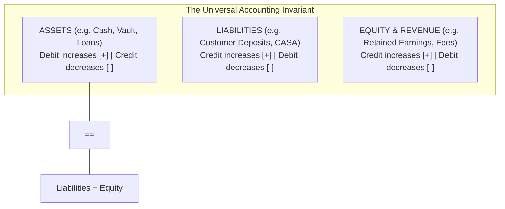
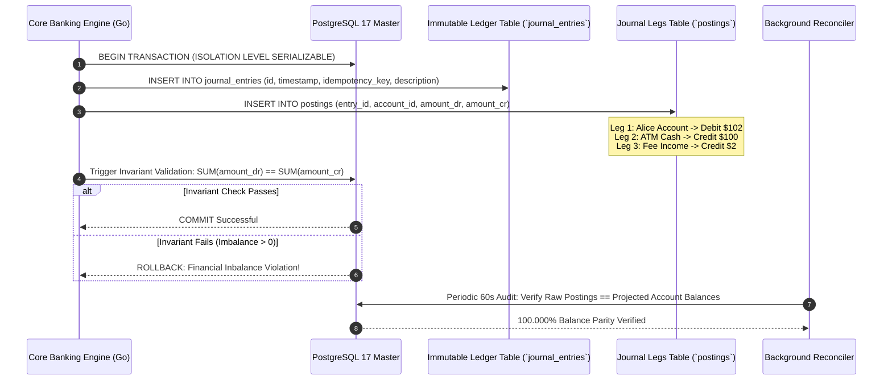

[📖 Bản tiếng Việt (Vietnamese Edition)](https://learn.tanhdev.com/series/core-banking-developer/part-1-double-entry-ledger/)

---

> **Prerequisite:** Read [Executive Summary: Core Banking Developer Roadmap](/series/core-banking-developer/executive-summary/) for architectural context.

# Double-Entry Bookkeeping: Core Banking Ledger Guide

**Answer-first:** Double-entry bookkeeping in core banking guarantees that every transaction records equal and offsetting Debit and Credit entries across sub-ledgers. By enforcing $\sum \text{Debits} = \sum \text{Credits}$ at the database schema level via atomic multi-leg constraints (`CHECK (sum(amount) = 0)`) and immutable append-only journal structures, financial engineering engines eliminate balance drift, rounding loss, and audit discrepancies under high transaction concurrency.

---

## 1. The Principle of Double-Entry Bookkeeping & T-Accounts

In consumer applications, a money transfer is often naively modeled as:
```sql
-- DANGEROUS: Antipattern in financial systems!
UPDATE accounts SET balance = balance - 100 WHERE id = 'alice';
UPDATE accounts SET balance = balance + 100 WHERE id = 'bob';
```
This naive approach fails regulatory audits immediately. It leaves no immutable audit trail, creates unresolvable race conditions if either statement fails, and conceals the economic nature of the transfer.

In professional banking software, money never moves in isolation. Every transfer is an immutable **Journal Entry** composed of at least two balanced **Journal Legs** adhering to the fundamental accounting equation:

$$\text{Assets} = \text{Liabilities} + \text{Equity}$$


```mermaid
flowchart TD
    subgraph Accounting_Equation ["The Universal Accounting Invariant"]
        Assets["ASSETS (e.g. Cash, Vault, Loans)<br/>Debit increases [+] | Credit decreases [-]"]
        Liabilities["LIABILITIES (e.g. Customer Deposits, CASA)<br/>Credit increases [+] | Debit decreases [-]"]
        Equity["EQUITY & REVENUE (e.g. Retained Earnings, Fees)<br/>Credit increases [+] | Debit decreases [-]"]
    end

    Assets --- Equals["=="]
    Equals --- SumLiabEq["Liabilities + Equity"]
```

### The Rules of Debit and Credit:
- **Debit (DR)**: Increases Asset and Expense accounts. Decreases Liability, Equity, and Revenue accounts.
- **Credit (CR)**: Increases Liability, Equity, and Revenue accounts. Decreases Asset and Expense accounts.

When Customer Alice transfers $100 to Customer Bob within the same bank:
1. Alice's account (a Liability to the bank) is **Debited** by $100 (reducing the bank's liability to Alice).
2. Bob's account (also a Liability to the bank) is **Credited** by $100 (increasing the bank's liability to Bob).
3. The net change to the bank's total balance sheet is **Zero** ($\Delta \text{Liabilities} = -100 + 100 = 0$).

---

## 2. Multi-Leg Journal Posting & Balance Invariant Workflow

Real-world banking transactions frequently involve more than two accounts. A customer ATM withdrawal of $100 involving a $2 fee incurs a 3-leg entry:
- **Debit**: Customer Account ($102) — Liability drops by $102.
- **Credit**: ATM Vault Cash ($100) — Asset drops by $100.
- **Credit**: ATM Fee Income ($2) — Revenue increases by $2.

$$\text{Net Balance} = \text{Debit (\$102)} - \text{Credit (\$100)} - \text{Credit (\$2)} = 0$$


```mermaid
sequenceDiagram
    autonumber
    participant App as Core Banking Engine (Go)
    participant DB as PostgreSQL 17 Master
    participant Ledger as Immutable Ledger Table (`journal_entries`)
    participant Postings as Journal Legs Table (`postings`)
    participant AccRec as Background Reconciler

    App->>DB: BEGIN TRANSACTION (ISOLATION LEVEL SERIALIZABLE)
    App->>Ledger: INSERT INTO journal_entries (id, timestamp, idempotency_key, description)
    App->>Postings: INSERT INTO postings (entry_id, account_id, amount_dr, amount_cr)
    Note over Postings: Leg 1: Alice Account -> Debit $102<br/>Leg 2: ATM Cash -> Credit $100<br/>Leg 3: Fee Income -> Credit $2
    
    App->>DB: Trigger Invariant Validation: SUM(amount_dr) == SUM(amount_cr)
    alt Invariant Check Passes
        DB-->>App: COMMIT Successful
    else Invariant Fails (Imbalance > 0)
        DB-->>App: ROLLBACK: Financial Inbalance Violation!
    end

    AccRec->>DB: Periodic 60s Audit: Verify Raw Postings == Projected Account Balances
    DB-->>AccRec: 100.000% Balance Parity Verified
```

---

## 3. Production PostgreSQL Ledger Schema

Below is the production DDL for an immutable, append-only double-entry financial ledger:

```sql
-- PostgreSQL 17 Core Banking Ledger Schema
CREATE TABLE accounts (
    id UUID PRIMARY KEY DEFAULT gen_random_uuid(),
    customer_id UUID NOT NULL,
    account_number VARCHAR(34) NOT NULL UNIQUE,
    currency VARCHAR(3) NOT NULL,
    account_type VARCHAR(20) NOT NULL, -- ASSET, LIABILITY, EQUITY, REVENUE, EXPENSE
    current_balance BIGINT NOT NULL DEFAULT 0, -- Minor currency units (e.g. cents)
    version BIGINT NOT NULL DEFAULT 1,
    created_at TIMESTAMPTZ NOT NULL DEFAULT clock_timestamp()
);

CREATE TABLE journal_entries (
    id UUID PRIMARY KEY DEFAULT gen_random_uuid(),
    idempotency_key VARCHAR(64) NOT NULL UNIQUE,
    narration TEXT NOT NULL,
    posted_at TIMESTAMPTZ NOT NULL DEFAULT clock_timestamp()
);

CREATE TABLE journal_legs (
    id UUID PRIMARY KEY DEFAULT gen_random_uuid(),
    entry_id UUID NOT NULL REFERENCES journal_entries(id) ON DELETE RESTRICT,
    account_id UUID NOT NULL REFERENCES accounts(id) ON DELETE RESTRICT,
    direction VARCHAR(2) NOT NULL CHECK (direction IN ('DR', 'CR')),
    amount BIGINT NOT NULL CHECK (amount > 0), -- Stored as positive integer
    sequence_num INT NOT NULL,
    UNIQUE (entry_id, sequence_num)
);

-- Compound index for rapid historical balance lookups
CREATE INDEX idx_legs_account_posted ON journal_legs(account_id, id);
```

---

## 4. Go 1.24 Invariant Verification Engine

In addition to database constraints, the application layer verifies mathematical balance invariants before submitting SQL transactions:

```go
package ledger

import (
	"errors"
	"fmt"
)

type Direction string

const (
	Debit  Direction = "DR"
	Credit Direction = "CR"
)

type JournalLeg struct {
	AccountID string
	Direction Direction
	Amount    int64 // In minor currency unit (e.g. cents)
}

type JournalEntry struct {
	IdempotencyKey string
	Narration      string
	Legs           []JournalLeg
}

// ValidateInvariant verifies that total Debits exactly equal total Credits.
func (e *JournalEntry) ValidateInvariant() error {
	if len(e.Legs) < 2 {
		return errors.New("journal entry must contain at least two legs")
	}

	var totalDebit, totalCredit int64
	for _, leg := range e.Legs {
		if leg.Amount <= 0 {
			return fmt.Errorf("invalid leg amount: %d (must be > 0)", leg.Amount)
		}
		switch leg.Direction {
		case Debit:
			totalDebit += leg.Amount
		case Credit:
			totalCredit += leg.Amount
		default:
			return fmt.Errorf("unknown direction: %s", leg.Direction)
		}
	}

	if totalDebit != totalCredit {
		return fmt.Errorf("ledger balance invariant violated: DR=%d, CR=%d, diff=%d",
			totalDebit, totalCredit, totalDebit-totalCredit)
	}

	return nil
}
```

---

## Frequently Asked Questions


Financial regulators (such as central banks and tax authorities) require complete, unalterable historical auditability. If an entry is modified or deleted directly in the database, it becomes impossible to prove who authorized the change, when it occurred, or what the financial state was at a prior point in time. Errors must be corrected exclusively through explicit reversing entries (Compensating Journal Entries) that record both the cancellation and the subsequent correction.



Floating-point numbers in computer hardware conform to the IEEE-754 binary floating-point standard, which cannot accurately represent fractional decimal values like 0.1 or 0.01. Across millions of compound interest calculations or transaction splits, binary rounding errors compound into unaccounted pennies or dollars. Core banking software stores all monetary figures as 64-bit or 128-bit signed integers in minor currency units (e.g. cents for USD, xu for VND).



TigerBeetle is a specialized, purpose-built distributed financial accounting database that implements Viewstamped Replication (VSR) and in-memory balance tracking, achieving over 800,000 two-phase transfers per second with strict safety guarantees. PostgreSQL is a general-purpose relational database that tops out at 12,000–15,000 transfers per second under serializable isolation on comparable hardware, but offers superior ecosystem compatibility and flexible SQL reporting.

