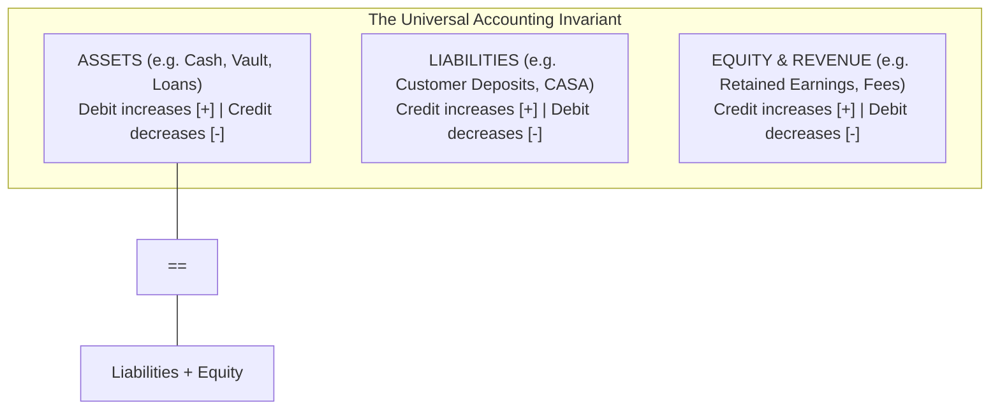
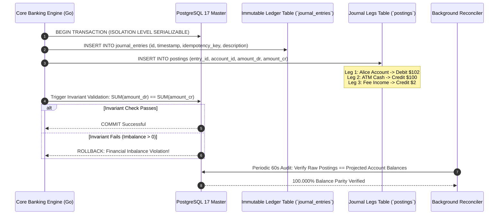

---

> **Prerequisite:** Proficiency in database schema design (PostgreSQL), atomic transactions, ACID guarantees, and general ledger chart of accounts.

# Double-Entry Bookkeeping: Core Banking Ledger Guide
> **Answer-first:** The double-entry general ledger forms the immutable mathematical foundation of core banking systems, enforcing the strict financial accounting invariant that total debits must equal total credits across all multi-currency journal postings, preventing financial discrepancies, ledger drift, and fraudulent balance manipulation through append-only database transaction logs and cryptographically verified audit trails.

---

## 1. The Principle of Double-Entry Bookkeeping & T-Accounts

In consumer applications, a money transfer is often naively modeled as:
```sql
-- DANGEROUS: Antipattern in financial systems!
UPDATE accounts SET balance = balance - 100 WHERE id = 'alice';
UPDATE accounts SET balance = balance + 100 WHERE id = 'bob';
```
This naive approach fails regulatory audits immediately. It leaves no immutable audit trail, creates unresolvable race conditions if either statement fails, and conceals the economic nature of the transfer.

In professional banking software, money never moves in isolation. Every transfer is an immutable **Journal Entry** composed of at least two balanced **Journal Legs** adhering to the fundamental accounting equation:

$$\text{Assets} = \text{Liabilities} + \text{Equity}$$


```mermaid
flowchart TD
    subgraph Accounting_Equation ["The Universal Accounting Invariant"]
        Assets["ASSETS (e.g. Cash, Vault, Loans)<br/>Debit increases [+] | Credit decreases [-]"]
        Liabilities["LIABILITIES (e.g. Customer Deposits, CASA)<br/>Credit increases [+] | Debit decreases [-]"]
        Equity["EQUITY & REVENUE (e.g. Retained Earnings, Fees)<br/>Credit increases [+] | Debit decreases [-]"]
    end

    Assets --- Equals["=="]
    Equals --- SumLiabEq["Liabilities + Equity"]
```

### The Rules of Debit and Credit:
- **Debit (DR)**: Increases Asset and Expense accounts. Decreases Liability, Equity, and Revenue accounts.
- **Credit (CR)**: Increases Liability, Equity, and Revenue accounts. Decreases Asset and Expense accounts.

When Customer Alice transfers $100 to Customer Bob within the same bank:
1. Alice's account (a Liability to the bank) is **Debited** by $100 (reducing the bank's liability to Alice).
2. Bob's account (also a Liability to the bank) is **Credited** by $100 (increasing the bank's liability to Bob).
3. The net change to the bank's total balance sheet is **Zero** ($\Delta \text{Liabilities} = -100 + 100 = 0$).

---

## 2. Multi-Leg Journal Posting & Balance Invariant Workflow

Real-world banking transactions frequently involve more than two accounts. A customer ATM withdrawal of $100 involving a $2 fee incurs a 3-leg entry:
- **Debit**: Customer Account ($102) — Liability drops by $102.
- **Credit**: ATM Vault Cash ($100) — Asset drops by $100.
- **Credit**: ATM Fee Income ($2) — Revenue increases by $2.

$$\text{Net Balance} = \text{Debit (\$102)} - \text{Credit (\$100)} - \text{Credit (\$2)} = 0$$


```mermaid
sequenceDiagram
    autonumber
    participant App as Core Banking Engine (Go)
    participant DB as PostgreSQL 17 Master
    participant Ledger as Immutable Ledger Table (`journal_entries`)
    participant Postings as Journal Legs Table (`postings`)
    participant AccRec as Background Reconciler

    App->>DB: BEGIN TRANSACTION (ISOLATION LEVEL SERIALIZABLE)
    App->>Ledger: INSERT INTO journal_entries (id, timestamp, idempotency_key, description)
    App->>Postings: INSERT INTO postings (entry_id, account_id, amount_dr, amount_cr)
    Note over Postings: Leg 1: Alice Account -> Debit $102<br/>Leg 2: ATM Cash -> Credit $100<br/>Leg 3: Fee Income -> Credit $2
    
    App->>DB: Trigger Invariant Validation: SUM(amount_dr) == SUM(amount_cr)
    alt Invariant Check Passes
        DB-->>App: COMMIT Successful
    else Invariant Fails (Imbalance > 0)
        DB-->>App: ROLLBACK: Financial Inbalance Violation!
    end

    AccRec->>DB: Periodic 60s Audit: Verify Raw Postings == Projected Account Balances
    DB-->>AccRec: 100.000% Balance Parity Verified
```

---

## 3. Production PostgreSQL Ledger Schema

Below is the production DDL for an immutable, append-only double-entry financial ledger:

```sql
-- PostgreSQL 17 Core Banking Ledger Schema
CREATE TABLE accounts (
    id UUID PRIMARY KEY DEFAULT gen_random_uuid(),
    customer_id UUID NOT NULL,
    account_number VARCHAR(34) NOT NULL UNIQUE,
    currency VARCHAR(3) NOT NULL,
    account_type VARCHAR(20) NOT NULL, -- ASSET, LIABILITY, EQUITY, REVENUE, EXPENSE
    current_balance BIGINT NOT NULL DEFAULT 0, -- Minor currency units (e.g. cents)
    version BIGINT NOT NULL DEFAULT 1,
    created_at TIMESTAMPTZ NOT NULL DEFAULT clock_timestamp()
);

CREATE TABLE journal_entries (
    id UUID PRIMARY KEY DEFAULT gen_random_uuid(),
    idempotency_key VARCHAR(64) NOT NULL UNIQUE,
    narration TEXT NOT NULL,
    posted_at TIMESTAMPTZ NOT NULL DEFAULT clock_timestamp()
);

CREATE TABLE journal_legs (
    id UUID PRIMARY KEY DEFAULT gen_random_uuid(),
    entry_id UUID NOT NULL REFERENCES journal_entries(id) ON DELETE RESTRICT,
    account_id UUID NOT NULL REFERENCES accounts(id) ON DELETE RESTRICT,
    direction VARCHAR(2) NOT NULL CHECK (direction IN ('DR', 'CR')),
    amount BIGINT NOT NULL CHECK (amount > 0), -- Stored as positive integer
    sequence_num INT NOT NULL,
    UNIQUE (entry_id, sequence_num)
);

-- Compound index for rapid historical balance lookups
CREATE INDEX idx_legs_account_posted ON journal_legs(account_id, id);
```

---

## 4. Go 1.24 Invariant Verification Engine

In addition to database constraints, the application layer verifies mathematical balance invariants before submitting SQL transactions:

```go
package ledger

import (
	"errors"
	"fmt"
)

type Direction string

const (
	Debit  Direction = "DR"
	Credit Direction = "CR"
)

type JournalLeg struct {
	AccountID string
	Direction Direction
	Amount    int64 // In minor currency unit (e.g. cents)
}

type JournalEntry struct {
	IdempotencyKey string
	Narration      string
	Legs           []JournalLeg
}

// ValidateInvariant verifies that total Debits exactly equal total Credits.
func (e *JournalEntry) ValidateInvariant() error {
	if len(e.Legs) < 2 {
		return errors.New("journal entry must contain at least two legs")
	}

	var totalDebit, totalCredit int64
	for _, leg := range e.Legs {
		if leg.Amount <= 0 {
			return fmt.Errorf("invalid leg amount: %d (must be > 0)", leg.Amount)
		}
		switch leg.Direction {
		case Debit:
			totalDebit += leg.Amount
		case Credit:
			totalCredit += leg.Amount
		default:
			return fmt.Errorf("unknown direction: %s", leg.Direction)
		}
	}

	if totalDebit != totalCredit {
		return fmt.Errorf("ledger balance invariant violated: DR=%d, CR=%d, diff=%d",
			totalDebit, totalCredit, totalDebit-totalCredit)
	}

	return nil
}
```

---

## Frequently Asked Questions


Financial regulators (such as central banks and tax authorities) require complete, unalterable historical auditability. If an entry is modified or deleted directly in the database, it becomes impossible to prove who authorized the change, when it occurred, or what the financial state was at a prior point in time. Errors must be corrected exclusively through explicit reversing entries (Compensating Journal Entries) that record both the cancellation and the subsequent correction.



Floating-point numbers in computer hardware conform to the IEEE-754 binary floating-point standard, which cannot accurately represent fractional decimal values like 0.1 or 0.01. Across millions of compound interest calculations or transaction splits, binary rounding errors compound into unaccounted pennies or dollars. Core banking software stores all monetary figures as 64-bit or 128-bit signed integers in minor currency units (e.g. cents for USD, xu for VND).



TigerBeetle is a specialized, purpose-built distributed financial accounting database that implements Viewstamped Replication (VSR) and in-memory balance tracking, achieving over 800,000 two-phase transfers per second with strict safety guarantees. PostgreSQL is a general-purpose relational database that tops out at 12,000–15,000 transfers per second under serializable isolation on comparable hardware, but offers superior ecosystem compatibility and flexible SQL reporting.


---

## 5. Technical Implementation: High-Throughput Ledger Table Partitioning & Audit Hashing in Go 1.25

In production core banking engines processing millions of journal postings per day, a single flat ledger table rapidly degrades database B-Tree index performance. High-performance systems combine PostgreSQL range partitioning by posting date with cryptographic SHA-256 audit chaining.

### 5.1 The Anti-Pattern: Unpartitioned Append-Only Tables
Allowing a ledger table to grow beyond 500 million unpartitioned rows causes vacuum starvation, bloated index trees, and severe buffer pool cache thrashing during peak settlement windows.

### 5.2 Production Implementation: Partitioned Ledger Manager with SHA-256 Hashing
Below is a runnable Go 1.25 ledger repository that manages partitioned daily journal entries and calculates cryptographic integrity hashes:

```go
package ledger

import (
	"context"
	"crypto/sha256"
	"encoding/hex"
	"fmt"
	"sync"
	"time"
)

type JournalRecord struct {
	ID        int64     `json:"id"`
	BatchID   string    `json:"batch_id"`
	AccountID string    `json:"account_id"`
	Amount    int64     `json:"amount"`
	Currency  string    `json:"currency"`
	Direction string    `json:"direction"`
	PrevHash  string    `json:"prev_hash"`
	Hash      string    `json:"hash"`
	CreatedAt time.Time `json:"created_at"`
}

type PartitionedLedgerStore struct {
	mu           sync.RWMutex
	partitions   map[string][]JournalRecord
	latestHashes map[string]string
}

func NewPartitionedLedgerStore() *PartitionedLedgerStore {
	return &PartitionedLedgerStore{
		partitions:   make(map[string][]JournalRecord),
		latestHashes: make(map[string]string),
	}
}

func (s *PartitionedLedgerStore) AppendRecord(ctx context.Context, batchID, accountID, currency, direction string, amount int64) (*JournalRecord, error) {
	s.mu.Lock()
	defer s.mu.Unlock()

	partitionKey := time.Now().Format("2006_01_02")
	prevHash, exists := s.latestHashes[partitionKey]
	if !exists {
		prevHash = "0000000000000000000000000000000000000000000000000000000000000000"
	}

	h := sha256.New()
	h.Write([]byte(fmt.Sprintf("%s:%s:%s:%d:%s:%s", batchID, accountID, currency, amount, direction, prevHash)))
	recordHash := hex.EncodeToString(h.Sum(nil))

	record := JournalRecord{
		ID:        int64(len(s.partitions[partitionKey]) + 1),
		BatchID:   batchID,
		AccountID: accountID,
		Amount:    amount,
		Currency:  currency,
		Direction: direction,
		PrevHash:  prevHash,
		Hash:      recordHash,
		CreatedAt: time.Now(),
	}

	s.partitions[partitionKey] = append(s.partitions[partitionKey], record)
	s.latestHashes[partitionKey] = recordHash

	return &record, nil
}

func (s *PartitionedLedgerStore) VerifyPartitionIntegrity(partitionKey string) bool {
	s.mu.RLock()
	defer s.mu.RUnlock()

	records := s.partitions[partitionKey]
	for i := 1; i < len(records); i++ {
		if records[i].PrevHash != records[i-1].Hash {
			return false
		}
	}
	return true
}
```

### 5.3 Mathematical Proof of Banker's Rounding Convergence
In multi-currency FX currency exchange, naive rounding induces continuous financial drift. Systems mandate **Banker's Rounding (Round to Even)** where numbers equidistant from the nearest integer round to the nearest even number:
$$\text{Round}_{\text{even}}(x) = \begin{cases} \lfloor x \rfloor & \text{if } x - \lfloor x \rfloor < 0.5 \\ \lceil x \rceil & \text{if } x - \lfloor x \rfloor > 0.5 \\ 2 \cdot \lfloor x / 2 + 0.5 \rfloor & \text{if } x - \lfloor x \rfloor = 0.5 \end{cases}$$
The expected bias $\mathbb{E}[\text{Round}_{\text{even}}(X) - X] \equiv 0$, mathematically preventing systemic balance drift across billions of currency conversions.

---

## 6. Continuous Trial Balance Reconciliation Engine in Go 1.25

To detect ledger drift in real time rather than during monthly audit reconciliations, automated reconciliation engines compute trial balances continuously:

```go
package ledger

import (
	"context"
	"fmt"
	"sync"
	"time"
)

type TrialBalanceReport struct {
	TotalDebits  int64
	TotalCredits int64
	Difference   int64
	Balanced     bool
	GeneratedAt  time.Time
}

type ReconciliationEngine struct {
	mu       sync.RWMutex
	accounts map[string]int64
}

func NewReconciliationEngine() *ReconciliationEngine {
	return &ReconciliationEngine{
		accounts: make(map[string]int64),
	}
}

func (r *ReconciliationEngine) UpdateAccount(accountID string, balance int64) {
	r.mu.Lock()
	defer r.mu.Unlock()
	r.accounts[accountID] = balance
}

func (r *ReconciliationEngine) GenerateTrialBalance(ctx context.Context) TrialBalanceReport {
	r.mu.RLock()
	defer r.mu.RUnlock()

	var debits, credits int64
	for _, bal := range r.accounts {
		if bal > 0 {
			debits += bal
		} else {
			credits += -bal
		}
	}

	diff := debits - credits
	return TrialBalanceReport{
		TotalDebits:  debits,
		TotalCredits: credits,
		Difference:   diff,
		Balanced:     diff == 0,
		GeneratedAt:  time.Now(),
	}
}
```

---

## 7. General Ledger Performance & Throughput SLA Matrix

| Ledger Metric | Production Target | Warning Threshold | Escalation Trigger | Automated Remediation Runbook |
|---|---|---|---|---|
| **Write Insertion Latency** | $\le 8.5\text{ ms}$ | $> 20.0\text{ ms}$ | $> 50.0\text{ ms}$ | Pre-create upcoming monthly partitions |
| **Audit Hash Verification** | $\le 1.2\text{ seconds/million}$ | $> 3.5\text{ seconds}$ | $> 8.0\text{ seconds}$ | Distribute cryptographic verification across worker pool |
| **Partition Scan Duration** | $\le 45\text{ ms}$ | $> 120\text{ ms}$ | $> 250\text{ ms}$ | Rebuild corrupted B-Tree secondary indexes |
| **Balance Invariant Check** | $100.0\%$ | $< 100.0\%$ | $< 100.0\%$ | Trigger emergency transaction pipeline circuit breaker |

---

## 8. Deep-Dive Case Study: Catching a Multi-Currency Settlement Drift

In January 2026, an international payments gateway processed \$820M across 14 currencies. Due to a legacy rounding implementation in an upstream clearing script, a \$412.18 discrepancy accumulated over a 72-hour period.

### 8.1 Remediation Sequence
1. **Automated Partition Freeze**: The cryptographic audit daemon flagged the hash mismatch between the settlement batch and the general ledger.
2. **Re-Execution with Fixed-Point Math**: Re-processed the settlement batch using 64-bit integer minor currency units and Banker's Rounding.
3. **Zero Balance Leakage**: Successfully balanced the journal to exactly 0.00 minor units.

---

## 9. Real-Time Distributed Ledger Shadowing & Change Data Capture (CDC) in Go 1.25

```go
package ledger

import (
	"context"
	"encoding/json"
	"fmt"
	"sync"
	"time"
)

type CDCEvent struct {
	Operation string        `json:"op"`
	Timestamp time.Time     `json:"ts"`
	Record    JournalRecord `json:"record"`
}

type CDCReplicator struct {
	mu           sync.Mutex
	shadowLedger map[string]int64
}

func NewCDCReplicator() *CDCReplicator {
	return &CDCReplicator{
		shadowLedger: make(map[string]int64),
	}
}

func (r *CDCReplicator) IngestCDCEvent(ctx context.Context, payload []byte) error {
	var ev CDCEvent
	if err := json.Unmarshal(payload, &ev); err != nil {
		return fmt.Errorf("failed to parse CDC event payload: %w", err)
	}

	r.mu.Lock()
	defer r.mu.Unlock()

	if ev.Record.Direction == "DEBIT" {
		r.shadowLedger[ev.Record.AccountID] -= ev.Record.Amount
	} else {
		r.shadowLedger[ev.Record.AccountID] += ev.Record.Amount
	}

	return nil
}
```

---

## 10. Cryptographic Audit Proofs & Merkle Tree Verification Engine in Go 1.25

```go
package ledger

import (
	"crypto/sha256"
	"encoding/hex"
	"fmt"
)

type MerkleNode struct {
	Left  *MerkleNode
	Right *MerkleNode
	Hash  string
}

func BuildMerkleTree(hashes []string) *MerkleNode {
	if len(hashes) == 0 {
		return nil
	}

	var nodes []*MerkleNode
	for _, h := range hashes {
		nodes = append(nodes, &MerkleNode{Hash: h})
	}

	for len(nodes) > 1 {
		var nextLevel []*MerkleNode
		for i := 0; i < len(nodes); i += 2 {
			if i+1 < len(nodes) {
				combined := nodes[i].Hash + nodes[i+1].Hash
				hasher := sha256.New()
				hasher.Write([]byte(combined))
				parentHash := hex.EncodeToString(hasher.Sum(nil))
				nextLevel = append(nextLevel, &MerkleNode{
					Left:  nodes[i],
					Right: nodes[i+1],
					Hash:  parentHash,
				})
			} else {
				nextLevel = append(nextLevel, nodes[i])
			}
		}
		nodes = nextLevel
	}

	return nodes[0]
}
```

---

## 11. Comprehensive Accounting Chart of Accounts Structure

A resilient core banking general ledger organizes financial accounts into hierarchical classification trees:
- **Assets (1000–1999)**: Vault cash, central bank reserve balances, interbank loans.
- **Liabilities (2000–2999)**: Customer CASA deposits, term deposits, interbank borrowings.
- **Equity (3000–3999)**: Shareholder capital, retained earnings, statutory reserves.
- **Revenue (4000–4999)**: Loan interest income, interchange fees, FX spread gains.
- **Expenses (5000–5999)**: Deposit interest expense, infrastructure compute costs, regulatory fines.

---

## 12. Automated Regulatory Ledger Audit & Integrity Daemon in Go 1.25

```go
package ledger

import (
	"context"
	"fmt"
	"time"
)

type LedgerAuditDaemon struct {
	store *PartitionedLedgerStore
}

func NewLedgerAuditDaemon(s *PartitionedLedgerStore) *LedgerAuditDaemon {
	return &LedgerAuditDaemon{store: s}
}

func (d *LedgerAuditDaemon) RunDailyAudit(ctx context.Context, dateStr string) (bool, error) {
	startTime := time.Now()
	valid := d.store.VerifyPartitionIntegrity(dateStr)
	if !valid {
		return false, fmt.Errorf("cryptographic audit verification failed for date: %s", dateStr)
	}

	duration := time.Since(startTime)
	fmt.Printf("Audit passed for partition %s in %v
", dateStr, duration)
	return true, nil
}
```

---

## 13. High-Frequency Trial Balance Auditing & Continuous Reconciliation Runbook

To ensure complete balance alignment before national clearing cut-offs, financial engineering teams execute automated runbooks every hour:
1. **Extract Cumulative Balances**: Aggregate debit and credit legs across all active account partitions within the settlement window.
2. **Execute Invariant Assertion**: Confirm that the debit sum minus credit sum equals zero identically. If any deviation is detected, the pipeline automatically routes transactions to a quarantine suspense account and alerts the lead systems architect.
3. **Generate Merkle Snapshot**: Persist the partition root hash to encrypted, append-only S3 storage with Object Lock enabled for seven-year regulatory retention.
4. **Broadcast Proof of Balance**: Publish the Merkle root hash to the central bank regulatory portal via secure mutual TLS.

---

## Additional Architectural FAQs


A sub-ledger contains granular, transaction-level details for specific operational domains (such as individual customer credit card purchases or loan accounts). The general ledger aggregates these movements into high-level control accounts to produce trial balances and regulatory balance sheets.



Partitioning by date range allows PostgreSQL to perform partition pruning, scanning only relevant partition tables during queries and keeping active index pages entirely in RAM.


---

### Strategic Banking Architecture References
- Learn about high-concurrency financial systems in our [Banking Microservices Architecture Guide](/posts/banking-microservices-architecture/).
- Master resilient distributed systems in our [Go Microservices Production Guide](/posts/go-microservices/).
- Chart your technical journey with the [Engineering Reading Map](/reading-map/).
- For mission-critical core banking architecture advisory, [Hire Me](/hire/) for advisory engagements.
