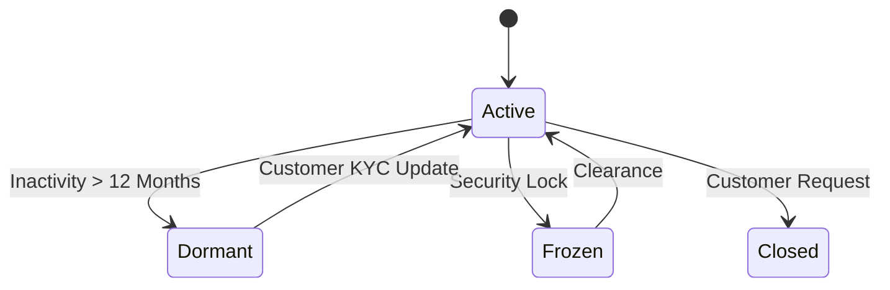

## Overview of the Three Core Modules

Most Core Banking systems are organized around these three business domains. Understanding them helps you read customer (bank) specifications and translate them into accurate system designs.

---

## Module 1: CIF — Customer Information File

The **CIF** is the foundation of customer identity across the entire system. Every customer — whether individual or corporate — has a unique CIF number. All other products (accounts, loans, cards) are linked to this CIF.

### Why is CIF important?

Without a well-designed CIF, your **"Customer 360"** view falls apart — the bank won't realize that the person opening a savings account and the person applying for a loan are the same individual, making accurate credit scoring impossible.

### Basic CIF Database Design

```sql
CREATE TABLE customers (
    cif_number      VARCHAR(20)  PRIMARY KEY,   -- Unique CIF ID
    customer_type   VARCHAR(10)  NOT NULL,       -- 'INDIVIDUAL' or 'CORPORATE'
    full_name       VARCHAR(255) NOT NULL,
    id_number       VARCHAR(20)  UNIQUE NOT NULL, -- National ID / Passport / Tax Code
    id_type         VARCHAR(20)  NOT NULL,        -- 'NATIONAL_ID', 'PASSPORT', 'TAX_CODE'
    date_of_birth   DATE,
    nationality     CHAR(3),                     -- ISO 3166 country code
    kyc_status      VARCHAR(20)  NOT NULL DEFAULT 'PENDING',
    -- 'PENDING', 'VERIFIED', 'REJECTED', 'EXPIRED'
    risk_rating     VARCHAR(10),                 -- 'LOW', 'MEDIUM', 'HIGH'
    created_at      TIMESTAMPTZ NOT NULL DEFAULT NOW(),
    updated_at      TIMESTAMPTZ NOT NULL DEFAULT NOW()
);
```

### eKYC & AML Integration

CIF cannot operate in isolation — it must integrate with:
- **eKYC System:** Electronic Know Your Customer for identity verification.
- **AML (Anti-Money Laundering):** Screening against blacklists and detecting suspicious patterns.
- **Credit Bureaus:** Checking credit history before issuing loans.

---

## Module 2: CASA — Current Account & Savings Account

**CASA** is where customer money is stored. This module generates the **cheapest source of funding** for the bank because checking account interest rates are exceedingly low.

### Account Classifications

| Type | Characteristics | Typical Interest Rate |
|---|---|---|
| **Current Account** (Checking) | Unlimited deposits/withdrawals, no term | 0.1% - 0.5% / year |
| **Savings Account - Demand** | Free withdrawals, daily interest | 0.5% - 1% / year |
| **Savings Account - Term** (CDs) | Locked for a term (1,3,6,12 months) | 5% - 8% / year |

### Database Design for CASA

```sql
CREATE TABLE accounts (
    account_number  VARCHAR(20)  PRIMARY KEY,
    cif_number      VARCHAR(20)  NOT NULL REFERENCES customers(cif_number),
    account_type    VARCHAR(30)  NOT NULL,
    -- 'CURRENT', 'SAVINGS_DEMAND', 'SAVINGS_TERM'
    currency        CHAR(3)      NOT NULL DEFAULT 'VND',
    status          VARCHAR(20)  NOT NULL DEFAULT 'ACTIVE',
    -- 'ACTIVE', 'DORMANT', 'BLOCKED', 'CLOSED'
    current_balance BIGINT       NOT NULL DEFAULT 0,  -- Actual balance
    available_balance BIGINT     NOT NULL DEFAULT 0,  -- Balance minus holds
    interest_rate   DECIMAL(6,4),                     -- Annual interest rate
    maturity_date   DATE,                             -- End date for term savings
    opened_at       TIMESTAMPTZ  NOT NULL DEFAULT NOW()
);
```

### Critical Business Rule: Available Balance vs. Current Balance

This is where many developers get confused:

```
current_balance   = Total actual money in the account
available_balance = current_balance - hold_amount

Holds (freezes) occur when:
  - A customer uses a card to book a hotel (authorized but not settled)
  - The account is frozen by a court order
  - A deposit is held for a pending transaction
```

When a customer withdraws money, the system **must only allow withdrawals from `available_balance`**, not `current_balance`.

### Daily Interest Accrual

This is one of the most critical batch processes run every night (EOD - End of Day):

```
Daily Accrued Interest = (End of Day Balance × Interest Rate / 365)

Example:
  - Balance: 100,000,000 VND
  - Interest Rate: 5.5% / year
  - 1 Day Interest = 100,000,000 × 0.055 / 365 = 15,068 VND / day
```

---

## Module 3: Lending — Credit Operations

Lending is the module that generates the **primary revenue** for the bank. It is also the most mathematically complex.

### Loan Lifecycle

```
[Origination] → [Underwriting] → [Approval] → [Disbursement] 
      → [Servicing (Periodic Repayment)] → [Closure]
```

### Mandatory Concepts to Understand

| Term | Meaning |
|---|---|
| **Principal** | The original amount borrowed that is still unpaid |
| **Outstanding Balance** | Total debt = Principal + Accrued Interest |
| **EMI** | Equated Monthly Installment (fixed payment covering principal + interest) |
| **Amortization Schedule** | The schedule detailing each periodic repayment |
| **NPA** | Non-Performing Asset — a bad debt (overdue > 90 days) |
| **Provisioning** | Setting aside funds to cover anticipated credit losses |

### Calculating EMI (Equated Monthly Installment)

```
EMI = P × r × (1 + r)^n / ((1 + r)^n - 1)

Where:
  P = Principal (initial loan amount)
  r = Periodic interest rate (e.g., 12%/year → r = 1%/month = 0.01)
  n = Total number of payments (months)

Example: Borrowing 500,000,000 VND, 12%/year, 60 months
  r = 0.01, n = 60
  EMI = 500,000,000 × 0.01 × (1.01)^60 / ((1.01)^60 - 1)
      ≈ 11,122,222 VND / month
```

### Debt Classification — Regulatory Requirements

| Group | Status | Provisioning Requirement |
|---|---|---|
| Group 1 | Standard (< 10 days overdue) | 0% |
| Group 2 | Special Mention (10 - 90 days) | 5% |
| Group 3 | Substandard (90 - 180 days) | 20% |
| Group 4 | Doubtful (180 - 360 days) | 50% |
| Group 5 | Loss (> 360 days) | 100% |

This is a legal requirement — the Core Banking system must automatically classify and provision for these groups during the daily EOD process.

## Summary of Module Relationships

```
Customer (CIF) ├───┬─── 1:N ───┬───┤ Accounts (CASA)
Customer (CIF) ├───┬─── 1:N ───┬───┤ Loans (Lending)
Accounts       ├───┬─── 1:N ───┬───┤ Ledger Entries
Loans          ├───┬─── 1:N ───┬───┤ Ledger Entries
```

> *Now you understand the business domains. Next, we will dive deep into the technical implementation to ensure data accuracy in extremely high-concurrency environments. Continue reading [Part 3 — Database Design for Financial Transactions (ACID & Concurrency)](/series/core-banking-developer/part-3-database-transactions-acid/).*

> **Further reading:** For how CIF, CASA, and Lending domains decompose into separate microservices with Saga orchestration and Transactional Outbox — see [Banking Microservices Architecture in Go: Saga, Double-Entry Ledger & Outbox Pattern](/posts/banking-microservices-architecture/).

## CASA Account Creation and Lifecycle in Go

CASA accounts transition through multiple states to enforce operational controls. The following Go code maps the CASA account state machine and validates transactions against account status parameters:

```go
package main

import (
	"errors"
	"fmt"
)

type AccountStatus string

const (
	Active   AccountStatus = "ACTIVE"
	Dormant  AccountStatus = "DORMANT"
	Frozen   AccountStatus = "FROZEN"
	Closed   AccountStatus = "CLOSED"
)

type CASAAccount struct {
	AccountNumber string
	Balance       int64
	Status        AccountStatus
}

func (a *CASAAccount) ProcessTransaction(amount int64, txType string) error {
	if a.Status == Frozen {
		return errors.New("transaction blocked: account is frozen")
	}
	if a.Status == Closed {
		return errors.New("transaction blocked: account is closed")
	}
	if txType == "WITHDRAWAL" && a.Balance < amount {
		return errors.New("transaction blocked: insufficient funds")
	}

	if txType == "WITHDRAWAL" {
		a.Balance -= amount
	} else {
		a.Balance += amount
	}

	return nil
}

func main() {
	acc := CASAAccount{AccountNumber: "110022", Balance: 50000, Status: Frozen}
	err := acc.ProcessTransaction(10000, "WITHDRAWAL")
	fmt.Println("Transaction result:", err)
}
```



## Interest Calculation Mathematical Model

Interest computations typically follow strict mathematical standards. For example, daily interest accrual is defined as:
$$	ext{Accrual} = 	ext{Balance} 	imes \left( rac{	ext{Interest Rate}}{	ext{Day Count Convention}} 
ight)$$
where the Day Count Convention is set to 365 or 360 depending on local central bank regulations.

## Interest Accrual Engine in Go

The Interest Engine processes daily calculations across all active savings accounts, writing accrual nodes to the database:

```go
package main

import (
	"fmt"
	"time"
)

type AccrualJob struct {
	AccountNo    string
	DailyRate    float64
	AccruedToday float64
}

func CalculateAccrual(balance int64, annualRate float64) float64 {
	dailyRate := annualRate / 365.0
	return float64(balance) * dailyRate
}

func main() {
	balance := int64(250000000) // 250M VND
	annualRate := 0.055         // 5.5%
	accrued := CalculateAccrual(balance, annualRate)
	fmt.Printf("Daily interest accrued: %.2f VND\n", accrued)
}
```

## Reactivation Protocol for Dormant Accounts

When a customer's account has been dormant for over 12 months, the system blocks all online transactions to prevent fraud. Reactivating the account follows a strict compliance protocol:
1. **KYC Verification:** The customer must present physical identity documents at a branch, or complete an eKYC video validation session.
2. **BOD Activation:** A Maker submits a reactivation request, which must be approved by a compliance Checker (Maker-Checker segregation).
3. **Ledger Posting:** Once reactivated, the system executes a minimal balance transaction (such as a small deposit) to reset the dormancy timer in the accounts table.

To ensure complete system reliability, the engineering team establishes regular performance benchmarks under simulated transaction loads. The metrics focus on transactional throughput, lock contention rates, and memory allocation efficiency under garbage collection stress in Go runtimes. We monitor latency profiles closely to identify bottleneck indicators under concurrent traffic.

Database connections are managed via a centralized connection pool to prevent TCP port exhaustion during peak loads. The pool configuration dynamically scales between minimum idle connections and maximum active limits based on queue metrics. This prevents deadlock loops and connection starvation under concurrent requests.

System auditing checks execute asynchronously to avoid blocking the primary transaction path. The metrics are dispatched to the monitoring cluster using decoupled buffered channels, ensuring that logger latency does not bleed into customer API responses. The tracing collector captures intermediate spans and aggregates metrics.

Error handling policies follow standardized bank error codes, mapping database constraints to explicit, human-readable API responses while hiding internal database stack traces to prevent security exposure. The boundary middleware sanitizes outbound error messages.

Automated regression tests run continuously in the deployment pipeline. Every change to the ledger engine triggers thousands of simulated transaction loops to verify that no balance discrepancies can be introduced under race conditions. This rigorous validation ensures high reliability of the double-entry accounting layer.

Cryptographic operations are offloaded to hardware security modules (HSMs) or specialized CPU instructions to minimize CPU utilization during TLS handshakes and payload encryption steps. This ensures high throughput for payment SWITCH APIs.

All configurations (interest rates, overdraft limits, transaction fees) are versioned and stored in the database, allowing dynamic system updates without requiring service redeployment or downtime. This flexibility reduces production operational overhead.
