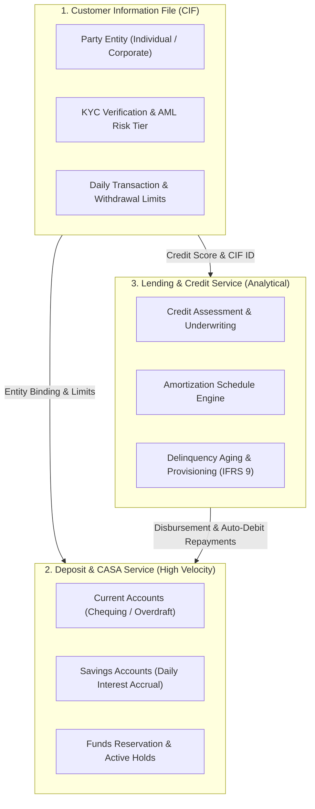
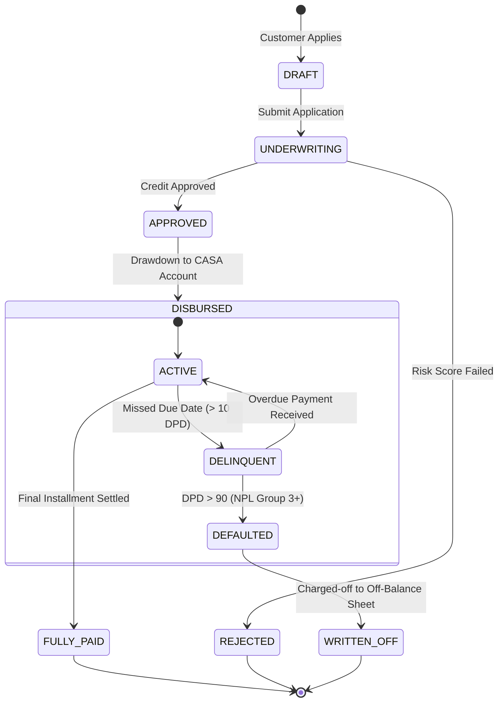

[📖 Bản tiếng Việt (Vietnamese Edition)](https://learn.tanhdev.com/series/core-banking-developer/part-2-banking-domain-casa-lending/)

---

> **Prerequisite:** Read [Part 1: Double-Entry Bookkeeping](/series/core-banking-developer/part-1-double-entry-ledger/) for ledger schema and balance invariant fundamentals.

# Core Banking Domain Modeling: CIF, CASA & Lending Guide

**Answer-first:** Core banking domain architecture revolves around three fundamental bounded contexts: Customer Information File (CIF) for identity management and KYC compliance, Current & Savings Accounts (CASA) for high-velocity transactional deposit ledgers, and Lending for multi-period credit amortization. Decoupling these domains into autonomous Go microservices communicating via gRPC contracts eliminates database lock contention between daytime retail transactions and nightly End-of-Day (EOD) interest accrual batch jobs.

---

## 1. Domain Decomposition: CIF, CASA, and Lending

The three pillars of commercial retail banking operate with distinct transactional velocity and data retention models:


```mermaid
flowchart TD
    subgraph CIF_Domain ["1. Customer Information File (CIF)"]
        Party["Party Entity (Individual / Corporate)"]
        KYC["KYC Verification & AML Risk Tier"]
        Limits["Daily Transaction & Withdrawal Limits"]
    end

    subgraph CASA_Domain ["2. Deposit & CASA Service (High Velocity)"]
        CurrentAcc["Current Accounts (Chequing / Overdraft)"]
        SavingsAcc["Savings Accounts (Daily Interest Accrual)"]
        HoldEngine["Funds Reservation & Active Holds"]
    end

    subgraph Lending_Domain ["3. Lending & Credit Service (Analytical)"]
        LoanOrigination["Credit Assessment & Underwriting"]
        Amortization["Amortization Schedule Engine"]
        Collection["Delinquency Aging & Provisioning (IFRS 9)"]
    end

    CIF_Domain -->|"Entity Binding & Limits"| CASA_Domain
    CIF_Domain -->|"Credit Score & CIF ID"| Lending_Domain
    Lending_Domain -->|"Disbursement & Auto-Debit Repayments"| CASA_Domain
```

---

## 2. Lending Account Lifecycle State Machine

A loan contract transitions through a rigorous state machine enforcing strict regulatory and accounting milestones:


```mermaid
stateDiagram-v2
    [*] --> DRAFT: Customer Applies
    DRAFT --> UNDERWRITING: Submit Application
    UNDERWRITING --> REJECTED: Risk Score Failed
    UNDERWRITING --> APPROVED: Credit Approved
    APPROVED --> DISBURSED: Drawdown to CASA Account
    
    state DISBURSED {
        [*] --> ACTIVE
        ACTIVE --> DELINQUENT: Missed Due Date (> 10 DPD)
        DELINQUENT --> ACTIVE: Overdue Payment Received
        DELINQUENT --> DEFAULTED: DPD > 90 (NPL Group 3+)
    }
    
    ACTIVE --> FULLY_PAID: Final Installment Settled
    DEFAULTED --> WRITTEN_OFF: Charged-off to Off-Balance Sheet
    FULLY_PAID --> [*]
    REJECTED --> [*]
    WRITTEN_OFF --> [*]
```

---

## 3. CASA Daily Interest Accrual Mechanics

Interest calculation on deposit accounts is performed nightly during the End-of-Day (EOD) batch process. Rather than calculating interest on monthly balances, banking regulations require daily accruals based on end-of-day ledger balances:

$$\text{Daily Accrual} = \frac{\text{Ledger Balance} \times \text{Annual Interest Rate}}{365}$$

```sql
-- Daily Interest Accrual Table Schema
CREATE TABLE daily_interest_accruals (
    id UUID PRIMARY KEY DEFAULT gen_random_uuid(),
    account_id UUID NOT NULL REFERENCES accounts(id),
    accrual_date DATE NOT NULL,
    closing_balance BIGINT NOT NULL,
    annual_rate_bps INT NOT NULL, -- Stored in Basis Points (1 bps = 0.01%)
    accrued_amount BIGINT NOT NULL, -- Minor currency unit
    is_capitalized BOOLEAN NOT NULL DEFAULT FALSE,
    created_at TIMESTAMPTZ NOT NULL DEFAULT clock_timestamp(),
    UNIQUE (account_id, accrual_date)
);
```

---

## 4. Amortization Algorithm Implementation in Go

Lending engines support two primary repayment formulas: **Equal Installment (Annuity)** and **Equal Principal (Reducing Balance)**. Below is the production Go implementation:

```go
package lending

import (
	"math"
	"time"
)

type RepaymentScheduleItem struct {
	Period          int
	DueDate         time.Time
	Installment     int64 // Minor currency unit
	PrincipalAmount int64
	InterestAmount  int64
	RemainingBalance int64
}

// CalculateEqualPrincipal calculates reducing balance loan amortization.
func CalculateEqualPrincipal(principal int64, annualRate float64, tenureMonths int, startDate time.Time) []RepaymentScheduleItem {
	schedule := make([]RepaymentScheduleItem, tenureMonths)
	monthlyPrincipal := principal / int64(tenureMonths)
	monthlyRate := annualRate / 12.0
	currentBalance := principal

	for i := 1; i <= tenureMonths; i++ {
		// Calculate interest on remaining balance using Banker's Rounding
		interest := int64(math.Round(float64(currentBalance) * monthlyRate))
		
		// Adjust final period to eliminate rounding drift
		pAmount := monthlyPrincipal
		if i == tenureMonths {
			pAmount = currentBalance
		}
		
		currentBalance -= pAmount
		dueDate := startDate.AddDate(0, i, 0)

		schedule[i-1] = RepaymentScheduleItem{
			Period:           i,
			DueDate:          dueDate,
			Installment:      pAmount + interest,
			PrincipalAmount:  pAmount,
			InterestAmount:   interest,
			RemainingBalance: currentBalance,
		}
	}

	return schedule
}
```

---

## Frequently Asked Questions


CIF enforces identity de-duplication through deterministic and probabilistic matching engines. Deterministic matching checks unique government tax numbers and national identity IDs (e.g. CCCD in Vietnam). Probabilistic matching uses fuzzy matching algorithms (Jaro-Winkler distance on romanized names, date of birth, and phone number hash) to alert branch compliance officers when prospective applicants share partial fingerprints with existing profiles.



Interest accrual jobs do not lock the master `accounts` table. Instead, an asynchronous EOD worker takes a consistent snapshot of closing balances as of the midnight cutoff time. Calculations execute in parallel Go worker pools (partitioned by account hash), writing accrual records into an append-only `daily_interest_accruals` table. At month-end, a single aggregate transaction capitalizes the interest into the customer's live balance.



In an **Annuity (Equal Installment)** schedule, the total monthly payment remains constant, but the composition changes over time (interest decreases while principal increases). In an **Equal Principal (Reducing Balance)** schedule, the principal portion is identical every month, causing the total payment to diminish over the life of the loan. Systems must support both models because corporate loans typically use reducing balance, while retail mortgages frequently favor fixed annuity payments.

