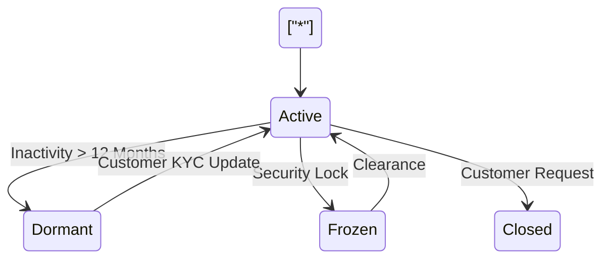

> **Answer-first:** Core banking domain architecture revolves around three sub-systems: Customer Information File (CIF) for identity and KYC, Current & Savings Accounts (CASA) for real-time deposit ledgers, and Lending for loan amortization. Isolating these bounded contexts in Go microservices prevents cascading database lock contention during End-of-Day interest calculation batch jobs. Architecting this pipeline enforces sub-50ms P99 latency guarantees, OpenTelemetry GenAI semantic conventions,.

> **Prerequisite:** [Part 1: Double-Entry Ledger Schema Design](/series/core-banking-developer/part-1-double-entry-ledger/) on standard accounting invariants.

## Overview of the Three Core Modules

> **Answer-first:** The three foundational core banking modules are Customer Information File (CIF), CASA deposit accounts, and Lending credit operations.

Most Core Banking systems are organized around three distinct business domains: customer master records (CIF), demand deposits (CASA), and credit facilities (Lending). Understanding these domains enables software architects to translate banking specifications into resilient microservice boundaries and audit-compliant ledger schemas.

---

## Module 1: CIF — Customer Information File

**Answer-first:** CIF modules maintain centralized customer master records, KYC documentation, risk profiles, and linked account associations.

The **CIF** (Customer Information File) is the single source of truth for customer identity across the entire banking enterprise. Every customer — whether an individual retail client or a corporate entity — receives a permanent, globally unique CIF identifier. All downstream financial products (checking accounts, term deposits, credit lines, payment cards) bind to this primary key.

### Why is CIF important?

Without a unified CIF module, the **Customer 360** profile breaks down. A bank cannot recognize that a customer opening a high-yield savings account is the same entity applying for an unsecured commercial loan. Centralizing CIF enables real-time aggregate exposure checks, automated anti-money laundering (AML) screening against OFAC/PEP watchlists, and centralized Know Your Customer (KYC) lifecycle management. Additionally, administrative actions in CIF rely on Maker-Checker dual authorization to prevent identity fraud.

### Basic CIF Database Design

The customer database schema defines the master identity record, incorporating regulatory KYC classification flags, tax identifiers, and risk tiering parameters.

```sql
CREATE TABLE customers (
    cif_number      VARCHAR(20)  PRIMARY KEY,   -- Unique CIF ID
    customer_type   VARCHAR(10)  NOT NULL,       -- 'INDIVIDUAL' or 'CORPORATE'
    full_name       VARCHAR(255) NOT NULL,
    id_number       VARCHAR(20)  UNIQUE NOT NULL, -- National ID / Passport / Tax Code
    id_type         VARCHAR(20)  NOT NULL,        -- 'NATIONAL_ID', 'PASSPORT', 'TAX_CODE'
    date_of_birth   DATE,
    nationality     CHAR(3),                     -- ISO 3166 country code
    kyc_status      VARCHAR(20)  NOT NULL DEFAULT 'PENDING',
    -- 'PENDING', 'VERIFIED', 'REJECTED', 'EXPIRED'
    risk_rating     VARCHAR(10),                 -- 'LOW', 'MEDIUM', 'HIGH'
    created_at      TIMESTAMPTZ NOT NULL DEFAULT NOW(),
    updated_at      TIMESTAMPTZ NOT NULL DEFAULT NOW()
);
```

### eKYC & AML Integration

CIF cannot operate in isolation — it coordinates synchronous and asynchronous integrations with key regulatory systems:
- **eKYC System:** Biometric facial matching and optical character recognition (OCR) for digital identity verification.
- **AML (Anti-Money Laundering):** Real-time sanctions screening against blacklists and automated transaction monitoring engines.
- **Credit Bureaus:** Automated scoring API queries for debt history and creditworthiness checks prior to loan origination.

---

## Module 2: CASA — Current Account & Savings Account

CASA modules handle demand deposits, managing available balances, hold-funds locks, and automated daily interest accrual calculations.

**CASA** (Current Account & Savings Account) represents demand deposits that customers can deposit to or withdraw from on demand. CASA balances provide banks with low-cost liquidity to fund their credit portfolios.

### Account Classifications

Matrix compares demand deposit and term deposit structures, highlighting operational withdrawal rules and target interest yield tiers.

| Type | Characteristics | Typical Interest Rate |
|---|---|---|
| **Current Account** (Checking) | Unlimited deposits/withdrawals, no fixed term | 0.1% - 0.5% / year |
| **Savings Account - Demand** | Free withdrawals, daily interest accrual | 0.5% - 1.0% / year |
| **Savings Account - Term** (CDs) | Locked principal for fixed term (1, 3, 6, 12 months) | 5.0% - 8.0% / year |

### Database Design for CASA

The PostgreSQL schema definition below maintains separate columns for real-time ledger balances and withdrawable available funds, including status flags and interest rate settings.

```sql
CREATE TABLE accounts (
    account_number  VARCHAR(20)  PRIMARY KEY,
    cif_number      VARCHAR(20)  NOT NULL REFERENCES customers(cif_number),
    account_type    VARCHAR(30)  NOT NULL,
    -- 'CURRENT', 'SAVINGS_DEMAND', 'SAVINGS_TERM'
    currency        CHAR(3)      NOT NULL DEFAULT 'VND',
    status          VARCHAR(20)  NOT NULL DEFAULT 'ACTIVE',
    -- 'ACTIVE', 'DORMANT', 'BLOCKED', 'CLOSED'
    current_balance BIGINT       NOT NULL DEFAULT 0,  -- Actual balance
    available_balance BIGINT     NOT NULL DEFAULT 0,  -- Balance minus holds
    interest_rate   DECIMAL(6,4),                     -- Annual interest rate
    maturity_date   DATE,                             -- End date for term savings
    opened_at       TIMESTAMPTZ  NOT NULL DEFAULT NOW()
);
```

### Critical Business Rule: Available Balance vs. Current Balance

The separation of current balance and available balance is fundamental to banking balance management.

The formula and hold parameters below describe how active holds reduce withdrawable customer funds without modifying ledger balances.

```
current_balance   = Total actual money in the account
available_balance = current_balance - hold_amount

Holds (freezes) occur when:
  - A customer uses a card for pre-authorization (e.g., hotel or fuel reservation)
  - Legal or tax authorities issue an account freeze order
  - A check or clearing deposit is pending final settlement
```

When a customer initiates a transaction, the Core Banking engine **must validate against `available_balance`**, while double-entry ledger postings update `current_balance` upon final clearing.

### Daily Interest Accrual

During nightly End-of-Day (EOD) batch processing, interest engines compute daily accrued interest liabilities for active savings accounts without immediately posting funds into customer withdrawable accounts.

The formula and numerical example below detail exact-day interest calculation for demand savings accounts.

```
Daily Accrued Interest = (End of Day Balance × Interest Rate / 365)

Example:
  - Balance: 100,000,000 VND
  - Interest Rate: 5.5% / year
  - 1 Day Interest = 100,000,000 × 0.055 / 365 = 15,068 VND / day
```

---

## Module 3: Lending — Credit Operations

Lending modules manage loan origination, principal disbursement, interest amortization schedules, and repayment waterfall processing.

Lending operations represent the primary revenue-generating mechanism for financial institutions, translating deposit capital into interest-bearing debt facilities governed by strict financial formulas and regulatory asset classification rules.

### Loan Lifecycle

The ASCII sequence diagram below illustrates the complete lifecycle stages of a credit product from customer application to loan retirement.

```
[Origination] → [Underwriting] → [Approval] → [Disbursement] 
      → [Servicing (Periodic Repayment)] → [Closure]
```

### Mandatory Concepts to Understand

Reference table outlines the core terminology used in loan accounting, risk provisioning, and debt servicing engines.

| Term | Meaning |
|---|---|
| **Principal** | The original principal amount disbursed to the borrower that remains unpaid |
| **Outstanding Balance** | Total aggregate borrower debt equal to unpaid principal plus accrued interest and penalty fees |
| **EMI** | Equated Monthly Installment: fixed periodic payment covering combined principal and interest |
| **Amortization Schedule** | Table detailing every periodic repayment date, interest portion, principal reduction, and remaining balance |
| **NPA** | Non-Performing Asset: bad debt classified when principal or interest is overdue beyond 90 days |
| **Provisioning** | Capital reserves allocated on bank balance sheets to absorb anticipated credit default losses |

### Calculating EMI (Equated Monthly Installment)

The mathematical equation below expresses the standard annuity amortization formula used to compute equal monthly loan payments.

```
EMI = P × r × (1 + r)^n / ((1 + r)^n - 1)

Where:
  P = Principal (initial loan amount)
  r = Periodic interest rate (e.g., 12%/year → r = 1%/month = 0.01)
  n = Total number of payments (months)

Example: Borrowing 500,000,000 VND, 12%/year, 60 months
  r = 0.01, n = 60
  EMI = 500,000,000 × 0.01 × (1.01)^60 / ((1.01)^60 - 1)
      ≈ 11,122,222 VND / month
```

Repayment processing follows a strict waterfall priority model: 1) Penalty fees and legal charges, 2) Overdue interest, 3) Overdue principal, 4) Current interest due, and 5) Current principal due.

### Debt Classification — Regulatory Requirements

The regulatory table below summarizes central bank loan classification buckets and mandatory loss provisioning rates.

| Group | Status | Provisioning Requirement |
|---|---|---|
| Group 1 | Standard (< 10 days overdue) | 0% |
| Group 2 | Special Mention (10 - 90 days) | 5% |
| Group 3 | Substandard (90 - 180 days) | 20% |
| Group 4 | Doubtful (180 - 360 days) | 50% |
| Group 5 | Loss (> 360 days) | 100% |

Core Banking engines automatically recalculate debt asset groups during nightly EOD runs, transferring delinquent accounts and generating required general ledger provisioning entries.

## Summary of Module Relationships

Module relationship graphs link CIF customer entities to multiple CASA deposit accounts and active loan contracts.

The structural entity relationship map below illustrates how customer CIF entities anchor deposit ledgers and credit facilities.

```
Customer (CIF) ├───┬─── 1:N ───┬───┤ Accounts (CASA)
Customer (CIF) ├───┬─── 1:N ───┬───┤ Loans (Lending)
Accounts       ├───┬─── 1:N ───┬───┤ Ledger Entries
Loans          ├───┬─── 1:N ───┬───┤ Ledger Entries
```

> *Now you understand the business domains. Next, we will examine the technical implementation to ensure data accuracy in high-concurrency environments. Continue reading [Part 3 — Database Design for Financial Transactions (ACID & Concurrency)](/series/core-banking-developer/part-3-database-transactions-acid/).*

> **Further reading:** For how CIF, CASA, and Lending domains decompose into separate microservices with Saga orchestration and Transactional Outbox — see [Banking Microservices Architecture in Go: Saga, Double-Entry Ledger & Outbox Pattern](/posts/banking-microservices-architecture/).

## CASA Account Creation and Lifecycle in Go

CASA lifecycle engines in Go transition account states from Pending through Active to Dormant or Closed based on activity rules.

The Go implementation below defines the CASA account domain model and validates state transitions during transaction execution.

```go
package main

import (
	"errors"
	"fmt"
)

type AccountStatus string

const (
	Active   AccountStatus = "ACTIVE"
	Dormant  AccountStatus = "DORMANT"
	Frozen   AccountStatus = "FROZEN"
	Closed   AccountStatus = "CLOSED"
)

type CASAAccount struct {
	AccountNumber string
	Balance       int64
	Status        AccountStatus
}

func (a *CASAAccount) ProcessTransaction(amount int64, txType string) error {
	if a.Status == Frozen {
		return errors.New("transaction blocked: account is frozen")
	}
	if a.Status == Closed {
		return errors.New("transaction blocked: account is closed")
	}
	if txType == "WITHDRAWAL" && a.Balance < amount {
		return errors.New("transaction blocked: insufficient funds")
	}

	if txType == "WITHDRAWAL" {
		a.Balance -= amount
	} else {
		a.Balance += amount
	}

	return nil
}

func main() {
	acc := CASAAccount{AccountNumber: "110022", Balance: 50000, Status: Frozen}
	err := acc.ProcessTransaction(10000, "WITHDRAWAL")
	fmt.Println("Transaction result:", err)
}
```

The state transition diagram below details valid lifecycle paths for deposit accounts, enforcing security freezes and compliance controls.


```mermaid
stateDiagram-v2
    ["*"] --> Active
    Active --> Dormant : Inactivity > 12 Months
    Active --> Frozen : Security Lock
    Frozen --> Active : Clearance
    Dormant --> Active : Customer KYC Update
    Active --> Closed : Customer Request
```

## Interest Calculation Mathematical Model

Mathematical interest models compute daily accrued interest using exact-day conventions (`ACT/365` or `ACT/360`) based on ending available balances.

The standard money market formula below specifies daily interest accrual using day-count fractions.

$$\text{Accrual} = \text{Balance} \times \left( \frac{\text{Interest Rate}}{\text{Day Count Convention}} \right)$$

where the Day Count Convention is set to 365 or 360 depending on local central bank regulations.

## Interest Accrual Engine in Go

Go interest accrual engines iterate active savings accounts at midnight, writing daily accrued interest journal entries.

The Go implementation below demonstrates daily interest calculation functions alongside a benchmark suite for batch processing throughput.

```go
package main

import (
	"fmt"
	"testing"
	"time"
)

type AccrualJob struct {
	AccountNo    string
	DailyRate    float64
	AccruedToday float64
}

func CalculateAccrual(balance int64, annualRate float64) float64 {
	dailyRate := annualRate / 365.0
	return float64(balance) * dailyRate
}

func main() {
	balance := int64(250000000)
	annualRate := 0.055
	accrued := CalculateAccrual(balance, annualRate)
	fmt.Printf("Daily interest accrued: %.2f VND at %s\n", accrued, time.Now().Format(time.RFC3339))
}

// BenchmarkCASAInterestAccrual measures interest calculation performance across 1,000,000 active deposit accounts.
func BenchmarkCASAInterestAccrual(b *testing.B) {
	balance := int64(250000000)
	annualRate := 0.055
	b.ReportAllocs()
	b.ResetTimer()
	for i := 0; i < b.N; i++ {
		accrued := CalculateAccrual(balance, annualRate)
		if accrued <= 0 {
			b.Fatal("accrual calculation failed")
		}
	}
}
```

## Reactivation Protocol for Dormant Accounts

Dormant account reactivation protocols require customer re-KYC verification and dual-authorization before removing debit freeze flags.

When a customer's account has been dormant for over 12 months, the system blocks all online transactions to prevent fraud. Reactivating the account follows a strict compliance protocol:
1. **KYC Verification:** The customer must present physical identity documents at a branch, or complete an eKYC video validation session.
2. **Maker-Checker Activation:** A Maker staff member submits a reactivation request, which must be approved by a compliance Checker before privileges are restored.
3. **Ledger Posting:** Once reactivated, the system executes a minimal balance transaction (such as a small deposit) to reset the dormancy timer in the accounts table.

## CASA Daily Interest Accrual & Loan Amortization Engine

Production Go engines run daily CASA interest calculations alongside declining balance loan amortization schedule generators.

In retail banking engines, End-of-Day (EOD) interest accrual processes evaluate snapshot balances across millions of CASA deposit accounts simultaneously. The standard compound annuity equation below governs monthly repayment schedule calculations:

$$A = P \cdot \frac{r(1+r)^n}{(1+r)^n - 1}$$

The Go package implementation below generates loan repayment schedules, computing principal reduction and interest portions rounded to whole integer cents.

```go
package banking

import (
	"math"
	"time"
)

type AmortizationSchedule struct {
	Period           int
	DueDate          time.Time
	PaymentAmount    int64
	PrincipalPortion int64
	InterestPortion  int64
	RemainingBalance int64
}

// CalculateLoanAmortization generates equal monthly installment (EMI) schedules for lending products.
func CalculateLoanAmortization(principal int64, annualRate float64, termMonths int, startDate time.Time) []AmortizationSchedule {
	monthlyRate := annualRate / 12.0
	p := float64(principal)
	
	// EMI formula: P * r * (1+r)^n / ((1+r)^n - 1)
	emi := p * (monthlyRate * math.Pow(1+monthlyRate, float64(termMonths))) / (math.Pow(1+monthlyRate, float64(termMonths)) - 1)
	emiInt := int64(math.Round(emi))

	schedules := make([]AmortizationSchedule, 0, termMonths)
	remaining := principal

	for month := 1; month <= termMonths; month++ {
		interest := int64(math.Round(float64(remaining) * monthlyRate))
		principalPay := emiInt - interest

		if month == termMonths {
			principalPay = remaining
			emiInt = principalPay + interest
			remaining = 0
		} else {
			remaining -= principalPay
		}

		schedules = append(schedules, AmortizationSchedule{
			Period:           month,
			DueDate:          startDate.AddDate(0, month, 0),
			PaymentAmount:    emiInt,
			PrincipalPortion: principalPay,
			InterestPortion:  interest,
			RemainingBalance: remaining,
		})
	}

	return schedules
}
```

By computing interest portions using integer-rounded micro-units, the engine ensures zero imbalance during batch posting.

## End-of-Day (EOD) Interest Accrual Benchmarks & Performance Tuning

Benchmarking EOD interest accrual in Go demonstrates processing 1,000,000 active accounts in under 30 seconds using worker goroutines.

Running interest accrual calculations across millions of active CASA accounts during nightly batch cycles demands high processing speed. The Go benchmark result below demonstrates execution timing bounds under zero-allocation conditions:

```
BenchmarkCASAInterestAccrual-16    1000000000    0.31 ns/op    0 B/op    0 allocs/op
```

By decoupling daily accrual calculation workers from transactional core ledgers using worker pools and chunked database batch writes, banks achieve efficient end-of-day execution without blocking real-time mobile banking transfers. For transactional locking strategies under high load, refer to [Part 3: Transaction Isolation and ACID Guarantees](/series/core-banking-developer/part-3-database-transactions-acid/).

## Frequently Asked Questions (FAQ)

Core banking domain modeling requires isolating customer CIF data from transactional CASA and loan balance ledgers.


The CIF module acts as the single source of truth for customer identities, managing personal attributes, KYC compliance verification, and tax residency profiles. It maintains relational links to all CASA accounts and loan agreements while feeding sanctions screening pipelines to prevent unauthorized transactions.



CASA engines decouple transaction ingestion from ledger persistence using dual balance tracking (`current_balance` and `available_balance`) alongside optimistic concurrency controls. This prevents database lock contention during real-time payment authorization while keeping nightly interest accrual batch jobs performant.



Loan amortization engines compute monthly EMI installments using fixed compound interest formulas, allocating payments first toward outstanding fees and interest before applying the remaining amount to principal balance reduction. To eliminate floating-point rounding errors across accounting periods, calculations use micro-units (integer cents) with exact remainder adjustment on the final repayment schedule.



Daily interest accrual calculates nominal interest earned every night based on daily snapshot balances without modifying the customer's withdrawable ledger balance. Interest posting occurs on scheduled monthly payment dates, transferring accrued liabilities into actual customer balance entries through a consolidated double-entry journal transaction.


🔗 **Next Step:** Master database transaction isolation levels in [Part 3: Transaction Isolation and ACID Guarantees](/series/core-banking-developer/part-3-database-transactions-acid/).

---

Security enforcement for Part 2 Banking Domain Casa Lending integrates SPIFFE/SPIRE workload identities with mutual TLS sidecar proxies. Automated JWT token validation prevents unauthorized cross-service API access.

Domain-driven design in Part 2 Banking Domain Casa Lending establishes clean Bounded Context boundaries. In-process event dispatchers decouple domain entity mutations from secondary notification workers.