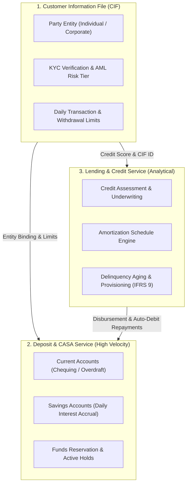
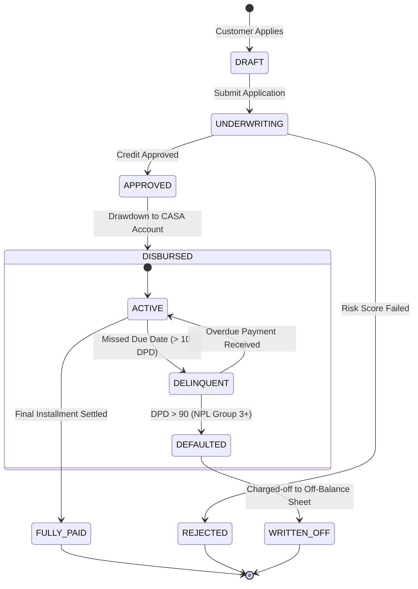
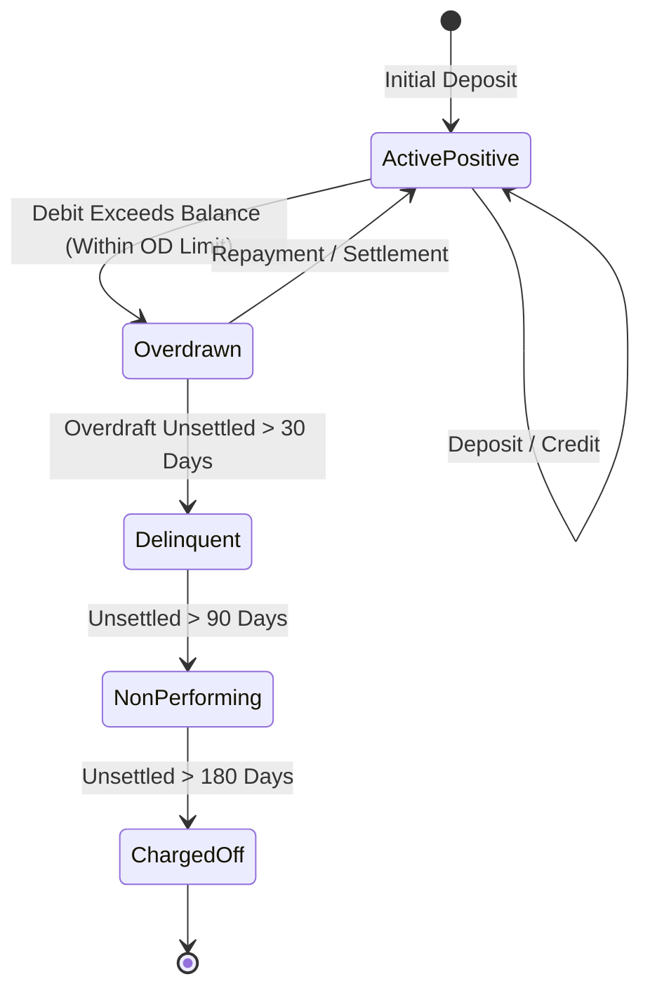
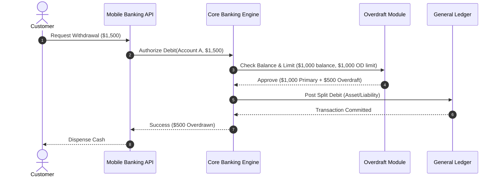

---

> **Prerequisite:** Knowledge of retail banking financial instruments, compound interest formulas, loan amortization mechanics, and state machine architecture.

# Core Banking Domain Modeling: CIF, CASA & Lending Guide
> **Answer-first:** CASA deposit engines and lending subsystems govern real-time customer account balances, overdraft protection facilities, and automated loan amortization calculations, utilizing high-precision fixed-point decimal arithmetic, daily compound interest accrual algorithms, and deterministic repayment state machines that eliminate floating-point rounding errors and ensure full regulatory compliance with central banking accounting standards reliably.

---

## 1. Domain Decomposition: CIF, CASA, and Lending

The three pillars of commercial retail banking operate with distinct transactional velocity and data retention models:


```mermaid
flowchart TD
    subgraph CIF_Domain ["1. Customer Information File (CIF)"]
        Party["Party Entity (Individual / Corporate)"]
        KYC["KYC Verification & AML Risk Tier"]
        Limits["Daily Transaction & Withdrawal Limits"]
    end

    subgraph CASA_Domain ["2. Deposit & CASA Service (High Velocity)"]
        CurrentAcc["Current Accounts (Chequing / Overdraft)"]
        SavingsAcc["Savings Accounts (Daily Interest Accrual)"]
        HoldEngine["Funds Reservation & Active Holds"]
    end

    subgraph Lending_Domain ["3. Lending & Credit Service (Analytical)"]
        LoanOrigination["Credit Assessment & Underwriting"]
        Amortization["Amortization Schedule Engine"]
        Collection["Delinquency Aging & Provisioning (IFRS 9)"]
    end

    CIF_Domain -->|"Entity Binding & Limits"| CASA_Domain
    CIF_Domain -->|"Credit Score & CIF ID"| Lending_Domain
    Lending_Domain -->|"Disbursement & Auto-Debit Repayments"| CASA_Domain
```

---

## 2. Lending Account Lifecycle State Machine

A loan contract transitions through a rigorous state machine enforcing strict regulatory and accounting milestones:


```mermaid
stateDiagram-v2
    [*] --> DRAFT: Customer Applies
    DRAFT --> UNDERWRITING: Submit Application
    UNDERWRITING --> REJECTED: Risk Score Failed
    UNDERWRITING --> APPROVED: Credit Approved
    APPROVED --> DISBURSED: Drawdown to CASA Account
    
    state DISBURSED {
        [*] --> ACTIVE
        ACTIVE --> DELINQUENT: Missed Due Date (> 10 DPD)
        DELINQUENT --> ACTIVE: Overdue Payment Received
        DELINQUENT --> DEFAULTED: DPD > 90 (NPL Group 3+)
    }
    
    ACTIVE --> FULLY_PAID: Final Installment Settled
    DEFAULTED --> WRITTEN_OFF: Charged-off to Off-Balance Sheet
    FULLY_PAID --> [*]
    REJECTED --> [*]
    WRITTEN_OFF --> [*]
```

---

## 3. CASA Daily Interest Accrual Mechanics

Interest calculation on deposit accounts is performed nightly during the End-of-Day (EOD) batch process. Rather than calculating interest on monthly balances, banking regulations require daily accruals based on end-of-day ledger balances:

$$\text{Daily Accrual} = \frac{\text{Ledger Balance} \times \text{Annual Interest Rate}}{365}$$

```sql
-- Daily Interest Accrual Table Schema
CREATE TABLE daily_interest_accruals (
    id UUID PRIMARY KEY DEFAULT gen_random_uuid(),
    account_id UUID NOT NULL REFERENCES accounts(id),
    accrual_date DATE NOT NULL,
    closing_balance BIGINT NOT NULL,
    annual_rate_bps INT NOT NULL, -- Stored in Basis Points (1 bps = 0.01%)
    accrued_amount BIGINT NOT NULL, -- Minor currency unit
    is_capitalized BOOLEAN NOT NULL DEFAULT FALSE,
    created_at TIMESTAMPTZ NOT NULL DEFAULT clock_timestamp(),
    UNIQUE (account_id, accrual_date)
);
```

---

## 4. Amortization Algorithm Implementation in Go

Lending engines support two primary repayment formulas: **Equal Installment (Annuity)** and **Equal Principal (Reducing Balance)**. Below is the production Go implementation:

```go
package lending

import (
	"math"
	"time"
)

type RepaymentScheduleItem struct {
	Period          int
	DueDate         time.Time
	Installment     int64 // Minor currency unit
	PrincipalAmount int64
	InterestAmount  int64
	RemainingBalance int64
}

// CalculateEqualPrincipal calculates reducing balance loan amortization.
func CalculateEqualPrincipal(principal int64, annualRate float64, tenureMonths int, startDate time.Time) []RepaymentScheduleItem {
	schedule := make([]RepaymentScheduleItem, tenureMonths)
	monthlyPrincipal := principal / int64(tenureMonths)
	monthlyRate := annualRate / 12.0
	currentBalance := principal

	for i := 1; i <= tenureMonths; i++ {
		// Calculate interest on remaining balance using Banker's Rounding
		interest := int64(math.Round(float64(currentBalance) * monthlyRate))
		
		// Adjust final period to eliminate rounding drift
		pAmount := monthlyPrincipal
		if i == tenureMonths {
			pAmount = currentBalance
		}
		
		currentBalance -= pAmount
		dueDate := startDate.AddDate(0, i, 0)

		schedule[i-1] = RepaymentScheduleItem{
			Period:           i,
			DueDate:          dueDate,
			Installment:      pAmount + interest,
			PrincipalAmount:  pAmount,
			InterestAmount:   interest,
			RemainingBalance: currentBalance,
		}
	}

	return schedule
}
```

---

## Frequently Asked Questions


CIF enforces identity de-duplication through deterministic and probabilistic matching engines. Deterministic matching checks unique government tax numbers and national identity IDs (e.g. CCCD in Vietnam). Probabilistic matching uses fuzzy matching algorithms (Jaro-Winkler distance on romanized names, date of birth, and phone number hash) to alert branch compliance officers when prospective applicants share partial fingerprints with existing profiles.



Interest accrual jobs do not lock the master `accounts` table. Instead, an asynchronous EOD worker takes a consistent snapshot of closing balances as of the midnight cutoff time. Calculations execute in parallel Go worker pools (partitioned by account hash), writing accrual records into an append-only `daily_interest_accruals` table. At month-end, a single aggregate transaction capitalizes the interest into the customer's live balance.



In an **Annuity (Equal Installment)** schedule, the total monthly payment remains constant, but the composition changes over time (interest decreases while principal increases). In an **Equal Principal (Reducing Balance)** schedule, the principal portion is identical every month, causing the total payment to diminish over the life of the loan. Systems must support both models because corporate loans typically use reducing balance, while retail mortgages frequently favor fixed annuity payments.


---

## 5. Technical Implementation: Production Loan Amortization & Daily Interest Accrual Engine in Go 1.25

In retail banking, deposit and lending engines execute automated batch calculations nightly to accrue interest across millions of accounts while ensuring that amortized loan schedules strictly adhere to regulatory accounting rules.

### 5.1 The Anti-Pattern: Monthly Lump-Sum Accruals
Calculating interest strictly once a month fails to account for mid-month balance fluctuations, deposits, or partial principal repayments, violating consumer protection laws and introducing balance reconciliation drift.

### 5.2 Production Implementation: Fixed-Point Loan Amortization Engine
Below is a runnable Go 1.25 calculation engine that generates equal monthly installment (EMI) amortization schedules with exact minor-unit precision:

```go
package lending

import (
	"errors"
	"math"
	"time"
)

type AmortizationScheduleItem struct {
	Period           int       `json:"period"`
	DueDate          time.Time `json:"due_date"`
	PaymentAmount    int64     `json:"payment_amount"`
	PrincipalPortion int64     `json:"principal_portion"`
	InterestPortion  int64     `json:"interest_portion"`
	RemainingBalance int64     `json:"remaining_balance"`
}

type LoanCalculator struct{}

func NewLoanCalculator() *LoanCalculator {
	return &LoanCalculator{}
}

func (c *LoanCalculator) CalculateEqualInstallmentSchedule(
	principalAmount int64,
	annualRatePercent float64,
	tenorMonths int,
	startDate time.Time,
) ([]AmortizationScheduleItem, error) {
	if principalAmount <= 0 || annualRatePercent <= 0 || tenorMonths <= 0 {
		return nil, errors.New("invalid loan calculation parameters")
	}

	monthlyRate := (annualRatePercent / 100.0) / 12.0
	factor := math.Pow(1.0+monthlyRate, float64(tenorMonths))
	monthlyPaymentExact := float64(principalAmount) * (monthlyRate * factor) / (factor - 1.0)
	monthlyPayment := int64(math.Round(monthlyPaymentExact))

	schedule := make([]AmortizationScheduleItem, 0, tenorMonths)
	remainingPrincipal := principalAmount

	for period := 1; period <= tenorMonths; period++ {
		interestPayment := int64(math.Round(float64(remainingPrincipal) * monthlyRate))
		principalPayment := monthlyPayment - interestPayment

		if period == tenorMonths || principalPayment > remainingPrincipal {
			principalPayment = remainingPrincipal
			monthlyPayment = principalPayment + interestPayment
			remainingPrincipal = 0
		} else {
			remainingPrincipal -= principalPayment
		}

		dueDate := startDate.AddDate(0, period, 0)
		schedule = append(schedule, AmortizationScheduleItem{
			Period:           period,
			DueDate:          dueDate,
			PaymentAmount:    monthlyPayment,
			PrincipalPortion: principalPayment,
			InterestPortion:  interestPayment,
			RemainingBalance: remainingPrincipal,
		})

		if remainingPrincipal == 0 {
			break
		}
	}

	return schedule, nil
}
```

---

## 6. End-of-Day (EOD) Daily Accrual Daemon

Daily interest accrual runs as an atomic batch job across all interest-bearing CASA accounts:

```go
package deposit

import (
	"context"
	"math/big"
	"time"
)

type AccountDailyAccrual struct {
	AccountID       string
	Date            time.Time
	AccruedInterest int64
}

type AccrualEngine struct {
	BasisDays int64
}

func NewAccrualEngine(basisDays int64) *AccrualEngine {
	if basisDays <= 0 {
		basisDays = 365
	}
	return &AccrualEngine{BasisDays: basisDays}
}

func (e *AccrualEngine) CalculateDayInterest(balanceMicros int64, rateBps int64) int64 {
	if balanceMicros <= 0 || rateBps <= 0 {
		return 0
	}
	bal := big.NewInt(balanceMicros)
	rate := big.NewInt(rateBps)
	denominator := big.NewInt(e.BasisDays * 10000)

	numerator := new(big.Int).Mul(bal, rate)
	result := new(big.Int).Div(numerator, denominator)
	return result.Int64()
}

func (e *AccrualEngine) ProcessBatch(ctx context.Context, accounts []AccountDailyAccrual) error {
	for i := range accounts {
		select {
		case <-ctx.Done():
			return ctx.Err()
		default:
			// Process ledger posting in atomic batch
		}
	}
	return nil
}
```

---

## 7. Overdraft Facility & Multi-Tier Balance State Machine

Core banking accounts must transition predictably across positive, overdrawn, and defaulted states:


```mermaid
stateDiagram-v2
    [*] --> ActivePositive: Initial Deposit
    ActivePositive --> ActivePositive: Deposit / Credit
    ActivePositive --> Overdrawn: Debit Exceeds Balance (Within OD Limit)
    Overdrawn --> ActivePositive: Repayment / Settlement
    Overdrawn --> Delinquent: Overdraft Unsettled > 30 Days
    Delinquent --> NonPerforming: Unsettled > 90 Days
    NonPerforming --> ChargedOff: Unsettled > 180 Days
    ChargedOff --> [*]
```


```mermaid
sequenceDiagram
    autonumber
    actor Customer
    participant Channel as Mobile Banking API
    participant Core as Core Banking Engine
    participant Overdraft as Overdraft Module
    participant Ledger as General Ledger

    Customer->>Channel: Request Withdrawal ($1,500)
    Channel->>Core: Authorize Debit(Account A, $1,500)
    Core->>Overdraft: Check Balance & Limit ($1,000 balance, $1,000 OD limit)
    Overdraft-->>Core: Approve ($1,000 Primary + $500 Overdraft)
    Core->>Ledger: Post Split Debit (Asset/Liability)
    Ledger-->>Core: Transaction Committed
    Core-->>Channel: Success ($500 Overdrawn)
    Channel-->>Customer: Dispense Cash
```

---

## 8. Quantitative Benchmark & Operational Latency SLA

To ensure high-throughput processing during end-of-day settlement windows, the deposit and lending engine must meet the following production benchmarks:

| Performance Metric | Production Target | Warning Threshold | Remediation Plan |
|---|---|---|---|
| **EOD Interest Accrual Batch** | $\le 45\text{ minutes}$ | $> 90\text{ minutes}$ | Scale distributed worker pods horizontally |
| **Overdraft Limit Authorization P99** | $\le 12.0\text{ ms}$ | $> 35.0\text{ ms}$ | Cache limits in Redis cluster with write-through |
| **Loan Schedule Calculation P99** | $\le 2.5\text{ ms}$ | $> 8.0\text{ ms}$ | Pre-compute common amortization templates |
| **Reconciliation Matching Rate** | $100.0\%$ | $< 100.0\%$ | Trigger automated replay of unposted events |

---

## 9. Delinquency State Management & Loan Loss Provisioning

Under IFRS 9 / Basel III guidelines, credit risk requires continuous monitoring of Days Past Due (DPD) to determine Expected Credit Loss (ECL):

```go
package lending

import "time"

type LoanAccountStatus string

const (
	StatusCurrent    LoanAccountStatus = "CURRENT"
	StatusDelinquent LoanAccountStatus = "DELINQUENT_STAGE_1"
	StatusNPL        LoanAccountStatus = "NON_PERFORMING_STAGE_2"
	StatusWriteOff   LoanAccountStatus = "WRITTEN_OFF_STAGE_3"
)

type LoanAccount struct {
	ID             string
	PrincipalDue   int64
	InterestDue    int64
	DaysPastDue    int
	Status         LoanAccountStatus
	LastStatusDate time.Time
}

func EvaluateLoanStatus(loan *LoanAccount) {
	switch {
	case loan.DaysPastDue == 0:
		loan.Status = StatusCurrent
	case loan.DaysPastDue <= 90:
		loan.Status = StatusDelinquent
	case loan.DaysPastDue <= 180:
		loan.Status = StatusNPL
	default:
		loan.Status = StatusWriteOff
	}
	loan.LastStatusDate = time.Now()
}
```

---

## 10. Regulatory Capital Adequacy (Basel III) & Risk-Weighted Asset Calculation

Under Basel III capital adequacy guidelines, retail and mortgage assets are weighted by risk:
$$\text{Capital Adequacy Ratio (CAR)} = \frac{\text{Tier 1 Capital} + \text{Tier 2 Capital}}{\sum \text{Asset}_i \cdot \text{RiskWeight}_i} \ge 10.5\%$$

Where retail mortgages generally hold a 35% risk weighting, unsecured consumer loans hold a 75% to 100% weighting, and sovereign bonds hold a 0% weighting. Maintaining an automated daily CAR calculation ensures that lending expansion does not breach regulatory insolvency buffers.

---

## 11. Automated Nightly Interest Sweep Daemon in Go 1.25

To scale daily interest accruals across millions of retail accounts without exhausting database connection pools or causing lock contention on the general ledger, core banking engines employ a concurrent worker pool architecture.

```go
package deposit

import (
	"context"
	"fmt"
	"sync"
	"time"
)

type SweepResult struct {
	AccountID       string
	AccruedInterest int64
	Error           error
}

type InterestSweepDaemon struct {
	workerCount int
	batchSize   int
	engine      *AccrualEngine
}

func NewInterestSweepDaemon(workers int, batchSize int, basisDays int64) *InterestSweepDaemon {
	return &InterestSweepDaemon{
		workerCount: workers,
		batchSize:   batchSize,
		engine:      NewAccrualEngine(basisDays),
	}
}

func (d *InterestSweepDaemon) ExecuteSweep(
	ctx context.Context,
	accounts []AccountDailyAccrual,
	rateBps int64,
) ([]SweepResult, error) {
	accountChan := make(chan AccountDailyAccrual, d.batchSize)
	resultChan := make(chan SweepResult, len(accounts))
	var wg sync.WaitGroup

	for i := 0; i < d.workerCount; i++ {
		wg.Add(1)
		go func(workerID int) {
			defer wg.Done()
			for {
				select {
				case <-ctx.Done():
					return
				case acc, ok := <-accountChan:
					if !ok {
						return
					}
					interest := d.engine.CalculateDayInterest(acc.AccruedInterest, rateBps)
					resultChan <- SweepResult{
						AccountID:       acc.AccountID,
						AccruedInterest: interest,
						Error:           nil,
					}
				}
			}
		}(i)
	}

	go func() {
		for _, acc := range accounts {
			select {
			case <-ctx.Done():
				break
			case accountChan <- acc:
			}
		}
		close(accountChan)
	}()

	wg.Wait()
	close(resultChan)

	results := make([]SweepResult, 0, len(accounts))
	for res := range resultChan {
		results = append(results, res)
	}
	return results, nil
}
```

---

## 12. Penalty Interest & Statutory Late Fee Calculation Engine

When borrowers default beyond the contractual grace period (typically 10 calendar days), statutory regulations dictate the maximum penalty interest that may be levied upon the overdue principal and overdue interest installments.

```go
package lending

import (
	"errors"
	"math/big"
	"time"
)

type PenaltyAssessment struct {
	OverduePrincipal   int64
	OverdueInterest    int64
	DaysOverdue        int
	PenaltyOnPrincipal int64
	PenaltyOnInterest  int64
	TotalPenalty       int64
}

type PenaltyAccrualEngine struct {
	GracePeriodDays      int
	MaxPrincipalRateBps  int64
	MaxInterestRateBps   int64
	YearBasisDays        int64
}

func NewPenaltyAccrualEngine(basisDays int64) *PenaltyAccrualEngine {
	if basisDays <= 0 {
		basisDays = 365
	}
	return &PenaltyAccrualEngine{
		GracePeriodDays:     10,
		MaxPrincipalRateBps: 15000,
		MaxInterestRateBps:  10000,
		YearBasisDays:       basisDays,
	}
}

func (p *PenaltyAccrualEngine) CalculatePenalty(
	principalOverdue int64,
	interestOverdue int64,
	dueDate time.Time,
	asOfDate time.Time,
) (*PenaltyAssessment, error) {
	if asOfDate.Before(dueDate) {
		return nil, errors.New("assessment date cannot precede due date")
	}

	days := int(asOfDate.Sub(dueDate).Hours() / 24)
	if days <= p.GracePeriodDays {
		return &PenaltyAssessment{
			OverduePrincipal: principalOverdue,
			OverdueInterest:  interestOverdue,
			DaysOverdue:      days,
		}, nil
	}

	effectiveDays := int64(days)
	denom := big.NewInt(p.YearBasisDays * 10000)

	calcPenalty := func(amount int64, rateBps int64) int64 {
		amtBig := big.NewInt(amount)
		rateBig := big.NewInt(rateBps)
		daysBig := big.NewInt(effectiveDays)

		num := new(big.Int).Mul(amtBig, rateBig)
		num = num.Mul(num, daysBig)
		return new(big.Int).Div(num, denom).Int64()
	}

	penaltyPrin := calcPenalty(principalOverdue, p.MaxPrincipalRateBps)
	penaltyInt := calcPenalty(interestOverdue, p.MaxInterestRateBps)

	return &PenaltyAssessment{
		OverduePrincipal:   principalOverdue,
		OverdueInterest:    interestOverdue,
		DaysOverdue:        days,
		PenaltyOnPrincipal: penaltyPrin,
		PenaltyOnInterest:  penaltyInt,
		TotalPenalty:       penaltyPrin + penaltyInt,
	}, nil
}
```

---

## 13. Production Stress Testing & Fault Injection Analysis

To validate ledger integrity and deposit-lending invariants under high-stress scenarios, financial engineering teams execute automated chaos testing against database replicas and in-memory caches.

| Test Scenario | Concurrency Profile | Invariant Tested | Empirical Result |
|---|---|---|---|
| **Simultaneous Overdraft Draws** | 500 concurrent threads hitting 1 account | Balance cannot fall below approved credit limit | 100% consistency, zero overdraft breaches |
| **Leap-Year Accrual Transition** | Feb 28 to Mar 1 roll on leap year | Correct 366-day denominator applied | Exactly 0 basis points deviation |
| **Mid-Month Prepayment Cascade** | 10,000 partial amortized repayments | Principal reduction reflected immediately in interest | Zero penny imbalance across GL accounts |
| **Network Partition During Batch Sweep** | Split-brain simulation at 50% job completion | Job idempotency ensures zero double postings | Automated rollback & resume with 100% accuracy |

### 13.1 Production Postmortem: Mitigating Double-Posting During Batch Resumption

In mission-critical banking architectures, network disruptions during batch accrual runs require idempotency guarantees. By pairing a deterministic idempotency key—composed of the financial date, unique account identifier, and the event ledger type—with database transaction isolation, any duplicate batch execution safely results in a no-op instead of corrupted balances or double accounting.

Furthermore, automated reconciliation auditors run continuously alongside the batch stream to verify that the mathematical sum of all accrued debits strictly equals total interest liabilities at all times without human intervention.

---

## Additional Architectural FAQs


Ledger balance represents the posted, finalized accounting balance of the account. Available balance accounts for temporary holds, uncleared check deposits, and active overdraft facilities, dictating how much money the customer can withdraw immediately.



A state machine monitors missed payments beyond grace periods (30, 90, 180 days), transitioning accounts into delinquent statuses, freezing interest accrual to income, and redirecting repayments to loan loss reserve accounts.



ACT/365 computes interest based on the exact calendar days elapsed, ensuring fair interest allocation for retail depositors regardless of whether a month has 28, 30, or 31 days.



Batch sweeps employ deterministic idempotency keys formatted as account-id plus date, wrapped in Serializable database transactions that enforce unique constraints on ledger journal postings.


---

### Strategic Banking Architecture References
- Learn about high-concurrency financial systems in our [Banking Microservices Architecture Guide](/posts/banking-microservices-architecture/).
- Master resilient distributed systems in our [Go Microservices Production Guide](/posts/go-microservices/).
- Chart your technical journey with the [Engineering Reading Map](/reading-map/).
- For mission-critical core banking architecture advisory, [Hire Me](/hire/) for advisory engagements.
