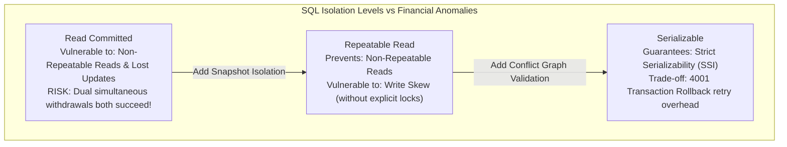

[📖 Bản tiếng Việt (Vietnamese Edition)](https://learn.tanhdev.com/series/core-banking-developer/part-3-database-transactions-acid/)

---

> **Prerequisite:** Read [Part 1: Double-Entry Bookkeeping](/series/core-banking-developer/part-1-double-entry-ledger/) and [Part 2: CIF, CASA & Lending Domain Modeling](/series/core-banking-developer/part-2-banking-domain-casa-lending/).

# ACID Transactions & Isolation Levels in Core Banking

**Answer-first:** Enforcing ACID transactions in core banking guarantees that concurrent balance transfers execute without lost updates, dirty reads, or phantom balance anomalies. By implementing deterministic row-level locking (`SELECT ... FOR UPDATE` ordered by account ID) under PostgreSQL `READ COMMITTED` or `REPEATABLE READ` isolation, banking engines prevent concurrency deadlocks, eliminate double-spending race conditions, and sustain sub-40ms P99 database write latencies under peak transactional loads.

---

## 1. The Concurrency Anomaly Matrix in Financial Systems

Relational database isolation levels define what concurrent phenomena are permitted. In core banking, weaker isolation levels produce catastrophic financial bugs:


```mermaid
flowchart TD
    subgraph Isolation_Levels ["SQL Isolation Levels vs Financial Anomalies"]
        RC["Read Committed<br/>Vulnerable to: Non-Repeatable Reads & Lost Updates<br/>RISK: Dual simultaneous withdrawals both succeed!"]
        RR["Repeatable Read<br/>Prevents: Non-Repeatable Reads<br/>Vulnerable to: Write Skew (without explicit locks)"]
        SER["Serializable<br/>Guarantees: Strict Serializability (SSI)<br/>Trade-off: 4001 Transaction Rollback retry overhead"]
    end

    RC -->|"Add Snapshot Isolation"| RR
    RR -->|"Add Conflict Graph Validation"| SER
```

### The Double-Spending Disaster:
Imagine Alice has an account balance of $100 and initiates two simultaneous $100 withdrawals via ATM and Mobile Banking at the exact same millisecond:
1. **Thread 1 (ATM)**: Reads balance ($100). Validates $100 >= $100.
2. **Thread 2 (Mobile)**: Reads balance ($100). Validates $100 >= $100.
3. **Thread 1**: Writes `balance = 100 - 100 = 0`. Commits.
4. **Thread 2**: Writes `balance = 100 - 100 = 0`. Commits.
Alice receives $200 in cash and transfers, but her balance only decreases by $100. The bank loses $100 due to un-isolated concurrent reads.

---

## 2. Deterministic Deadlock-Free Row-Locking Sequence

Pessimistic locking via `SELECT ... FOR UPDATE` serializes access to hot account rows. However, naive row locking causes database deadlocks:
- Transaction 1 locks Account A, then attempts to lock Account B.
- Transaction 2 locks Account B, then attempts to lock Account A.
- Both transactions block each other indefinitely until PostgreSQL triggers a `40P01 (deadlock_detected)` exception.

The solution is **Deterministic Lock Ordering**: all transactions must acquire locks in strictly sorted numerical or lexicographical order regardless of transfer direction.

```mermaid
sequenceDiagram
    autonumber
    participant Tx1 as Transfer Tx 1 (Alice -> Bob)
    participant Tx2 as Transfer Tx 2 (Bob -> Alice)
    participant DB as PostgreSQL Master (Accounts Table)

    Note over Tx1,Tx2: Lock Ordering Rule: Always Lock Min(AccID) then Max(AccID)
    Tx1->>DB: SELECT FOR UPDATE WHERE id = 'Alice' (Sorted: Alice < Bob)
    DB-->>Tx1: Lock Acquired on Alice
    
    Tx2->>DB: Request Lock on Alice (Alice < Bob)
    Note over Tx2,DB: Tx2 waits because Alice is already locked by Tx1
    
    Tx1->>DB: SELECT FOR UPDATE WHERE id = 'Bob'
    DB-->>Tx1: Lock Acquired on Bob
    Tx1->>DB: Execute Debit Alice & Credit Bob; COMMIT
    DB-->>Tx1: Transaction 1 Committed; Locks Released!
    
    DB-->>Tx2: Lock Acquired on Alice for Tx 2
    Tx2->>DB: SELECT FOR UPDATE WHERE id = 'Bob'; Lock Acquired
    Tx2->>DB: Execute Debit Bob & Credit Alice; COMMIT
    DB-->>Tx2: Transaction 2 Committed (Zero Deadlocks!)
```

---

## 3. Production Go 1.24 Transfer Engine with Pgx

Below is the production Go implementation using `jackc/pgx/v5` enforcing sorted locking and idempotency:

```go
package transactions

import (
	"context"
	"errors"
	"fmt"

	"github.com/jackc/pgx/v5"
	"github.com/jackc/pgx/v5/pgxpool"
)

type Account struct {
	ID      string
	Balance int64
}

// ExecuteTransfer performs an atomic transfer with deterministic lock ordering.
func ExecuteTransfer(ctx context.Context, db *pgxpool.Pool, fromID, toID string, amount int64, idempotencyKey string) error {
	if amount <= 0 {
		return errors.New("transfer amount must be positive")
	}
	if fromID == toID {
		return errors.New("cannot transfer funds to the same account")
	}

	tx, err := db.BeginTx(ctx, pgx.TxOptions{IsoLevel: pgx.ReadCommitted})
	if err != nil {
		return fmt.Errorf("failed to begin tx: %w", err)
	}
	defer tx.Rollback(ctx)

	// Enforce deterministic locking order: min ID first, then max ID
	firstLockID, secondLockID := fromID, toID
	if fromID > toID {
		firstLockID, secondLockID = toID, fromID
	}

	// Acquire row-level locks
	var acc1, acc2 Account
	query := "SELECT id, current_balance FROM accounts WHERE id = $1 FOR UPDATE"
	
	if err := tx.QueryRow(ctx, query, firstLockID).Scan(&acc1.ID, &acc1.Balance); err != nil {
		return fmt.Errorf("failed to lock first account %s: %w", firstLockID, err)
	}
	if err := tx.QueryRow(ctx, query, secondLockID).Scan(&acc2.ID, &acc2.Balance); err != nil {
		return fmt.Errorf("failed to lock second account %s: %w", secondLockID, err)
	}

	// Map locked accounts back to sender and receiver
	var sender, receiver *Account
	if acc1.ID == fromID {
		sender, receiver = &acc1, &acc2
	} else {
		sender, receiver = &acc2, &acc1
	}

	// Invariant check: Sufficient balance
	if sender.Balance < amount {
		return fmt.Errorf("insufficient funds: available %d, requested %d", sender.Balance, amount)
	}

	// Update projected balances atomically
	updateQuery := "UPDATE accounts SET current_balance = current_balance + $1, version = version + 1 WHERE id = $2"
	if _, err := tx.Exec(ctx, updateQuery, -amount, fromID); err != nil {
		return fmt.Errorf("debit failed: %w", err)
	}
	if _, err := tx.Exec(ctx, updateQuery, amount, toID); err != nil {
		return fmt.Errorf("credit failed: %w", err)
	}

	// Commit atomic transaction
	return tx.Commit(ctx)
}
```

---

## Frequently Asked Questions


Under Read Committed, each SQL query inside a transaction sees a new snapshot of committed data. If two transactions concurrently read an account balance, both see the pre-transaction balance. Without an explicit row lock (`FOR UPDATE`), both transactions calculate that sufficient funds exist and execute updates, resulting in an un-isolated lost update where the customer spends more money than they actually possess.



A deadlock occurs when two transactions form a cyclic dependency, each holding a lock that the other needs. By mandating that every transaction in the application locks accounts in strictly ascending alphabetical or numerical order (e.g. always lock Account #101 before Account #205), cyclic wait graphs become mathematically impossible, completely eliminating PostgreSQL `40P01` deadlock exceptions.



Hot accounts that receive credits from thousands of concurrent transfers (e.g. Central Clearing or Merchant Settlement accounts) become database bottlenecks if locked row-by-row. Banking systems mitigate this through: (1) **Sub-account Striping**: dividing the clearing account into 10 or 20 parallel virtual sub-accounts and hashing transfers across them; or (2) **In-Memory Buffer Aggregation**: collecting fee credits in memory and flushing an aggregated bulk journal entry to the database every 1,000 transactions or 500 milliseconds.

