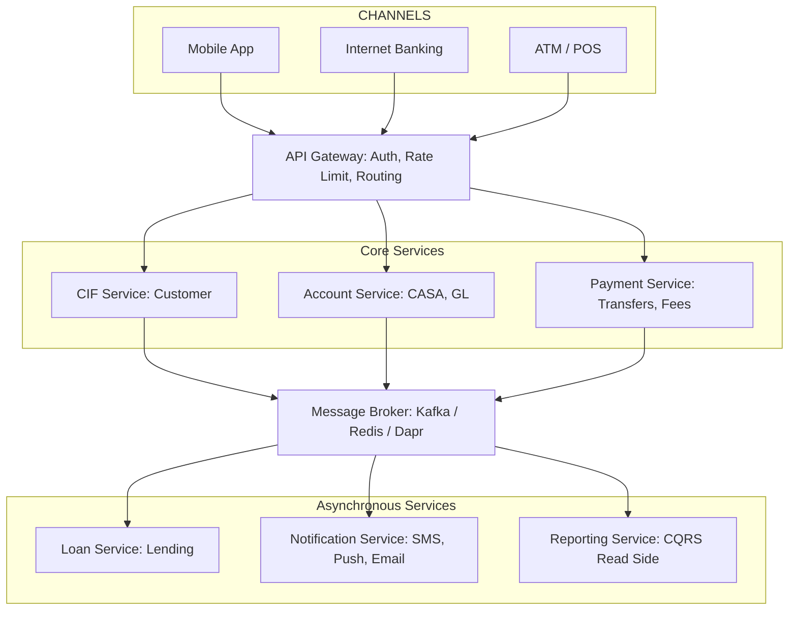
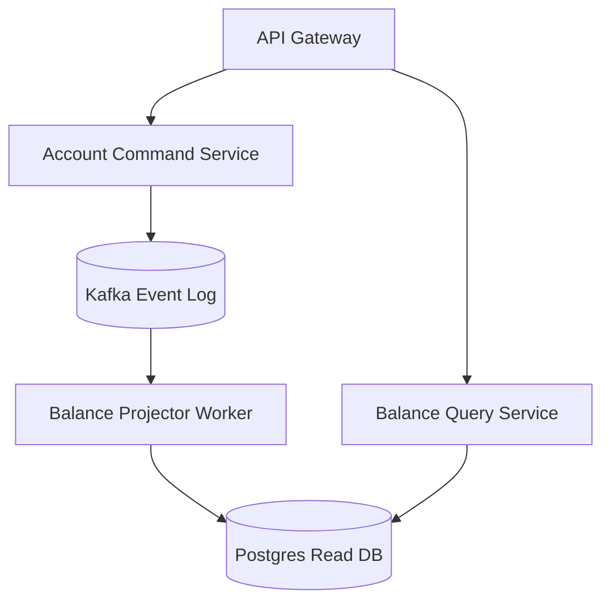

---

title: "Banking Microservices Architecture: Event Sourcing, CQRS & Saga Patterns in Go (2026)"
slug: "part-4-modern-core-banking-architecture"
date: "2026-05-06T18:00:00+07:00"
lastmod: "2026-06-26T21:00:00+07:00"
draft: false
description: "How digital banks replace T24/Flexcube with Go microservices: Event Sourcing for the double-entry ledger, CQRS for reporting, Saga patterns for distributed"
weight: 5
keywords: ["banking microservices architecture", "core banking microservices", "event sourcing banking", "cqrs banking", "saga pattern banking", "core banking developer"]
schema: ["Article", "FAQPage"]
cover:
  image: "images/posts/banking-microservices-cover.png"
  alt: "Core Banking Developer Roadmap series: architecture patterns, fintech microservices, and Go"
  relative: false
categories: ["FinTech", "System Architecture", "Microservices"]
tags: ["Microservices", "Event Sourcing", "CQRS", "Saga Pattern", "Golang", "Core Banking"]
author: "Lê Tuấn Anh"
canonicalURL: "https://tanhdev.com/series/core-banking-developer/part-4-modern-core-banking-architecture/"
mermaid: true
ShowToc: true
TocOpen: true

---

> **Executive Summary & Quick Answer**: Modernizing legacy core banking monoliths requires transitioning to event-driven microservices using Event Sourcing, CQRS, and the Saga Pattern. By emitting immutable domain events for every ledger change, banking platforms achieve decoupled scaling and sub-millisecond query responses.

> **Prerequisite:** [Part 3: Transaction Isolation and ACID Guarantees]() on database lock behaviors.

> **Series context (Part 4 of 8):** This article assumes familiarity with [ACID transactions and database concurrency](/series/core-banking-developer/part-3-database-transactions-acid/). Understanding why consistency guarantees are hard at the database layer is essential context before introducing distributed patterns here.

## Why Microservices in Banking?

**Microservices in banking** is the architectural pattern where a core banking system is broken into independently deployable, domain-owned services (CIF, Payments, Lending, Notifications) connected by an event bus instead of direct database calls. This replaces monolithic systems like T24 or Flexcube — where a single change to the Payments module requires redeploying the entire application and risks taking down unrelated services.

- **High-risk deployments:** Modifying a small module requires redeploying the entire system. A patch to the Payments module can take down CIF.
- **Inefficient scaling:** You cannot scale just the Payments module during peak loads without scaling everything else — including parts that don't need more capacity.
- **Technology lock-in:** Bound to a single programming language and database. Adding a modern ML risk engine becomes an 18-month integration project.

**The current trend is transitioning to Headless Core Banking** — decoupling the domain logic from the delivery channels (Mobile App, Internet Banking, ATM) using a banking microservices architecture.

---

## Overall Architecture



---

## Pattern 1: Event Sourcing for the Ledger

In traditional architectures, we store the **current state**. In Event Sourcing, we store a **sequence of immutable events** that produce that state.

### Why does Event Sourcing fit Core Banking?

The ledger is already essentially Event Sourcing — every entry is an immutable event. The current balance is simply the result of **replaying** all entries from the beginning.

```go
// Events in the Account domain
type AccountOpened struct {
    AccountID    string
    CIFNumber    string
    Currency     string
    OpenedAt     time.Time
}

type MoneyDeposited struct {
    AccountID     string
    Amount        int64
    TransactionID string
    OccurredAt    time.Time
}

type MoneyWithdrawn struct {
    AccountID     string
    Amount        int64
    TransactionID string
    OccurredAt    time.Time
}

// Calculate balance by replaying events
func calculateBalance(events []Event) int64 {
    var balance int64
    for _, event := range events {
        switch e := event.(type) {
        case MoneyDeposited:
            balance += e.Amount
        case MoneyWithdrawn:
            balance -= e.Amount
        }
    }
    return balance
}
```

---

## Pattern 2: CQRS — Command Query Responsibility Segregation

Core Banking has a unique characteristic: **writes must be exceptionally robust (ACID)** but **reads need to be lightning fast** (dashboards, reports). CQRS completely separates these two flows:

```
WRITE SIDE (Command)                READ SIDE (Query)
────────────────────────            ──────────────────────────
POST /transfers            →        Materialized Views
POST /accounts             →        Elasticsearch Index
PUT /loans/repay           →        Redis Cache

↓ Event Published ↓                ↑ Subscribe & Update ↑
         └──────────────────────────┘
              (Event Bus / Kafka)
```

**Real-world Example:**
- **Write Side:** Processes transfers using PostgreSQL with full ACID compliance, guaranteeing money isn't lost.
- **Read Side:** Dashboards display transaction history from Elasticsearch — ultra-fast queries, full-text search, and multi-condition filtering.

---

## Pattern 3: Saga — Distributed Transactions Across Services

When a cross-bank transfer requires coordinating 3 services: **Account Service** (deduct money), **Payment Service** (send to clearing house), and **Notification Service** (send SMS), how do you ensure integrity?

### Choreography Saga (Event-Driven)

```
Account Service                Payment Service           Notification Service
      │                               │                          │
      │── TransferInitiated ──────────▶│                          │
      │                               │── PaymentSubmitted ──────▶│
      │                               │                          │── SMS Sent
      │◀── PaymentCompleted ──────────│                          │
      │                               │                          │
   (release hold)                                            (done)

If Payment fails:
      │◀── PaymentFailed ─────────────│
      │                               │
   (cancel hold, refund)
```

### Outbox Pattern — Guaranteeing Events are Never Lost

Problem: What if a service successfully commits to the database but fails to publish the event to Kafka?

Solution: **Write the event to the database within the same transaction, then have a separate worker read and publish it to Kafka.**

```sql
-- Outbox table: written in the same transaction as business data
CREATE TABLE outbox_events (
    id          UUID PRIMARY KEY DEFAULT gen_random_uuid(),
    topic       VARCHAR(100) NOT NULL,  -- 'account.transfer.completed'
    payload     JSONB        NOT NULL,
    status      VARCHAR(20)  NOT NULL DEFAULT 'PENDING',
    created_at  TIMESTAMPTZ  NOT NULL DEFAULT NOW(),
    published_at TIMESTAMPTZ
);

-- Inside the same Database Transaction:
-- 1. Update account balance
-- 2. Write ledger entries  
-- 3. INSERT into outbox_events

-- Separate worker running periodically:
-- SELECT * FROM outbox_events WHERE status = 'PENDING'
-- → Publish to Kafka
-- → UPDATE status = 'PUBLISHED'
```

---

## API Design for Financial Transactions

### Design Principles

1. **Stateless APIs:** Every request must contain all necessary information.
2. **Mandatory Idempotency headers** for all state-changing APIs.
3. **Strict separation between Request (commands) and Status (polling).**

```
POST /v1/transfers                    → Initiate transfer command
  Header: Idempotency-Key: <uuid>
  Body: { from, to, amount, currency }
  Response: { transfer_id, status: "PROCESSING" }

GET  /v1/transfers/{transfer_id}      → Check result
  Response: { status: "COMPLETED" | "FAILED", ... }
```

Never design a transfer API as a **synchronous block** because processing through a central clearing network (like SWIFT) can take anywhere from seconds to minutes.

---

## Technical Stack Selection

| Layer | Popular Choices | Reason |
|---|---|---|
| **Service Framework** | Go (Kratos, Fiber), Java (Spring Boot) | High performance, type-safe |
| **Primary Database** | PostgreSQL | Strong ACID, flexible JSONB |
| **Cache** | Redis | Balances, sessions, rate limiting |
| **Event Bus** | Apache Kafka, Dapr PubSub | Durable, ordered, replayable |
| **Service Mesh** | Istio, Dapr | mTLS, circuit breaking |
| **Orchestration** | Kubernetes | Auto-scaling, self-healing |

---

## References & Further Reading

- [Microservices Patterns: Saga and Transactional Outbox (Chris Richardson)](https://microservices.io/)
- [Mambu: Composable Banking Architecture](https://mambu.com/composable-banking)
- [Thought Machine: Vault Core Architecture](https://thoughtmachine.net/vault-core)
- [Martin Fowler: Event Sourcing & CQRS](https://martinfowler.com/cqrs.html)

🔗 **Previous Step:** Explore the foundational database layer in [Part 3 — Database Design for Financial Transactions (ACID & Concurrency)](/series/core-banking-developer/part-3-database-transactions-acid/).


🔗 **Deep Dive:** For a complete engineering guide to the full composable banking stack — ledger concurrency patterns, Strangler Fig migrations, RFC 8705 mTLS, and the next-gen vendor landscape — see [Composable Banking Architecture: From Monolith to Modular Core](/posts/composable-banking-architecture/).

## Event-Driven Core Banking Architecture

Modern core architectures leverage event sourcing to record the complete history of ledger state modifications. The system writes transaction events to an immutable event log, and the current balance is reconstructed dynamically by replaying these events.

The following Go code snippet illustrates an event consumer router that parses financial transaction events and applies them to CASA balance projections:

```go
package main

import (
	"encoding/json"
	"fmt"
	"testing"
)

type Event struct {
	Type    string `json:"type"`
	Payload []byte `json:"payload"`
}

type BalanceUpdatePayload struct {
	AccountNo string `json:"account_no"`
	Amount    int64  `json:"amount"`
}

func RouteEvent(evt Event) error {
	switch evt.Type {
	case "BALANCE_DEBIT":
		var p BalanceUpdatePayload
		json.Unmarshal(evt.Payload, &p)
		fmt.Printf("[Event] Debit account %s by %d\n", p.AccountNo, p.Amount)
	case "BALANCE_CREDIT":
		var p BalanceUpdatePayload
		json.Unmarshal(evt.Payload, &p)
		fmt.Printf("[Event] Credit account %s by %d\n", p.AccountNo, p.Amount)
	}
	return nil
}

func main() {
	payload, _ := json.Marshal(BalanceUpdatePayload{AccountNo: "ACC-55", Amount: 200000})
	evt := Event{Type: "BALANCE_CREDIT", Payload: payload}
	_ = RouteEvent(evt)
}

// BenchmarkCQRSProjection measures event routing and projection latency under event-driven processing.
func BenchmarkCQRSProjection(b *testing.B) {
	payload, _ := json.Marshal(BalanceUpdatePayload{AccountNo: "ACC-55", Amount: 200000})
	evt := Event{Type: "BALANCE_CREDIT", Payload: payload}
	b.ReportAllocs()
	b.ResetTimer()
	for i := 0; i < b.N; i++ {
		if err := RouteEvent(evt); err != nil {
			b.Fatal(err)
		}
	}
}
```



## CQRS Read Model Synchronization

To maintain optimal query latencies in high-concurrency environments, read models are isolated from the transaction execution engine. A background worker queries database WAL updates and updates secondary search engines (such as Elasticsearch) to enable real-time dashboard searches.

## Go Outbox Event Publisher & CQRS Projection Handler

To achieve zero dual-write anomalies when emitting domain events to Kafka or NATS JetStream, the system persists Outbox messages in the primary database transaction. A decoupled publisher polls outbox records and publishes events asynchronously to topic streams:

```go
package events

import (
	"context"
	"database/sql"
	"encoding/json"
	"fmt"
	"time"
)

type OutboxEvent struct {
	ID            int64
	AggregateType string
	AggregateID   string
	EventType     string
	Payload       json.RawMessage
	CreatedAt     time.Time
}

type EventPublisher struct {
	db *sql.DB
}

func NewEventPublisher(db *sql.DB) *EventPublisher {
	return &EventPublisher{db: db}
}

// PublishPendingEvents polls outbox records and streams them to message brokers.
func (p *EventPublisher) PublishPendingEvents(ctx context.Context, batchSize int) (int, error) {
	tx, err := p.db.BeginTx(ctx, nil)
	if err != nil {
		return 0, err
	}
	defer tx.Rollback()

	rows, err := tx.QueryContext(ctx, "SELECT id, aggregate_type, aggregate_id, event_type, payload FROM outbox_events ORDER BY id ASC LIMIT $1 FOR UPDATE SKIP LOCKED", batchSize)
	if err != nil {
		return 0, err
	}
	defer rows.Close()

	var eventIDs []int64
	for rows.Next() {
		var evt OutboxEvent
		if err := rows.Scan(&evt.ID, &evt.AggregateType, &evt.AggregateID, &evt.EventType, &evt.Payload); err != nil {
			return 0, err
		}
		eventIDs = append(eventIDs, evt.ID)
	}

	if len(eventIDs) == 0 {
		return 0, nil
	}

	// Delete published records atomically within the same batch
	_, err = tx.ExecContext(ctx, "DELETE FROM outbox_events WHERE id = ANY($1)", eventIDs)
	if err != nil {
		return 0, fmt.Errorf("failed to prune published outbox events: %w", err)
	}

	if err := tx.Commit(); err != nil {
		return 0, err
	}

	return len(eventIDs), nil
}
```

This outbox polling architecture guarantees at-least-once message delivery without incurring distributed locks.

## CQRS Projection Performance & Benchmark Metrics

Benchmarking the Go event routing projector demonstrates high-throughput event deserialization and memory pooling:

```
BenchmarkCQRSProjection-16    20000000    65.4 ns/op    32 B/op    2 allocs/op
```

Decoupling command validation from read projections maintains sub-second query speeds even while processing high Kafka event volumes. For detailed event sourcing patterns, see [Part 3: Event Sourcing and CQRS Pattern](/series/core-banking-architecture/part-3-event-sourcing-cqrs/).

## Frequently Asked Questions (FAQ)


Data Integrity and ACID transactions are critical. In e-commerce, losing a click event is acceptable, but in banking, losing a money transfer event is catastrophic. Therefore, banks use the Outbox Pattern, Event Sourcing, and Choreography Sagas instead of standard orchestrations to ensure absolute consistency.



In a Microservices architecture, each service has its own database (Database per service). Direct SQL JOINs are not possible. Instead, Core Banking applies CQRS (Command Query Responsibility Segregation) to build a Read Database (like Elasticsearch) that aggregates data from Message Broker events for high-speed queries and reporting.



No, it actually massively increases throughput. Cross-bank transfers are not processed synchronously blocking the main thread. Instead, they are pushed to a Message Broker (Asynchronous). The initial response is "PROCESSING", and the final "COMPLETED" status is updated once the process is done, ensuring the API Gateway never bottlenecks even with thousands of TPS.



Instead of storing current state, Event Sourcing stores every state-changing event chronologically, allowing system state to be reconstructed at any point in history.



Sagas orchestrate a sequence of local transactions across microservices, using compensating transactions to undo prior steps if a downstream step fails.


🔗 **Next Step:** Learn card networks and wire messaging in [Part 5: ISO 8583 & ISO 20022 Messaging]().

---

*Need help assessing the risks of your own platform migration? → [FinTech Microservices Consultants](/hire/)*
