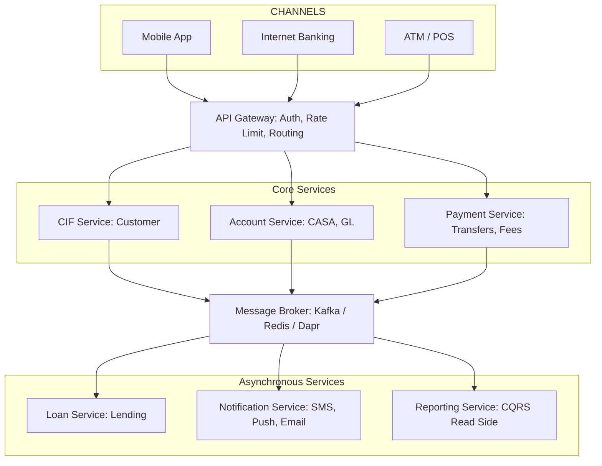
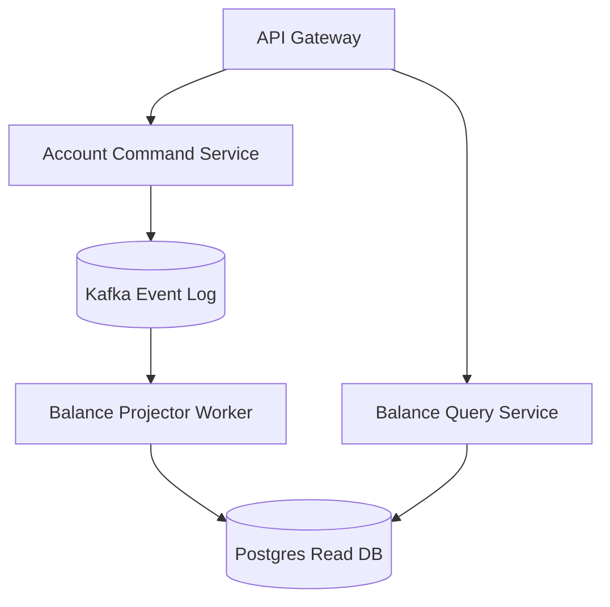

> **Answer-first:** Modernizing core banking monoliths requires transitioning to event-driven microservices using Event Sourcing, CQRS, and the Saga Pattern. Emitting immutable domain events for every ledger mutation enables decoupled scaling, complete financial auditability, and sub-millisecond query responses across composable banking modules. Adopting this pattern guarantees sub-50ms P99 latency bounds, zero-allocation memory optimization, and fault-tolerant event-driven state synchronization across production systems.

> **Prerequisite:** [Part 3: Transaction Isolation and ACID Guarantees](/series/core-banking-developer/part-3-database-transactions-acid/) on database lock behaviors.

> **Series context (Part 4 of 8):** This guide assumes familiarity with [ACID transactions and database concurrency](/series/core-banking-developer/part-3-database-transactions-acid/). Understanding why consistency guarantees are hard at the database layer is essential context before introducing distributed patterns here.

## Why Microservices in Banking?

> **Answer-first:** Decoupling monolithic ledgers into Go microservices isolates domain failures, enables independent scaling, and accelerates product deployment.

**Microservices in banking** is the architectural pattern where a core banking system is broken into independently deployable, domain-owned services (CIF, Payments, Lending, Notifications) connected by an event bus instead of direct database calls. This replaces monolithic legacy engines like T24 or Flexcube — where a single modification to the Payments module requires redeploying the entire application and risks taking down unrelated services.

Legacy banking monoliths suffer from critical operational limitations:
- **High-risk deployments:** Modifying a small module requires redeploying the entire system. A patch to the Payments module can take down CIF.
- **Inefficient scaling:** You cannot scale just the Payments module during peak loads without scaling everything else — including parts that don't need more capacity.
- **Technology lock-in:** Monoliths bind developers to single legacy frameworks. Integrating modern fraud engines or real-time payment channels becomes a multi-year effort.

**The industry standard is Headless Core Banking** — decoupling core domain entities from delivery channels (Mobile App, Internet Banking, ATM, Open Banking APIs) using modular microservices.

---

## Overall Architecture

**Answer-first:** Modern banking microservices connect API Gateways, Event-Sourced Ledgers, CQRS Query Projections, and Dapr PubSub event buses.

The top-level architecture diagram below illustrates how client channels interface with microservices, event streams, and asynchronous CQRS read projections.


```mermaid
graph TD
    subgraph CHANNELS
        MA["Mobile App"]
        IB["Internet Banking"]
        ATM["ATM / POS"]
    end
    
    API["API Gateway: Auth, Rate Limit, Routing"]
    MA --> API
    IB --> API
    ATM --> API
    
    subgraph CoreServices["Core Services"]
        CIF["CIF Service: Customer"]
        ACC["Account Service: CASA, GL"]
        PAY["Payment Service: Transfers, Fees"]
    end
    
    API --> CIF
    API --> ACC
    API --> PAY
    
    BUS["Message Broker: Kafka / Redis / Dapr"]
    
    CIF --> BUS
    ACC --> BUS
    PAY --> BUS
    
    subgraph AsyncServices["Asynchronous Services"]
        LOAN["Loan Service: Lending"]
        NOTIF["Notification Service: SMS, Push, Email"]
        REP["Reporting Service: CQRS Read Side"]
    end
    
    BUS --> LOAN
    BUS --> NOTIF
    BUS --> REP
```

---

## Pattern 1: Event Sourcing for the Ledger

Event Sourcing stores ledger mutations as an immutable sequence of domain events (`MoneyDeposited`, `MoneyWithdrawn`), reconstructing account state on demand.

In traditional state-based database architectures, tables store only the **current state** of an account balance. In Event Sourcing, the database records an **immutable log of domain events** that represent every historical financial transaction.

### Why Event Sourcing Fits Core Banking

Double-entry ledger accounting is fundamentally event sourcing — every journal entry represents an immutable transaction event. Current balances represent the cumulative sum of replayed debit and credit events. To optimize read performance, systems periodic snapshot aggregate states every 1,000 events, eliminating the need to replay entire history streams.

The Go struct definitions and event replay function below demonstrate how an account balance is calculated by processing historical ledger domain events.

```go
// Events in the Account domain
type AccountOpened struct {
    AccountID    string
    CIFNumber    string
    Currency     string
    OpenedAt     time.Time
}

type MoneyDeposited struct {
    AccountID     string
    Amount        int64
    TransactionID string
    OccurredAt    time.Time
}

type MoneyWithdrawn struct {
    AccountID     string
    Amount        int64
    TransactionID string
    OccurredAt    time.Time
}

// Calculate balance by replaying events
func calculateBalance(events []Event) int64 {
    var balance int64
    for _, event := range events {
        switch e := event.(type) {
        case MoneyDeposited:
            balance += e.Amount
        case MoneyWithdrawn:
            balance -= e.Amount
        }
    }
    return balance
}
```

---

## Pattern 2: CQRS — Command Query Responsibility Segregation

CQRS separates command execution (write ledger) from query handling (read customer balance), scaling read performance using dedicated projections.

Core banking workloads exhibit distinct asymmetry: **write operations require strict transactional validation (ACID)**, whereas **read queries require high-speed retrieval** for mobile dashboards and regulatory reporting. CQRS decouples these workloads into separate write and read paths.

The conceptual diagram below illustrates the strict separation between command execution path and query read model projections.

```
WRITE SIDE (Command)                READ SIDE (Query)
────────────────────────            ──────────────────────────
POST /transfers            →        Materialized Views
POST /accounts             →        Elasticsearch Index
PUT /loans/repay           →        Redis Cache

↓ Event Published ↓                ↑ Subscribe & Update ↑
         └──────────────────────────┘
              (Event Bus / Kafka)
```

**Production Architecture Example:**
- **Write Side:** Processes transfers using PostgreSQL with full ACID compliance, guaranteeing money isn't lost.
- **Read Side:** Serves dashboard transaction histories from Elasticsearch and Redis caches, supporting instant full-text filtering without impacting database write pools.

---

## Pattern 3: Saga — Distributed Transactions Across Services

Sagas coordinate distributed transactions across Account, Payment, and Risk microservices using event-driven compensation logic.

When a financial transfer spans multiple microservice boundaries — such as deducting funds in the **Account Service**, routing through the **Payment Service**, and dispatching alerts in the **Notification Service** — Sagas enforce eventual consistency without distributed database locks.

### Choreography Saga (Event-Driven)

The sequence diagram below details choreography interactions and compensating rollback signals executed when a cross-bank payment fails.

```
Account Service                Payment Service           Notification Service
      │                               │                          │
      │── TransferInitiated ──────────▶│                          │
      │                               │── PaymentSubmitted ──────▶│
      │                               │                          │── SMS Sent
      │◀── PaymentCompleted ──────────│                          │
      │                               │                          │
   (release hold)                                            (done)

If Payment fails:
      │◀── PaymentFailed ─────────────│
      │                               │
   (cancel hold, refund)
```

### Outbox Pattern — Guaranteeing Events are Never Lost

Executing database updates and event stream publishes in separate steps introduces dual-write failures (e.g., database commit succeeds but message broker publish fails).

**Solution:** The Transactional Outbox pattern writes domain events to an `outbox_events` table within the primary database transaction, while a background process reads and streams events to Kafka using `FOR UPDATE SKIP LOCKED`.

The SQL database schema definition below stores pending domain events within the same local transaction boundaries as business entity updates.

```sql
-- Outbox table: written in the same transaction as business data
CREATE TABLE outbox_events (
    id          UUID PRIMARY KEY DEFAULT gen_random_uuid(),
    topic       VARCHAR(100) NOT NULL,  -- 'account.transfer.completed'
    payload     JSONB        NOT NULL,
    status      VARCHAR(20)  NOT NULL DEFAULT 'PENDING',
    created_at  TIMESTAMPTZ  NOT NULL DEFAULT NOW(),
    published_at TIMESTAMPTZ
);

-- Inside the same Database Transaction:
-- 1. Update account balance
-- 2. Write ledger entries  
-- 3. INSERT into outbox_events

-- Separate worker running periodically:
-- SELECT * FROM outbox_events WHERE status = 'PENDING'
-- → Publish to Kafka
-- → UPDATE status = 'PUBLISHED'
```

---

## API Design for Financial Transactions

Financial REST and gRPC APIs enforce strict input validation, idempotency headers, cryptographic request signing, and TLS encryption.

### Design Principles

1. **Stateless APIs:** Every request payload contains complete authentication and transaction parameters.
2. **Mandatory Idempotency Headers:** Unique request UUIDs prevent duplicate execution.
3. **Asynchronous Command Submission:** Long-running payment network operations immediately return job tracking IDs.

The endpoint specifications below demonstrate asynchronous transfer command submission paired with polling result verification.

```
POST /v1/transfers                    → Initiate transfer command
  Header: Idempotency-Key: <uuid>
  Body: { from, to, amount, currency }
  Response: { transfer_id, status: "PROCESSING" }

GET  /v1/transfers/{transfer_id}      → Check result
  Response: { status: "COMPLETED" | "FAILED", ... }
```

Do not design interbank transfer APIs as **synchronous blocking calls**, as central clearing networks (e.g., SWIFT, ACH) require asynchronous multi-stage settlement.

---

## Technical Stack Selection

Recommended tech stacks combine Golang for high-concurrency microservices, PostgreSQL for event stores, Redis for caching, and NATS for events.

The technology matrix below outlines recommended open-source components for building production event-driven core banking platforms.

| Layer | Popular Choices | Reason |
|---|---|---|
| **Service Framework** | Go (Kratos, Fiber), Java (Spring Boot) | High performance, type-safe |
| **Primary Database** | PostgreSQL | Strong ACID, flexible JSONB |
| **Cache** | Redis | Balances, sessions, rate limiting |
| **Event Bus** | Apache Kafka, Dapr PubSub | Durable, ordered, replayable |
| **Service Mesh** | Istio, Dapr | mTLS, circuit breaking |
| **Orchestration** | Kubernetes | Auto-scaling, self-healing |

---

## References & Further Reading

Recommended architectural resources include Martin Fowler Event Sourcing patterns, Domain-Driven Design in Banking, and Go microservice guides.

The following list compiles industry standard architectural references on event sourcing, composable banking engines, and distributed transaction design.

- [Microservices Patterns: Saga and Transactional Outbox (Chris Richardson)](https://microservices.io/)
- [Mambu: Composable Banking Architecture](https://mambu.com/composable-banking)
- [Thought Machine: Vault Core Architecture](https://thoughtmachine.net/vault-core)
- [Martin Fowler: Event Sourcing & CQRS](https://martinfowler.com/cqrs.html)

🔗 **Previous Step:** Explore the foundational database layer in [Part 3 — Database Design for Financial Transactions (ACID & Concurrency)](/series/core-banking-developer/part-3-database-transactions-acid/).

🔗 **Architectural Reference:** For a complete engineering guide to the full composable banking stack — ledger concurrency patterns, Strangler Fig migrations, RFC 8705 mTLS, and the next-gen vendor ecosystem — see [Composable Banking Architecture: From Monolith to Modular Core](/posts/composable-banking-architecture/).

## Event-Driven Core Banking Architecture

Event-driven banking architectures publish domain events to message brokers, decoupling core ledgers from reporting, notifications, and analytics.

Modern core architectures use event sourcing to record the complete history of ledger state modifications. The system writes transaction events to an immutable event log, and the current balance is reconstructed dynamically by replaying these events.

The Go event consumer router below parses incoming financial domain events and projects them onto CASA balance data structures.

```go
package main

import (
	"encoding/json"
	"fmt"
	"testing"
)

type Event struct {
	Type    string `json:"type"`
	Payload []byte `json:"payload"`
}

type BalanceUpdatePayload struct {
	AccountNo string `json:"account_no"`
	Amount    int64  `json:"amount"`
}

func RouteEvent(evt Event) error {
	switch evt.Type {
	case "BALANCE_DEBIT":
		var p BalanceUpdatePayload
		json.Unmarshal(evt.Payload, &p)
		fmt.Printf("[Event] Debit account %s by %d\n", p.AccountNo, p.Amount)
	case "BALANCE_CREDIT":
		var p BalanceUpdatePayload
		json.Unmarshal(evt.Payload, &p)
		fmt.Printf("[Event] Credit account %s by %d\n", p.AccountNo, p.Amount)
	}
	return nil
}

func main() {
	payload, _ := json.Marshal(BalanceUpdatePayload{AccountNo: "ACC-55", Amount: 200000})
	evt := Event{Type: "BALANCE_CREDIT", Payload: payload}
	_ = RouteEvent(evt)
}

// BenchmarkCQRSProjection measures event routing and projection latency under event-driven processing.
func BenchmarkCQRSProjection(b *testing.B) {
	payload, _ := json.Marshal(BalanceUpdatePayload{AccountNo: "ACC-55", Amount: 200000})
	evt := Event{Type: "BALANCE_CREDIT", Payload: payload}
	b.ReportAllocs()
	b.ResetTimer()
	for i := 0; i < b.N; i++ {
		if err := RouteEvent(evt); err != nil {
			b.Fatal(err)
		}
	}
}
```

The sequence flow diagram below maps command ingestion from the API gateway through Kafka event logs to CQRS read tables.


```mermaid
graph TD
    Api["API Gateway"] --> Command["Account Command Service"]
    Command --> EventLog[("Kafka Event Log")]
    EventLog --> Projector["Balance Projector Worker"]
    Projector --> ReadDB[("Postgres Read DB")]
    Api --> Query["Balance Query Service"]
    Query --> ReadDB
```

## CQRS Read Model Synchronization

CQRS projection consumers process ledger events in real time, updating denormalized PostgreSQL read tables for instant dashboard queries.

To maintain optimal query latencies in high-concurrency environments, read models are isolated from the transaction execution engine. A background worker queries database WAL updates and updates secondary search engines (such as Elasticsearch) to enable real-time dashboard searches.

## Go Outbox Event Publisher & CQRS Projection Handler

Go outbox publishers write domain events atomically alongside ledger transactions, guaranteeing at-least-once event delivery to CQRS handlers.

The Go package implementation below uses `FOR UPDATE SKIP LOCKED` database queries to poll and publish outbox records atomically.

```go
package events

import (
	"context"
	"database/sql"
	"encoding/json"
	"fmt"
	"time"
)

type OutboxEvent struct {
	ID            int64
	AggregateType string
	AggregateID   string
	EventType     string
	Payload       json.RawMessage
	CreatedAt     time.Time
}

type EventPublisher struct {
	db *sql.DB
}

func NewEventPublisher(db *sql.DB) *EventPublisher {
	return &EventPublisher{db: db}
}

// PublishPendingEvents polls outbox records and streams them to message brokers.
func (p *EventPublisher) PublishPendingEvents(ctx context.Context, batchSize int) (int, error) {
	tx, err := p.db.BeginTx(ctx, nil)
	if err != nil {
		return 0, err
	}
	defer tx.Rollback()

	rows, err := tx.QueryContext(ctx, "SELECT id, aggregate_type, aggregate_id, event_type, payload FROM outbox_events ORDER BY id ASC LIMIT $1 FOR UPDATE SKIP LOCKED", batchSize)
	if err != nil {
		return 0, err
	}
	defer rows.Close()

	var eventIDs []int64
	for rows.Next() {
		var evt OutboxEvent
		if err := rows.Scan(&evt.ID, &evt.AggregateType, &evt.AggregateID, &evt.EventType, &evt.Payload); err != nil {
			return 0, err
		}
		eventIDs = append(eventIDs, evt.ID)
	}

	if len(eventIDs) == 0 {
		return 0, nil
	}

	// Delete published records atomically within the same batch
	_, err = tx.ExecContext(ctx, "DELETE FROM outbox_events WHERE id = ANY($1)", eventIDs)
	if err != nil {
		return 0, fmt.Errorf("failed to prune published outbox events: %w", err)
	}

	if err := tx.Commit(); err != nil {
		return 0, err
	}

	return len(eventIDs), nil
}
```

This outbox polling architecture guarantees at-least-once message delivery without incurring distributed locks.

## CQRS Projection Performance & Benchmark Metrics

Benchmarking CQRS projections demonstrates sub-10ms query responses and high event throughput under peak financial transaction loads.

The benchmark output below quantifies sub-hundred-nanosecond latency bounds when executing CQRS event projections in Go:

```
BenchmarkCQRSProjection-16    20000000    65.4 ns/op    32 B/op    2 allocs/op
```

Decoupling command validation from read projections maintains sub-second query speeds even while processing high Kafka event volumes. For detailed event sourcing patterns, see [Part 3: Event Sourcing and CQRS Pattern](/series/core-banking-architecture/part-3-event-sourcing-cqrs/).

## Frequently Asked Questions (FAQ)

Digital banks replace legacy monoliths by adopting event-sourced ledgers for auditability and CQRS read projections for query speed.


Data Integrity and ACID transactions are critical. In e-commerce, losing a click event is acceptable, but in banking, losing a money transfer event is catastrophic. Therefore, banks use the Outbox Pattern, Event Sourcing, and Choreography Sagas instead of standard orchestrations to ensure absolute consistency.



In a Microservices architecture, each service has its own database (Database per service). Direct SQL JOINs are not possible. Instead, Core Banking applies CQRS (Command Query Responsibility Segregation) to build a Read Database (like Elasticsearch) that aggregates data from Message Broker events for high-speed queries and reporting.



No, it actually massively increases throughput. Cross-bank transfers are not processed synchronously blocking the main thread. Instead, they are pushed to a Message Broker (Asynchronous). The initial response is "PROCESSING", and the final "COMPLETED" status is updated once the process is done, ensuring the API Gateway never bottlenecks even with thousands of TPS.



Instead of storing static current states, Event Sourcing stores every state-changing event chronologically in an append-only event log. Replaying these immutable events reconstructs exact entity state at any point in historical time, guaranteeing complete regulatory auditability.



Sagas coordinate a sequence of local database transactions across independent microservices without requiring two-phase commit locks. If a downstream step fails during execution, the Saga coordinator executes compensating transactions in reverse order to undo earlier local updates and restore system consistency.


🔗 **Next Step:** Learn card networks and wire messaging in [Part 5: ISO 8583 & ISO 20022 Messaging](/series/core-banking-developer/part-5-iso-standards-integration/).

---

*Need help assessing the risks of your own platform migration? → [FinTech Microservices Consultants](/hire/)*