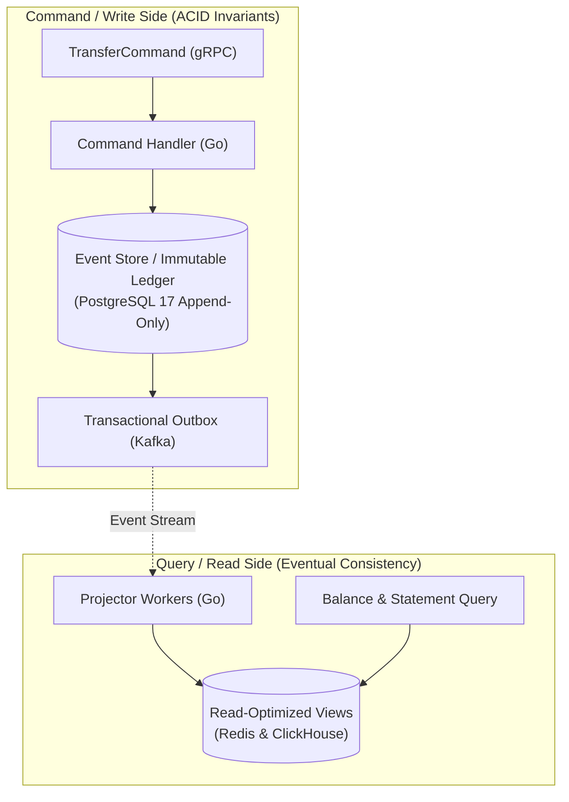
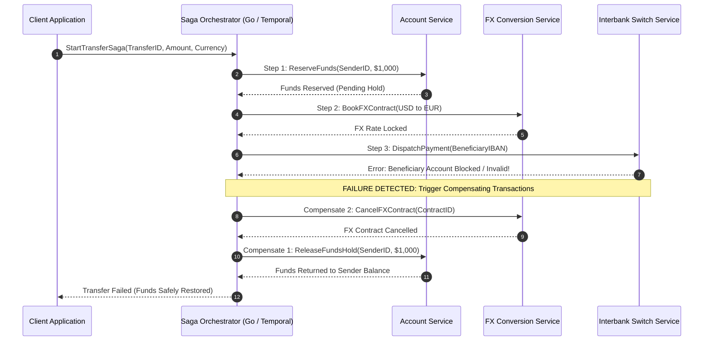

[📖 Bản tiếng Việt (Vietnamese Edition)](https://learn.tanhdev.com/series/core-banking-developer/part-4-modern-core-banking-architecture/)

---

> **Prerequisite:** Read [Part 3: ACID Transactions & Concurrency](/series/core-banking-developer/part-3-database-transactions-acid/) for database isolation mechanics.

# Banking Microservices Architecture: Event Sourcing & Saga

**Answer-first:** Modernizing legacy core banking monoliths requires transitioning to event-driven microservices governed by Event Sourcing, CQRS, and Orchestrated Sagas. Recording every balance mutation as an immutable domain event enables independent horizontal scaling, temporal auditability, and sub-millisecond query responses across decoupled banking domains while eliminating blocking Two-Phase Commit (2PC) bottlenecks.

---

## 1. CQRS & Event Sourcing Architecture for Core Banking

In traditional CRUD databases, updating an account overwrites historical state, destroying temporal context. With **Event Sourcing**, the state of an account is computed by replaying an immutable append-only event stream (`AccountCreated`, `FundsDeposited`, `FundsWithheld`, `InterestCapitalized`).

By pairing Event Sourcing with **CQRS (Command Query Responsibility Segregation)**, read-heavy queries (e.g. mobile app balance checks) are completely decoupled from write-heavy ledger commands:


```mermaid
flowchart TD
    subgraph Write_Side ["Command / Write Side (ACID Invariants)"]
        Cmd["TransferCommand (gRPC)"] --> Handler["Command Handler (Go)"]
        Handler --> EventStore[("Event Store / Immutable Ledger<br/>(PostgreSQL 17 Append-Only)")]
        EventStore --> Outbox["Transactional Outbox (Kafka)"]
    end

    subgraph Read_Side ["Query / Read Side (Eventual Consistency)"]
        Outbox -. Event Stream .-> Projector["Projector Workers (Go)"]
        Projector --> ReadDB[("Read-Optimized Views<br/>(Redis & ClickHouse)")]
        CustomerQuery["Balance & Statement Query"] --> ReadDB
    end
```

---

## 2. Distributed Saga Orchestration with Compensating Transactions

In a decoupled microservices architecture, a cross-border payment spans multiple independent services: Fraud Check -> Debit Sender -> Foreign Exchange -> Central Bank Switch -> Credit Beneficiary. Because distributed Two-Phase Commit (2PC) causes database locking vulnerabilities, banking systems mandate **Orchestrated Sagas** with deterministic compensating actions:


```mermaid
sequenceDiagram
    autonumber
    participant Client as Client Application
    participant Saga as Saga Orchestrator (Go / Temporal)
    participant AccountSvc as Account Service
    participant FXSvc as FX Conversion Service
    participant SwitchSvc as Interbank Switch Service

    Client->>Saga: StartTransferSaga(TransferID, Amount, Currency)
    Saga->>AccountSvc: Step 1: ReserveFunds(SenderID, $1,000)
    AccountSvc-->>Saga: Funds Reserved (Pending Hold)
    
    Saga->>FXSvc: Step 2: BookFXContract(USD to EUR)
    FXSvc-->>Saga: FX Rate Locked
    
    Saga->>SwitchSvc: Step 3: DispatchPayment(BeneficiaryIBAN)
    SwitchSvc-->>Saga: Error: Beneficiary Account Blocked / Invalid!
    
    Note over Saga,SwitchSvc: FAILURE DETECTED: Trigger Compensating Transactions
    Saga->>FXSvc: Compensate 2: CancelFXContract(ContractID)
    FXSvc-->>Saga: FX Contract Cancelled
    
    Saga->>AccountSvc: Compensate 1: ReleaseFundsHold(SenderID, $1,000)
    AccountSvc-->>Saga: Funds Returned to Sender Balance
    Saga-->>Client: Transfer Failed (Funds Safely Restored)
```

---

## 3. Go 1.24 Saga Orchestrator Implementation

Below is a robust Go implementation demonstrating an orchestrated state machine executing forward operations and automated compensating rollbacks:

```go
package saga

import (
	"context"
	"fmt"
)

type Step interface {
	Name() string
	Execute(ctx context.Context) error
	Compensate(ctx context.Context) error
}

type Orchestrator struct {
	steps []Step
}

func NewOrchestrator() *Orchestrator {
	return &Orchestrator{steps: make([]Step, 0)}
}

func (o *Orchestrator) AddStep(step Step) {
	o.steps = append(o.steps, step)
}

func (o *Orchestrator) Run(ctx context.Context) error {
	executedSteps := make([]Step, 0)

	for _, step := range o.steps {
		fmt.Printf("[Saga] Executing forward step: %s\n", step.Name())
		if err := step.Execute(ctx); err != nil {
			fmt.Printf("[Saga] Step %s failed: %v. Initiating rollbacks...\n", step.Name(), err)
			o.rollback(ctx, executedSteps)
			return fmt.Errorf("saga aborted at step %s: %w", step.Name(), err)
		}
		executedSteps = append(executedSteps, step)
	}

	fmt.Println("[Saga] All steps committed successfully.")
	return nil
}

func (o *Orchestrator) rollback(ctx context.Context, executed []Step) {
	// Execute compensating transactions in reverse order
	for i := len(executed) - 1; i >= 0; i-- {
		step := executed[i]
		fmt.Printf("[Saga] Executing compensation: %s\n", step.Name())
		if err := step.Compensate(ctx); err != nil {
			// In production, log to DLQ and page on-call SRE immediately
			fmt.Printf("[CRITICAL] Compensation failed for %s: %v. Manual intervention required!\n", step.Name(), err)
		}
	}
}
```

---

## Frequently Asked Questions


Choreography relies on services reacting to events without a centralized coordinator. In banking, this creates high operational risk: tracking the global state of a transaction becomes complex, cyclic dependencies can emerge, and verifying whether all compensating rollbacks executed during an outage is difficult. Orchestrated Sagas provide a single source of truth, deterministic audit logging, and guaranteed rollback tracking in centralized workflow engines like Temporal.



A failed compensating transaction is treated as a critical production event. The orchestrator retries the compensating step with exponential backoff and jitter. If the failure persists (e.g. downstream service unreachable), the transaction state is flagged as `COMPENSATION_FAILED` and emitted to a Dead Letter Queue (DLQ). A Sev-1 alert pages the on-call SRE team, and automated runbooks assist engineers in resolving the downstream dependency.



Because Event Sourcing preserves every historical domain mutation as an immutable log, calculating an account balance at any arbitrary timestamp in the past (e.g. "What was Customer X's balance on December 31, 2024 at 23:59:59 UTC?") simply requires replaying events up to that timestamp. This eliminates the need for expensive historical database backups and delivers mathematical proof of balance states for central bank audits.

