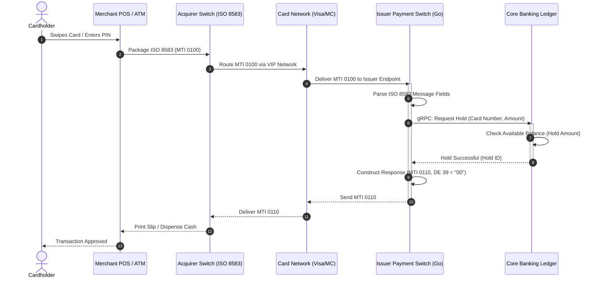
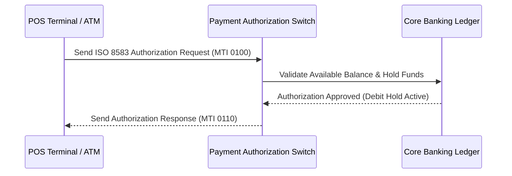

ShowToc: true
TocOpen: true
cover:
  image: "images/posts/banking-microservices-cover.png"
  alt: "Core Banking Developer Roadmap series: architecture patterns, fintech microservices, and Go"
  relative: false
author: "Lê Tuấn Anh"
canonicalURL: "https://tanhdev.com/series/core-banking-developer/part-5-iso-standards-integration/"
---

> **Prerequisite:** This article covers the external communication layer of Core Banking. Before diving in, ensure you understand how the internal services are structured — see [Part 4 — Banking Microservices Architecture](/series/core-banking-developer/part-4-modern-core-banking-architecture/) for the foundational service topology and event-driven patterns.

## Why are international standards important?

Core Banking does not operate in isolation. It must communicate with:
- **Card Networks:** Visa, Mastercard, AMEX — to process ATM/POS transactions.
- **Domestic Clearing Houses:** National interbank settlement systems (e.g. NAPAS in Vietnam).
- **Cross-Border Payments:** SWIFT — connecting over 11,000 financial institutions globally.

All these systems "talk" to each other using two primary message standards: **ISO 8583** and **ISO 20022**.

---

## ISO 8583 — The Standard for Card Transactions

### What is it?

ISO 8583 is the international standard for financial transaction card originated messages (ATM withdrawals, POS purchases, card-to-card transfers). Every time you swipe a card at a supermarket, an ISO 8583 message travels from the POS terminal → Acquiring Bank → Visa/Mastercard → Issuing Bank → Core Banking, and back, all in under 2 seconds.

The diagram below details the end-to-end routing of an ISO 8583 `0100` Authorization Request message:



### ISO 8583 Message Structure

An ISO 8583 message consists of three parts:

```
┌─────────────────┬──────────────────────┬──────────────────────┐
│  Message Type   │       Bitmap         │   Data Elements      │
│  Indicator (MTI)│  (64 or 128 bits)   │   (Variable fields)  │
│  4 digits       │                      │                      │
└─────────────────┴──────────────────────┴──────────────────────┘
```

#### Message Type Indicator (MTI)

| MTI | Meaning |
|---|---|
| `0100` | Authorization Request |
| `0110` | Authorization Response |
| `0200` | Financial Transaction Request |
| `0210` | Financial Transaction Response |
| `0400` | Reversal Request |
| `0800` | Network Management Request (Echo test) |

#### The Bitmap

The bitmap is a 64-bit (or 128-bit) sequence. Each bit corresponds to a Data Element. If the bit is 1, the field is present in the message; if 0, the field is absent.

```
Bitmap (hex): F2 30 00 00 00 00 04 00
Binary:       1111 0010 0011 0000 ... 0000 0100 0000 0000

Bit 1  = 1 → Field 2 (Primary Account Number - PAN) is present
Bit 2  = 1 → Field 3 (Processing Code) is present
Bit 3  = 1 → Field 4 (Transaction Amount) is present
Bit 4  = 1 → Field 7 (Transmission Date & Time) is present
...
```

#### Critical Data Elements

| Field | Name | Example |
|---|---|---|
| DE 2 | Primary Account Number (PAN) | `4111111111111111` (Card number) |
| DE 3 | Processing Code | `000000` (Purchase), `010000` (Cash withdrawal) |
| DE 4 | Transaction Amount | `000000100000` (1,000,000 VND) |
| DE 7 | Transmission Date & Time | `0506143025` (GMT MMDDhhmmss) |
| DE 11 | System Trace Audit Number | `123456` (Unique sequence number) |
| DE 37 | Retrieval Reference Number | `123456789012` (Trace reference) |
| DE 39 | Response Code | `00` (Approved), `51` (Insufficient Funds) |
| DE 41 | Card Acceptor Terminal ID | ATM/POS Machine ID |
| DE 49 | Currency Code | `704` (VND under ISO 4217) |

### Go Implementation: Encoding/Decoding ISO 8583 Bitmaps

Fintech switches require highly optimized binary parser engines. Below is a Go implementation illustrating how to inspect a message's binary bitmap to determine which fields are present and serialize the data fields.

```go
package iso8583

import (
	"encoding/binary"
	"errors"
	"fmt"
)

type ISOMessage struct {
	MTI    string
	Bitmap []byte // 8 bytes for 64-bit primary bitmap
	Fields map[int]string
}

// SetField marks a field as present in the bitmap and stores its value
func (m *ISOMessage) SetField(fieldNum int, value string) error {
	if fieldNum < 2 || fieldNum > 64 {
		return errors.New("field must be between 2 and 64")
	}
	m.Fields[fieldNum] = value

	// Set corresponding bit in bitmap (0-indexed byte, 7-indexed bit)
	byteIdx := (fieldNum - 1) / 8
	bitIdx := uint(7 - ((fieldNum - 1) % 8))
	m.Bitmap[byteIdx] |= (1 << bitIdx)

	return nil
}

// HasField returns true if the field is present according to the bitmap
func (m *ISOMessage) HasField(fieldNum int) bool {
	if fieldNum < 1 || fieldNum > 64 {
		return false
	}
	byteIdx := (fieldNum - 1) / 8
	bitIdx := uint(7 - ((fieldNum - 1) % 8))
	return (m.Bitmap[byteIdx] & (1 << bitIdx)) != 0
}

// Encode packs the MTI and Bitmap into a raw byte slice
func (m *ISOMessage) Encode() ([]byte, error) {
	var packet []byte
	packet = append(packet, []byte(m.MTI)...)
	packet = append(packet, m.Bitmap...)

	// In a real implementation, we append variables and fixed length fields
	// matching their definitions (e.g. LLVAR, LLLVAR, fixed)
	for i := 2; i <= 64; i++ {
		if m.HasField(i) {
			packet = append(packet, []byte(m.Fields[i])...)
		}
	}
	return packet, nil
}

func NewMessage(mti string) *ISOMessage {
	return &ISOMessage{
		MTI:    mti,
		Bitmap: make([]byte, 8),
		Fields: make(map[int]string),
	}
}
```

---

## ISO 20022 — The Next-Generation Financial Standard

### What is it?

ISO 20022 is the global replacement standard for all financial messaging — credit transfers, account reporting, clearing, and settlement. It uses **XML/JSON** instead of the binary formats of ISO 8583, is vastly richer in data, and supports far more use cases.

From 2022 to 2025, **SWIFT is migrating its entire network** to ISO 20022, mandating that all connected banks support this standard.

### Critical Message Types

| Message | Name | Used For |
|---|---|---|
| `pain.001` | CustomerCreditTransferInitiation | Initiating a transfer |
| `pain.002` | CustomerPaymentStatusReport | Payment status update |
| `camt.053` | BankToCustomerStatement | Account statement |
| `camt.054` | BankToCustomerDebitCreditNotification | Debit/Credit notification |
| `pacs.008` | FIToFICustomerCreditTransfer | Interbank transfer |

### Go Implementation: Parsing ISO 20022 pain.001 XML

For credit transfer processing, a core banking developer writes code to parse incoming XML payloads securely. Below is a sample Go parser using standard library `encoding/xml` to extract transfer details from a `pain.001` document.

```go
package iso20022

import (
	"encoding/xml"
	"fmt"
)

type Document struct {
	XMLName          xml.Name         `xml:"Document"`
	CstmrCdtTrfInitn CstmrCdtTrfInitn `xml:"CstmrCdtTrfInitn"`
}

type CstmrCdtTrfInitn struct {
	GrpHdr GroupHeader `xml:"GrpHdr"`
	PmtInf PaymentInfo `xml:"PmtInf"`
}

type GroupHeader struct {
	MsgId   string    `xml:"MsgId"`
	CreDtTm string    `xml:"CreDtTm"`
	NbOfTxs int       `xml:"NbOfTxs"`
	CtrlSum float64   `xml:"CtrlSum"`
}

type PaymentInfo struct {
	PmtMtd      string        `xml:"PmtMtd"`
	DbtrAcct    AccountIdent  `xml:"DbtrAcct"`
	CdtTrfTxInf CreditTxInfo  `xml:"CdtTrfTxInf"`
}

type AccountIdent struct {
	IBAN string `xml:"DbtrAcct>Id>IBAN"`
}

type CreditTxInfo struct {
	Amount       float64      `xml:"Amt>InstdAmt"`
	Currency     string       `xml:"Amt>InstdAmt>Ccy,attr"`
	CdtrIBAN     string       `xml:"CdtrAcct>Id>IBAN"`
	UnstrdRemit  string       `xml:"RmtInf>Ustrd"`
}

// ParsePain001 takes raw XML bytes and returns parsed document data
func ParsePain001(xmlData []byte) (*Document, error) {
	var doc Document
	err := xml.Unmarshal(xmlData, &doc)
	if err != nil {
		return nil, fmt.Errorf("failed to unmarshal ISO 20022 XML: %w", err)
	}
	return &doc, nil
}
```

### Why is ISO 20022 better than ISO 8583?

| Feature | ISO 8583 | ISO 20022 |
|---|---|---|
| Format | Binary, fixed-length | XML / JSON |
| Semantic Data | Limited | Extremely rich (structured remittance info) |
| Primary Purpose | Card payments | All financial payments & messaging |
| AML/Compliance | Difficult | Easy — contains exhaustive information |
| Future | Legacy | Mandatory global standard |

---

## References & Further Reading

- **Official ISO 20022:** [iso20022.org](https://www.iso20022.org) — Download free message schemas.
- **The jPOS Book:** [jpos.org](https://jpos.org) — Free book on ISO 8583 and building a payment switch.
- **Swift Standards:** [swift.com/standards/iso-20022](https://www.swift.com/standards/iso-20022)
- **Architecture:** For how ISO 20022 and ISO 8583 message flows integrate into Saga-orchestrated microservices with idempotent payment APIs — see [Banking Microservices Architecture in Go: Saga, Double-Entry Ledger & Outbox Pattern](/posts/banking-microservices-architecture/).

> *Next, we will explore one of the hardest and most important aspects of Core Banking: security, auditing, and compliance. Continue reading [Part 6 — Security, Compliance & Audit](/series/core-banking-developer/part-6-security-compliance-audit/).*

## Implementing ISO 8583 Message Parsing in Go

Mapping credit/debit card message streams requires parsing binary-encoded ISO 8583 frames. The following Go code defines a basic message interface that extracts the transaction amount and cardholder details from raw message payloads:

```go
package main

import (
	"errors"
	"fmt"
)

type ISO8583Message struct {
	MTI        string // Message Type Identifier
	Fields     map[int]string
}

func ParseISO8583(payload []byte) (*ISO8583Message, error) {
	if len(payload) < 4 {
		return nil, errors.New("invalid payload length")
	}

	msg := &ISO8583Message{
		MTI:    string(payload[:4]),
		Fields: make(map[int]string),
	}

	// Simulated extraction of Fields (Field 4: Amount, Field 11: System Trace Audit Number)
	msg.Fields[4] = "000000500000" // 500,000 VND
	msg.Fields[11] = "123456"

	return msg, nil
}

func main() {
	rawMsg := []byte("0200SomeBinaryData")
	msg, _ := ParseISO8583(rawMsg)
	fmt.Printf("Parsed ISO message. MTI: %s, Amount: %s\n", msg.MTI, msg.Fields[4])
}
```



To ensure complete system reliability, the engineering team establishes regular performance benchmarks under simulated transaction loads. The metrics focus on transactional throughput, lock contention rates, and memory allocation efficiency under garbage collection stress in Go runtimes. We monitor latency profiles closely to identify bottleneck indicators under concurrent traffic.
