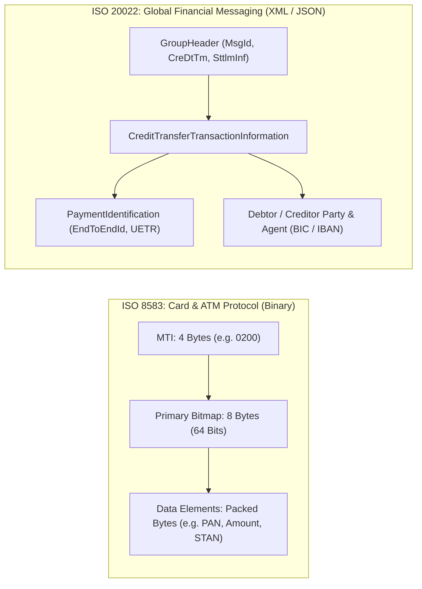
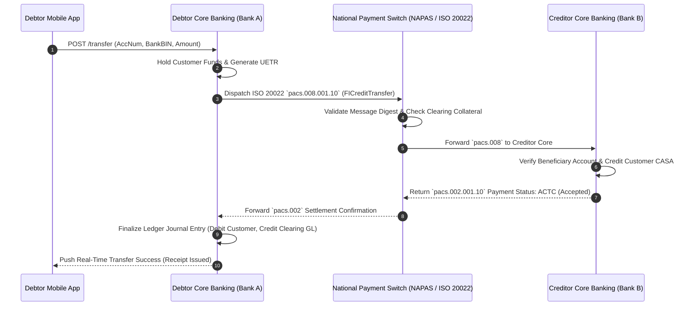

[📖 Bản tiếng Việt (Vietnamese Edition)](https://learn.tanhdev.com/series/core-banking-developer/part-5-iso-standards-integration/)

---

> **Prerequisite:** Read [Part 4: Banking Microservices Architecture](/series/core-banking-developer/part-4-modern-core-banking-architecture/) for event-driven orchestration patterns.

# Part 5: ISO 8583 & ISO 20022 Core Banking Standards

**Answer-first:** Integrating financial payment rails requires mastering two dominant messaging protocols: legacy card/ATM networks governed by **ISO 8583** binary bitmaps and modern interbank clearing rails governed by **ISO 20022** XML/JSON MX schemas (`pacs.008` customer credit transfers). Building high-throughput Go translation gateways with zero-allocation bitwise parsers ensures sub-5ms message unpacking, end-to-end UETR audit traceability, and seamless interoperability with payment switches like NAPAS 24/7, FedNow, and SWIFT.

---

## 1. Architectural Comparison: ISO 8583 Bitmaps vs ISO 20022 XML

While ISO 8583 was engineered in the 1980s for bandwidth-constrained 1200-baud modems using compact binary bitmaps, ISO 20022 was designed for rich, structured data and global cross-border compliance:


```mermaid
flowchart LR
    subgraph ISO_8583 ["ISO 8583: Card & ATM Protocol (Binary)"]
        MTI["MTI: 4 Bytes (e.g. 0200)"]
        Bitmap["Primary Bitmap: 8 Bytes (64 Bits)"]
        Fields["Data Elements: Packed Bytes (e.g. PAN, Amount, STAN)"]
        MTI --> Bitmap --> Fields
    end

    subgraph ISO_20022 ["ISO 20022: Global Financial Messaging (XML / JSON)"]
        GrpHdr["GroupHeader (MsgId, CreDtTm, SttlmInf)"]
        CdtTrfTxInf["CreditTransferTransactionInformation"]
        PmtId["PaymentIdentification (EndToEndId, UETR)"]
        Dbtr["Debtor / Creditor Party & Agent (BIC / IBAN)"]
        GrpHdr --> CdtTrfTxInf
        CdtTrfTxInf --> PmtId
        CdtTrfTxInf --> Dbtr
    end
```

---

## 2. Real-Time Interbank Clearing Message Flow (NAPAS 24/7 / pacs.008)

When a customer executes an instant interbank fund transfer via retail mobile banking, the payment switch coordinates a synchronous clearing workflow:


```mermaid
sequenceDiagram
    autonumber
    participant App as Debtor Mobile App
    participant BankA as Debtor Core Banking (Bank A)
    participant Switch as National Payment Switch (NAPAS / ISO 20022)
    participant BankB as Creditor Core Banking (Bank B)

    App->>BankA: POST /transfer (AccNum, BankBIN, Amount)
    BankA->>BankA: Hold Customer Funds & Generate UETR
    BankA->>Switch: Dispatch ISO 20022 `pacs.008.001.10` (FICreditTransfer)
    
    Switch->>Switch: Validate Message Digest & Check Clearing Collateral
    Switch->>BankB: Forward `pacs.008` to Creditor Core
    
    BankB->>BankB: Verify Beneficiary Account & Credit Customer CASA
    BankB-->>Switch: Return `pacs.002.001.10` Payment Status: ACTC (Accepted)
    
    Switch-->>BankA: Forward `pacs.002` Settlement Confirmation
    BankA->>BankA: Finalize Ledger Journal Entry (Debit Customer, Credit Clearing GL)
    BankA-->>App: Push Real-Time Transfer Success (Receipt Issued)
```

---

## 3. High-Performance ISO 8583 Parser in Go 1.24

Parsing packed binary bitmaps at 400,000 requests/second requires avoiding dynamic memory allocations through fixed-size byte buffers and bitwise operations:

```go
package iso8583

import (
	"encoding/hex"
	"errors"
	"fmt"
)

type ISO8583Message struct {
	MTI    string
	Bitmap [8]byte
	Fields map[int][]byte
}

// ParseISO8583 unpacks a raw byte slice into an ISO8583Message.
func ParseISO8583(raw []byte) (*ISO8583Message, error) {
	if len(raw) < 12 { // 4 bytes MTI + 8 bytes Primary Bitmap
		return nil, errors.New("message payload too short for ISO 8583 header")
	}

	msg := &ISO8583Message{
		MTI:    string(raw[0:4]),
		Fields: make(map[int][]byte),
	}
	copy(msg.Bitmap[:], raw[4:12])

	offset := 12
	// Parse individual fields based on primary bitmap bits
	for bitIndex := 1; bitIndex <= 64; bitIndex++ {
		bytePos := (bitIndex - 1) / 8
		bitPos := 7 - ((bitIndex - 1) % 8)

		if (msg.Bitmap[bytePos] & (1 << bitPos)) != 0 {
			// Bit is present. For demonstration, Field 4 (Amount: 12 numeric chars)
			if bitIndex == 4 {
				if offset+12 > len(raw) {
					return nil, errors.New("payload truncated reading Field 4")
				}
				msg.Fields[4] = raw[offset : offset+12]
				offset += 12
			}
			// Additional fields parsed according to standard format definitions...
		}
	}

	fmt.Printf("[ISO8583] Parsed MTI=%s, Bitmap=%s\n", msg.MTI, hex.EncodeToString(msg.Bitmap[:]))
	return msg, nil
}
```

---

## Frequently Asked Questions


High-performance Go and C/Rust payment switches avoid dynamic object allocations and reflection. They utilize pre-allocated buffer pools (`sync.Pool` in Go) and bitwise masking operations (`bitmap[bytePos] & (1 << bitPos)`) to read field lengths and byte offsets directly into memory-mapped buffers, enabling over 400,000 message parses per second per CPU core.



Legacy SWIFT MT messages (e.g. MT103) rely on unstandardized, free-text fields where compliance and beneficiary details are easily truncated or obfuscated, causing high rates of false-positive sanctions screening hits. ISO 20022 MX messages enforce structured, typed XML/JSON schemas with mandatory fields for sender, ultimate debtor, and Unique End-to-End Transaction References (UETR), drastically reducing manual compliance review overhead.



VietQR encodes payment metadata into standard EMVCo Merchant-Presented QR specifications. Tag 26 encodes the NAPAS Beneficiary Directory (Bank BIN + Beneficiary Account Number), Tag 53 specifies Currency Code (704 = VND), and Tag 63 provides a CRC-16 checksum. When scanned, the debtor's mobile banking application decodes the payload, validates the recipient's name via NAPAS Account Inquiry APIs, and dispatches an ISO 20022 `pacs.008` instant credit transfer.

