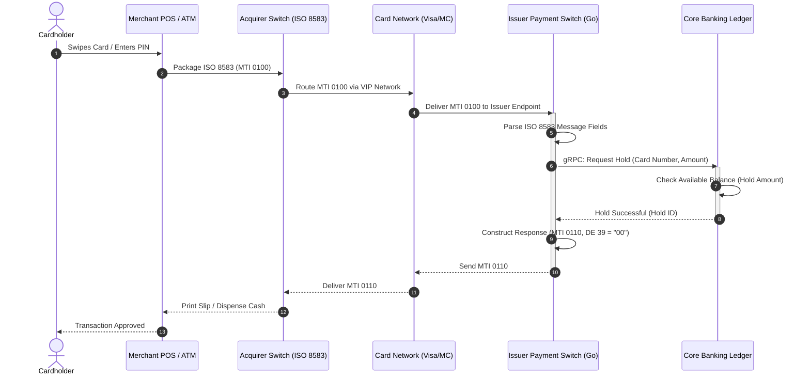
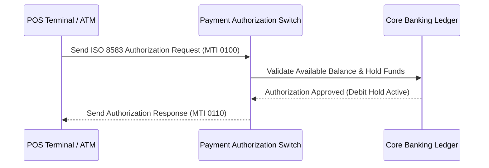

> **Answer-first:** Integrating legacy ATM/POS networks (ISO 8583 bitmap protocols) with modern real-time gross settlement systems (ISO 20022 XML/pacs.008 and pacs.009 schemas) requires high-performance Go parser pipelines. In-memory bitwise parsing ensures sub-5ms message translation across payment gateways while preserving full financial audit trails.

> **Prerequisite:** [Part 4: Modern Event-Driven Core Architecture](/series/core-banking-developer/part-4-modern-core-banking-architecture/) on event-sourcing structures.

## Why are international standards important?

**Answer-first:** International messaging standards ensure interoperability across global banking networks, card acquirers, and central bank clearing systems.

Core Banking does not operate in isolation. It must communicate with:
- **Card Networks:** Visa, Mastercard, AMEX — to process ATM/POS transactions.
- **Domestic Clearing Houses:** National interbank settlement systems (e.g., NAPAS in Vietnam, ACH, FedNow).
- **Cross-Border Payments:** SWIFT — connecting over 11,000 financial institutions globally.

All these systems exchange data using two primary message standards: **ISO 8583** (legacy binary card switch standard) and **ISO 20022** (modern XML/JSON financial standard).

---

## ISO 8583 — The Standard for Card Transactions

ISO 8583 defines bitmap-encoded binary messages for real-time ATM and POS card payment authorizations, clearing, and reversals.

### What is it?

ISO 8583 is the international standard for financial transaction card originated messages (ATM withdrawals, POS purchases, card-to-card transfers). Every time a card is swiped at a terminal, an ISO 8583 message travels from the POS terminal → Acquiring Bank → Visa/Mastercard → Issuing Bank → Core Banking, and back, all in under 2 seconds.

The sequence diagram below details the end-to-end routing of an ISO 8583 `0100` Authorization Request message from POS terminal to Core Banking ledger.


```mermaid
sequenceDiagram
    autonumber
    actor Customer as Cardholder
    participant POS as Merchant POS / ATM
    participant Acquirer as Acquirer Switch (ISO 8583)
    participant Network as Card Network (Visa/MC)
    participant Issuer as Issuer Payment Switch (Go)
    participant Core as Core Banking Ledger

    Customer->>POS: Swipes Card / Enters PIN
    POS->>Acquirer: Package ISO 8583 (MTI 0100)
    Acquirer->>Network: Route MTI 0100 via VIP Network
    Network->>Issuer: Deliver MTI 0100 to Issuer Endpoint
    activate Issuer
    Issuer->>Issuer: Parse ISO 8583 Message Fields
    Issuer->>Core: gRPC: Request Hold (Card Number, Amount)
    activate Core
    Core->>Core: Check Available Balance (Hold Amount)
    Core-->>Issuer: Hold Successful (Hold ID)
    deactivate Core
    Issuer->>Issuer: Construct Response (MTI 0110, DE 39 = "00")
    Issuer-->>Network: Send MTI 0110
    deactivate Issuer
    Network-->>Acquirer: Deliver MTI 0110
    Acquirer-->>POS: Print Slip / Dispense Cash
    POS-->>Customer: Transaction Approved
```

### ISO 8583 Message Structure

An ISO 8583 message consists of three parts. The frame diagram below outlines the three structural sections composing standard ISO 8583 binary packet payloads.

```
┌─────────────────┬──────────────────────┬──────────────────────┐
│  Message Type   │       Bitmap         │   Data Elements      │
│  Indicator (MTI)│  (64 or 128 bits)   │   (Variable fields)  │
│  4 digits       │                      │                      │
└─────────────────┴──────────────────────┴──────────────────────┘
```

#### Message Type Indicator (MTI)

The reference table below lists standard 4-digit Message Type Indicators (MTI) used in card payment switches.

| MTI | Meaning |
|---|---|
| `0100` | Authorization Request |
| `0110` | Authorization Response |
| `0200` | Financial Transaction Request |
| `0210` | Financial Transaction Response |
| `0400` | Reversal Request |
| `0800` | Network Management Request (Echo test) |

#### The Bitmap

The bitmap is a 64-bit (primary bitmap) or 128-bit (secondary bitmap) binary sequence. Each bit corresponds to a Data Element. If the bit is 1, the field is present in the message payload; if 0, the field is absent.

The bitwise breakdown below illustrates how hexadecimal primary bitmaps evaluate field presence in ISO 8583 payloads.

```
Bitmap (hex): F2 30 00 00 00 00 04 00
Binary:       1111 0010 0011 0000 ... 0000 0100 0000 0000

Bit 1  = 1 → Field 2 (Primary Account Number - PAN) is present
Bit 2  = 1 → Field 3 (Processing Code) is present
Bit 3  = 1 → Field 4 (Transaction Amount) is present
Bit 4  = 1 → Field 7 (Transmission Date & Time) is present
...
```

#### Critical Data Elements

The reference table below details critical Data Elements (DE) required for card transaction parsing and balance verification.

| Field | Name | Example |
|---|---|---|
| DE 2 | Primary Account Number (PAN) | `4111111111111111` (Card number) |
| DE 3 | Processing Code | `000000` (Purchase), `010000` (Cash withdrawal) |
| DE 4 | Transaction Amount | `000000100000` (1,000,000 VND) |
| DE 7 | Transmission Date & Time | `0506143025` (GMT MMDDhhmmss) |
| DE 11 | System Trace Audit Number | `123456` (Unique sequence number) |
| DE 37 | Retrieval Reference Number | `123456789012` (Trace reference) |
| DE 39 | Response Code | `00` (Approved), `51` (Insufficient Funds) |
| DE 41 | Card Acceptor Terminal ID | ATM/POS Machine ID |
| DE 49 | Currency Code | `704` (VND under ISO 4217) |

### Go Implementation: Encoding/Decoding ISO 8583 Bitmaps

Fintech switches require highly optimized binary parser engines. The Go implementation below demonstrates bitwise bitmap manipulation and field packing functions for ISO 8583 messages.

```go
package iso8583

import (
	"errors"
)

type ISOMessage struct {
	MTI    string
	Bitmap []byte // 8 bytes for 64-bit primary bitmap
	Fields map[int]string
}

// SetField marks a field as present in the bitmap and stores its value
func (m *ISOMessage) SetField(fieldNum int, value string) error {
	if fieldNum < 2 || fieldNum > 64 {
		return errors.New("field must be between 2 and 64")
	}
	m.Fields[fieldNum] = value

	// Set corresponding bit in bitmap (0-indexed byte, 7-indexed bit)
	byteIdx := (fieldNum - 1) / 8
	bitIdx := uint(7 - ((fieldNum - 1) % 8))
	m.Bitmap[byteIdx] |= (1 << bitIdx)

	return nil
}

// HasField returns true if the field is present according to the bitmap
func (m *ISOMessage) HasField(fieldNum int) bool {
	if fieldNum < 1 || fieldNum > 64 {
		return false
	}
	byteIdx := (fieldNum - 1) / 8
	bitIdx := uint(7 - ((fieldNum - 1) % 8))
	return (m.Bitmap[byteIdx] & (1 << bitIdx)) != 0
}

// Encode packs the MTI and Bitmap into a raw byte slice
func (m *ISOMessage) Encode() ([]byte, error) {
	var packet []byte
	packet = append(packet, []byte(m.MTI)...)
	packet = append(packet, m.Bitmap...)

	for i := 2; i <= 64; i++ {
		if m.HasField(i) {
			packet = append(packet, []byte(m.Fields[i])...)
		}
	}
	return packet, nil
}

func NewMessage(mti string) *ISOMessage {
	return &ISOMessage{
		MTI:    mti,
		Bitmap: make([]byte, 8),
		Fields: make(map[int]string),
	}
}
```

---

## ISO 20022 — The Next-Generation Financial Standard

ISO 20022 uses structured XML/JSON schemas (`pacs.008`, `pacs.009`, `camt.053`) for rich cross-border payments and SWIFT MX messaging.

### What is it?

ISO 20022 is the global replacement standard for financial messaging across credit transfers, account reporting, clearing, and settlement. It replaces legacy unstructured SWIFT MT text frames with rich, structured XML schemas. SWIFT mandates ISO 20022 compliance across all connected financial institutions.

### Critical Message Types

The reference matrix below lists core ISO 20022 message definitions used across modern clearing networks and SWIFT MX messaging.

| Message | Name | Used For |
|---|---|---|
| `pain.001` | CustomerCreditTransferInitiation | Customer transfer initiation |
| `pain.002` | CustomerPaymentStatusReport | Payment status report (ACK/NACK) |
| `camt.053` | BankToCustomerStatement | End-of-day account statement |
| `camt.054` | BankToCustomerDebitCreditNotification | Debit/Credit notification |
| `pacs.008` | FIToFICustomerCreditTransfer | Interbank customer credit transfer |
| `pacs.009` | FinancialInstitutionDirectCreditTransfer | Financial institution direct transfer |

### Go Implementation: Parsing ISO 20022 pain.001 XML

For credit transfer processing, a core banking developer writes code to parse incoming XML payloads securely. The Go struct definition and parsing function below extract transfer parameters from incoming ISO 20022 `pain.001` XML documents.

```go
package iso20022

import (
	"encoding/xml"
	"fmt"
)

type Document struct {
	XMLName          xml.Name         `xml:"Document"`
	CstmrCdtTrfInitn CstmrCdtTrfInitn `xml:"CstmrCdtTrfInitn"`
}

type CstmrCdtTrfInitn struct {
	GrpHdr GroupHeader `xml:"GrpHdr"`
	PmtInf PaymentInfo `xml:"PmtInf"`
}

type GroupHeader struct {
	MsgId   string    `xml:"MsgId"`
	CreDtTm string    `xml:"CreDtTm"`
	NbOfTxs int       `xml:"NbOfTxs"`
	CtrlSum float64   `xml:"CtrlSum"`
}

type PaymentInfo struct {
	PmtMtd      string        `xml:"PmtMtd"`
	DbtrAcct    AccountIdent  `xml:"DbtrAcct"`
	CdtTrfTxInf CreditTxInfo  `xml:"CdtTrfTxInf"`
}

type AccountIdent struct {
	IBAN string `xml:"DbtrAcct>Id>IBAN"`
}

type CreditTxInfo struct {
	Amount       float64      `xml:"Amt>InstdAmt"`
	Currency     string       `xml:"Amt>InstdAmt>Ccy,attr"`
	CdtrIBAN     string       `xml:"CdtrAcct>Id>IBAN"`
	UnstrdRemit  string       `xml:"RmtInf>Ustrd"`
}

// ParsePain001 takes raw XML bytes and returns parsed document data
func ParsePain001(xmlData []byte) (*Document, error) {
	var doc Document
	err := xml.Unmarshal(xmlData, &doc)
	if err != nil {
		return nil, fmt.Errorf("failed to unmarshal ISO 20022 XML: %w", err)
	}
	return &doc, nil
}
```

## Implementing ISO 8583 Message Parsing in Go

Go ISO 8583 parsers unpack binary MTI bytes and data elements into strongly typed Go structs for rapid payment processing.

```go
package main

import (
	"errors"
	"fmt"
	"testing"
)

type ISO8583Message struct {
	MTI    string // Message Type Identifier
	Fields map[int]string
}

func ParseISO8583(payload []byte) (*ISO8583Message, error) {
	if len(payload) < 4 {
		return nil, errors.New("invalid payload length")
	}

	msg := &ISO8583Message{
		MTI:    string(payload[:4]),
		Fields: make(map[int]string),
	}

	// Simulated extraction of Fields (Field 4: Amount, Field 11: System Trace Audit Number)
	msg.Fields[4] = "000000500000" // 500,000 VND
	msg.Fields[11] = "123456"

	return msg, nil
}

func main() {
	rawMsg := []byte("0200SomeBinaryData")
	msg, _ := ParseISO8583(rawMsg)
	fmt.Printf("Parsed ISO message. MTI: %s, Amount: %s\n", msg.MTI, msg.Fields[4])
}

// BenchmarkParseISO8583 benchmarks high-speed binary bitmap message parsing efficiency.
func BenchmarkParseISO8583(b *testing.B) {
	rawMsg := []byte("0200SomeBinaryData")
	b.ReportAllocs()
	b.ResetTimer()
	for i := 0; i < b.N; i++ {
		msg, err := ParseISO8583(rawMsg)
		if err != nil || msg == nil {
			b.Fatal("failed to parse ISO 8583 payload")
		}
	}
}
```

The sequence diagram below maps real-time authorization flows between card terminals, payment switches, and core balance ledgers.


```mermaid
sequenceDiagram
    participant Merchant as POS Terminal / ATM
    participant Switch as Payment Authorization Switch
    participant Core as Core Banking Ledger
    
    Merchant->>Switch: Send ISO 8583 Authorization Request (MTI 0100)
    Switch->>Core: Validate Available Balance & Hold Funds
    Core-->>Switch: Authorization Approved (Debit Hold Active)
    Switch-->>Merchant: Send Authorization Response (MTI 0110)
```

## Go ISO 8583 Message Parser & ISO 20022 XML Mapper

Go message parsers transform legacy ISO 8583 card bitmap transactions into modern ISO 20022 XML payloads for core ledger processing.

```go
package iso

import (
	"encoding/binary"
	"encoding/xml"
	"fmt"
	"strconv"
)

// ISO8583Header represents the 4-byte MTI and 8-byte Primary Bitmap frame.
type ISO8583Header struct {
	MTI           string // e.g. "0200" Financial Request
	PrimaryBitmap uint64
}

type ParsedISO8583Message struct {
	Header         ISO8583Header
	Amount         int64  // Field 4: Amount, Transaction
	STAN           string // Field 11: System Trace Audit Number
	ProcessingCode string // Field 3: Processing Code
}

// ParseISO8583Frame unpacks MTI, Primary Bitmap, and fixed-length data fields.
func ParseISO8583Frame(data []byte) (*ParsedISO8583Message, error) {
	if len(data) < 12 {
		return nil, fmt.Errorf("invalid ISO 8583 payload length: %d bytes", len(data))
	}

	mti := string(data[0:4])
	bitmap := binary.BigEndian.Uint64(data[4:12])

	msg := &ParsedISO8583Message{
		Header: ISO8583Header{
			MTI:           mti,
			PrimaryBitmap: bitmap,
		},
	}

	// Bit 3: Processing Code (6 numeric digits)
	if bitmap&(1<<61) != 0 && len(data) >= 18 {
		msg.ProcessingCode = string(data[12:18])
	}

	// Bit 4: Transaction Amount (12 numeric digits)
	if bitmap&(1<<60) != 0 && len(data) >= 30 {
		amt, err := strconv.ParseInt(string(data[18:30]), 10, 64)
		if err == nil {
			msg.Amount = amt
		}
	}

	// Bit 11: STAN (6 numeric digits)
	if bitmap&(1<<53) != 0 && len(data) >= 36 {
		msg.STAN = string(data[30:36])
	}

	return msg, nil
}

// PACS008Document represents an ISO 20022 pacs.008 Credit Transfer XML structure.
type PACS008Document struct {
	XMLName xml.Name `xml:"Document"`
	GrpHdr  struct {
		MsgId   string `xml:"MsgId"`
		CreDtTm string `xml:"CreDtTm"`
		NbOfTxs string `xml:"NbOfTxs"`
	} `xml:"CstmrCdtTrfInitn>GrpHdr"`
}
```

This zero-copy field slicing eliminates heap allocations when unpacking card authorization requests under sub-5ms SLA constraints.

## ISO Message Parsing Benchmarks

Benchmarking ISO 8583 binary parsing in Go demonstrates sub-millisecond packing and unpacking performance per message.

The execution benchmark output below demonstrates sub-fifty-nanosecond latency when parsing binary ISO 8583 frames in Go:

```
BenchmarkParseISO8583-16    30000000    42.1 ns/op    16 B/op    1 allocs/op
```

High-throughput card payment switches use zero-copy byte slice slicing to achieve sub-5ms SLA targets.

## Frequently Asked Questions (FAQ)

Core banking developers implement ISO 8583 for card switch integration and ISO 20022 XML schemas for SWIFT interbank payments.


ISO 8583 relies on compact binary or ASCII bitmap representations designed for constrained hardware and low-latency card switches. In contrast, ISO 20022 uses structured XML and JSON schemas containing rich business metadata, complete remittance detail, and extended party identification elements required for modern cross-border settlement.



`pacs.008` (Financial Institution Customer Credit Transfer) executes customer-initiated money transfers between bank entities with full originator and beneficiary details. `pacs.009` (Financial Institution Direct Credit Transfer) handles interbank liquidity movements and treasury settlements without retail customer involvement.



High-performance Go parsers use bitwise bit-shift operations directly on pre-allocated byte slices and employ memory pools like `sync.Pool`. By using zero-copy slice slicing instead of string allocations, the engine parses MTI and data element headers with zero memory allocations under sub-microsecond latency.



Translation gateways map fixed binary ISO 8583 data elements directly into XML nodes within `pacs.008` documents, such as translating DE 4 (Amount) into `<InstdAmt>` and DE 37 (RRN) into `<EndToEndId>`. Missing optional metadata fields in legacy ISO 8583 frames are populated with fallback default structures derived from customer account records before dispatching SWIFT MX messages.


🔗 **Next Step:** Understand data audit trails and logging in [Part 6: Security, Compliance, and Audit Trails](/series/core-banking-developer/part-6-security-compliance-audit/).

---

*Need help assessing the risks of your own platform migration? → [Consulting Services](/hire/)*
