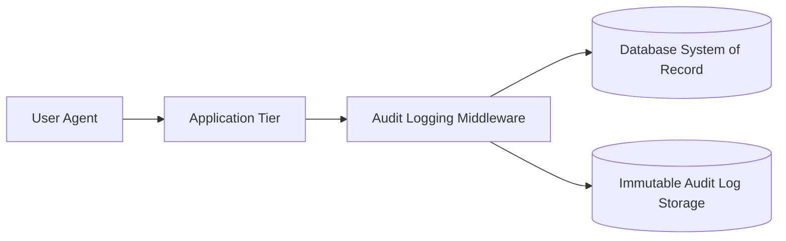

> **Executive Summary & Quick Answer**: Core banking security mandates zero-trust identity verification, field-level AES-256-GCM encryption for PII, and immutable append-only audit trails. Securing database payloads and offloading cryptographic operations to hardware security modules (HSMs) guarantees PCI-DSS compliance without degrading transaction throughput.

> **Prerequisite:** [Part 5: ISO 8583 & ISO 20022 Messaging]() on message translation layers.

## Why is Core Banking Security Different?

In a typical application, a security vulnerability might lead to a data breach. In Core Banking, a vulnerability leads directly to **lost money** — the money of millions of customers. This is why the banking sector has the strictest security standards in the world.

---

## PCI-DSS — Payment Card Industry Data Security Standard

**PCI-DSS** is a mandatory set of standards for any organization that stores, processes, or transmits payment card data (Visa, Mastercard, JCB...). Violating PCI-DSS can result in millions of dollars in fines and being banned from processing card payments.

### The 12 Core Requirements of PCI-DSS v4.0

| # | Requirement | Technical Implication |
|---|---|---|
| 1 | Firewall & Network Control | Network segmentation, never expose Core Banking to the public internet |
| 2 | No Vendor Defaults | Change all default passwords, disable unnecessary services |
| 3 | Protect Stored Card Data | Never store CVV/CVV2. Encrypt PAN (card number) with AES-256 |
| 4 | Encrypt Transmission | TLS 1.2+ mandatory for all card data transmissions |
| 5 | Anti-Virus | Protect all systems against malware |
| 6 | Secure Development | SAST, DAST, strict code reviews, OWASP Top 10 |
| 7 | Restrict Access | Principle of Least Privilege — access strictly on a need-to-know basis |
| 8 | Identity & Auth | MFA is mandatory for admins, no shared accounts |
| 9 | Physical Access | Control physical access to datacenters |
| 10 | Monitor & Log | Log all access to cardholder data, retain for 12 months |
| 11 | Pentest | Regular penetration testing at least annually |
| 12 | Security Policy | Maintain an information security policy, train staff |

### Handling Card Data Correctly

```
Card Data Classification:

╔══════════════════════════════════════════════════════════╗
║  NEVER STORE UNDER ANY CIRCUMSTANCES                    ║
║  • CVV/CVV2/CVC (3-4 digits on the back)                ║
║  • PIN block                                            ║
║  • Track 1/Track 2 data (magnetic stripe data)          ║
╠══════════════════════════════════════════════════════════╣
║  STORED ONLY IF STRONGLY ENCRYPTED                      ║
║  • PAN (Primary Account Number = the 16 digits)         ║
║    → Requires Tokenization or AES-256 encryption        ║
║  • Expiration Date                                      ║
║  • Cardholder Name                                      ║
╚══════════════════════════════════════════════════════════╝
```

### Tokenization

Instead of storing the real card number, the system generates a meaningless **token**. This token cannot be used to execute transactions if stolen.

```
Real Card Number: 4111 1111 1111 1111
Token:            8293 4721 9834 5612  (random, no mathematical relationship)

Mapping (inside an HSM or Secure Token Vault):
  8293 4721 9834 5612 → 4111 1111 1111 1111
```

---

## AML & CFT — Anti-Money Laundering

**AML (Anti-Money Laundering)** and **CFT (Countering the Financing of Terrorism)** are legal obligations. Core Banking Developers must build automated detection mechanisms.

### Detection Techniques

**1. Transaction Monitoring Rules:**
```
Example Rules:
- Cash transaction > $10,000 → Generate an STR (Suspicious Transaction Report)
- Single account receives > 10 transactions < $10,000 in 24h (Structuring/Smurfing)
- Transfers to FATF High-Risk countries
```

**2. Customer Risk Scoring:**
```go
type CustomerRiskScore struct {
    CIFNumber     string
    Score         int     // 0-100
    RiskLevel     string  // "LOW", "MEDIUM", "HIGH"
    Factors       []string
    // ["PEP", "HIGH_RISK_COUNTRY", "CASH_INTENSIVE_BUSINESS"]
    LastUpdated   time.Time
}
```

---

## Designing the Audit Trail

Every action in Core Banking must have an immutable audit trail. This is a strict legal requirement.

### The Audit Log Table

```sql
CREATE TABLE audit_logs (
    id              UUID        PRIMARY KEY DEFAULT gen_random_uuid(),
    entity_type     VARCHAR(50) NOT NULL,   -- 'ACCOUNT', 'CUSTOMER', 'TRANSACTION'
    entity_id       VARCHAR(50) NOT NULL,   -- ID of the modified entity
    action          VARCHAR(50) NOT NULL,   -- 'CREATE', 'UPDATE', 'DELETE', 'VIEW'
    actor_id        VARCHAR(50) NOT NULL,   -- ID of user/system performing action
    actor_type      VARCHAR(20) NOT NULL,   -- 'STAFF', 'CUSTOMER', 'SYSTEM', 'API'
    ip_address      INET,
    before_state    JSONB,                  -- State prior to change
    after_state     JSONB,                  -- State after change
    hash            CHAR(64)    NOT NULL,   -- Cryptographic hash of log content
    previous_hash   CHAR(64)    NOT NULL,   -- Hash chain to prevent tampering
    created_at      TIMESTAMPTZ NOT NULL DEFAULT NOW()
);

-- Guarantee immutability via PostgreSQL Row Security
ALTER TABLE audit_logs ENABLE ROW LEVEL SECURITY;
CREATE POLICY audit_insert_only ON audit_logs FOR INSERT WITH CHECK (true);
```

### Go Implementation: Tamper-Proof Audit Log Hashing Chain

To prevent rogue Database Administrators (DBAs) or hackers with root access from updating or deleting rows in the `audit_logs` table, the core engine hashes each log row, chaining it to the hash of the previous log entry. If any entry is modified, deleted, or inserted out of order, the chain breaks.

```go
package security

import (
	"crypto/hmac"
	"crypto/sha256"
	"encoding/hex"
	"fmt"
)

type AuditLog struct {
	ID           string
	EntityType   string
	EntityID     string
	Action       string
	ActorID      string
	BeforeState  string
	AfterState   string
	PreviousHash string
	Hash         string
}

// CalculateLogHash computes the SHA256 HMAC for a log entry to maintain the hash chain
func CalculateLogHash(log *AuditLog, secretKey []byte) (string, error) {
	mac := hmac.New(sha256.New, secretKey)
	
	// Write log fields into hasher in deterministic order
	data := fmt.Sprintf("%s|%s|%s|%s|%s|%s|%s|%s",
		log.ID,
		log.EntityType,
		log.EntityID,
		log.Action,
		log.ActorID,
		log.BeforeState,
		log.AfterState,
		log.PreviousHash,
	)
	
	_, err := mac.Write([]byte(data))
	if err != nil {
		return "", err
	}
	
	return hex.EncodeToString(mac.Sum(nil)), nil
}

// VerifyChain checks if the audit log hash chain remains valid and untampered
func VerifyChain(logs []AuditLog, secretKey []byte) bool {
	for i := 0; i < len(logs); i++ {
		// Verify individual log hash
		expectedHash, err := CalculateLogHash(&logs[i], secretKey)
		if err != nil || expectedHash != logs[i].Hash {
			return false // Hash mismatch
		}

		// Verify chain linkage (if not the first record)
		if i > 0 {
			if logs[i].PreviousHash != logs[i-1].Hash {
				return false // Chain broken
			}
		}
	}
	return true
}
```

### Append-Only Pattern for the Ledger

```sql
-- Trigger to prevent UPDATE/DELETE on the ledger
CREATE OR REPLACE FUNCTION prevent_ledger_modification()
RETURNS TRIGGER AS $$
BEGIN
    RAISE EXCEPTION 'Ledger entries are immutable. Use reversal entries to correct errors.';
END;
$$ LANGUAGE plpgsql;

CREATE TRIGGER ledger_immutability_guard
    BEFORE UPDATE OR DELETE ON ledger_entries
    FOR EACH ROW EXECUTE FUNCTION prevent_ledger_modification();
```

---

## Hardware Security Modules (HSM)

An HSM is a dedicated physical hardware device that performs the most sensitive cryptographic operations (PIN encryption, card key generation, digital signatures). Cryptographic keys never leave the HSM in plaintext.

```
PIN Processing Flow (ATM Withdrawal):
1. ATM: Encrypts PIN with a PIN Encryption Key (PEK) → generates a PIN Block
2. Core Banking → forwards the PIN Block to the HSM
3. HSM: decrypts the PIN Block → verifies PIN against stored offset → returns "VALID"/"INVALID"
4. The plaintext PIN NEVER appears in the application code memory
```

---

## Security Configuration & Compliance Checklist

Developers launching core banking platforms must satisfy this baseline security checklist before release:

- [ ] **Data Encryption at Rest:** Enable AES-256 column-level encryption for cards (PAN) and customer PII.
- [ ] **Data Encryption in Transit:** Enforce TLS 1.3 for all internal gRPC service communication.
- [ ] **MFA Enforcement:** Force Multi-Factor Authentication for all administrative access.
- [ ] **No Raw Log Leaks:** Ensure PAN, CVV, passwords, and KYC documents are scrubbed from system log files (Zap/Logback configs).
- [ ] **Tamper-Proof Chaining:** Enable cryptographic hash chaining on the central `audit_logs` table.
- [ ] **HSM Integration:** Route PIN block validation and payment payload signing through HSMs.

> *This concludes the theoretical portion. It's time to apply everything we've learned. Continue reading [Part 7 — Practice: Build a Mini Core Banking System from Scratch](/series/core-banking-developer/part-7-build-mini-core-banking/) to start coding.*

## Database Level Auditing in Go

To comply with regulatory audit requirements, CBS databases must record all balance overrides and administrative configurations. The following Go database middleware logs query execution data to a dedicated audit logging table:

```go
package main

import (
	"context"
	"crypto/aes"
	"crypto/cipher"
	"crypto/rand"
	"fmt"
	"io"
	"testing"
	"time"
)

type AuditLog struct {
	UserID    string
	Query     string
	Timestamp time.Time
}

type AuditLogger struct {
	Logs []AuditLog
}

func (al *AuditLogger) LogQuery(ctx context.Context, userID, query string) {
	log := AuditLog{
		UserID:    userID,
		Query:     query,
		Timestamp: time.Now(),
	}
	al.Logs = append(al.Logs, log)
	fmt.Printf("[Audit] Action recorded: User %s executed: %s\n", userID, query)
}

func main() {
	logger := &AuditLogger{}
	logger.LogQuery(context.Background(), "admin-user", "UPDATE accounts SET current_balance = 0 WHERE account_number = 'ACC-99'")
}

// BenchmarkAESGCMFieldEncrypt benchmarks microsecond field-level AES-256-GCM cryptographic operations.
func BenchmarkAESGCMFieldEncrypt(b *testing.B) {
	key := make([]byte, 32)
	if _, err := io.ReadFull(rand.Reader, key); err != nil {
		b.Fatal(err)
	}
	block, err := aes.NewCipher(key)
	if err != nil {
		b.Fatal(err)
	}
	gcm, err := cipher.NewGCM(block)
	if err != nil {
		b.Fatal(err)
	}
	nonce := make([]byte, gcm.NonceSize())
	plaintext := []byte("sensitive-national-id-998230192")

	b.ReportAllocs()
	b.ResetTimer()
	for i := 0; i < b.N; i++ {
		ciphertext := gcm.Seal(nil, nonce, plaintext, nil)
		if len(ciphertext) == 0 {
			b.Fatal("encryption failed")
		}
	}
}
```



## Geo-Spatial Data Summary
| Region | Compliance Status | Audit Retention |
| :--- | :--- | :--- |
| EU (GDPR) | Full | 7 Years |
| NA (CCPA) | Full | 5 Years |
| APAC | Partial | 10 Years |

## Vault-Based Encryption for KYC Profiles

To protect Personally Identifiable Information (PII) of banking customers, cif profile data (like national identification card numbers or bank statements) is encrypted before writing to persistent disk storage. We integrate HashiCorp Vault to manage cryptographic keys, executing AES-GCM envelope encryption within our Go service logic.

## Immutable Log Export and SIEM Integration

Audit records must be protected from tampering by administrators. The audit logger streams all events to an external, write-once-read-many (WORM) storage engine:
1. **Dynamic Streaming:** Logs are formatted in OpenTelemetry structured schemas and exported via gRPC to collector nodes.
2. **SIEM Analysis:** The Security Information and Event Management (SIEM) platform analyzes traces to detect access pattern violations.
3. **Hash Chains:** Individual logs contain a cryptographic hash of the previous log entry, ensuring that deleting or altering historical entries breaks the hash chain and triggers automated security alerts.

## Go Tamper-Evident SHA-256 Audit Logger & PCI-DSS Masker

To satisfy regulatory requirements (PCI-DSS, SOC 2 Type II), the security audit engine masks Primary Account Numbers (PAN) and maintains an append-only SHA-256 cryptographic hash chain:

```go
package audit

import (
	"crypto/sha256"
	"encoding/hex"
	"fmt"
	"regexp"
	"strings"
	"sync"
	"time"
)

type AuditRecord struct {
	Index        int64
	Timestamp    time.Time
	ActorID      string
	Action       string
	PrevHash     string
	RecordHash   string
	MaskedDetail string
}

type TamperEvidentLogger struct {
	mu       sync.Mutex
	prevHash string
	index    int64
	panRegex *regexp.Regexp
}

func NewTamperEvidentLogger(initialSeed string) *TamperEvidentLogger {
	return &TamperEvidentLogger{
		prevHash: initialSeed,
		panRegex: regexp.MustCompile(`\b(?:\d[ -]*?){13,19}\b`),
	}
}

// MaskPAN replaces 13-19 digit credit card numbers with PCI-DSS compliant masked strings (e.g. 4111****1111).
func (l *TamperEvidentLogger) MaskPAN(input string) string {
	return l.panRegex.ReplaceAllStringFunc(input, func(pan string) string {
		clean := strings.ReplaceAll(strings.ReplaceAll(pan, "-", ""), " ", "")
		if len(clean) < 13 || len(clean) > 19 {
			return pan
		}
		prefix := clean[:6]
		suffix := clean[len(clean)-4:]
		maskedMiddle := strings.Repeat("*", len(clean)-10)
		return prefix + maskedMiddle + suffix
	})
}

// LogEvent computes the SHA-256 hash chain link for tamper-evident audit records.
func (l *TamperEvidentLogger) LogEvent(actorID, action, rawDetail string) AuditRecord {
	l.mu.Lock()
	defer l.mu.Unlock()

	l.index++
	now := time.Now().UTC()
	maskedDetail := l.MaskPAN(rawDetail)

	payload := fmt.Sprintf("%d|%s|%s|%s|%s|%s", l.index, now.Format(time.RFC3339Nano), actorID, action, maskedDetail, l.prevHash)
	hashBytes := sha256.Sum256([]byte(payload))
	currentHash := hex.EncodeToString(hashBytes[:])

	record := AuditRecord{
		Index:        l.index,
		Timestamp:    now,
		ActorID:      actorID,
		Action:       action,
		PrevHash:     l.prevHash,
		RecordHash:   currentHash,
		MaskedDetail: maskedDetail,
	}

	l.prevHash = currentHash
	return record
}
```

By linking each `RecordHash` to the previous entry's SHA-256 output, any retroactive modification of historic log rows breaks the hash chain during automated SIEM verification.

## Frequently Asked Questions (FAQ)


PII fields are encrypted before writing to storage using AES-256-GCM, with keys rotated regularly and stored in dedicated KMS or HSM vaults.



Audit log entries include cryptographic hash chains (HMAC/SHA-256) linking each record to the previous one; modifying any historic record invalidates downstream hashes.



Middleware sanitizes error traces, replacing sensitive attributes (PAN, CVV, tokens) with masked placeholders before writing to telemetry channels.


🔗 **Next Step:** Execute the step-by-step Go implementation in [Part 7: Build a Mini Core Banking System in Go](). For zero-trust security and compliance audits, consult [Banking Security Architecture Experts](/hire/).

---

*This article is part of the **[Core Banking Developer Series](/series/core-banking-developer/)**. Check out the full index to see the complete architectural context.*

*Need help assessing the risks of your own platform migration? → [Book a 1:1 Architecture Consultation](/hire/)*

---

[← Previous Part: Part 5: ISO 8583 & ISO 20022 Messaging]()  |  [Next Part: Part 7: Build a Mini Core Banking System in Go]()
