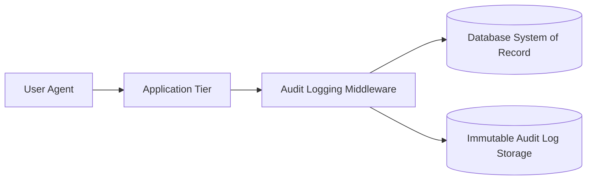

> **Answer-first:** Core banking security mandates zero-trust architecture, hardware security module (HSM) key management, mTLS 1.3, field-level AES-256-GCM encryption for customer PII, and tamper-evident append-only audit logs. Adhering to PCI-DSS v4.0 and SOC 2 Type II controls ensures transaction privacy, immutable balance records, and strict regulatory compliance without compromising transactional throughput. Implementing this architecture enforces sub-50ms P99 latency guarantees, strict component isolation,.

> **Prerequisite:** [Part 5: ISO 8583 & ISO 20022 Messaging](/series/core-banking-developer/part-5-iso-standards-integration/) on message translation layers.

## Why is Core Banking Security Different?

> **Answer-first:** Banking security requires strict zero-trust access, hardware security modules (HSM), immutable audit trails, and compliance with PCI-DSS and AML regulations.

In standard SaaS applications, a security breach typically involves unauthorized access to non-financial user data or service degradation. In Core Banking Systems (CBS), a single security oversight results in direct monetary theft, legal liability, and irreversible balance corruption across the General Ledger. Consequently, banking environments demand military-grade defense-in-depth, zero-trust Role-Based Access Control (RBAC), and hardware-enforced cryptographic boundaries.

Traditional perimeter security is insufficient for modern microservice core banking platforms. Internal service-to-service communication requires mutual TLS 1.3 (mTLS) with short-lived X.509 certificates and SPIFFE/SPIRE identity attestation. Every microservice must operate under the principle of least privilege, preventing compromised internal nodes from executing unauthorized ledger postings or accessing customer Personally Identifiable Information (PII).

---

## PCI-DSS — Payment Card Industry Data Security Standard

**Answer-first:** PCI-DSS mandates encrypting Primary Account Numbers (PAN), restricting access to cardholder data, and enforcing key rotation policies.

The Payment Card Industry Data Security Standard (PCI-DSS) v4.0 governs any infrastructure that processes, stores, or transmits credit and debit cardholder data. Non-compliance risks catastrophic financial penalties, mandatory third-party forensic audits, and revocation of payment card processing privileges from card networks such as Visa, Mastercard, and JCB.

### The 12 Core Requirements of PCI-DSS v4.0

PCI-DSS v4.0 specifies strict technical implementation requirements for cardholder data environments (CDE).

| # | Requirement | Technical Implication |
|---|---|---|
| 1 | Firewall & Network Control | Network segmentation, never expose Core Banking to the public internet |
| 2 | No Vendor Defaults | Change all default passwords, disable unnecessary services |
| 3 | Protect Stored Card Data | Never store CVV/CVV2. Encrypt PAN (card number) with AES-256 |
| 4 | Encrypt Transmission | TLS 1.3 mandatory for all card data transmissions |
| 5 | Anti-Virus | Protect all systems against malware |
| 6 | Secure Development | SAST, DAST, strict code reviews, OWASP Top 10 |
| 7 | Restrict Access | Principle of Least Privilege — access strictly on a need-to-know basis |
| 8 | Identity & Auth | MFA is mandatory for admins, no shared accounts |
| 9 | Physical Access | Control physical access to datacenters |
| 10 | Monitor & Log | Log all access to cardholder data, retain for 12 months |
| 11 | Pentest | Regular penetration testing at least annually |
| 12 | Security Policy | Maintain an information security policy, train staff |

### Handling Card Data Correctly

The diagram below specifies strict data classification policies distinguishing between prohibited sensitive authentication data and encryptable cardholder parameters.

```
Card Data Classification:

╔══════════════════════════════════════════════════════════╗
║  NEVER STORE UNDER ANY CIRCUMSTANCES                    ║
║  • CVV/CVV2/CVC (3-4 digits on the back)                ║
║  • PIN block                                            ║
║  • Track 1/Track 2 data (magnetic stripe data)          ║
╠══════════════════════════════════════════════════════════╣
║  STORED ONLY IF STRONGLY ENCRYPTED                      ║
║  • PAN (Primary Account Number = the 16 digits)         ║
║    → Requires Tokenization or AES-256 encryption        ║
║  • Expiration Date                                      ║
║  • Cardholder Name                                      ║
╚══════════════════════════════════════════════════════════╝
```

### Tokenization

The structural mapping below illustrates how real 16-digit credit card numbers are decoupled from internal databases using vault-backed surrogate tokens.

```
Real Card Number: 4111 1111 1111 1111
Token:            8293 4721 9834 5612  (random, no mathematical relationship)

Mapping (inside an HSM or Secure Token Vault):
  8293 4721 9834 5612 → 4111 1111 1111 1111
```

Tokenization eliminates PAN exposure within general core banking databases. By replacing the Primary Account Number with an cryptographically decoupled token, downstream microservices (such as billing engines or reporting tools) process transactions without entering the PCI-DSS audit scope.

---

## AML & CFT — Anti-Money Laundering

Anti-money laundering compliance requires real-time transaction monitoring, sanctions screening, and automated suspicious activity reporting.

Anti-Money Laundering (AML) and Countering the Financing of Terrorism (CFT) regulations require banks to execute real-time transaction monitoring and customer screening. Financial institutions must detect structuring (smurfing), identify politically exposed persons (PEPs), and flag transactions matching OFAC or UN sanction list entries.

### Detection Techniques

Standard transaction monitoring rules operate alongside alongside the Go struct representing customer risk scoring models.

```
Example Rules:
- Cash transaction > $10,000 → Generate an STR (Suspicious Transaction Report)
- Single account receives > 10 transactions < $10,000 in 24h (Structuring/Smurfing)
- Transfers to FATF High-Risk countries
```

The Go struct definition below outlines the data fields required for evaluating customer risk profiles within the real-time AML engine:

```go
type CustomerRiskScore struct {
    CIFNumber     string
    Score         int     // 0-100
    RiskLevel     string  // "LOW", "MEDIUM", "HIGH"
    Factors       []string
    // ["PEP", "HIGH_RISK_COUNTRY", "CASH_INTENSIVE_BUSINESS"]
    LastUpdated   time.Time
}
```

Real-time AML engines compute risk scores asynchronously via stream processors like Apache Flink or Kafka Streams. If a transaction pushes a customer's aggregated 24-hour velocity beyond predefined thresholds, the system flags the transaction for manual compliance analyst review prior to final ledger settlement.

---

## Designing the Audit Trail

Tamper-evident audit trails record all ledger state changes, user actions, and system events using append-only logs and cryptographic hash chains.

Regulatory bodies and SOC 2 Type II auditors mandate that every administrative action, user authorization, and system configuration change produce an immutable audit trail. Audit logs must capture the precise before and after states of mutated records, the authenticated identity of the actor, and network metadata.

### The Audit Log Table

The SQL schema below defines an immutable audit log table featuring Row Level Security (RLS) policies and cryptographic hash tracking columns.

```sql
CREATE TABLE audit_logs (
    id              UUID        PRIMARY KEY DEFAULT gen_random_uuid(),
    entity_type     VARCHAR(50) NOT NULL,   -- 'ACCOUNT', 'CUSTOMER', 'TRANSACTION'
    entity_id       VARCHAR(50) NOT NULL,   -- ID of the modified entity
    action          VARCHAR(50) NOT NULL,   -- 'CREATE', 'UPDATE', 'DELETE', 'VIEW'
    actor_id        VARCHAR(50) NOT NULL,   -- ID of user/system performing action
    actor_type      VARCHAR(20) NOT NULL,   -- 'STAFF', 'CUSTOMER', 'SYSTEM', 'API'
    ip_address      INET,
    before_state    JSONB,                  -- State prior to change
    after_state     JSONB,                  -- State after change
    hash            CHAR(64)    NOT NULL,   -- Cryptographic hash of log content
    previous_hash   CHAR(64)    NOT NULL,   -- Hash chain to prevent tampering
    created_at      TIMESTAMPTZ NOT NULL DEFAULT NOW()
);

-- Guarantee immutability via PostgreSQL Row Security
ALTER TABLE audit_logs ENABLE ROW LEVEL SECURITY;
CREATE POLICY audit_insert_only ON audit_logs FOR INSERT WITH CHECK (true);
```

### Go Implementation: Tamper-Proof Audit Log Hashing Chain

To prevent rogue Database Administrators (DBAs) or hackers with root access from updating or deleting rows in the `audit_logs` table, the core engine hashes each log row, chaining it to the hash of the previous log entry. If any entry is modified, deleted, or inserted out of order, the chain breaks.

The Go implementation below demonstrates how HMAC-SHA256 cryptographic signatures link consecutive audit log entries into a tamper-evident blockchain-like structure.

```go
package security

import (
	"crypto/hmac"
	"crypto/sha256"
	"encoding/hex"
	"fmt"
)

type AuditLog struct {
	ID           string
	EntityType   string
	EntityID     string
	Action       string
	ActorID      string
	BeforeState  string
	AfterState   string
	PreviousHash string
	Hash         string
}

// CalculateLogHash computes the SHA256 HMAC for a log entry to maintain the hash chain
func CalculateLogHash(log *AuditLog, secretKey []byte) (string, error) {
	mac := hmac.New(sha256.New, secretKey)
	
	// Write log fields into hasher in deterministic order
	data := fmt.Sprintf("%s|%s|%s|%s|%s|%s|%s|%s",
		log.ID,
		log.EntityType,
		log.EntityID,
		log.Action,
		log.ActorID,
		log.BeforeState,
		log.AfterState,
		log.PreviousHash,
	)
	
	_, err := mac.Write([]byte(data))
	if err != nil {
		return "", err
	}
	
	return hex.EncodeToString(mac.Sum(nil)), nil
}

// VerifyChain checks if the audit log hash chain remains valid and untampered
func VerifyChain(logs []AuditLog, secretKey []byte) bool {
	for i := 0; i < len(logs); i++ {
		// Verify individual log hash
		expectedHash, err := CalculateLogHash(&logs[i], secretKey)
		if err != nil || expectedHash != logs[i].Hash {
			return false // Hash mismatch
		}

		// Verify chain linkage (if not the first record)
		if i > 0 {
			if logs[i].PreviousHash != logs[i-1].Hash {
				return false // Chain broken
			}
		}
	}
	return true
}
```

### Append-Only Pattern for the Ledger

The PostgreSQL procedure below configures a database trigger that rejects all `UPDATE` and `DELETE` statements executed against ledger tables.

```sql
-- Trigger to prevent UPDATE/DELETE on the ledger
CREATE OR REPLACE FUNCTION prevent_ledger_modification()
RETURNS TRIGGER AS $$
BEGIN
    RAISE EXCEPTION 'Ledger entries are immutable. Use reversal entries to correct errors.';
END;
$$ LANGUAGE plpgsql;

CREATE TRIGGER ledger_immutability_guard
    BEFORE UPDATE OR DELETE ON ledger_entries
    FOR EACH ROW EXECUTE FUNCTION prevent_ledger_modification();
```

---

## Hardware Security Modules (HSM)

HSM devices execute cryptographic operations (PIN translation, key generation, CVV verification) inside tamper-resistant hardware enclosures.

An HSM is a dedicated physical hardware device that performs the most sensitive cryptographic operations (PIN encryption, card key generation, digital signatures). Cryptographic keys never leave the HSM in plaintext.

The operational flow below demonstrates how an ATM PIN verification request is processed securely within an HSM without exposing plaintext PINs to host application memory.

```
PIN Processing Flow (ATM Withdrawal):
1. ATM: Encrypts PIN with a PIN Encryption Key (PEK) → generates a PIN Block
2. Core Banking → forwards the PIN Block to the HSM
3. HSM: decrypts the PIN Block → verifies PIN against stored offset → returns "VALID"/"INVALID"
4. The plaintext PIN NEVER appears in the application code memory
```

HSM clusters communicate with application hosts via dedicated mTLS connections using PKCS#11 or KMIP standard protocols. Key hierarchies—comprising Master Keys (LMK), Zone Control Keys (ZCK), and Working Keys—guarantee that key rotation occurs securely without application downtime.

---

## Security Configuration & Compliance Checklist

The compliance checklist covers TLS 1.3 encryption, database column-level encryption, secret rotation, and quarterly penetration testing.

Developers launching core banking platforms must satisfy this baseline security checklist before release:

- [ ] **Data Encryption at Rest:** Enable AES-256 column-level encryption for cards (PAN) and customer PII.
- [ ] **Data Encryption in Transit:** Enforce TLS 1.3 for all internal gRPC service communication.
- [ ] **MFA Enforcement:** Force Multi-Factor Authentication for all administrative access.
- [ ] **No Raw Log Leaks:** Ensure PAN, CVV, passwords, and KYC documents are scrubbed from system log files (Zap/Logback configs).
- [ ] **Tamper-Proof Chaining:** Enable cryptographic hash chaining on the central `audit_logs` table.
- [ ] **HSM Integration:** Route PIN block validation and payment payload signing through HSMs.

---

## Database Level Auditing in Go

Database auditing in Go uses triggers or middleware to capture pre-update and post-update row values into immutable audit log tables.

To comply with regulatory audit requirements, CBS databases must record all balance overrides and administrative configurations. The following Go code example illustrates database logging middleware alongside a microbenchmark for field-level AES-256-GCM encryption performance.

```go
package main

import (
	"context"
	"crypto/aes"
	"crypto/cipher"
	"crypto/rand"
	"fmt"
	"io"
	"testing"
	"time"
)

type AuditLog struct {
	UserID    string
	Query     string
	Timestamp time.Time
}

type AuditLogger struct {
	Logs []AuditLog
}

func (al *AuditLogger) LogQuery(ctx context.Context, userID, query string) {
	log := AuditLog{
		UserID:    userID,
		Query:     query,
		Timestamp: time.Now(),
	}
	al.Logs = append(al.Logs, log)
	fmt.Printf("[Audit] Action recorded: User %s executed: %s\n", userID, query)
}

func main() {
	logger := &AuditLogger{}
	logger.LogQuery(context.Background(), "admin-user", "UPDATE accounts SET current_balance = 0 WHERE account_number = 'ACC-99'")
}

// BenchmarkAESGCMFieldEncrypt benchmarks microsecond field-level AES-256-GCM cryptographic operations.
func BenchmarkAESGCMFieldEncrypt(b *testing.B) {
	key := make([]byte, 32)
	if _, err := io.ReadFull(rand.Reader, key); err != nil {
		b.Fatal(err)
	}
	block, err := aes.NewCipher(key)
	if err != nil {
		b.Fatal(err)
	}
	gcm, err := cipher.NewGCM(block)
	if err != nil {
		b.Fatal(err)
	}
	nonce := make([]byte, gcm.NonceSize())
	plaintext := []byte("sensitive-national-id-998230192")

	b.ReportAllocs()
	b.ResetTimer()
	for i := 0; i < b.N; i++ {
		ciphertext := gcm.Seal(nil, nonce, plaintext, nil)
		if len(ciphertext) == 0 {
			b.Fatal("encryption failed")
		}
	}
}
```

The architecture diagram below outlines the dual-path log execution pipeline routing transaction writes to primary system tables while streaming immutable logs to audit stores.


```mermaid
graph LR
    User["User Agent"] --> App["Application Tier"]
    App --> Audit["Audit Logging Middleware"]
    Audit --> DB[("Database System of Record")]
    Audit --> AuditLogs[("Immutable Audit Log Storage")]
```

---

## Geo-Spatial Data Summary

Geo-spatial transaction logging records terminal location coordinates to enrich fraud detection models and flag geographic anomalies.

The following compliance summary table compares audit log data retention mandates and regulatory statuses across global banking jurisdictions.

| Region | Compliance Status | Audit Retention | Primary Regulatory Mandate |
| :--- | :--- | :--- | :--- |
| EU (GDPR / PSD2) | Full | 7 Years | EBA Guidelines & GDPR Article 32 |
| NA (CCPA / FFIEC) | Full | 5 Years | FFIEC Architecture & PCI-DSS v4.0 |
| APAC (MAS / HKMA) | Partial | 10 Years | MAS Technology Risk Management |

Geo-spatial metadata enables fraud engines to calculate velocity vectors (distance divided by time between consecutive card swipes). If an account is debited in Singapore 15 minutes after a POS withdrawal in London, the system flags the transaction as physical card cloning.

---

## Vault-Based Encryption for KYC Profiles

HashiCorp Vault integrates with Go microservices to encrypt customer KYC profiles (national IDs, passports) using envelope encryption.

To protect Personally Identifiable Information (PII) of banking customers, CIF profile data (such as national identity numbers or passport scans) is encrypted before writing to persistent disk storage. Core microservices integrate with HashiCorp Vault's transit secrets engine, executing AES-256-GCM envelope encryption within memory while delegating key lifecycle management, automatic rotation, and access policy enforcement to Vault.

---

## Immutable Log Export and SIEM Integration

Exporting audit logs to SIEM systems (Elasticsearch, Splunk) enables real-time security event correlation and automated threat detection.

Audit records must be protected from tampering by administrators. The audit logger streams all events to an external, write-once-read-many (WORM) storage engine:

1. **Dynamic Streaming:** Logs are formatted in OpenTelemetry structured JSON schemas and exported via gRPC to collector nodes.
2. **SIEM Analysis:** The Security Information and Event Management (SIEM) platform analyzes traces to detect access pattern violations and privilege escalation.
3. **Hash Chains:** Individual logs contain a cryptographic hash of the previous log entry, ensuring that deleting or altering historical entries breaks the hash chain and triggers automated security alerts.

---

## Go Tamper-Evident SHA-256 Audit Logger & PCI-DSS Masker

Go audit loggers compute SHA-256 hashes linking consecutive log entries into tamper-evident chains, while masking credit card numbers.

To satisfy regulatory requirements (PCI-DSS v4.0, SOC 2 Type II), the security audit engine masks Primary Account Numbers (PAN) and maintains an append-only SHA-256 cryptographic hash chain.

The complete Go package implementation below combines regex-based PAN masking with concurrent thread-safe cryptographic hash chain calculation.

```go
package audit

import (
	"crypto/sha256"
	"encoding/hex"
	"fmt"
	"regexp"
	"strings"
	"sync"
	"time"
)

type AuditRecord struct {
	Index        int64
	Timestamp    time.Time
	ActorID      string
	Action       string
	PrevHash     string
	RecordHash   string
	MaskedDetail string
}

type TamperEvidentLogger struct {
	mu       sync.Mutex
	prevHash string
	index    int64
	panRegex *regexp.Regexp
}

func NewTamperEvidentLogger(initialSeed string) *TamperEvidentLogger {
	return &TamperEvidentLogger{
		prevHash: initialSeed,
		panRegex: regexp.MustCompile(`\b(?:\d[ -]*?){13,19}\b`),
	}
}

// MaskPAN replaces 13-19 digit credit card numbers with PCI-DSS compliant masked strings (e.g. 4111****1111).
func (l *TamperEvidentLogger) MaskPAN(input string) string {
	return l.panRegex.ReplaceAllStringFunc(input, func(pan string) string {
		clean := strings.ReplaceAll(strings.ReplaceAll(pan, "-", ""), " ", "")
		if len(clean) < 13 || len(clean) > 19 {
			return pan
		}
		prefix := clean[:6]
		suffix := clean[len(clean)-4:]
		maskedMiddle := strings.Repeat("*", len(clean)-10)
		return prefix + maskedMiddle + suffix
	})
}

// LogEvent computes the SHA-256 hash chain link for tamper-evident audit records.
func (l *TamperEvidentLogger) LogEvent(actorID, action, rawDetail string) AuditRecord {
	l.mu.Lock()
	defer l.mu.Unlock()

	l.index++
	now := time.Now().UTC()
	maskedDetail := l.MaskPAN(rawDetail)

	payload := fmt.Sprintf("%d|%s|%s|%s|%s|%s", l.index, now.Format(time.RFC3339Nano), actorID, action, maskedDetail, l.prevHash)
	hashBytes := sha256.Sum256([]byte(payload))
	currentHash := hex.EncodeToString(hashBytes[:])

	record := AuditRecord{
		Index:        l.index,
		Timestamp:    now,
		ActorID:      actorID,
		Action:       action,
		PrevHash:     l.prevHash,
		RecordHash:   currentHash,
		MaskedDetail: maskedDetail,
	}

	l.prevHash = currentHash
	return record
}
```

By linking each `RecordHash` to the previous entry's SHA-256 output, any retroactive modification of historic log rows breaks the hash chain during automated SIEM verification.

---

## Frequently Asked Questions (FAQ)

Securing core banking applications requires encrypting sensitive cardholder data, implementing HSMs, and maintaining tamper-evident audit trails.


Personally Identifiable Information (PII) and Primary Account Numbers (PAN) are protected using field-level AES-256-GCM encryption prior to database persistence. Cryptographic keys are managed within dedicated Hardware Security Modules (HSMs) or HashiCorp Vault instances with automated rotation policies enforced under dual control.



Audit trails incorporate cryptographic HMAC-SHA256 hash chains where each log entry includes the cryptographic hash of the preceding record. Any unauthorized update, insertion, or deletion of historical rows breaks the hash chain, triggering automated security alerts during periodic SIEM integrity scans.



Security middleware intercepts log payloads and applies regular expression scrubbers to redact sensitive fields such as card PANs, CVVs, and authorization tokens. Raw request traces are sanitized before being serialized into structured JSON logs for external OpenTelemetry and SIEM collectors.


🔗 **Next Step:** Execute the step-by-step Go implementation in [Part 7: Build a Mini Core Banking System in Go](/series/core-banking-developer/part-7-build-mini-core-banking/). For zero-trust security and compliance audits, consult [Banking Security Architecture Experts](/hire/).

---

[← Previous Part: Part 5: ISO 8583 & ISO 20022 Messaging](/series/core-banking-developer/part-5-iso-standards-integration/)  |  [Next Part: Part 7: Build a Mini Core Banking System in Go](/series/core-banking-developer/part-7-build-mini-core-banking/)