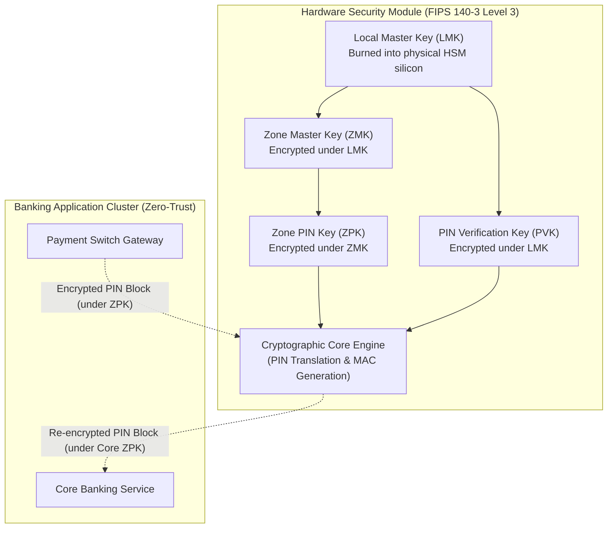

[📖 Bản tiếng Việt (Vietnamese Edition)](https://learn.tanhdev.com/series/core-banking-developer/part-6-security-compliance-audit/)

---

> **Prerequisite:** Read [Part 5: ISO 8583 & ISO 20022 Financial Standards](/series/core-banking-developer/part-5-iso-standards-integration/) for payment switch mechanics.

# Part 6: Core Banking Security, PCI-DSS & Audit Trails

**Answer-first:** Core banking security mandates a defense-in-depth zero-trust topology anchored by tamper-resistant Hardware Security Modules (HSM) for cryptographic key lifecycles, ANSI X9.8 PIN block translations, envelope field-level encryption (AES-256-GCM) for sensitive customer PII, and cryptographically hashed append-only audit trails. Enforcing strict compliance with **PCI-DSS v4.0.1** and central bank cybersecurity mandates (such as SBV Circular 09/2020/TT-NHNN) ensures continuous operational resilience against insider threats and sophisticated external cyber attacks.

---

## 1. Cryptographic Key Management & HSM Architecture

Financial security relies on physical Hardware Security Modules (Thales payShield, Entrust nShield) ensuring that plaintext encryption keys and customer PINs never exist in operating system RAM:


```mermaid
flowchart TD
    subgraph HSM_Boundary ["Hardware Security Module (FIPS 140-3 Level 3)"]
        LMK["Local Master Key (LMK)<br/>Burned into physical HSM silicon"]
        ZMK["Zone Master Key (ZMK)<br/>Encrypted under LMK"]
        ZPK["Zone PIN Key (ZPK)<br/>Encrypted under ZMK"]
        PVK["PIN Verification Key (PVK)<br/>Encrypted under LMK"]
        PE_Engine["Cryptographic Core Engine<br/>(PIN Translation & MAC Generation)"]
        LMK --> ZMK
        LMK --> PVK
        ZMK --> ZPK
        ZPK --> PE_Engine
        PVK --> PE_Engine
    end

    subgraph Application_Tier ["Banking Application Cluster (Zero-Trust)"]
        Switch["Payment Switch Gateway"]
        CoreApp["Core Banking Service"]
        Switch -. Encrypted PIN Block (under ZPK) .-> PE_Engine
        PE_Engine -. Re-encrypted PIN Block (under Core ZPK) .-> CoreApp
    end
```

---

## 2. ATM/POS PIN Block Translation Sequence via HSM

Customer PINs are never transmitted in plaintext. An ATM encrypts the PIN using its local terminal key into an ANSI X9.8 Format 0 PIN block. When routed to the bank core, the HSM translates the block into the core's private key without ever exposing the raw digits:

```mermaid
sequenceDiagram
    autonumber
    participant ATM as ATM / POS Terminal
    participant Switch as Payment Switch Gateway
    participant HSM as Hardware Security Module (payShield 10K)
    participant Core as Core Banking Authorizer

    ATM->>ATM: Capture PIN (4-6 digits) & XOR with PAN (Format 0)
    ATM->>Switch: Transmit Encrypted PIN Block (Encrypted with ATM ZPK)
    
    Switch->>HSM: Command 0xCA: Translate PIN Block (from ATM ZPK to Core ZPK)
    Note over HSM: Decrypts PIN block using ATM ZPK inside secure silicon;<br/>Re-encrypts under Core ZPK; Raw PIN NEVER leaves HSM RAM!
    HSM-->>Switch: Return Re-encrypted PIN Block
    
    Switch->>Core: Dispatch Authorization Request (with Core Encrypted PIN Block)
    Core->>HSM: Command 0x02: Verify PIN against PVV/Offset using PVK
    HSM-->>Core: Verification Result: PIN MATCH (00)
    Core-->>Switch: Approved (Authorization Code Generated)
```

---

## 3. Cryptographic Audit Trail Hash Chaining in Go 1.24

To prevent rogue database administrators from tampering with historical audit records, every audit entry includes a cryptographic SHA-256 hash linking back to the previous entry (Merkle hash chain):

```go
package security

import (
	"crypto/sha256"
	"encoding/hex"
	"fmt"
	"time"
)

type AuditLogEntry struct {
	ID           string
	Timestamp    time.Time
	ActorID      string
	Action       string
	EntityID     string
	PayloadDiff  string
	PreviousHash string
	CurrentHash  string
}

// ComputeHash seals the audit log entry by chaining the previous hash.
func (e *AuditLogEntry) ComputeHash() string {
	record := fmt.Sprintf("%s|%s|%s|%s|%s|%s|%s",
		e.ID,
		e.Timestamp.UTC().Format(time.RFC3339Nano),
		e.ActorID,
		e.Action,
		e.EntityID,
		e.PayloadDiff,
		e.PreviousHash,
	)

	hash := sha256.Sum256([]byte(record))
	return hex.EncodeToString(hash[:])
}

// VerifyAuditChain validates that an entire sequence of audit logs is untampered.
func VerifyAuditChain(entries []AuditLogEntry) bool {
	for i := 1; i < len(entries); i++ {
		current := entries[i]
		previous := entries[i-1]

		if current.PreviousHash != previous.CurrentHash {
			return false // Chain broken: Historical tampering detected!
		}
		if current.ComputeHash() != current.CurrentHash {
			return false // Payload altered!
		}
	}
	return true
}
```

---

## Frequently Asked Questions


PCI-DSS Requirement 3.6 strictly dictates that Primary Account Numbers (PAN) and PINs must never exist in plaintext in general-purpose computing memory where they could be dumped via core dumps, memory inspection tools, or compromised kernel modules. Hardware Security Modules (HSMs) provide tamper-evident, FIPS 140-3 Level 3 certified physical enclosures that automatically zeroize (erase) all cryptographic keys if physical probing or unauthorized bus tapping is detected.



Circular 09/2020/TT-NHNN mandates rigorous security baselines for online banking: (1) Mandatory multi-factor authentication (MFA/Biometric FIDO2) for high-value fund transfers; (2) Data localization within sovereign Vietnamese territory; (3) Operating a 24/7 Security Operations Center (SOC) with automated SIEM log analysis; and (4) Annual third-party penetration testing and source-code vulnerability scanning prior to major release deployments.



Searching encrypted data without decrypting the entire database is achieved using **Blind Indexing (HMAC-SHA256)**. Alongside the column storing the ciphertext (encrypted with randomized AES-256-GCM and unique IVs), the table stores a separate deterministic blind index column computed as `HMAC(PAN, secret_search_salt)`. Queries search directly against the blind index hash with $O(1)$ indexed speed without exposing plaintext data to database query analyzers.

