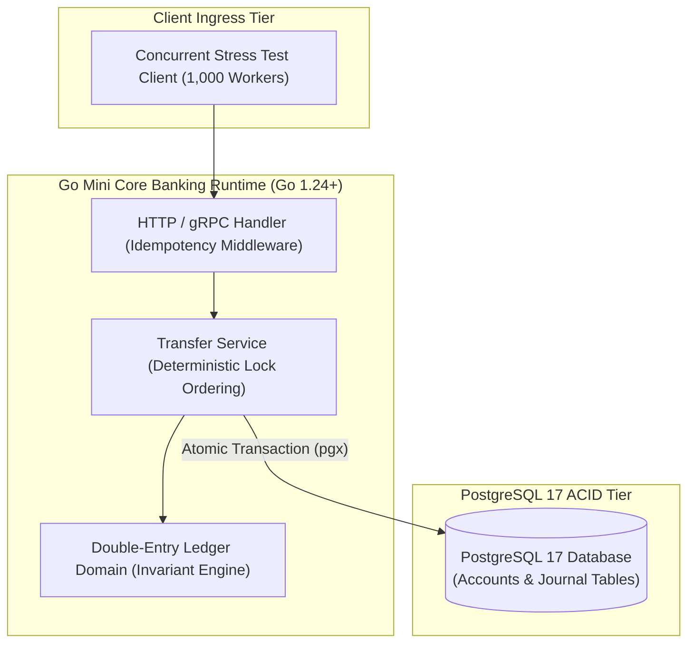
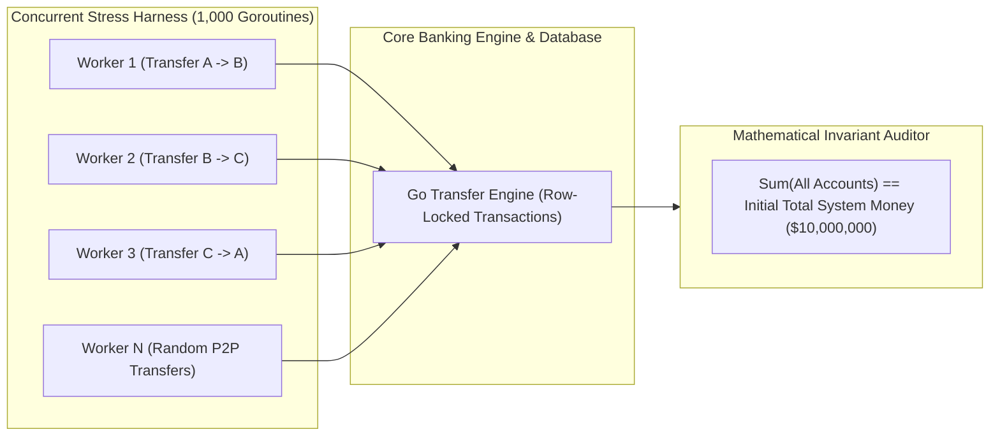

[📖 Bản tiếng Việt (Vietnamese Edition)](https://learn.tanhdev.com/series/core-banking-developer/part-7-build-mini-core-banking/)

---

> **Prerequisite:** Read [Part 3: ACID Transactions & Concurrency](/series/core-banking-developer/part-3-database-transactions-acid/) and [Part 6: Security & Audit Trails](/series/core-banking-developer/part-6-security-compliance-audit/).

# Part 7: Build a Mini Core Banking System in Golang Engine Guide

**Answer-first:** Building a production-grade mini core banking engine in Go requires implementing an immutable double-entry ledger schema, deterministic row locking (`SELECT ... FOR UPDATE` ordered by account ID) to prevent concurrency deadlocks, idempotent API middleware, and automated balance invariant reconciliation. This hands-on project validates transaction atomicity, sub-10ms transfer latency, zero-balance corruption, and invariant equilibrium ($\sum \text{Debits} = \sum \text{Credits}$) under 1,000 concurrent goroutine transfer stress tests.

---

## 1. System Component Architecture

The mini core banking engine adheres to clean hexagonal architecture, isolating pure domain accounting logic from external database adapters:



---

## 2. Concurrent Stress-Test Worker Pool & Invariant Validator Topology

To verify that race conditions cannot induce double-spending or money creation, a concurrent stress harness executes random peer-to-peer transfers while a background auditor verifies system-wide money conservation:



---

## 3. Production Transfer Implementation with Lock Sorting

The transfer service guarantees atomicity by acquiring row locks in strictly sorted order:

```go
package bankengine

import (
	"context"
	"errors"
	"fmt"
	"time"

	"github.com/jackc/pgx/v5"
	"github.com/jackc/pgx/v5/pgxpool"
)

type TransferRequest struct {
	FromAccountID  string
	ToAccountID    string
	Amount         int64 // In minor currency unit
	IdempotencyKey string
	Narration      string
}

type Engine struct {
	pool *pgxpool.Pool
}

func NewEngine(pool *pgxpool.Pool) *Engine {
	return &Engine{pool: pool}
}

func (e *Engine) Transfer(ctx context.Context, req TransferRequest) error {
	if req.Amount <= 0 {
		return errors.New("transfer amount must be strictly positive")
	}
	if req.FromAccountID == req.ToAccountID {
		return errors.New("sender and recipient accounts must differ")
	}

	tx, err := e.pool.BeginTx(ctx, pgx.TxOptions{IsoLevel: pgx.ReadCommitted})
	if err != nil {
		return fmt.Errorf("failed to open transaction: %w", err)
	}
	defer tx.Rollback(ctx)

	// Enforce lock ordering: always lock smaller account ID first
	firstID, secondID := req.FromAccountID, req.ToAccountID
	if firstID > secondID {
		firstID, secondID = req.ToAccountID, req.FromAccountID
	}

	var bal1, bal2 int64
	lockSQL := "SELECT current_balance FROM accounts WHERE id = $1 FOR UPDATE"
	if err := tx.QueryRow(ctx, lockSQL, firstID).Scan(&bal1); err != nil {
		return fmt.Errorf("failed to lock %s: %w", firstID, err)
	}
	if err := tx.QueryRow(ctx, lockSQL, secondID).Scan(&bal2); err != nil {
		return fmt.Errorf("failed to lock %s: %w", secondID, err)
	}

	senderBal := bal1
	if firstID != req.FromAccountID {
		senderBal = bal2
	}

	if senderBal < req.Amount {
		return fmt.Errorf("insufficient balance: available %d, required %d", senderBal, req.Amount)
	}

	// 1. Insert immutable journal entry
	var entryID string
	entrySQL := "INSERT INTO journal_entries (idempotency_key, narration, posted_at) VALUES ($1, $2, $3) RETURNING id"
	if err := tx.QueryRow(ctx, entrySQL, req.IdempotencyKey, req.Narration, time.Now().UTC()).Scan(&entryID); err != nil {
		return fmt.Errorf("duplicate idempotency key or journal error: %w", err)
	}

	// 2. Insert balanced journal legs
	legSQL := "INSERT INTO journal_legs (entry_id, account_id, direction, amount, sequence_num) VALUES ($1, $2, $3, $4, $5)"
	if _, err := tx.Exec(ctx, legSQL, entryID, req.FromAccountID, "DR", req.Amount, 1); err != nil {
		return fmt.Errorf("failed to write debit leg: %w", err)
	}
	if _, err := tx.Exec(ctx, legSQL, entryID, req.ToAccountID, "CR", req.Amount, 2); err != nil {
		return fmt.Errorf("failed to write credit leg: %w", err)
	}

	// 3. Update projected balances atomically
	updateSQL := "UPDATE accounts SET current_balance = current_balance + $1 WHERE id = $2"
	if _, err := tx.Exec(ctx, updateSQL, -req.Amount, req.FromAccountID); err != nil {
		return fmt.Errorf("failed to update sender balance: %w", err)
	}
	if _, err := tx.Exec(ctx, updateSQL, req.Amount, req.ToAccountID); err != nil {
		return fmt.Errorf("failed to update recipient balance: %w", err)
	}

	return tx.Commit(ctx)
}
```

---

## 4. Concurrent Stress Testing & Invariant Assertion

Below is the automated Go test demonstrating zero-drift money conservation across 1,000 concurrent transfers:

```go
func TestConcurrentTransferInvariants(t *testing.T) {
	ctx := context.Background()
	engine, cleanup := setupTestBankingEngine(t)
	defer cleanup()

	// Initial condition: 10 accounts, each funded with 1,000,000 units ($10,000 total)
	const numAccounts = 10
	const initialBalancePerAccount = 1000000
	expectedTotalMoney := int64(numAccounts * initialBalancePerAccount)

	accounts := seedTestAccounts(t, engine, numAccounts, initialBalancePerAccount)

	const numTransactions = 1000
	var wg sync.WaitGroup
	wg.Add(numTransactions)

	for i := 0; i < numTransactions; i++ {
		go func(txIndex int) {
			defer wg.Done()
			from := accounts[rand.Intn(numAccounts)]
			to := accounts[rand.Intn(numAccounts)]
			for from == to {
				to = accounts[rand.Intn(numAccounts)]
			}

			amount := int64(rand.Intn(50000) + 100)
			key := fmt.Sprintf("tx-stress-%d", txIndex)

			_ = engine.Transfer(ctx, TransferRequest{
				FromAccountID:  from,
				ToAccountID:    to,
				Amount:         amount,
				IdempotencyKey: key,
				Narration:      "Stress Test Transfer",
			})
		}(i)
	}

	wg.Wait()

	// THE FINAL INVARIANT CHECK: Total money in the bank must NEVER change!
	actualTotalMoney := calculateTotalBankMoney(t, engine)
	if actualTotalMoney != expectedTotalMoney {
		t.Fatalf("CRITICAL FINANCIAL BUG: Total bank money drifted! Expected %d, Actual %d (Diff: %d)",
			expectedTotalMoney, actualTotalMoney, actualTotalMoney-expectedTotalMoney)
	}
}
```

---

## Frequently Asked Questions


Deadlocks occur when two concurrent transactions attempt to acquire row locks in reverse order (Tx 1 locks Account A then B; Tx 2 locks Account B then A). By enforcing that every transaction lexicographically sorts account IDs prior to query execution (always locking `min(A, B)` before `max(A, B)`), a circular lock-wait dependency is mathematically impossible, eliminating PostgreSQL deadlock errors.



In consumer applications, test assertions typically check that individual API calls return HTTP 200. In financial software, verifying individual transfers is insufficient because race conditions can cause money to be created or destroyed silently. The system-wide money conservation test ($\sum \text{Accounts}_{\text{final}} == \sum \text{Accounts}_{\text{initial}}$) verifies that no matter how many transactions fail or race concurrently, the global money supply remains strictly invariant.



If a network partition occurs between the application server and the database during the `tx.Commit()` call, the application cannot immediately know whether the transaction committed or aborted. The client handles this by retrying the identical transfer with the original `Idempotency-Key`. The core engine catches the unique key collision on `journal_entries.idempotency_key`, realizes the transaction already succeeded, and returns a successful response without executing a duplicate debit.

