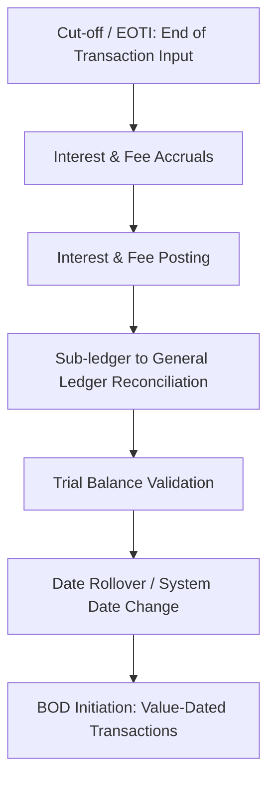

In core banking system (CBS) development, the Product Requirements Document (PRD) is vastly different from a standard SaaS or mobile app PRD. While a SaaS PRD focuses heavily on user interfaces, user growth metrics, and customer delight, a Core Banking PRD must prioritize **financial integrity, transactional consistency, auditability, and regulatory compliance**.

A poorly designed core banking requirement doesn't just lead to bad user reviews; it can result in regulatory fines, unbalanced ledgers, and millions of dollars in financial discrepancies.

This guide outlines a comprehensive, industry-standard structure for a Core Banking PRD, specifically focusing on core modules like Customer Information Files (CIF), Current and Savings Accounts (CASA), and the General Ledger (GL).

---

## 1. Why Core Banking PRDs Are Different

A Core Banking System serves as the ultimate source of truth for a financial institution. When structuring requirements for such a system, Product Managers (PMs) and Business Analysts (BAs) must design with a systems-engineering mindset.

| SaaS PRD | Core Banking PRD |
| :--- | :--- |
| **Focus:** User growth, engagement, UI/UX, and fast onboarding. | **Focus:** Data integrity, transaction atomicity, ledger balance, and auditing. |
| **Design:** Optimistic UI, eventual consistency, simple API contracts. | **Design:** Strong consistency, ACID properties, double-entry bookkeeping, strict state machines. |
| **Failures:** Annoying to users, minor bugs can be hotfixed. | **Failures:** Catastrophic (unbalanced GL, double-spend, compliance breaches). |

---

## 2. Core Banking PRD Structure

A robust Core Banking PRD should be organized into the following logical sections:

### Section A: Domain & Scope Definition
Every core module (CIF, CASA, GL, Loans, payments) must have strict operational boundaries. You must clearly state:
- **In-Scope Modules:** E.g., "This PRD defines current account creation, maintenance fees, and interest calculations."
- **Out-of-Scope Modules:** E.g., "Card issuing, payment gateways, and foreign exchange (FX) settlement are handled by external microservices and are out of scope."

### Section B: Customer Information File (CIF) & KYC
The CIF is the party-centric master database containing all customer information. In this section, define:
- **Party-Centric Model:** How static customer profile data (names, tax IDs, contact details) maps to multiple accounts (CASA, loans).
- **KYC/AML Lifecycle States:** `Prospect` $\rightarrow$ `Pending` $\rightarrow$ `Approved` $\rightarrow$ `Expired` $\rightarrow$ `Restricted`.
- **Deduplication Logic:** Strict rules to prevent the creation of duplicate CIFs (e.g., using tax ID or national identity card validation rules).

### Section C: Account Management (CASA)
Current Accounts and Savings Accounts represent the bank's liability engine. This section must detail:
- **The Account State Machine:**
  - Active, Dormant, Frozen, Restricted, Closed.
  - Define exactly what system events or manual controls transition accounts between these states.
- **Interest Engine Rules:**
  - Daily balance calculation rules (e.g., *Day Count Convention* like Act/365 or Act/360).
  - Accrual vs. Posting: Accruing interest daily (accrual) but posting it to the ledger monthly or quarterly (posting).
- **Overdraft (OD) Logic:**
  - Define overdraft limits.
  - Enforce validation against the **Available Balance** (Ledger Balance - Hold/Block amounts) rather than Ledger Balance to prevent the *Authorize Positive, Settle Negative (APSN)* failure pattern.

### Section D: Transaction Processing & Double-Entry Accounting
Core banking ledger updates must follow strict accounting principles.
- **Double-Entry Enforcement:** Every financial transaction must generate at least two entries (legs): a **Debit** and a **Credit**. The PRD must validate:
  $$\sum \text{Debits} = \sum \text{Credits}$$
- **Ledger Immutability:** Historical database records must never be updated or deleted. If a transaction is incorrect, the PRD must specify an offsetting transaction (Reversal) to correct the balance.
- **Idempotency Control:** Require clients to supply a unique `Idempotency-Key` to prevent duplicate postings due to network retries.

### Section E: Maker-Checker (4-Eyes Principle)
To prevent internal fraud and operational errors, sensitive configurations and high-value transactions must be routed through a maker-checker workflow.
- **Queue-Based Centralized Approval:** Maker creates the request $\rightarrow$ Payload is written to a pending queue $\rightarrow$ Checker approves or rejects the payload $\rightarrow$ Transaction executes.
- **Segregation of Duties:** A user who acts as the Maker for a specific transaction must be programmatically blocked from acting as the Checker for that same transaction.

### Section F: Non-Functional Requirements (NFRs)
NFRs in Core Banking are functional barriers. They must be measurable:
- **Availability:** Target 99.999% uptime with a maximum Recovery Time Objective (RTO) of 5 minutes.
- **Data Integrity:** Strict ACID database compliance for all ledger transactions.
- **Performance:** Handle a minimum of 5,000 Transactions Per Second (TPS) with latency below 100ms.
- **Audit Trail:** Capture all data states (before and after) for manual overrides, system parameter changes, and database configurations.

---

## 3. End-of-Day (EOD) and Begin-of-Day (BOD) Batches

Unlike modern SaaS which operates purely in real-time, banks still rely heavily on batch processing to finalize the financial day. A Core Banking PRD must explicitly map out the EOD/BOD pipeline sequence:

### Key Considerations for Batch Processing:
1. **System Date vs. Physical Date:** In a 24/7 transaction environment, online transaction channels must be allowed to post transactions during the EOD run. The core system must immediately route these transactions to the new *System Business Date* while the batch processes the old date.
2. **Restartability:** If a batch job fails (e.g., due to a database lock), the system must support resuming execution from the failed checkpoint without corrupting the historical database state.

---

## 4. Integration Standards: ISO 8583 vs. ISO 20022

A core banking PRD must specify how the core ledger translates payment payloads to standard message formats.

- **ISO 8583 (Card Processing):** Compact, binary-encoded format optimized for high-volume, low-latency credit/debit card transactions at ATMs and POS terminals.
- **ISO 20022 (Modern Payments):** Verbose, XML/JSON-based messaging standard that supports rich metadata (such as remittance details and structured address fields) required for cross-border wires (SWIFT) and real-time payments (FedNow, SEPA).

The PRD must outline the **Data Adapter layer** that maps legacy card fields directly to internal core modules without truncating critical payment context.

---

## Summary Checklist for a Core Banking PRD

When reviewing or writing your CBS PRD, ensure all these checkboxes are met:

- [ ] **Ledger Rules:** Are double-entry balances validated before committing the transaction?
- [ ] **Balance Checks:** Are overdraft and balance holds verified against the *Available Balance* instead of the *Ledger Balance*?
- [ ] **Immutability:** Is there a strict rule preventing SQL updates or deletes on the transaction history tables?
- [ ] **Batch Recovery:** Does the EOD batch flow support transaction rollback and resumption from checkpoints?
- [ ] **Maker-Checker Queue:** Is dual-authorization implemented as a centralized queue rather than hardcoded table flags?
- [ ] **Idempotency:** Are all financial endpoints protected by a mandatory client-side idempotency key?
