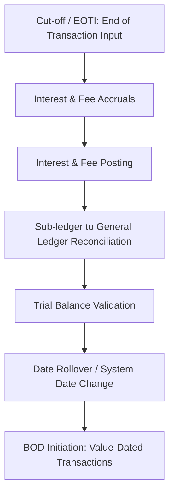

> **Answer-first:** Writing an enterprise core banking Product Requirements Document (PRD) requires specifying double-entry journal rules, strict balance validation, ACID transaction atomicity, maker-checker dual authorization, and End-of-Day batch pipelines. Defining non-functional SLAs (99.999% uptime, 5-minute RTO, sub-100ms API latency) and ISO message schemas ensures financial consistency and compliance with banking audit standards.

> **Prerequisite:** [Part 7: Build a Mini Core Banking System in Go](/series/core-banking-developer/part-7-build-mini-core-banking/) on core ledger code.

In Core Banking System (CBS) engineering, the Product Requirements Document (PRD) differs fundamental from standard consumer SaaS specifications. While SaaS PRDs prioritize front-end user experience, growth metrics, and rapid feature iteration, a Core Banking PRD establishes non-negotiable standards for **financial integrity, transactional consistency, auditability, and regulatory compliance**.

An ambiguous core banking requirement does not merely degrade user experience; it causes General Ledger imbalances, regulatory fines, and millions of dollars in direct financial loss. This handbook provides an industry-standard template for structuring Core Banking PRDs across critical domain modules, including Customer Information Files (CIF), Current and Savings Accounts (CASA), and the General Ledger (GL).

---

## 1. Why Core Banking PRDs Are Different

> **Answer-first:** Core banking PRDs differ from standard web specs by requiring explicit accounting journal rules, ACID transaction isolation, and regulatory compliance.

A Core Banking System serves as the definitive financial system of record for a banking institution. Product Managers (PMs) and Business Analysts (BAs) must design specifications with a distributed systems engineering discipline.

The reference table below contrasts core architectural differences between conventional SaaS PRDs and Core Banking PRDs.

| SaaS PRD | Core Banking PRD |
| :--- | :--- |
| **Focus:** User growth, engagement, UI/UX, and fast onboarding. | **Focus:** Data integrity, transaction atomicity, ledger balance, and auditing. |
| **Design:** Optimistic UI, eventual consistency, simple API contracts. | **Design:** Strong consistency, ACID properties, double-entry bookkeeping, strict state machines. |
| **Failures:** Annoying to users, minor bugs can be hotfixed. | **Failures:** Catastrophic (unbalanced GL, double-spend, compliance breaches). |

---

## 2. Core Banking PRD Structure

**Answer-first:** A complete core banking PRD structures Functional Scope, Accounting Entries, Exception Flows, Non-Functional Requirements, and Audit Controls.

A production-grade Core Banking PRD must be partitioned into discrete, independently testable sections:

### Section A: Domain & Scope Definition
Every core module (CIF, CASA, GL, Loans, payments) requires explicit functional boundary definitions:
- **In-Scope Modules:** E.g., "This PRD defines current account creation, maintenance fee accruals, and monthly interest posting rules."
- **Out-of-Scope Modules:** E.g., "Card issuance, payment gateways, and foreign exchange (FX) settlement are handled by dedicated peripheral microservices."

### Section B: Customer Information File (CIF) & KYC
The CIF serves as the party-master store for all customer relationship records:
- **Party-Centric Model:** Maps static customer profile data (names, tax identifiers, corporate structures) to associated deposit and loan accounts.
- **KYC/AML Lifecycle States:** `Prospect` $\rightarrow$ `Pending` $\rightarrow$ `Approved` $\rightarrow$ `Expired` $\rightarrow$ `Restricted`.
- **Deduplication Logic:** Enforces strict multi-field matching (tax identification number, national identity card hash, biometric hashes) to block duplicate CIF generation.

### Section C: Account Management (CASA)
Current Accounts and Savings Accounts represent the primary liability engine of a bank:
- **Account State Machine:** Defines transitions between `Active`, `Dormant`, `Frozen`, `Restricted`, and `Closed` statuses.
- **Interest Engine Rules:** Specifies daily balance calculation conventions (e.g., Act/365 or Act/360) and distinguishes daily accruals from monthly journal postings.
- **Overdraft (OD) Logic:** Validates all debit attempts against the **Available Balance** (Ledger Balance minus active Holds and pending auths) to eliminate Authorize Positive, Settle Negative (APSN) vulnerabilities.

### Section D: Transaction Processing & Double-Entry Accounting
Core banking ledger updates must adhere to double-entry bookkeeping invariants:
- **Double-Entry Equality:** Every financial transaction must contain at least two entries: a **Debit** leg and a **Credit** leg, satisfying:
  $$\sum \text{Debits} = \sum \text{Credits}$$
- **Ledger Immutability:** Prohibits raw database SQL updates or deletes on historical transaction rows. Discrepancies must be corrected via offsetting Reversal entries.
- **Idempotency Control:** Mandates client-supplied unique `Idempotency-Key` headers on all financial POST requests.

### Section E: Maker-Checker (4-Eyes Principle)
To mitigate insider threat risks and operational errors, high-value transfer executions and parameter updates require dual authorization.

#### Maker-Checker Database Schema (PostgreSQL DDL)

The PostgreSQL DDL specification below establishes a dedicated pending request queue table for maker-checker approval workflows.

```sql
CREATE TABLE maker_checker_requests (
    id            UUID PRIMARY KEY DEFAULT gen_random_uuid(),
    action_type   VARCHAR(50) NOT NULL, -- e.g., 'CREATE_CASA_ACCOUNT', 'APPROVE_LOAN'
    payload       JSONB NOT NULL,       -- Complete JSON data for execution
    maker_id      VARCHAR(50) NOT NULL,
    status        VARCHAR(20) NOT NULL DEFAULT 'PENDING' CHECK (status IN ('PENDING', 'APPROVED', 'REJECTED')),
    checker_id    VARCHAR(50),
    rejection_reason TEXT,
    created_at    TIMESTAMP WITH TIME ZONE DEFAULT CURRENT_TIMESTAMP,
    updated_at    TIMESTAMP WITH TIME ZONE DEFAULT CURRENT_TIMESTAMP
);

-- Indexing for quick queue lookups
CREATE INDEX idx_maker_checker_pending ON maker_checker_requests(status) WHERE status = 'PENDING';
```

#### Go Implementation: Enforcing Segregation of Duties

The Go service logic below demonstrates programmatically blocking self-approval by verifying that the approving user (checker) differs from the initiating user (maker).

```go
package prd

import (
	"context"
	"database/sql"
	"errors"
	"fmt"
)

type ApprovalService struct {
	db *sql.DB
}

// ApproveRequest processes the checker approval step of a maker-checker request
func (s *ApprovalService) ApproveRequest(ctx context.Context, requestID string, checkerID string) error {
	tx, err := s.db.BeginTx(ctx, nil)
	if err != nil {
		return err
	}
	defer tx.Rollback()

	// 1. Fetch Request
	var makerID string
	var status string
	query := "SELECT maker_id, status FROM maker_checker_requests WHERE id = $1 FOR UPDATE"
	err = tx.QueryRowContext(ctx, query, requestID).Scan(&makerID, &status)
	if err != nil {
		return fmt.Errorf("failed to retrieve request: %w", err)
	}

	// 2. Validate current status
	if status != "PENDING" {
		return fmt.Errorf("request cannot be approved: current status is %s", status)
	}

	// 3. Enforce 4-Eyes Invariant (Segregation of Duties)
	if makerID == checkerID {
		return errors.New("security violation: checker cannot be the same user as the maker")
	}

	// 4. Update status and record checker
	updateQuery := "UPDATE maker_checker_requests SET status = 'APPROVED', checker_id = $1, updated_at = NOW() WHERE id = $2"
	_, err = tx.ExecContext(ctx, updateQuery, checkerID, requestID)
	if err != nil {
		return fmt.Errorf("failed to update request status: %w", err)
	}

	// Payload execution is performed within this atomic transaction boundary.

	return tx.Commit()
}
```

- **Queue-Based Centralized Approval:** Maker submits action $\rightarrow$ Payload is written to queue $\rightarrow$ Checker approves or rejects payload $\rightarrow$ Transaction executes.
- **Segregation of Duties:** Software logic guarantees that a user acting as Maker cannot act as Checker for the same request.

### Section F: Non-Functional Requirements (NFRs)
NFRs in Core Banking PRDs specify quantitative system SLA targets:
- **Availability:** 99.999% uptime SLA with a maximum Recovery Time Objective (RTO) of 5 minutes and Recovery Point Objective (RPO) of 0 seconds.
- **Data Integrity:** Strict ACID database compliance for all ledger transactions.
- **Performance:** Sustained throughput of 5,000 Transactions Per Second (TPS) with latency below 100ms at p99.
- **Audit Trail:** Detailed before-and-after change capture for all data mutations and system configurations.

---

## 3. End-of-Day (EOD) and Begin-of-Day (BOD) Batches

Specifying EOD/BOD batches in PRDs requires defining interest accrual formulas, trial balance validation rules, and system lock schedules.

Unlike stateless SaaS platforms, core banking systems process batch runs to finalize financial business dates. The PRD must map out the sequential EOD/BOD pipeline.

The process flow diagram below details the End-of-Day batch processing pipeline stages leading to business date rollover.


```mermaid
graph TD
    A["Cut-off / EOTI: End of Transaction Input"] --> B["Interest & Fee Accruals"]
    B --> C["Interest & Fee Posting"]
    C --> D[Sub-ledger to General Ledger Reconciliation]
    D --> E[Trial Balance Validation]
    E --> F["Date Rollover / System Date Change"]
    F --> G["BOD Initiation: Value-Dated Transactions"]
```

### Key Considerations for Batch Processing:
1. **System Business Date vs. Physical Date:** 24/7 online transaction channels post incoming requests to the new *System Business Date* while EOD batch processing runs against the prior date.
2. **Batch Restartability:** If a batch step fails (e.g. database timeout), the job runner must resume from checkpoint saved states without re-applying financial postings.

---

## 4. Integration Standards: ISO 8583 vs. ISO 20022

Integration sections in banking PRDs define message schemas for ISO 8583 card switches and ISO 20022 XML payment clearing networks.

A core banking PRD must specify message translation mappings between internal ledger payloads and external payment network standards:

- **ISO 8583 (Card Processing):** Compact binary/bitmap protocol optimized for high-volume POS and ATM network authorization.
- **ISO 20022 (Modern Payments):** Rich XML/JSON schema supporting detailed remittance metadata for cross-border wires (SWIFT) and real-time payment networks (FedNow, SEPA).

---

## Summary Checklist for a Core Banking PRD

The PRD summary checklist verifies accounting balance equations, error handling codes, idempotency keys, and security compliance requirements.

When evaluating a Core Banking PRD specification, verify that all checklist items are satisfied:

- [ ] **Ledger Rules:** Are double-entry balances ($\sum \text{Debits} = \sum \text{Credits}$) enforced prior to transaction commits?
- [ ] **Balance Validation:** Are balance checks executed against *Available Balance* instead of raw *Ledger Balance*?
- [ ] **Immutability:** Are SQL `UPDATE` and `DELETE` actions explicitly prohibited on ledger tables?
- [ ] **Batch Recovery:** Does the EOD batch workflow support checkpoint resumption after failure?
- [ ] **Maker-Checker Queue:** Is dual authorization modeled as a centralized database queue rather than simple boolean columns?
- [ ] **Idempotency:** Are all financial endpoints guarded by mandatory client-side idempotency keys?

---

## Non-Repudiation Security Framework

Non-repudiation security frameworks mandate digital signatures and cryptographic audit logs for high-value financial transaction approvals.

To prevent fraud disputes, the PRD mandates that high-value transfer requests carry an asymmetric cryptographic signature generated by the client's private key.

The Go implementation below illustrates RSA PKCS#1 v1.5 signature verification for inbound financial payload authentication.

```go
package prd

import (
	"crypto"
	"crypto/rsa"
	"crypto/sha256"
	"errors"
)

type SignatureVerifier struct {
	PublicKey *rsa.PublicKey
}

func (sv *SignatureVerifier) Verify(payload []byte, signature []byte) error {
	hashed := sha256.Sum256(payload)
	err := rsa.VerifyPKCS1v15(sv.PublicKey, crypto.SHA256, hashed[:], signature)
	if err != nil {
		return errors.New("cryptographic validation failed: invalid signature payload")
	}
	return nil
}
```

This security mechanism guarantees non-repudiation, ensuring that committed financial requests cannot be denied or altered post-execution.

---

## Frequently Asked Questions (FAQ)

Writing a core banking PRD requires specifying accounting ledger rules, maker-checker authorization workflows, and End-of-Day batch pipeline sequences.


Available balance accounts for pending holds and uncleared deposits, whereas ledger balance represents posted transactions. Validating transactions against available balance prevents Authorize Positive, Settle Negative (APSN) fraud and uncollectible overdraft liabilities.



The maker-checker framework stores authorization requests in a dedicated database queue table with pending status flags. Service layer validation checks that the authenticating user (checker) does not match the initiating user (maker), blocking self-approval of high-value transfer requests.



The EOD batch locks the business date, calculates daily interest accruals for CASA and loan accounts, posts scheduled fee entries, and reconciles sub-ledger postings to General Ledger trial balances. Once trial balance invariants pass validation, the batch processor increments the system business date to initiate Begin-of-Day operations.


🔗 **Next Step:** Explore the full curriculum of this series in the [Core Banking Developer Series](/series/core-banking-developer/).

---

[← Previous Part: Part 7: Build a Mini Core Banking System in Go](/series/core-banking-developer/part-7-build-mini-core-banking/)
