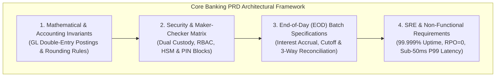
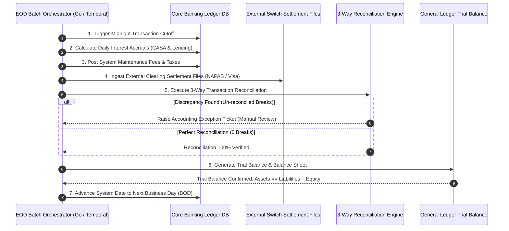

[📖 Bản tiếng Việt (Vietnamese Edition)](https://learn.tanhdev.com/series/core-banking-developer/part-8-core-banking-prd/)

---

> **Prerequisite:** Read [Part 7: Build a Mini Core Banking System](/series/core-banking-developer/part-7-build-mini-core-banking/) for ledger engine mechanics.

# Writing a Core Banking PRD: Developer & PM Handbook

**Answer-first:** Writing an enterprise Core Banking Product Requirements Document (PRD) requires defining explicit mathematical balance invariants ($\sum \text{Debits} = \sum \text{Credits}$), cryptographic audit trail specifications, Maker-Checker dual authorization matrices, and End-of-Day (EOD) batch processing SLAs. Codifying non-functional availability constraints (Five Nines 99.999%, RPO = 0, RTO < 30s) and ISO 20022 message mappings ensures seamless alignment between product managers, software architects, compliance officers, and regulatory central bank auditors.

---

## 1. Core Banking PRD Architectural Specification Framework

Unlike consumer application PRDs that emphasize UI mockups and user growth loops, a core banking PRD is a technical legal contract specifying accounting equations, concurrency locks, and failure recovery protocols:

```mermaid
flowchart TD
    subgraph PRD_Framework ["Core Banking PRD Architectural Framework"]
        Math["1. Mathematical & Accounting Invariants<br/>(GL Double-Entry Postings & Rounding Rules)"]
        Security["2. Security & Maker-Checker Matrix<br/>(Dual Custody, RBAC, HSM & PIN Blocks)"]
        Batch["3. End-of-Day (EOD) Batch Specifications<br/>(Interest Accrual, Cutoff & 3-Way Reconciliation)"]
        SRE["4. SRE & Non-Functional Requirements<br/>(99.999% Uptime, RPO=0, Sub-50ms P99 Latency)"]
    end

    Math --> Security
    Security --> Batch
    Batch --> SRE
```

---

## 2. End-of-Day (EOD) Batch Orchestration & Reconciliation Flow

The End-of-Day batch processing pipeline represents the financial closing of the bank's operational day, executing sequenced ledger calculations before opening the next business date:

```mermaid
sequenceDiagram
    autonumber
    participant Scheduler as EOD Batch Orchestrator (Go / Temporal)
    participant CoreDB as Core Banking Ledger DB
    participant SwitchLog as External Switch Settlement Files
    participant Recon as 3-Way Reconciliation Engine
    participant GL as General Ledger Trial Balance

    Scheduler->>CoreDB: 1. Trigger Midnight Transaction Cutoff
    Scheduler->>CoreDB: 2. Calculate Daily Interest Accruals (CASA & Lending)
    Scheduler->>CoreDB: 3. Post System Maintenance Fees & Taxes
    
    Scheduler->>SwitchLog: 4. Ingest External Clearing Settlement Files (NAPAS / Visa)
    Scheduler->>Recon: 5. Execute 3-Way Transaction Reconciliation
    
    alt Discrepancy Found (Un-reconciled Breaks)
        Recon-->>Scheduler: Raise Accounting Exception Ticket (Manual Review)
    else Perfect Reconciliation (0 Breaks)
        Recon-->>Scheduler: Reconciliation 100% Verified
    end

    Scheduler->>GL: 6. Generate Trial Balance & Balance Sheet
    GL-->>Scheduler: Trial Balance Confirmed: Assets == Liabilities + Equity
    Scheduler->>CoreDB: 7. Advance System Date to Next Business Day (BOD)
```

---

## 3. Core Banking PRD Checklist & Engineering Contract

Before engineering begins implementation on any core banking feature, the specification must satisfy this mandatory checklist:

| Dimension | Mandatory Requirement in Banking PRD | Verification Mechanism |
| :--- | :--- | :--- |
| **Accounting Invariant** | Must document every affected GL account (Asset, Liability, Equity, Revenue, Expense) with exact Debit/Credit legs. | Invariant unit tests asserting $\Delta \text{Assets} = \Delta \text{Liabilities} + \Delta \text{Equity}$. |
| **Maker-Checker Matrix** | Financial transactions exceeding regulatory thresholds (e.g. > $5,000) require two distinct authorized users (Maker creates, Checker approves). | API tests verifying Maker cannot approve their own submission. |
| **Idempotency Standard** | All mutation endpoints must mandate an `Idempotency-Key` header with a 24-hour persistence window. | Automated retry tests simulating duplicate requests with zero side-effects. |
| **Failure Recovery** | Every forward step must define an exact compensating transaction (e.g. reversal reasons, fees handling). | Chaos engineering drills verifying automatic rollback on timeout. |
| **SRE Performance SLAs** | P99 latency < 50ms at 5,000 TPS; Availability = 99.999%; RPO = 0; RTO < 30s. | Distributed k6 load tests and automated disaster recovery GameDays. |

---

## Frequently Asked Questions


In consumer SaaS applications, minor state inconsistencies can be resolved asynchronously via customer support tickets. In a core banking engine, a single transaction that posts an unbalanced ledger entry ($\text{Debits} \neq \text{Credits}$) breaks the entire bank's balance sheet, corrupts regulatory capital reporting, and triggers immediate central bank audits. An invariant table explicitly defines the mathematical equations that code must guarantee at compile time and runtime.



Maker-Checker (Dual Custody) is an internal fraud prevention standard requiring two distinct individuals to complete a sensitive operation (e.g. issuing a loan, adjusting an account balance, or executing a high-value wire). In the database, the transaction is created in a `PENDING_APPROVAL` state with `maker_user_id` populated. The API rejects any approval request where `checker_user_id == maker_user_id`, requiring an authenticated cryptographic signature from a second officer with supervisory roles.


Legacy banks ran single-threaded sequential batch jobs on monolithic mainframes, requiring digital channels to be disabled overnight. Modern cloud-native banking engines optimize EOD through: (1) **Read-Only Snapshotting**: snapshotting account balances at midnight so real-time transactions continue uninterrupted; (2) **Partitioned Parallel Workers**: distributing interest calculations across hundreds of ephemeral Kubernetes pods partitioned by account hash; and (3) **Stream-Based Reconciliation**: matching external clearing files continuously throughout the day rather than in a single midnight batch.

