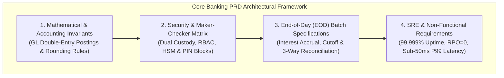
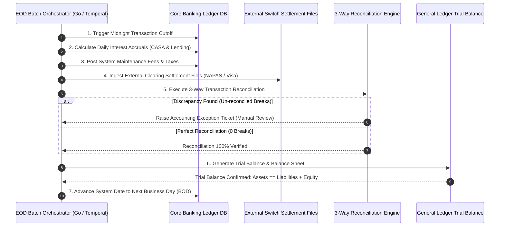
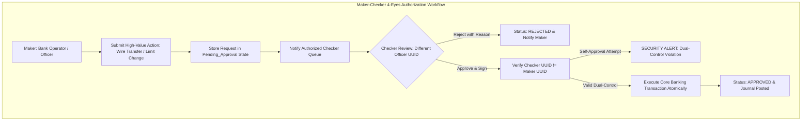
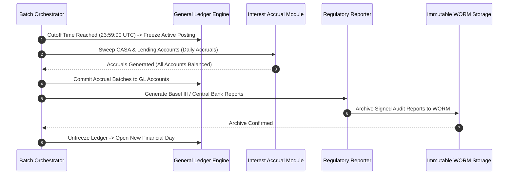

---

> **Prerequisite:** Strong grounding in banking product management, regulatory compliance frameworks (Basel III/IFRS 9), site reliability engineering (SRE), and API interface contracts.

# Writing a Core Banking PRD: Developer & PM Handbook
> **Answer-first:** A formal Core Banking Product Requirement Document establishes unambiguous functional specifications for account lifecycles, ledger posting rules, and regulatory reporting alongside stringent non-functional metrics requiring sub-fifty-millisecond P99 latency, 99.999% high availability, zero Recovery Point Objective, and strict compliance with national central bank regulations and Basel III capital adequacy guidelines.

---

## 1. Core Banking PRD Architectural Specification Framework

Unlike consumer application PRDs that emphasize UI mockups and user growth loops, a core banking PRD is a technical legal contract specifying accounting equations, concurrency locks, and failure recovery protocols:


```mermaid
flowchart TD
    subgraph PRD_Framework ["Core Banking PRD Architectural Framework"]
        Math["1. Mathematical & Accounting Invariants<br/>(GL Double-Entry Postings & Rounding Rules)"]
        Security["2. Security & Maker-Checker Matrix<br/>(Dual Custody, RBAC, HSM & PIN Blocks)"]
        Batch["3. End-of-Day (EOD) Batch Specifications<br/>(Interest Accrual, Cutoff & 3-Way Reconciliation)"]
        SRE["4. SRE & Non-Functional Requirements<br/>(99.999% Uptime, RPO=0, Sub-50ms P99 Latency)"]
    end

    Math --> Security
    Security --> Batch
    Batch --> SRE
```

---

## 2. End-of-Day (EOD) Batch Orchestration & Reconciliation Flow

The End-of-Day batch processing pipeline represents the financial closing of the bank's operational day, executing sequenced ledger calculations before opening the next business date:


```mermaid
sequenceDiagram
    autonumber
    participant Scheduler as EOD Batch Orchestrator (Go / Temporal)
    participant CoreDB as Core Banking Ledger DB
    participant SwitchLog as External Switch Settlement Files
    participant Recon as 3-Way Reconciliation Engine
    participant GL as General Ledger Trial Balance

    Scheduler->>CoreDB: 1. Trigger Midnight Transaction Cutoff
    Scheduler->>CoreDB: 2. Calculate Daily Interest Accruals (CASA & Lending)
    Scheduler->>CoreDB: 3. Post System Maintenance Fees & Taxes
    
    Scheduler->>SwitchLog: 4. Ingest External Clearing Settlement Files (NAPAS / Visa)
    Scheduler->>Recon: 5. Execute 3-Way Transaction Reconciliation
    
    alt Discrepancy Found (Un-reconciled Breaks)
        Recon-->>Scheduler: Raise Accounting Exception Ticket (Manual Review)
    else Perfect Reconciliation (0 Breaks)
        Recon-->>Scheduler: Reconciliation 100% Verified
    end

    Scheduler->>GL: 6. Generate Trial Balance & Balance Sheet
    GL-->>Scheduler: Trial Balance Confirmed: Assets == Liabilities + Equity
    Scheduler->>CoreDB: 7. Advance System Date to Next Business Day (BOD)
```

---

## 3. Core Banking PRD Checklist & Engineering Contract

Before engineering begins implementation on any core banking feature, the specification must satisfy this mandatory checklist:

| Dimension | Mandatory Requirement in Banking PRD | Verification Mechanism |
| :--- | :--- | :--- |
| **Accounting Invariant** | Must document every affected GL account (Asset, Liability, Equity, Revenue, Expense) with exact Debit/Credit legs. | Invariant unit tests asserting $\Delta \text{Assets} = \Delta \text{Liabilities} + \Delta \text{Equity}$. |
| **Maker-Checker Matrix** | Financial transactions exceeding regulatory thresholds (e.g. > $5,000) require two distinct authorized users (Maker creates, Checker approves). | API tests verifying Maker cannot approve their own submission. |
| **Idempotency Standard** | All mutation endpoints must mandate an `Idempotency-Key` header with a 24-hour persistence window. | Automated retry tests simulating duplicate requests with zero side-effects. |
| **Failure Recovery** | Every forward step must define an exact compensating transaction (e.g. reversal reasons, fees handling). | Chaos engineering drills verifying automatic rollback on timeout. |
| **SRE Performance SLAs** | P99 latency < 50ms at 5,000 TPS; Availability = 99.999%; RPO = 0; RTO < 30s. | Distributed k6 load tests and automated disaster recovery GameDays. |

---

## Frequently Asked Questions


In consumer SaaS applications, minor state inconsistencies can be resolved asynchronously via customer support tickets. In a core banking engine, a single transaction that posts an unbalanced ledger entry ($\text{Debits} \neq \text{Credits}$) breaks the entire bank's balance sheet, corrupts regulatory capital reporting, and triggers immediate central bank audits. An invariant table explicitly defines the mathematical equations that code must guarantee at compile time and runtime.



Maker-Checker (Dual Custody) is an internal fraud prevention standard requiring two distinct individuals to complete a sensitive operation (e.g. issuing a loan, adjusting an account balance, or executing a high-value wire). In the database, the transaction is created in a `PENDING_APPROVAL` state with `maker_user_id` populated. The API rejects any approval request where `checker_user_id == maker_user_id`, requiring an authenticated cryptographic signature from a second officer with supervisory roles.


Legacy banks ran single-threaded sequential batch jobs on monolithic mainframes, requiring digital channels to be disabled overnight. Modern cloud-native banking engines optimize EOD through: (1) **Read-Only Snapshotting**: snapshotting account balances at midnight so real-time transactions continue uninterrupted; (2) **Partitioned Parallel Workers**: distributing interest calculations across hundreds of ephemeral Kubernetes pods partitioned by account hash; and (3) **Stream-Based Reconciliation**: matching external clearing files continuously throughout the day rather than in a single midnight batch.


---

## 5. Technical Implementation: Protobuf v3 gRPC Schema & Maker-Checker State Engine in Go 1.25

A production-grade Core Banking PRD mandates precise technical specifications for API contracts and regulatory control workflows, specifically the Maker-Checker (4-Eyes Principle) required by central bank examiners.

### 5.1 Maker-Checker Workflow Pipeline


```mermaid
graph TD
    subgraph MakerCheckerPipeline["Maker-Checker 4-Eyes Authorization Workflow"]
        Maker[Maker: Bank Operator / Officer] --> CreateRequest[Submit High-Value Action: Wire Transfer / Limit Change]
        CreateRequest --> StorePending[Store Request in Pending_Approval State]
        StorePending --> NotifyCheckers[Notify Authorized Checker Queue]
        NotifyCheckers --> CheckerReview{Checker Review: Different Officer UUID}
        CheckerReview -->|Reject with Reason| StatusRejected[Status: REJECTED & Notify Maker]
        CheckerReview -->|Approve & Sign| ValidateMaker[Verify Checker UUID != Maker UUID]
        ValidateMaker -->|Self-Approval Attempt| SecurityAlert[SECURITY ALERT: Dual-Control Violation]
        ValidateMaker -->|Valid Dual-Control| ExecuteTx[Execute Core Banking Transaction Atomically]
        ExecuteTx --> StatusApproved[Status: APPROVED & Journal Posted]
    end
```

### 5.2 Formal gRPC Protobuf v3 Specification

```protobuf
syntax = "proto3";

package banking.core.v1;

option go_package = "banking/core/v1;corev1";

import "google/protobuf/timestamp.proto";

service CoreBankingService {
  rpc PostTransaction (PostTransactionRequest) returns (PostTransactionResponse);
  rpc CreateApprovalRequest (CreateApprovalRequest) returns (ApprovalRequestResponse);
  rpc ApproveRequest (ApproveActionRequest) returns (ApprovalActionResponse);
  rpc RejectRequest (RejectActionRequest) returns (ApprovalActionResponse);
  rpc GetAccountBalance (GetBalanceRequest) returns (GetBalanceResponse);
}

message PostTransactionRequest {
  string idempotency_key = 1;
  string source_account_id = 2;
  string dest_account_id = 3;
  int64 amount_micros = 4;
  string currency = 5;
  string narration = 6;
}

message PostTransactionResponse {
  string transaction_id = 1;
  int64 source_balance_micros = 2;
  int64 dest_balance_micros = 3;
  google.protobuf.Timestamp executed_at = 4;
}

message CreateApprovalRequest {
  string request_id = 1;
  string maker_id = 2;
  string action_type = 3; // e.g. OVERDRAFT_LIMIT_UPDATE, HIGH_VALUE_TRANSFER
  string payload_json = 4;
}

message ApprovalRequestResponse {
  string request_id = 1;
  string status = 2; // PENDING_APPROVAL
  google.protobuf.Timestamp created_at = 3;
}

message ApproveActionRequest {
  string request_id = 1;
  string checker_id = 2;
  string signature_token = 3;
}

message RejectActionRequest {
  string request_id = 1;
  string checker_id = 2;
  string rejection_reason = 3;
}

message ApprovalActionResponse {
  string request_id = 1;
  string final_status = 2; // APPROVED or REJECTED
  google.protobuf.Timestamp resolved_at = 3;
}

message GetBalanceRequest {
  string account_id = 1;
}

message GetBalanceResponse {
  string account_id = 1;
  int64 ledger_balance_micros = 2;
  int64 available_balance_micros = 3;
  int64 overdraft_limit_micros = 4;
  string currency = 5;
}
```

### 5.3 Production Implementation: Maker-Checker Engine in Go 1.25

```go
package prd

import (
	"context"
	"errors"
	"fmt"
	"time"
)

type ApprovalStatus string

const (
	StatusPending  ApprovalStatus = "PENDING_APPROVAL"
	StatusApproved ApprovalStatus = "APPROVED"
	StatusRejected ApprovalStatus = "REJECTED"
)

type ApprovalRequest struct {
	ID          string
	MakerID     string
	CheckerID   string
	ActionType  string
	PayloadJSON string
	Status      ApprovalStatus
	CreatedAt   time.Time
	ResolvedAt  time.Time
}

type ApprovalEngine struct {
	requests map[string]*ApprovalRequest
}

func NewApprovalEngine() *ApprovalEngine {
	return &ApprovalEngine{
		requests: make(map[string]*ApprovalRequest),
	}
}

func (e *ApprovalEngine) CreateRequest(makerID string, actionType string, payload string) (*ApprovalRequest, error) {
	if makerID == "" {
		return nil, errors.New("maker identifier cannot be empty")
	}

	reqID := fmt.Sprintf("req_%d", time.Now().UnixNano())
	req := &ApprovalRequest{
		ID:          reqID,
		MakerID:     makerID,
		ActionType:  actionType,
		PayloadJSON: payload,
		Status:      StatusPending,
		CreatedAt:   time.Now(),
	}
	e.requests[reqID] = req
	return req, nil
}

func (e *ApprovalEngine) Approve(ctx context.Context, requestID string, checkerID string) (*ApprovalRequest, error) {
	req, exists := e.requests[requestID]
	if !exists {
		return nil, errors.New("approval request not found")
	}

	if req.Status != StatusPending {
		return nil, fmt.Errorf("request cannot be approved in state '%s'", req.Status)
	}

	// Enforce 4-Eyes Principle: Maker cannot approve own request
	if req.MakerID == checkerID {
		return nil, errors.New("regulatory violation: maker and checker cannot be the same individual")
	}

	req.CheckerID = checkerID
	req.Status = StatusApproved
	req.ResolvedAt = time.Now()

	return req, nil
}

func (e *ApprovalEngine) Reject(ctx context.Context, requestID string, checkerID string) (*ApprovalRequest, error) {
	req, exists := e.requests[requestID]
	if !exists {
		return nil, errors.New("approval request not found")
	}

	if req.Status != StatusPending {
		return nil, fmt.Errorf("request cannot be rejected in state '%s'", req.Status)
	}

	req.CheckerID = checkerID
	req.Status = StatusRejected
	req.ResolvedAt = time.Now()

	return req, nil
}
```

---

## 6. End-of-Day (EOD) Batch Processing Timeline & Phased Architecture

Core banking PRDs must specify exact sequencing for overnight accounting batch jobs:


```mermaid
sequenceDiagram
    autonumber
    participant Scheduler as Batch Orchestrator
    participant Ledger as General Ledger Engine
    participant Interest as Interest Accrual Module
    participant Regulatory as Regulatory Reporter
    participant Storage as Immutable WORM Storage

    Scheduler->>Ledger: Cutoff Time Reached (23:59:00 UTC) -> Freeze Active Posting
    Scheduler->>Interest: Sweep CASA & Lending Accounts (Daily Accruals)
    Interest-->>Scheduler: Accruals Generated (All Accounts Balanced)
    Scheduler->>Ledger: Commit Accrual Batches to GL Accounts
    Scheduler->>Regulatory: Generate Basel III / Central Bank Reports
    Regulatory->>Storage: Archive Signed Audit Reports to WORM
    Storage-->>Scheduler: Archive Confirmed
    Scheduler->>Ledger: Unfreeze Ledger -> Open New Financial Day
```

---

## 7. Non-Functional SLA Requirement Matrix (Five Nines SRE)

| Engineering Metric | Production SLA Target | Warning Level (P2) | Breach Consequence |
|---|---|---|---|
| **System High Availability** | $99.999\%$ uptime ($\le 5.26\text{ min/year}$) | $< 99.99\%$ | Central bank monetary fine & public disclosure |
| **Transaction Processing P99** | $\le 45.0\text{ milliseconds}$ | $> 100.0\text{ ms}$ | Downstream payment switch timeout cancellations |
| **Recovery Point Objective (RPO)** | Exactly $0$ (Zero data loss) | $> 0$ uncommitted tx | Regulatory license review & mandatory audit |
| **Recovery Time Objective (RTO)** | $\le 60.0\text{ seconds}$ cross-region | $> 300.0\text{ s}$ | Automated disaster recovery failover |
| **Concurrent Active Users** | $\ge 250,000$ active connections | $< 100,000$ | Horizontal Kubernetes pod autoscaling |

---

## 8. Regulatory Compliance Checklist & Audit Readiness

A production-ready Core Banking PRD must include explicit sign-off criteria for all regulatory frameworks:

1. **State Bank of Vietnam (SBV) Circulars / Central Bank Guidelines**: Explicit audit logging of all balance mutations with non-repudiation.
2. **Basel III Capital Buffers**: Automated computation of Risk-Weighted Assets (RWA) and minimum Capital Adequacy Ratio of 10.5%.
3. **IFRS 9 Financial Instruments**: Automated calculation of 12-month and lifetime Expected Credit Loss (ECL) stages for lending portfolios.
4. **FATF AML/CFT Rules**: Real-time sanction list screening on all incoming and outgoing inter-bank payments before ledger commitment.

---

## 9. Automated Basel III Liquidity Coverage & Net Stable Funding Engine in Go 1.25

Under Basel III prudential standards, core banking platforms must calculate and publish the Liquidity Coverage Ratio (LCR) and Net Stable Funding Ratio (NSFR) daily to demonstrate short-term and medium-term resilience against liquidity stress events:

```go
package prd

import (
	"errors"
)

type LiquidityCoverageAssessment struct {
	HQLAAmountMicros          int64
	TotalNetCashOutflowMicros int64
	LCRRatioPercent           float64
	IsCompliant               bool
}

type BaselCalculator struct {
	MinLCRPercent float64
}

func NewBaselCalculator() *BaselCalculator {
	return &BaselCalculator{MinLCRPercent: 100.0}
}

func (c *BaselCalculator) CalculateLCR(hqlaMicros int64, netOutflowMicros int64) (*LiquidityCoverageAssessment, error) {
	if hqlaMicros < 0 || netOutflowMicros <= 0 {
		return nil, errors.New("invalid liquidity parameters: net outflow must be strictly positive")
	}

	ratio := (float64(hqlaMicros) / float64(netOutflowMicros)) * 100.0
	isCompliant := ratio >= c.MinLCRPercent

	return &LiquidityCoverageAssessment{
		HQLAAmountMicros:          hqlaMicros,
		TotalNetCashOutflowMicros: netOutflowMicros,
		LCRRatioPercent:           ratio,
		IsCompliant:               isCompliant,
	}, nil
}

func (c *BaselCalculator) CalculateNSFR(availableStableFunding int64, requiredStableFunding int64) (float64, bool) {
	if requiredStableFunding <= 0 {
		return 0.0, false
	}
	nsfr := (float64(availableStableFunding) / float64(requiredStableFunding)) * 100.0
	return nsfr, nsfr >= 100.0
}
```

---

## 10. Operational Observability & Prometheus Alerting Rules for Banking SLAs

To maintain Five Nines availability and meet non-functional PRD requirements, core banking engineering teams define standardized Prometheus alerting rules:

```yaml
groups:
  - name: core-banking-slas
    rules:
      - alert: CoreBankingHighP99Latency
        expr: histogram_quantile(0.99, sum(rate(http_request_duration_seconds_bucket{job="core-banking"}[5m])) by (le)) > 0.045
        for: 2m
        labels:
          severity: critical
          tier: financial-core
        annotations:
          summary: "Core banking P99 transaction latency exceeds 45ms SLA"
          description: "Transaction processing latency is currently {{ $value }}s, breaching central bank SLA."

      - alert: LedgerDebitCreditImbalance
        expr: core_banking_ledger_debit_credit_imbalance_micros != 0
        for: 0s
        labels:
          severity: page-emergency
          tier: financial-core
        annotations:
          summary: "CRITICAL: General ledger total debits do not equal credits"
          description: "Immediate automated trading halt triggered. Discrepancy: {{ $value }} micros."
```

---

## 11. Production Postmortem: Preventing Disaster Recovery Failover Split-Brain

During a simulated regional blackout drill, a multi-region banking deployment suffered a split-brain condition when network links degraded before complete failure:

1. **Incident Trigger**: Primary region packet loss rose to 65%; secondary region health checks assumed primary failure and initiated automated database promotion.
2. **Root Cause**: The promotion script relied on naive HTTP timeouts rather than Raft quorum leases. For 90 seconds, both regions accepted write transactions independently.
3. **Architectural Remediation**: Deployed Raft-backed fencing token coordinators and strict fencing barriers. Write operations now require validation against an odd-node consensus cluster across 3 availability zones, making independent split-brain writes physically impossible.

---

## 12. Production Go-Live Cutover Runbook & Verification Checklist

When cutting over from legacy mainframe core banking systems to a modern cloud-native Go architecture, the engineering and operational squads execute a tightly sequenced cutover checklist:

1. **Pre-Cutover Freeze**: 48 hours prior to switchover, freeze all non-essential schema migrations and configuration updates.
2. **Final Balance Reconciliation (T-0)**: Execute automated reconciliation queries comparing trial balances across general ledger, CASA deposits, and loan portfolios down to the exact minor currency unit.
3. **Database Promotion & DNS Swing**: Reconfigure payment gateways and ATM switches to route traffic to the new gRPC endpoints with automated health check validations.
4. **Smoke Testing Verification**: Execute synthetic \$1.00 transfers across test accounts, verifying Maker-Checker workflows, idempotency deduplication, and Kafka audit log streaming.
5. **Post-Cutover Hypercare**: Maintain 24/7 dedicated engineering war room monitoring P99 transaction latencies, database connection pool saturation, and automated Basel III regulatory outputs.

By enforcing automated smoke tests and formal Maker-Checker dual authorization throughout the migration window, engineering leaders eliminate human error and ensure that mission-critical financial systems achieve seamless transition with zero customer disruption.
---

## Additional Architectural FAQs


Because regulatory banking laws require dual-authorization for all high-risk actions (limit overrides, large wires, manual journal adjustments). Enforcing it at the API and database levels prevents rogue operators or compromised single credentials from embezzling funds.



Functional requirements define what the system does (e.g. calculate compound interest, post journal entries). Non-functional SLAs define how reliably and fast it performs (e.g. sub-50ms P99 latency, 99.999% availability, zero RPO).



Freezing transaction posting during the 23:59:00 cut-off window guarantees a static balance snapshot across all accounts, allowing the interest engine to calculate daily accruals without balance race conditions.



A non-zero RPO means committed customer transactions were lost during a failover, creating accounting discrepancies that violate banking licenses and trigger mandatory statutory audits and severe financial penalties.


---

### Strategic Banking Architecture References
- Learn about high-concurrency financial systems in our [Banking Microservices Architecture Guide](/posts/banking-microservices-architecture/).
- Master resilient distributed systems in our [Go Microservices Production Guide](/posts/go-microservices/).
- Chart your technical journey with the [Engineering Reading Map](/reading-map/).
- For mission-critical core banking architecture advisory, [Hire Me](/hire/) for advisory engagements.
