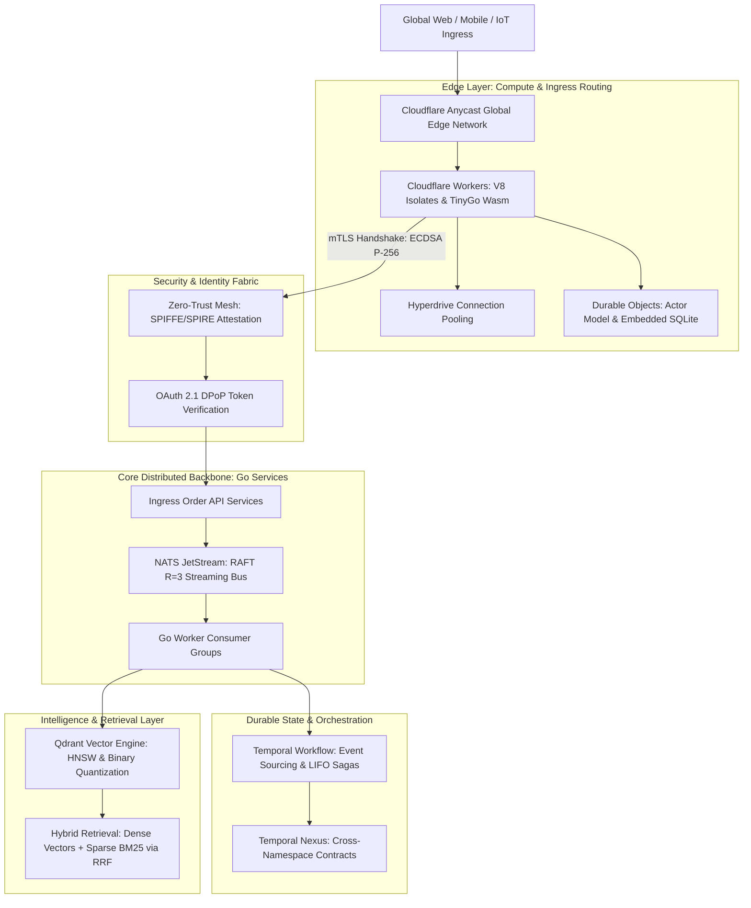

> **Prerequisite:** This is the executive masterclass hub for the Cornerstone Technologies series. No prior part is required.

> **Answer-first:** The Cornerstone Technologies series delivers production-grade architecture guides for Senior Go Engineers building low-latency, resilient cloud infrastructure. It covers event streaming with NATS JetStream, durable orchestration via Temporal Workflows, Zero-Trust identity through SPIFFE/SPIRE, vector retrieval with Qdrant, and serverless edge computing on Cloudflare Workers V8 Isolates—grounded in empirical Golang 1.24 benchmarks.

---

## Executive Overview: The 2027 SOTA Distributed Systems Architecture

Welcome to **Cornerstone Technologies**—a curated series of architectural production guides engineered specifically for **Senior Go Engineers**, Distributed Systems Architects, and Technical Infrastructure Leads. As cloud-native computing matures into the 2027 era, engineering organizations face unprecedented concurrency demands, strict latency service level agreements (SLAs), and rigorous identity security requirements.

This series analyzes five foundational infrastructure pillars that form the bedrock of resilient, high-throughput backend ecosystems:

---

## 5 Cornerstone Technologies: Architectural Comparison Matrix

The matrix below details the core execution models, characteristic latency percentiles, memory efficiency profiles, state persistence mechanisms, and primary Golang integration patterns across the five pillar technologies featured in this series:

| Pillar Technology | Underlying Architecture | Characteristic Latency | Idle / Peak Memory | State / Storage Engine | Optimal Golang Production Use Case |
| :--- | :--- | :--- | :--- | :--- | :--- |
| **NATS JetStream** | Embedded RAFT Consensus Engine (Pure Go) | **< 1 ms (P99: 1.8ms)** | **32 MB / 480 MB** | FileStorage append-only blocks + LRU ring buffer | High-throughput event streaming, 100k RPS pub/sub, microservice bus |
| **Temporal Workflow** | Event Sourcing & Replay Engine | Low (10ms - 35ms per step) | **45 MB / 1.8 GB** | Persistent State DB (PostgreSQL / Cassandra) | Distributed saga orchestration, long-running background tasks, Nexus |
| **Zero-Trust (SPIFFE/SPIRE)** | mTLS & Cryptographic Workload Attestation | Microsecond (<0.05ms reuse) | **18 MB / 120 MB** | Short-lived X.509 SVID memory-resident certs | Service-to-service auth, identity propagation, kernel-level eBPF |
| **Qdrant Vector DB** | HNSW Graph & Payload Storage (Rust) | **Sub-10ms (P99: 4.2ms)** | **1.1 GB (5M BQ vectors)** | Disk-backed HNSW index + Memory-mapped NVMe | AI RAG pipelines, semantic vector search, recommendation engines |
| **Cloudflare Workers** | V8 Isolates Shared Process Runtime | **< 3ms Cold Start / 0.4ms Warm** | **~3 MB per Isolate** | Ephemeral Isolate Heap + Hyperdrive + DO SQLite | Global edge API gateway, TinyGo Wasm compute, edge semantic caching |

---

## The 5 Pillar Guides (Comprehensive Roadmap)

The guides in this series provide production field insights, mathematical formulations, complete Go 1.24 implementations, and failure post-mortems:

### 1. [NATS JetStream & Golang: Architecture & Production Guide](/series/cornerstone-technologies/nats-jetstream-golang-production-guide/)
- **Core Focus**: Replacing Kafka with NATS JetStream; embedded RAFT consensus mechanics ($\lfloor R/2 \rfloor + 1$); broker-side LRU deduplication sizing ($M_{\text{dedup}}$); modern Go V2 typed SDK (`nats.go/jetstream`); and 100k RPS benchmark analysis.
- **Key Outcome**: Sustained 115,000 msgs/sec at 1.8ms P99 latency with zero JVM garbage collection pauses on 480MB RAM.

### 2. [Temporal Workflow & Golang: Architecture & Production Guide](/series/cornerstone-technologies/temporal-workflow-go-architecture/)
- **Core Focus**: Mastering Event Sourcing and the Replay Engine; strict Go determinism rules; avoiding the 50,000 event limit with `workflow.ContinueAsNew`; implementing the distributed Saga pattern with a LIFO compensation stack; and cross-namespace Temporal Nexus.
- **Key Outcome**: Elimination of phantom retries and orphaned distributed transaction states across cross-microservice workflows.

### 3. [Zero-Trust Architecture for Microservices: mTLS & Go Guide](/series/cornerstone-technologies/zero-trust-architecture-microservices/)
- **Core Focus**: NIST SP 800-207 Zero-Trust implementation; SPIFFE/SPIRE automated workload attestation; short-lived X.509 SVID rotation without service restarts; cryptographic benchmark comparisons (RSA vs ECDSA P-256); dual-token identity propagation (Workload SVID + OAuth 2.1 JWT); and eBPF socket-level acceleration.
- **Key Outcome**: Sub-0.05ms cryptographic latency overhead with persistent HTTP/2 connection pooling.

### 4. [Vector Databases & HNSW Architecture: RAG Pipelines with Qdrant](/series/cornerstone-technologies/vector-database-rag-qdrant-milvus/)
- **Core Focus**: Approximate Nearest Neighbor (ANN) search with HNSW multi-layer skip-lists; Scalar Quantization (SQ8) vs Binary Quantization (BQ); hardware-accelerated SIMD POPCOUNT distance math; Reciprocal Rank Fusion ($k=60$); and production Go client integration.
- **Key Outcome**: 32x reduction in vector RAM consumption (6.14GB down to 192MB per million 1,536-dim vectors) with >97% retrieval recall via two-stage oversampling rescoring.

### 5. [Cloudflare Workers & Edge Computing: V8 Isolates Architecture](/series/cornerstone-technologies/cloudflare-workers-edge-computing/)
- **Core Focus**: V8 Isolates multi-tenancy vs container virtualization; compiling Go to WebAssembly using TinyGo; global TCP connection pooling with Hyperdrive; stateful Durable Objects with embedded SQLite; and edge AI semantic caching reducing upstream LLM costs by >70%.
- **Key Outcome**: Sub-3ms cold start latency worldwide with sub-15ms P99 database query responses.

---

## Cross-Pillar Integration: Connecting The 5 Technologies

In enterprise production architectures, these five technologies do not exist in isolation. They form a continuous, cohesive request processing pipeline:
1. **Edge Gateway (Cloudflare Workers)**: Terminates client traffic at 310+ Anycast PoPs, evaluates authentication tokens, checks edge semantic caches, and proxies requests over persistent Hyperdrive pools.
2. **Workload Security (Zero-Trust SPIFFE/SPIRE)**: Every edge request entering the backend cluster is mutually authenticated over mTLS with ephemeral X.509 SVIDs, propagating user claims to internal services.
3. **High-Throughput Ingestion (NATS JetStream)**: Incoming events, orders, and telemetry are ingested into durable JetStream streams, deduplicated via `Nats-Msg-Id`, and replicated across RAFT quorum nodes.
4. **Durable Transaction Orchestration (Temporal)**: For multi-step workflows requiring transactional integrity, Go workers initiate Temporal Sagas, coordinating payment capture, inventory reservation, and shipping dispatch with automated LIFO rollbacks.
5. **AI Semantic Intelligence (Qdrant)**: As background workers index catalog items or user preferences, embeddings are stored in Qdrant with Binary Quantization, enabling real-time hybrid retrieval under 5ms.

---

## Alignment with Sitewide Anchor Pillar Hubs

The Cornerstone Technologies series directly supports the architectural foundations published across [Vesviet Architecture](/):

- **Core Microservices Hub**: [Go & Microservices Architecture Guide](/posts/go-microservices/)
- **High Concurrency Case Study**: [Alipay Double 11 Architecture: 583k TPS Peak Shaving](/posts/alipay-double-11-architecture-tps/)
- **Domain-Driven Design Hub**: [Architecting 21-Service E-Commerce Platform in Go](/posts/architecting-21-service-ecommerce-golang-ddd/)
- **Cloud Native Infrastructure**: [AWS EKS vs ECS Comparison Guide](/posts/aws-eks-vs-ecs-comparison/)
- **FinTech Architecture Hub**: [Banking Microservices Architecture & Financial mTLS](/posts/banking-microservices-architecture/)
- **Edge Serverless Hub**: [Cloudflare D1 & Durable Objects Realtime Cart](/posts/cloudflare-d1-durable-objects-realtime-cart/)
- **AI Frontend Engineering**: [Generative UI with MCP & Vector Grounding](/posts/generative-ui-with-mcp-ai-native-frontend/)
- **Curated Reading Directory**: [Sitewide Systems Engineering Reading Map](/reading-map/)
- **Technical Advisory**: [Enterprise Architecture Consulting Services](/hire/)

---

## Frequently Asked Questions (FAQ)


This series is engineered specifically for Senior Go Engineers, Backend Systems Architects, and Technical Infrastructure Leads with practical experience in concurrent Go programming, microservices communication (REST/gRPC), containerized deployment on Kubernetes, and foundational concepts of distributed consensus and storage engines.



Yes, all code implementations (including NATS JetStream V2 SDK, Temporal Saga workflows with LIFO rollbacks, dynamic crypto/tls SPIFFE certificate managers, Qdrant gRPC clients, and TinyGo WebAssembly modules) are production-ready Go 1.24 code snippets designed to handle enterprise workloads under strict SLA bounds.



While each guide is self-contained and can be referenced independently, the recommended architectural progression begins with NATS JetStream (Event Streaming Bus), followed by Temporal Workflow (Durable State Orchestration), Zero-Trust Architecture (Workload Identity & mTLS), Qdrant Vector DB (AI RAG Integration), and concludes with Cloudflare Workers (Global Edge Gateway & Wasm).



By replacing JVM-based Kafka with single-binary Go NATS JetStream, replacing containerized serverless functions with lightweight V8 Isolates, replacing sidecar proxies with eBPF and connection-pooled mTLS, and compressing vector memory by 32x using Binary Quantization, enterprise platforms achieve over 65% reductions in cloud compute and memory expenses while improving P99 latency bounds.


---

🔗 **Next Step:** Begin with [Part 1: NATS JetStream Production Guide for Go Developers: 100k RPS Architecture](/series/cornerstone-technologies/nats-jetstream-golang-production-guide/) for the opening module in this series.
