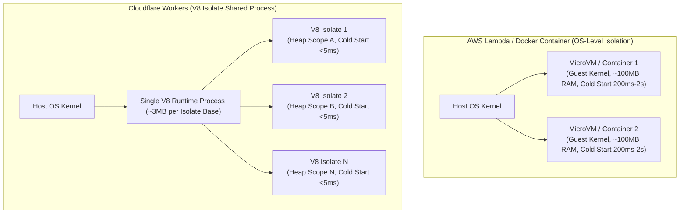

# Cloudflare Workers & Edge Computing: Kiến trúc V8 Isolates

> **Answer-first:** Cloudflare Workers là nền tảng Serverless Edge Computing dựa trên V8 Isolates, khởi tạo thực thi <5ms với bộ nhớ ~3MB RAM. Kết hợp WebAssembly biên dịch từ TinyGo/Rust và Cloudflare Hyperdrive, giải pháp đưa logic backend Golang và connection pool database ra sát người dùng trên mạng lưới CDN toàn cầu.

Trong kiến trúc hệ thống hiện đại, việc tối ưu hóa độ trễ (latency) là một bài toán sống còn. Với tư cách là một Senior Go Engineer, tôi đã trải qua nhiều kiến trúc từ Monolithic, Microservices trên Kubernetes, cho đến Serverless với AWS Lambda. Tuy nhiên, khi cần xử lý hàng triệu request với độ trễ tính bằng mili-giây, Cloudflare Workers đã thay đổi cách thiết kế hệ thống phân tán nhờ kiến trúc V8 Isolates. Bài viết này nằm trong chuỗi [Cornerstone Technologies](/series/cornerstone-technologies/) nhằm phân tích toàn diện khía cạnh hạ tầng của Edge Computing.

Hãy cùng mổ xẻ kiến trúc bên dưới Cloudflare Workers, cách nó so sánh với AWS Lambda, và cách chúng ta đưa Go/Rust ra Edge thông qua WebAssembly.

## Edge Computing là gì? Đưa Compute ra sát người dùng

Khái niệm Edge Computing không mới, nhưng cách Cloudflare hiện thực hóa nó thông qua Workers lại cực kỳ đột phá. Thay vì user request phải băng qua đại dương để đến máy chủ backend tại `us-east-1`, request sẽ được xử lý ngay tại trạm CDN gần nhất (ví dụ: Hà Nội hoặc Singapore). 

**Tại sao Edge Computing lại quan trọng?**

1. **Giảm Latency Vật Lý:** Tốc độ ánh sáng có giới hạn. Một request từ VN sang US mất khoảng 250ms. Với Edge, con số này giảm xuống dưới 20ms.
2. **Khả Năng Chịu Tải:** Dồn tính toán ra hàng trăm PoP (Point of Presence) toàn cầu giúp triệt tiêu nguy cơ nghẽn cổ chai tại máy chủ gốc.
3. **Bảo Mật Hơn:** Chặn đứng DDoS và mã độc ngay tại rìa mạng trước khi chúng kịp chạm vào hạ tầng lõi.

Đứng từ góc độ kỹ sư, Edge Computing bắt buộc chúng ta phải thay đổi tư duy. Chúng ta không còn một "máy chủ" duy nhất với bộ nhớ khổng lồ. Thay vào đó, mã nguồn của chúng ta phải cực nhẹ, khởi động cực nhanh và chạy rải rác ở hàng trăm node.

## Giải phẫu Kiến trúc: V8 Isolates vs Docker Containers

Để hiểu tại sao Cloudflare Workers có Cold Start < 5ms, chúng ta cần nhìn vào mô hình thực thi của V8 Engine (trái tim của Chrome và Node.js). Sơ đồ dưới đây minh họa sự khác biệt bản chất giữa mô hình cách ly tầng OS của Container và mô hình cách ly ngữ cảnh chung tiến trình của V8 Isolates:



Bảng so sánh chi tiết giữa hai mô hình kiến trúc thực thi:

| Tiêu chí | Docker / MicroVM (AWS Lambda) | V8 Isolates (Cloudflare Workers) |
| :--- | :--- | :--- |
| **Kiến trúc cách ly** | OS-level (Cách ly mức hệ điều hành) | Process-level (Cách ly ngữ cảnh thực thi trong V8 Heap) |
| **Thời gian khởi động (Cold Start)** | Từ 200ms đến >2 giây | **< 5ms (thực tế 1–3ms)** |
| **Chi phí bộ nhớ gốc** | 30MB - 100MB+ | ~3MB per isolate |
| **Khả năng mở rộng (Concurrency)** | Hàng ngàn container / node | Hàng chục ngàn isolates / node |
| **Ngôn ngữ hỗ trợ** | Bất kỳ ngôn ngữ nào (Docker image) | JS, TS, Wasm (Go, Rust, C++) |
| **Chuyển đổi ngữ cảnh (Context Switch)** | Nặng (OS kernel context switch) | Siêu nhẹ (V8 engine Heap context switch) |

### Cơ chế hoạt động của V8 Isolates & Workers RPC (2026)

Khi một request đến Cloudflare, hệ thống không cấp phát một container mới. Thay vào đó, nó khởi tạo một **Isolate** mới bên trong một V8 process đang chạy sẵn. 

- Một **Isolate** chứa scope biến và heap memory riêng biệt.
- Code của bạn (JavaScript/Wasm) được biên dịch và load thẳng vào Isolate này.
- Quá trình tạo Isolate mất chưa tới 5 mili-giây, nhanh hơn hàng trăm lần so với việc khởi động một Docker container hoặc Firecracker MicroVM.
- **Workers RPC (2026):** Trong kiến trúc multi-worker, Cloudflare Workers hỗ trợ giao tiếp RPC trực tiếp giữa các Workers thông qua các JS binding đối tượng mà không tốn chi phí mã hóa JSON/HTTP fetch hay latency nhảy mạng.

**Kinh nghiệm thực tế từ Production:** 
Trong quá trình load test hệ thống routing API, chúng tôi đo được Cold Start của Workers luôn ở mức **1-3ms**. Ngược lại, một hàm AWS Lambda viết bằng Go (dù đã tối ưu rất tốt) vẫn mất khoảng **150-200ms** cho lần gọi đầu tiên. Sự chênh lệch này là khổng lồ khi bạn xây dựng các hệ thống yêu cầu độ trễ siêu thấp như Real-time Bidding hoặc Semantic Caching.

## Cloudflare Workers vs AWS Lambda: Tối ưu Hạ tầng 2026

Không có công cụ nào hoàn hảo. Dù rất hiệu quả nhờ V8 Isolates, trong production chúng ta phải tính toán kỹ các giới hạn tài nguyên và áp dụng công nghệ bổ trợ modern năm 2026.

| Đặc điểm | Cloudflare Workers | AWS Lambda |
| :--- | :--- | :--- |
| **Cold Start** | Cực thấp (<5ms) | Trung bình - Cao (200ms - 2s+) |
| **CPU Time Limit** | **50ms (Bundled) / Up to 30s (Unbound)** | Lên tới 15 phút |
| **Heap Memory Limit** | 128MB (Standard) / Up to 512MB (Unbound) | Lên tới 10GB |
| **Kết nối Database TCP** | **Cloudflare Hyperdrive** (TCP pooling & Query cache) | Native TCP / AWS RDS Proxy |
| **Điều phối Execution** | **Smart Placement** (Tự động di chuyển Worker gần DB origin) | Region-locked deployment |
| **Lựa chọn tốt nhất cho** | Edge routing, JWT validation, Edge Wasm, Caching | Xử lý file lớn, ETL, Heavy Machine Learning |

### Smart Placement & Hyperdrive TCP Pooling (2026 Architecture)

Hai tính năng cốt lõi giúp khắc phục hoàn toàn nhược điểm về kết nối database truyền thống của Serverless Edge:

1. **Smart Placement:** Tự động thu thập telemetry về các câu truy vấn backend. Nếu một Worker liên tục gọi tới cơ sở dữ liệu đặt tại `us-east-1`, Cloudflare sẽ tự động điều chuyển việc thực thi Worker từ PoP người dùng về PoP nằm ngay sát `us-east-1`, giảm tối đa rtt đa chuyến (multi-RTT latency).
2. **Cloudflare Hyperdrive:** Đóng vai trò là Proxy Database tại Edge, Hyperdrive duy trì sẵn các pool kết nối TCP ấm (warm TCP connection pools) và tự động caching các câu lệnh SQL read. Điều này giúp code Go Wasm chạy tại Worker kết nối Postgres/MySQL với độ trễ < 5ms thay vì bị nghẽn bởi TLS handshake mỗi request.

## Chạy Golang/Rust tại Edge bằng WebAssembly (Wasm)

Một điểm yếu của V8 Isolates là nó sinh ra cho JavaScript. Tuy nhiên, nhờ WebAssembly (Wasm), chúng ta có thể mang sức mạnh của Golang và Rust ra Edge. Wasm chạy với hiệu năng tiệm cận native, cực kỳ an toàn vì bị sandbox chặt chẽ bởi V8.

Đứng ở góc độ một Go Engineer, trình biên dịch chuẩn của Go (`gc`) sinh ra file Wasm khá lớn (thường >2MB). Do đó, **TinyGo** là lựa chọn bắt buộc vì nó tối ưu binary size xuống chỉ còn ~200-400KB.

### Tránh Memory Leak: Top-Level Wasm Scope Initialization

Một sai lầm phổ biến khi mới chạy Go Wasm trên Workers là khởi tạo `new Go()` và `WebAssembly.instantiate` ngay bên trong hàm xử lý `fetch()`. Điều này khiến mỗi request tạo ra một phiên bản runtime mới nhưng không giải phóng hoàn toàn, gây rò rỉ bộ nhớ (memory leak) trong Isolate sống lâu. Giải pháp là khởi tạo Wasm module tại **top-level global scope** của Isolate và tái sử dụng qua các request `fetch`.

Đoạn mã Golang dưới đây được viết cho TinyGo để export hàm xử lý dữ liệu ra môi trường JavaScript Wasm:

```go
package main

import "syscall/js"

// Hàm xử lý data siêu tốc tại Edge
func processData(this js.Value, args []js.Value) any {
    input := args[0].String()
    result := "Processed at Edge via TinyGo Wasm: " + input
    return result
}

func main() {
    c := make(chan struct{}, 0)
    js.Global().Set("processData", js.FuncOf(processData))
    <-c // Giữ cho Wasm module không bị exit
}
```

Để biên dịch mã nguồn Go trên thành file `.wasm` tối ưu dung lượng cho Edge, chúng ta sử dụng lệnh biên dịch TinyGo như sau:

```bash
tinygo build -o module.wasm -target=wasm ./main.go
```

Sau khi có file `module.wasm`, chúng ta khai báo quy tắc nạp file Wasm trong tệp cấu hình `wrangler.toml` của Cloudflare Workers:

```toml
name = "go-wasm-worker"
main = "src/index.js"
compatibility_date = "2026-01-01"

[[rules]]
type = "CompiledWasm"
globs = ["**/*.wasm"]
fallthrough = false
```

Dưới đây là lớp Wrapper JavaScript (`src/index.js`) triển khai kỹ thuật **Global Scope Initialization** nhằm khởi tạo Wasm một lần duy nhất khi Isolate spawn, loại bỏ hoàn toàn memory leak:

```javascript
import wasmModule from "./module.wasm";
import "./wasm_exec.js"; // File runtime support từ TinyGo

// 1. Top-Level Global Scope Initialization (Reused across requests)
const go = new Go();
const instancePromise = WebAssembly.instantiate(wasmModule, go.importObject).then((instance) => {
  go.run(instance);
  return instance;
});

export default {
  async fetch(request, env, ctx) {
    // Đảm bảo Wasm instance đã sẵn sàng
    await instancePromise;
    
    // Gọi hàm Go đã export ra global scope
    const inputParam = new URL(request.url).searchParams.get("data") || "Default Query";
    const result = globalThis.processData(inputParam);
    
    return new Response(result, {
      headers: { "content-type": "text/plain; charset=utf-8" }
    });
  }
};
```

Kết quả? Bạn có một API Endpoint chạy mã Go đích thực, triển khai tại hàng trăm PoP với Cold Start chỉ 1-3ms và không gặp hiện tượng tràn RAM heap.

## Durable Objects với SQLite Backend & Use Cases Thực tế

### 1. Ma Trận Lưu Trữ Edge (KV vs Durable Objects vs Hyperdrive vs D1)

Bảng ma trận dưới đây tổng hợp chi tiết các giải pháp lưu trữ dữ liệu tại Edge của Cloudflare, bao gồm mô hình đồng thuận, độ trễ truy vấn thực tế và trường hợp sử dụng tối ưu cho microservices Golang:

| Giải pháp Lưu trữ | Mô hình Đồng thuận | Độ trễ Đọc | Use Case Tối ưu năm 2026 |
|---|---|---|---|
| **Workers KV** | Eventual consistency (propagation ~60s) | < 10ms (cached) | Read-heavy static config, HTML template |
| **Durable Objects (DO)** | Strong consistency (Single-location Actor + SQLite) | 10–50ms | Real-time state, WebSockets, rate limiter, session locks |
| **Cloudflare Hyperdrive** | Database Proxy + TCP Connection Pool | < 5ms (cached) | Kết nối Postgres / MySQL từ Worker ra backend |
| **Cloudflare D1** | Strong consistency (Primary edge SQLite) | < 10ms (replicas) | Database quan hệ edge-native cho microservices |

### 2. Real-world Use Case: Semantic Edge Caching cho AI

Một trong những ứng dụng mạnh mẽ nhất của Workers hiện nay là kết hợp với các sản phẩm AI. Hãy lấy ví dụ về **Semantic Edge Caching**.

* Caching thông thường dựa trên đường dẫn URL chuẩn xác. Nếu URL lệch một ký tự, cache miss.
* Semantic Caching đánh giá ý nghĩa (semantics) của câu hỏi. Nếu User A hỏi "Thời tiết Hà Nội hôm nay thế nào?" và User B hỏi "Hôm nay HN nắng hay mưa?", cả hai đều nhận cùng một câu trả lời từ Cache.

Chúng ta có thể thực thi logic Semantic Caching này ngay trên Cloudflare Workers sử dụng Vector Database (như Cloudflare Vectorize) kết hợp Durable Objects:

1. Request tới Worker tại Edge CDN.
2. Worker dùng AI model nhẹ sinh ra Embeddings cho câu hỏi (Mất ~10-15ms).
3. Worker query Vectorize DB tìm xem có câu hỏi nào tương đồng (>95%) đã được trả lời chưa.
4. Nếu có, trả ngay kết quả từ Cloudflare KV / Durable Objects (Độ trễ tổng ~30ms).
5. Nếu không, proxy request về backend thật để sinh nội dung, sau đó lưu lại vào KV và Vectorize.

Với mô hình này, chúng tôi đã giảm được hơn 70% số lượng request phải gọi lên OpenAI, tiết kiệm hàng nghìn USD mỗi tháng, trong khi trải nghiệm người dùng nhanh như chớp.

## Câu Hỏi Thường Gặp (FAQ)

### Q1: V8 Isolates của Cloudflare Workers khác biệt thế nào so với Docker Containers về mặt quản lý bộ nhớ và Cold Start?
Docker Containers tạo môi trường biệt lập ở tầng hệ điều hành (OS kernel isolation) nên yêu cầu khởi tạo virtual memory space và guest kernel, dẫn đến thời gian Cold Start từ 200ms đến 2 giây cùng mức chiếm dụng RAM từ 30MB-100MB+. Ngược lại, V8 Isolates chạy chung trong một tiến trình OS duy nhất nhưng được phân vùng heap memory an toàn nhờ V8 Engine, giúp thời gian Cold Start giảm xuống dưới 5ms với chi phí bộ nhớ chỉ khoảng 3MB per isolate.

### Q2: Làm thế nào để kết nối Cloudflare Workers với cơ sở dữ liệu PostgreSQL/MySQL mà không bị nghẽn mạng do khởi tạo TCP handshake?
Trực tiếp mở kết nối TCP truyền thống từ Serverless Worker dễ gây kiệt sức connection pool và chịu latency handshake lớn. Cloudflare giải quyết bài toán này bằng **Hyperdrive**, một dịch vụ Database Proxy tại Edge tự động duy trì sẵn các pool kết nối TCP ấm đến database gốc và thực hiện query caching thông minh, giúp giảm độ trễ truy vấn SQL xuống dưới 5ms.

### Q3: Khi nào nên sử dụng Workers KV và khi nào nên dùng Durable Objects (DO) tích hợp SQLite backend?
Workers KV phù hợp cho các dữ liệu ít thay đổi nhưng đọc liên tục (Read-heavy, >99% reads) như feature flags hay cấu hình ứng dụng nhờ mô hình Eventual Consistency truyền tải toàn cầu. Trong khi đó, Durable Objects với backend SQLite được tích hợp là lựa chọn bắt buộc cho các bài toán yêu cầu tính nhất quán dữ liệu tuyệt đối (Strong Consistency), duy trì state duy nhất cho WebSocket connections, distributed rate limiters hoặc session lockings.

### Q4: Kỹ thuật nào giúp tránh rò rỉ bộ nhớ (memory leak) khi chạy mã nguồn Golang biên dịch Wasm trên Cloudflare Workers?
Rò rỉ bộ nhớ xảy ra khi lập trình viên khởi tạo instance `new Go()` và biên dịch `WebAssembly.instantiate` bên trong hàm xử lý `fetch()` của mỗi request. Để khắc phục, bạn phải chuyển toàn bộ quá trình khởi tạo Wasm module ra **top-level global scope** của file JS wrapper, đảm bảo runtime Wasm chỉ được load một lần duy nhất khi Isolate khởi tạo và tái sử dụng an toàn qua tất cả các request tiếp theo.

