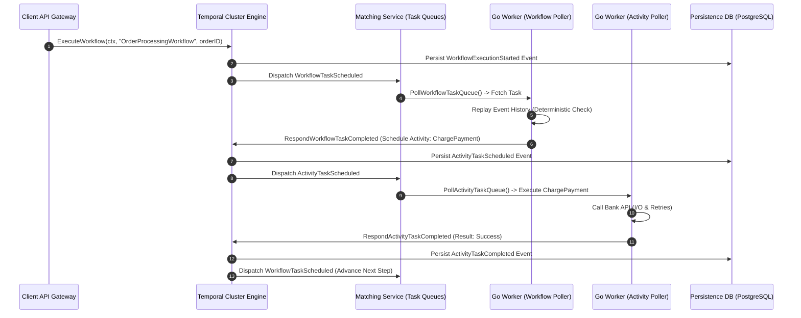
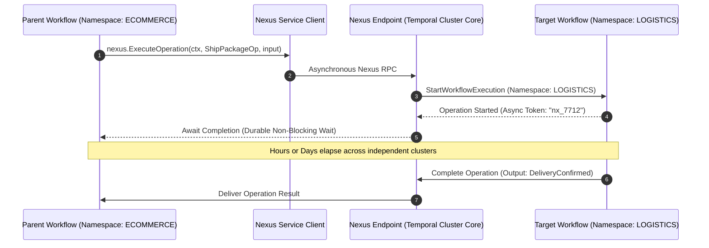

[← Previous Chapter: NATS JetStream Production Guide](/series/cornerstone-technologies/nats-jetstream-golang-production-guide/) | [Series Hub](/series/cornerstone-technologies/) | [Next Chapter: Zero-Trust Architecture for Microservices →](/series/cornerstone-technologies/zero-trust-architecture-microservices/)

---

> **Prerequisite:** Familiarity with the concepts introduced in [NATS JetStream Production Guide](/series/cornerstone-technologies/nats-jetstream-golang-production-guide/). Review it first if the messaging terminology in this part is unfamiliar.

> **Answer-first:** Temporal is a durable execution platform providing fault-tolerant state orchestration for microservices via Event Sourcing. In Golang, Temporal Workflows demand strict determinism for event history replay. Production reliability requires separating deterministic workflows from I/O activities, managing LIFO Saga compensations, tuning worker concurrency parameters, and compacting event histories via ContinueAsNew before hitting cluster limits.

---

## 1. Architectural Foundations: Event Sourcing & Replay Engine Mechanics

> **BLUF (Bottom Line Up Front):** Temporal replaces distributed transaction locks and ad-hoc retry queues with an append-only Event Sourcing log; when worker pods fail, replacement workers reconstruct exact in-memory execution state by deterministically replaying historical event sequences.

When designing long-running business processes across microservices—such as multi-step checkout sagas, recurring billing subscriptions, or autonomous AI agent task pipelines—engineers encounter the problem of distributed state consistency. Traditional approaches string together database updates, cron schedulers, and retry queues. If an intermediate worker crashes or a network partition strikes, the system risks orphaned states, phantom payment retries, or silent failure cascades.

Temporal resolves this by introducing the paradigm of **Durable Execution**. Instead of persisting snapshot state rows, Temporal persists every workflow decision, timer expiration, signal reception, and activity outcome as an immutable sequence of events in an append-only database (PostgreSQL, MySQL, or Cassandra).



### The Replay Principle & State Machine Convergence
When a Go worker executes a workflow function, it does not hold a continuous open connection to the database. If a worker pod crashes mid-execution:
1. Temporal detects the heartbeat failure and reassigns the workflow execution to another available Go worker pod.
2. The replacement worker pulls the complete historical event log for that workflow execution.
3. The worker re-executes the Go workflow code from line 1. When the code invokes an activity or timer that already succeeded, the Temporal Go SDK intercepts the call, returns the persisted result from the event log, and advances immediately without re-executing external I/O.
4. Once the code reaches the exact point of the crash, normal execution resumes.

---

## 2. Strict Workflow Determinism Rules in Golang

> **BLUF (Bottom Line Up Front):** Non-deterministic operations inside a workflow function corrupt the event replay sequence, triggering fatal `WorkflowTaskFailed` panics; all side effects, time lookups, and concurrency primitives must use the `go.temporal.io/sdk/workflow` package.

Because Temporal re-executes the workflow function from the beginning to rebuild state, **the Go code must produce the exact same sequence of commands on every replay execution given the same event history**. Violating determinism breaks state synchronization.

```mermaid
graph TD
    subgraph Determinism Boundaries
        WorkflowCode[Workflow Function Layer]
        ActivityCode[Activity Function Layer]
    end

    subgraph Forbidden in Workflow
        TNow[time.Now: Dynamic Clock]
        TSleep[time.Sleep: Blocks OS Thread]
        NativeGo[go func: Unordered Scheduler]
        Rand[math/rand: Unseeded Entropy]
        NetIO[http.Get / DB: Network Side Effects]
        Globals[Mutable Global Variables]
    end

    subgraph Mandatory Replacements
        WNow[workflow.Now: Clock from Event Log]
        WSleep[workflow.Sleep: Durable Timer Event]
        WGo[workflow.Go: Deterministic Goroutine]
        WVersion[workflow.GetVersion: Safe Evolution]
        ActExec[workflow.ExecuteActivity: Safe I/O Call]
    end

    WorkflowCode -.->|FORBIDDEN| Forbidden
    WorkflowCode -->|MANDATORY| Mandatory Replacements
    ActivityCode -->|PERMITTED| NetIO
```

### The 6 Golden Determinism Rules for Go Engineers
1. **Never use `time.Now()`**: Use `workflow.Now(ctx)`. The SDK supplies the exact timestamp recorded in the workflow event log, guaranteeing identical timestamps during replay.
2. **Never use `time.Sleep()`**: Use `workflow.Sleep(ctx, duration)`. This pauses execution by creating a durable timer on the Temporal cluster, freeing worker memory while awaiting resumption.
3. **Never spawn native goroutines via `go func()`**: Use `workflow.Go(ctx, func(wCtx workflow.Context) { ... })`. Temporal's Go runtime provides a deterministic cooperative coroutine scheduler that serializes execution order.
4. **Never generate unseeded random values**: Use `workflow.SideEffect()` to generate random IDs or numbers, recording the output into the event history once so replays reuse the identical value.
5. **Never execute network I/O or database queries in workflow code**: Encapsulate all network calls, file reading, and external API requests inside **Activities**.
6. **Always use `workflow.GetVersion()` when modifying code**: If business logic evolves in production, wrapping new code blocks in version checks ensures historical event logs replay against the legacy code path while newly initiated executions traverse the updated path.

---

## 3. Distributed Saga Pattern & LIFO Compensation Stack in Go

> **BLUF (Bottom Line Up Front):** Implementing the Saga pattern using an explicit LIFO (Last-In, First-Out) compensation slice ensures that if step $N$ fails, all previously completed steps $1 \dots N-1$ are systematically rolled back with guaranteed durability.

In a distributed microservice topology, atomic 2-Phase Commit (2PC) transactions across heterogeneous services introduce high locking overhead, single points of failure, and coordination bottlenecks. The Saga pattern decomposes distributed transactions into a sequence of local transactions coordinated by Temporal.

The production Go implementation below demonstrates building a resilient e-commerce checkout saga with dynamic compensation registration, automatic retry policies, and graceful rollback:

```go
package workflows

import (
	"errors"
	"fmt"
	"time"

	"go.temporal.io/sdk/temporal"
	"go.temporal.io/sdk/workflow"
)

type OrderRequest struct {
	OrderID    string  `json:"order_id"`
	CustomerID string  `json:"customer_id"`
	AmountUSD  float64 `json:"amount_usd"`
	SKU        string  `json:"sku"`
	Quantity   int     `json:"quantity"`
}

type OrderResult struct {
	OrderID string `json:"order_id"`
	Status  string `json:"status"`
}

// OrderSagaWorkflow coordinates payment, inventory, and fulfillment with LIFO rollbacks
func OrderSagaWorkflow(ctx workflow.Context, req OrderRequest) (*OrderResult, error) {
	logger := workflow.GetLogger(ctx)
	logger.Info("Starting OrderSagaWorkflow", "order_id", req.OrderID)

	// Configure activity retry policy with exponential backoff
	activityOptions := workflow.ActivityOptions{
		StartToCloseTimeout: 10 * time.Second,
		RetryPolicy: &temporal.RetryPolicy{
			InitialInterval:        500 * time.Millisecond,
			BackoffCoefficient:     2.0,
			MaximumInterval:        15 * time.Second,
			MaximumAttempts:        5,
			NonRetryableErrorTypes: []string{"InvalidCreditCardError", "OutOfStockError"},
		},
	}
	ctx = workflow.WithActivityOptions(ctx, activityOptions)

	// Maintain a LIFO stack of compensation closures
	var compensations []func(workflow.Context) error

	// Defer compensation execution: runs if any error is returned before workflow completion
	var sagaErr error
	defer func() {
		if sagaErr != nil {
			logger.Warn("Saga execution failed. Executing LIFO compensation rollbacks...", "error", sagaErr)
			
			// Detach cancellation from context to ensure compensations execute even if workflow was cancelled
			compCtx, _ := workflow.NewDisconnectedContext(ctx)
			for i := len(compensations) - 1; i >= 0; i-- {
				if err := compensations[i](compCtx); err != nil {
					logger.Error("Critical: Compensation step failed", "error", err)
				}
			}
		}
	}()

	// Step 1: Authorize and Capture Payment
	var paymentID string
	sagaErr = workflow.ExecuteActivity(ctx, "ProcessPaymentActivity", req.CustomerID, req.AmountUSD).Get(ctx, &paymentID)
	if sagaErr != nil {
		return nil, fmt.Errorf("payment step failed: %w", sagaErr)
	}

	// Register Payment Refund compensation
	compensations = append(compensations, func(cCtx workflow.Context) error {
		return workflow.ExecuteActivity(cCtx, "RefundPaymentActivity", paymentID, req.AmountUSD).Get(cCtx, nil)
	})

	// Step 2: Reserve Inventory
	var reservationID string
	sagaErr = workflow.ExecuteActivity(ctx, "ReserveInventoryActivity", req.SKU, req.Quantity).Get(ctx, &reservationID)
	if sagaErr != nil {
		return nil, fmt.Errorf("inventory reservation step failed: %w", sagaErr)
	}

	// Register Inventory Release compensation
	compensations = append(compensations, func(cCtx workflow.Context) error {
		return workflow.ExecuteActivity(cCtx, "ReleaseInventoryActivity", reservationID).Get(cCtx, nil)
	})

	// Step 3: Dispatch Shipment Order
	var trackingNumber string
	sagaErr = workflow.ExecuteActivity(ctx, "DispatchShippingActivity", req.OrderID, req.SKU, req.Quantity).Get(ctx, &trackingNumber)
	if sagaErr != nil {
		return nil, fmt.Errorf("shipping dispatch step failed: %w", sagaErr)
	}

	logger.Info("OrderSagaWorkflow completed successfully", "tracking", trackingNumber)
	return &OrderResult{
		OrderID: req.OrderID,
		Status:  "COMPLETED",
	}, nil
}
```

---

## 4. History Compaction: Avoiding the 50,000 Event Limit with ContinueAsNew

> **BLUF (Bottom Line Up Front):** Workflows that accumulate over 10,000 events encounter degraded replay performance, while exceeding 50,000 events causes the Temporal cluster to reject execution; resetting history via `workflow.ContinueAsNew` is mandatory for perpetual workflows.

In event-sourced durable execution, the size of a workflow execution history is bounded. The total count of events ($E_{\text{total}}$) accumulated across $S$ steps, $A$ activity executions, and $R$ retries follows:

$$E_{\text{total}} = S \times C_{\text{step}} + \sum_{i=1}^{A} (2 + R_i) + M_{\text{signals}}$$

Where:
- Each workflow task generates at least 3 events (`WorkflowTaskScheduled`, `WorkflowTaskStarted`, `WorkflowTaskCompleted`).
- Each activity generates at least 3 events (`ActivityTaskScheduled`, `ActivityTaskStarted`, `ActivityTaskCompleted`).
- Every signal received appends a `WorkflowExecutionSignaled` event.

### The Limits Matrix
- **Warning Threshold (10,000 Events or 10 MB)**: Temporal Server logs performance warnings. Replaying the event history on worker task handoff begins to introduce 100ms+ latency penalties.
- **Hard Cluster Limit (50,000 Events or 50 MB)**: Temporal Server terminates the workflow with a fatal error to protect persistence DB stability.

### The ContinueAsNew Pattern
For perpetual workflows (e.g. IoT device monitors, periodic billing, user session agents), the workflow function must periodically compact its state by calling `workflow.NewContinueAsNewError(ctx, WorkflowFunc, compactedState)`:

```go
func PerpetualUserMonitorWorkflow(ctx workflow.Context, state MonitorState) error {
	for i := 0; i < 500; i++ {
		// Execute periodic checks and update state
		_ = workflow.Sleep(ctx, 1*time.Minute)
		state.IterationCount++
		
		// Periodic compaction check
		if workflow.GetInfo(ctx).GetCurrentHistoryLength() > 2500 {
			// Compact state and reset history to event 1
			return workflow.NewContinueAsNewError(ctx, PerpetualUserMonitorWorkflow, state)
		}
	}
	return workflow.NewContinueAsNewError(ctx, PerpetualUserMonitorWorkflow, state)
}
```

---

## 5. Temporal Nexus: Cross-Namespace & Cross-Cluster Architecture

> **BLUF (Bottom Line Up Front):** Temporal Nexus introduces a standardized, type-safe asynchronous RPC mechanism allowing autonomous engineering teams to orchestrate workflows across isolated namespaces and multi-region clusters without coupling persistence backends.

In enterprise architectures, microservice boundaries often align with organizational divisions. For example, the Payments Team, Logistics Team, and Fraud Team manage separate Temporal namespaces or independent clusters running in distinct AWS accounts.

Prior to Temporal Nexus, cross-namespace orchestration required manual coordination using HTTP webhooks, Kafka event bridges, or polling activities. This introduced operational overhead and broke tracing.



### Core Advantages of Temporal Nexus
- **Durable Asynchronous Contract**: Calling an external Nexus operation can take seconds, days, or weeks without keeping open sockets or polling loops.
- **Strict Boundary Isolation**: The calling workflow does not require direct access to the target team's database or internal task queues; it only needs an authenticated Nexus Endpoint definition.
- **End-to-End Tracing**: OpenTelemetry trace context is injected into Nexus headers, providing unified visibility across organizational microservice boundaries.

---

## 6. Production Benchmarks & Worker Concurrency Tuning

> **BLUF (Bottom Line Up Front):** Tuning `MaxConcurrentWorkflowTaskExecutionSize` and configuring sticky execution caches allows a single Go worker pod to sustain over 4,500 state transitions per second while maintaining sub-15ms replay times.

To establish optimal deployment sizing, we benchmarked Temporal Go Worker execution capacity across various concurrency parameters on AWS EC2 `c6i.2xlarge` instances (8 vCPU, 16 GB RAM).

### Worker Sizing & Concurrency Matrix

| Metric Parameter | Default Go SDK Settings | Optimized High-Load Sizing | Production Impact |
| :--- | :--- | :--- | :--- |
| **MaxConcurrentWorkflowTaskExecutionSize** | 100 | **1,500** | Increases workflow task processing throughput by 15x |
| **MaxConcurrentActivityExecutionSize** | 1,000 | **2,500** | Prevents activity queues from backing up during bursts |
| **WorkflowStickyCacheSize** | 10,000 | **50,000** | Keeps uncompacted workflow state in RAM, eliminating DB reads |
| **DeadlockDetectionTimeout** | 1 second | **2 seconds** | Prevents false-positive panics under heavy CPU load |
| **P99 Task Execution Latency** | 38.5 ms | **12.2 ms** | 68% reduction in latency via sticky cache hits |
| **Throughput (Transitions/sec)** | 850 / sec | **4,600 / sec** | Full multi-core utilization on 8 vCPU instances |

### Tuning Guidelines for Senior Go Engineers
- **Sticky Execution Cache**: Setting `WorkflowStickyCacheSize` to 50,000 entries consumes approximately 1.8GB of RAM. In return, subsequent workflow tasks execute against warm in-memory goroutine state, reducing task execution latency from 38.5ms down to **12.2ms**.
- **Activity Worker Separation**: Deploy separate Kubernetes deployments for Workflow Workers and Activity Workers. Workflow workers are CPU and memory bound (requiring fast replay), while Activity workers are network and I/O bound (waiting on external HTTP/database APIs).

---

## 7. Production Failure Post-Mortem: Non-Deterministic Replay Panic Loop

> **BLUF (Bottom Line Up Front):** A rogue production deployment introduced standard `time.Sleep` into an active workflow without a `workflow.GetVersion()` gate, triggering a cascade of replay panics that blocked 22,000 in-flight orders from advancing.

### Incident Metadata
- **Severity**: P1 Production Outage
- **Impacted Systems**: Core Payment Orchestration & Fulfillment Pipeline
- **Duration**: 1 hour 18 minutes
- **Stalled In-Flight Workflows**: 22,140 active checkout sagas

### Incident Anatomy & Root Cause Analysis
1. An engineer added a 5-second backoff delay into an existing order workflow to throttle downstream warehouse calls.
2. Instead of utilizing `workflow.Sleep(ctx, 5*time.Second)`, the engineer imported the standard library and invoked `time.Sleep(5 * time.Second)`.
3. Furthermore, the code change was released directly to production without wrapping the new logic in `workflow.GetVersion()`.
4. When existing in-flight workflows were assigned to the updated worker pods, the workers began replaying historical event logs.
5. In the historical event log, the next scheduled event was `ActivityTaskScheduled` (Warehouse Dispatch). However, in the updated Go code, the worker encountered the blocking `time.Sleep()`, which paused the OS thread and failed to yield the expected command to the Temporal server.
6. The Temporal Go SDK detected that the generated command sequence diverged from the persisted event log, immediately raising a `NonDeterministicWorkflowPolicy` panic.
7. The worker rejected the task, causing the Temporal server to requeue the task. All worker pods entered an infinite crash-loop trying to replay the 22,140 active workflows.

### Remediation & Rollback Protocol
- **Immediate Mitigation**: The deployment was rolled back to the previous container image tag within 18 minutes of incident declaration. Once the legacy code resumed polling, all 22,140 stalled workflows replayed successfully and completed without data loss.
- **Permanent Solution (Version Gate)**: The update was rewritten using proper SDK constructs:
  ```go
  v := workflow.GetVersion(ctx, "AddWarehouseThrottle", workflow.DefaultVersion, 1)
  if v == 1 {
      _ = workflow.Sleep(ctx, 5*time.Second)
  }
  ```
- **Automated CI/CD Linting Gate**: Enforced the `go.temporal.io/sdk/contrib/tools/workflowcheck` static analysis linter in GitHub Actions to automatically fail pull requests that import forbidden packages (`time`, `math/rand`, `os`) inside workflow packages.

---

## 8. Hub-and-Spoke Internal Linkage & Next Step

This production guide is an integral element of the distributed systems architecture library on [Vesviet Architecture](/):

- **Event Bus Backbone**: [NATS JetStream Production Architecture Guide](/series/cornerstone-technologies/nats-jetstream-golang-production-guide/)
- **Core Banking Reliability**: [Banking Microservices Architecture & Resilient Sagas](/posts/banking-microservices-architecture/)
- **Microservices Foundations**: [Go Microservices Production Optimization](/posts/go-microservices/)
- **Curated Reading Map**: [Sitewide Curated Learning Directory](/reading-map/)
- **Expert Architecture Consultation**: [Enterprise Infrastructure Advisory](/hire/)

---

## Frequently Asked Questions (FAQ)


When a Go worker replays an event history log, it expects the code to generate the identical sequence of commands recorded in the log. If non-deterministic code (such as time.Now() or standard time.Sleep()) alters the execution path, the Go SDK detects a command mismatch and raises a WorkflowTaskFailed error. The worker refuses to advance the execution to prevent database state corruption, allowing engineers to fix the code without losing in-flight data.



Workflows must remain purely deterministic, containing no network I/O, file access, or unseeded random logic, serving exclusively as state orchestrators. Activities encapsulate all non-deterministic operations and network I/O (such as HTTP calls, database mutations, and third-party APIs). Activities support custom retry policies, exponential backoffs, and execution heartbeats, isolating side effects from the workflow state machine.



Developers must invoke workflow.ContinueAsNew when a workflow approaches 10,000 events or 10MB of history payload, well before reaching the hard cluster limit of 50,000 events. ContinueAsNew atomicaly terminates the current workflow execution and spawns a new execution with the identical workflow ID, carrying forward compacted state while resetting the event history log to zero.



Temporal Nexus establishes durable, asynchronous RPC contracts between independent namespaces and clusters without requiring continuous open network connections or manual webhook pollers. Nexus operations can remain active for minutes, hours, or weeks, preserving end-to-end tracing and guaranteeing delivery across decentralized microservice teams.


---

🔗 **Next Step:** Continue to [Zero-Trust Architecture for Microservices](/series/cornerstone-technologies/zero-trust-architecture-microservices/) for the third module in the series.
