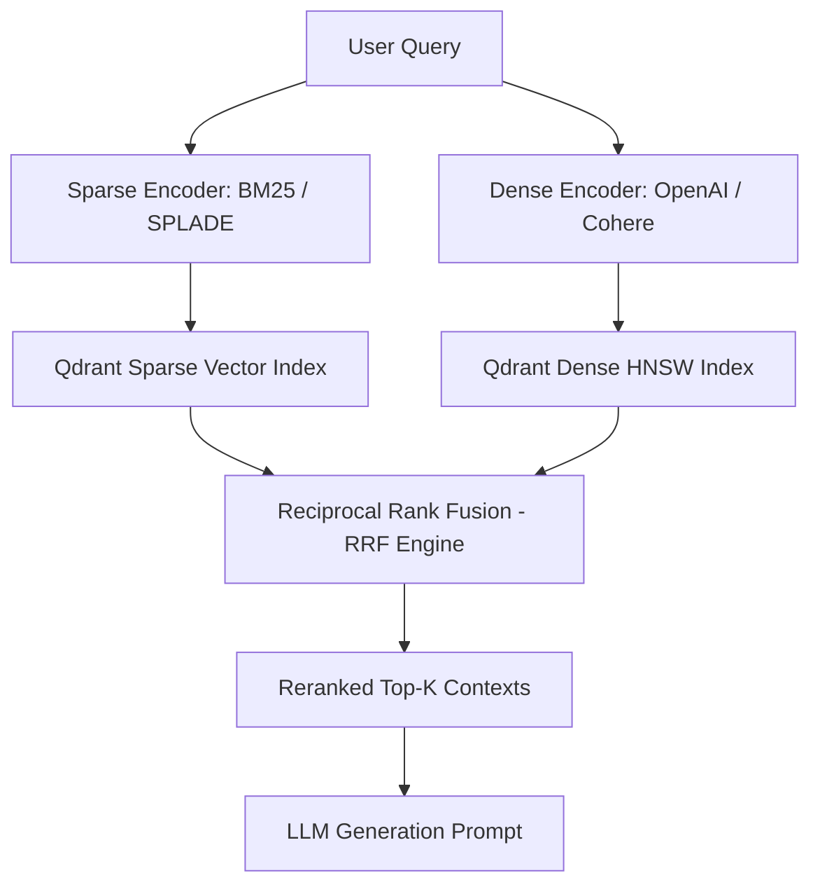

# Vector Database Architecture: HNSW Indexing & RAG Pipelines with Qdrant

> **Answer-First:** A Vector Database indexes high-dimensional embeddings using algorithms like Hierarchical Navigable Small World (HNSW) for ultra-fast semantic retrieval. In modern RAG architectures, combining dense semantic vectors with sparse BM25 keyword vectors via Reciprocal Rank Fusion (RRF) delivers optimal retrieval accuracy while Scalar and Binary Quantization reduce memory footprints up to 32x without degrading latency.

With the rapid advancement of Generative AI and Large Language Models (LLMs), the ability to interpret and retrieve unstructured data flexibly dictates the success of intelligent applications. When engineering foundational systems for [Cornerstone Technologies](/series/cornerstone-technologies/), understanding the role of Vector Databases is imperative. Unlike traditional database management systems, a Vector Database forms the nuclear engine within an authentic [AI Data Engineering Pipeline](/series/ai-data-engineering-pipeline/executive-summary/), transforming natural language into computationally queryable knowledge.

This article analyzes the internal architecture of Vector Databases, dissects how HNSW graph algorithms operate under the hood, compares Qdrant, Milvus, and pgvector, evaluates Binary Quantization techniques for 32x RAM reduction, and demonstrates production-grade RAG pipeline implementations in Golang.

## What is a Vector Database? The Core Engine of Modern AI Systems

A Vector Database is a specialized database system engineered to store, index, and query high-dimensional numeric arrays (vector embeddings). By leveraging Approximate Nearest Neighbor (ANN) algorithms like HNSW, Vector Databases perform sub-millisecond semantic retrieval across massive datasets, providing the underlying engine for RAG pipelines and AI Agents.

To understand why dedicated Vector Databases have become indispensable, it is essential to examine their fundamental architectural divergence from traditional relational databases.

Relational databases (such as MySQL or PostgreSQL) organize structured data within rigid tables consisting of rows and columns. Queries rely on SQL for exact match operations (e.g., `WHERE name = 'John'`) or pattern matching. While highly optimized for transactional and financial records, relational engines fail when tasked with interpreting unstructured data—such as text documents, images, or audio files—where capture of contextual semantics is required.

This challenge led to the adoption of **Vector Embeddings**. Embedding models (such as OpenAI's `text-embedding-ada-002` with 1,536 dimensions or BERT variants with 768 dimensions) map unstructured data into high-dimensional vector spaces. These numeric arrays encode semantic meaning. For instance, two sentences with entirely distinct lexicons but equivalent meanings (e.g., "The red sports car" and "A crimson four-wheeled vehicle") yield embedding vectors located in close geometric proximity.

Vector Databases are purpose-built to store millions or billions of high-dimensional vectors and perform fast K-Nearest Neighbor (KNN) searches against query vectors. Rather than executing character-level string matches, the database evaluates geometric distance metrics (such as Cosine Similarity or L2 Euclidean Distance) between vectors. This capability is essential for Retrieval-Augmented Generation (RAG) and has direct [applications in Agentic Search](/series/agentic-ecommerce-search/part-3-qdrant-hybrid-search/).

## Anatomy of HNSW Algorithm & Parameter Tuning (M, efConstruction, efSearch)

Hierarchical Navigable Small World (HNSW) is a state-of-the-art Approximate Nearest Neighbor (ANN) search algorithm that structures vector points into a multi-layer graph. Upper sparse layers enable rapid logarithmic traversal across large vector spaces, while lower dense layers refine local nearest neighbors. Performance and accuracy are tuned using parameters $M$, $efConstruction$, and $efSearch$.

In vector database architecture, executing exact K-Nearest Neighbor (KNN) brute-force searches across tens of millions of vectors creates unacceptable $O(N)$ computational latency. HNSW resolves this trade-off by accepting a negligible drop in absolute recall in exchange for logarithmic $O(\log N)$ search speedups.

HNSW operates on the following core structural principles and tuning parameters:

- **Multi-Layer Graph Topology:** Analogous to Skip Lists, HNSW organizes vectors into a hierarchy of graph layers. The top layer ($L$) contains widely scattered nodes for coarse routing. The bottom layer ($0$) contains all vectors connected via dense localized graphs.
- **Hierarchical Search Traversal:** When a query vector enters the system, traversal initiates at the top layer. The algorithm identifies the closest neighbor in the sparse graph, descends to the next lower layer using that neighbor as an entry point, and refines search candidate sets until reaching layer $0$.
- **Core Parameter Triad:**
  - **$M$ (Max Edges per Node, range 16–64):** Defines the maximum number of bi-directional links allocated per node in the graph. Higher $M$ values improve graph connectivity and retrieval recall but increase RAM overhead and index build time.
  - **$efConstruction$ (Build Search Depth, range 64–512):** Dictates the dynamic candidate evaluation depth during index construction. Setting higher $efConstruction$ values produces superior graph connectivity and recall at the expense of longer indexing build durations.
  - **$efSearch$ (Dynamic Query Depth, range 16–256):** Configures runtime search candidate evaluation depth during query execution. Increasing $efSearch$ pushes retrieval recall toward 100% while incrementally increasing query latency.
- **Small World Network Properties:** The "Small World" paradigm guarantees short path lengths between any pair of nodes in the graph regardless of dimensional distance, maintaining $O(\log N)$ search complexity.

## Hybrid Search RAG Architecture (BM25 + Dense HNSW + RRF)

Hybrid Search combines the strengths of Sparse Vectors (BM25 or SPLADE for exact keyword matching) with Dense Vectors (HNSW for semantic similarity). The Reciprocal Rank Fusion (RRF) algorithm synthesizes rank positions from both retrieval passes, producing contextually accurate RAG retrieval results.

Purely dense RAG systems often falter when queries involve exact product SKUs, proper names, or domain-specific terminology (e.g., error codes or acronyms). Conversely, sparse keyword algorithms like BM25 excel at exact matching but fail to resolve broader conceptual queries.

The diagram below illustrates the end-to-end query workflow of a 2026 Hybrid Search RAG Pipeline, routing user input through parallel sparse and dense encoders before merging top results via Reciprocal Rank Fusion (RRF):



The Reciprocal Rank Fusion (RRF) formula computes a unified score for each document $d$ across multiple retrieval models $M$:

$$RRF\_Score(d) = \sum_{m \in M} \frac{1}{k + r_m(d)}$$

Where $r_m(d)$ represents the ordinal rank of document $d$ within search model $m$, and $k$ is a smoothing constant (typically set to $k = 60$).

## Comparing Qdrant vs. Milvus vs. pgvector

Selecting a vector database depends on architectural requirements, data scale, and team ecosystem integration. Qdrant is a Rust-native engine optimized for single-node efficiency and easy scaling; Milvus is a cloud-native Go/C++ distributed platform built for billion-scale datasets; pgvector is a PostgreSQL extension ideal when co-locating vector search with existing relational databases under a few million vectors.

The comparison matrix below details the core architecture, indexing algorithms, scalability limits, RAM consumption, and ideal use cases for Qdrant, Milvus, and pgvector:

| Criteria | Qdrant | Milvus | pgvector (PostgreSQL) |
| --- | --- | --- | --- |
| **Core Architecture** | Standalone / Distributed (Rust) | Cloud-Native Distributed Microservices (Go/C++) | SQL Database Extension (C) |
| **Indexing Algorithms** | Native Rust HNSW | HNSW, IVFFlat, DiskANN, SCANN | HNSW, IVFFlat |
| **Scalability** | Optimized for tens to hundreds of millions of vectors. Efficient single-node execution. | Engineered for billion-scale vector datasets. Strict separation of storage and compute microservices. | Suited for small-to-medium datasets (under a few million vectors). |
| **RAM Footprint** | High (in-memory HNSW graphs), but supports advanced Scalar and Binary Quantization. | Very high; requires distributed server clusters and complex orchestration configurations. | Low-to-moderate; reuses PostgreSQL `shared_buffers` architecture. |
| **Ideal Use Case** | High-speed RAG pipelines requiring straightforward deployment and complex JSON payload filtering. | Enterprise AI applications with multi-tenancy, high-volume stream ingestion, and massive vector scales. | Integrating vector search directly alongside relational data without introducing new database engines. |

## Implementing a RAG Pipeline with Qdrant and Go

Implementing a RAG Pipeline using Qdrant and Go involves preparing text documents, requesting vector embeddings from model APIs (e.g., OpenAI), persisting vectors in a Qdrant collection, and executing semantic similarity queries.

To demonstrate Qdrant's capabilities as a system core, the RAG pipeline initialization requires establishing a gRPC client connection, setting up a collection, and executing filtered vector queries.

The Go implementation below demonstrates connecting to a Qdrant instance via gRPC to perform a vector search coupled with payload metadata filtering:

```go
package main

import (
	"context"
	"fmt"

	qdrant "github.com/qdrant/go-client/qdrant"
	"google.golang.org/grpc"
	"google.golang.org/grpc/credentials/insecure"
)

// QdrantRAGPipeline manages gRPC connections and executes vector queries with payload filtering
func QdrantRAGPipeline(ctx context.Context, queryVector []float32, categoryFilter string) ([]*qdrant.ScoredPoint, error) {
	// 1. Initialize gRPC connection to Qdrant Server
	conn, err := grpc.DialContext(ctx, "localhost:6334", grpc.WithTransportCredentials(insecure.NewCredentials()))
	if err != nil {
		return nil, fmt.Errorf("failed to connect to Qdrant gRPC: %w", err)
	}
	defer conn.Close()

	client := qdrant.NewPointsClient(conn)

	// 2. Execute Vector Search query with Payload filtering
	searchRequest := &qdrant.SearchPoints{
		CollectionName: "knowledge_base",
		Vector:         queryVector,
		Limit:          5,
		WithPayload:    &qdrant.WithPayloadSelector{Selector: &qdrant.WithPayloadSelector_Enable{Enable: true}},
		Filter: &qdrant.Filter{
			Must: []*qdrant.Condition{
				{
					ConditionOneOf: &qdrant.Condition_Field{
						Field: &qdrant.FieldCondition{
							Key: "category",
							Match: &qdrant.Match{
								MatchValue: &qdrant.Match_Keyword{Keyword: categoryFilter},
							},
						},
					},
				},
			},
		},
	}

	res, err := client.Search(ctx, searchRequest)
	if err != nil {
		return nil, fmt.Errorf("vector query failed: %w", err)
	}

	return res.GetResult(), nil
}
```

## Memory Profiling: Binary Quantization (32x RAM Reduction) & Optimization

Optimizing RAM allocations for millions of vectors requires pre-calculating memory footprints and leveraging advanced vector quantization strategies. Binary Quantization (BQ) compresses 32-bit floating-point vectors to single-bit representations, reducing memory requirements up to 32x while accelerating distance calculations using hardware SIMD Hamming Distance operations.

Memory capacity planning represents the primary challenge when running vector databases in production. While HNSW delivers sub-millisecond retrieval, it requires graph structures to reside in active memory.

During a production incident on a large-scale deployment, ingesting 5 million 1,536-dimensional vectors with metadata into Qdrant on a 32GB RAM node caused an out-of-memory crash. Baseline memory hovered near 25GB, but background HNSW graph re-indexing caused memory spikes that triggered Linux OOM killers. Accurate RAM calculation is vital before launching high-density vector indexes.

The vector quantization spectrum offers distinct memory and performance trade-offs:

- **Scalar Quantization (SQ8 - 4x RAM Reduction):** Compresses `float32` (4 bytes) to `int8` (1 byte). Reduces RAM consumption by 75% while maintaining retrieval recall above 98%.
- **Binary Quantization (BQ - 32x RAM Reduction):** Converts each float32 dimension to a single bit (0 or 1). Compresses 1 million 1,536-dimensional vectors from 6.14 GB down to **~192 MB** (32x memory reduction). Distance calculations transition to hardware SIMD bitwise XOR and POPCOUNT operations (AVX-512 / ARM Neon), increasing query throughput up to 40x.
- **Product Quantization (PQ):** Decomposes vectors into sub-vectors and applies centroid clustering, suitable for multi-billion vector scales.
- **Latency Impact:** Because quantized vectors fit within CPU L1/L2 caches, HNSW queries using Scalar Quantization drop search latencies from ~12ms down to **2–6ms**.

Additionally, Qdrant supports **Memory-Mapped Files (Memmap)**, allowing vector storage on NVMe SSDs while paging active segments into RAM on demand.

## Frequently Asked Questions (FAQ)

* **When should I choose pgvector over a dedicated vector database like Qdrant or Milvus?**
  pgvector is an excellent choice if your application already uses PostgreSQL, your vector dataset remains under a few million entries, and you require direct SQL JOIN operations between relational data and embeddings. However, for enterprise workloads exceeding tens of millions of vectors demanding sub-10ms query latencies under high concurrency, dedicated vector databases like Qdrant or Milvus provide superior performance through advanced quantization and specialized graph indexing.

* **How does Binary Quantization (BQ) achieve a 32x RAM reduction without severely ruining search accuracy?**
  Binary Quantization converts each 32-bit floating-point vector dimension down to a single bit based on its sign relative to zero, transforming high-dimensional floating-point arrays into compact bit vectors. This 32x memory reduction allows distance calculations to be executed via hardware-accelerated SIMD bitwise XOR and POPCOUNT operations (Hamming Distance), delivering massive memory savings and search speedups while maintaining high recall when combined with rescoring.

* **Do modern vector databases support real-time CRUD operations like traditional databases?**
  Yes, modern vector databases like Qdrant and Milvus fully support Create, Read, Update, and Delete (CRUD) operations on both vector embeddings and metadata payloads. However, because updating or deleting vectors modifies dynamic graph connections in HNSW, high-frequency writes trigger background graph compaction and re-indexing, making vector databases best optimized for write-once, read-heavy workloads.
