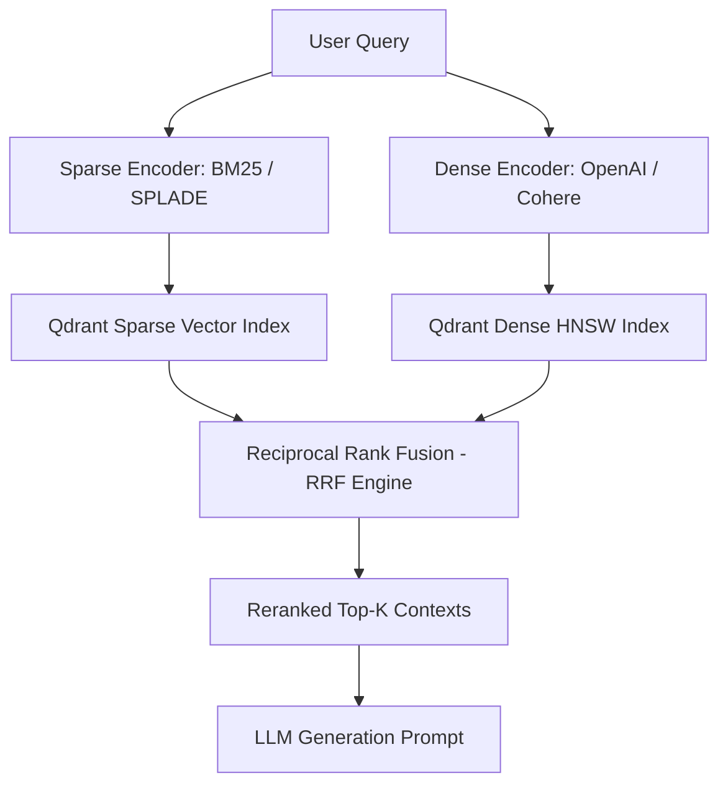

# Vector Database: Kiến trúc HNSW & RAG Pipeline (Qdrant)

> **Answer-first:** Vector Database là cơ sở dữ liệu lưu trữ và truy vấn vector embeddings qua thuật toán HNSW. Trong hệ thống RAG, Vector DB kết hợp dense vector và sparse vector (BM25) để tìm kiếm ngữ nghĩa siêu tốc, đồng thời nén RAM qua Scalar và Binary Quantization.

Trong bối cảnh AI sinh tạo (Generative AI) và Large Language Models (LLMs) phát triển mạnh mẽ, khả năng hiểu và truy xuất dữ liệu phi cấu trúc một cách linh hoạt là yếu tố quyết định sự thành bại của các ứng dụng thông minh. Nếu bạn đang thiết kế một kiến trúc nền tảng cho [Cornerstone Technologies](/series/cornerstone-technologies/), bạn sẽ không thể bỏ qua vai trò của Vector Database. Khác với các hệ quản trị cơ sở dữ liệu truyền thống, Vector Database là thành phần hạt nhân trong một [AI Data Engineering Pipeline](/series/ai-data-engineering-pipeline/executive-summary/) thực thụ, đảm nhiệm trọng trách biến ngôn ngữ tự nhiên thành tri thức có thể tính toán được.

Bài viết này phân tích chi tiết kiến trúc nội tại của Vector Database, mổ xẻ cách thuật toán HNSW vận hành dưới nắp capo, so sánh hai thế lực đáng gờm (Qdrant và Milvus), kỹ thuật Binary Quantization nén RAM 32x và cách triển khai RAG Pipeline thực chiến bằng Golang.

## Vector Database là gì? Trái tim của hệ thống AI

Vector Database (Cơ sở dữ liệu Vector) là loại database chuyên dụng để lưu trữ và truy vấn dữ liệu dưới dạng các mảng số (vector embeddings) nhiều chiều. Chúng sử dụng các thuật toán Approximate Nearest Neighbor (như HNSW) để tìm kiếm dữ liệu có ngữ nghĩa tương đồng (semantic search) siêu tốc, làm nền tảng cốt lõi cho các hệ thống RAG và AI Agents.

Để hiểu sâu sắc lý do Vector Database trở nên không thể thiếu, chúng ta cần xem xét sự khác biệt căn bản của nó so với Relational Database (Cơ sở dữ liệu quan hệ) và cách nó biểu diễn dữ liệu.

Relational Database (như MySQL, PostgreSQL) lưu trữ dữ liệu trong các bảng có cấu trúc nghiêm ngặt (hàng và cột). Khi tìm kiếm, chúng ta dùng ngôn ngữ SQL để thực thi các lệnh so khớp chính xác (exact match - ví dụ: `WHERE name = 'John'`) hoặc so khớp chuỗi một cách cơ bản. Điều này cực kỳ hiệu quả đối với dữ liệu giao dịch, tài chính hay thông tin người dùng. Tuy nhiên, khi đối mặt với dữ liệu phi cấu trúc như văn bản (một đoạn văn, một bài báo), hình ảnh, hoặc âm thanh, cách tiếp cận này hoàn toàn vô vọng trong việc nắm bắt "ý nghĩa" hay "ngữ cảnh".

Đó là lúc **Vector Embeddings** xuất hiện. Embedding là quá trình sử dụng các mô hình Machine Learning (như mô hình text-embedding-ada-002 của OpenAI với 1536 chiều, hay các mô hình BERT với 768 chiều) để biến một đoạn text, một hình ảnh thành một mảng số thực dài. Mảng số này mã hóa ý nghĩa ngữ nghĩa của đối tượng đó. Hai câu có cấu trúc từ vựng hoàn toàn khác nhau nhưng cùng mang một ý nghĩa (ví dụ: "Chiếc xe hơi màu đỏ" và "Phương tiện giao thông bốn bánh sắc đỏ") sẽ có hai vector nằm rất gần nhau trong không gian nhiều chiều.

Vector Database sinh ra để lưu trữ hàng triệu, thậm chí hàng tỷ vector này và cung cấp khả năng tìm kiếm các vector lân cận gần nhất (Nearest Neighbors) so với một query vector đầu vào. Thay vì tìm kiếm sự trùng khớp ký tự, nó đo lường khoảng cách hình học (ví dụ: Cosine Similarity, L2 Euclidean Distance) giữa các vector. Điều này đặc biệt thiết yếu đối với các hệ thống Retrieval-Augmented Generation (RAG) và có [ứng dụng trong Agentic Search](/series/agentic-ecommerce-search/part-3-qdrant-hybrid-search/).

## Giải phẫu thuật toán HNSW & Parameter Tuning (M, efConstruction, efSearch)

HNSW (Hierarchical Navigable Small World) là thuật toán tìm kiếm lân cận gần đúng (ANN) hoạt động bằng cách xây dựng một đồ thị nhiều tầng. Các tầng trên cùng thưa thớt giúp duyệt nhanh các khoảng cách xa, trong khi các tầng dưới cùng dày đặc giúp tìm chính xác các điểm lân cận gần nhất, với hiệu năng điều chỉnh qua các tham số M, efConstruction, và efSearch.

Trong kiến trúc Vector Database, việc tìm kiếm chính xác (K-Nearest Neighbors - KNN) bằng cách duyệt qua tất cả các vector là bất khả thi về mặt thời gian khi tập dữ liệu lên tới hàng chục triệu điểm. Thuật toán HNSW ra đời để giải bài toán đánh đổi: chúng ta chấp nhận giảm một tỷ lệ nhỏ độ chính xác tuyệt đối (Approximate Nearest Neighbor - ANN) để đạt tốc độ tìm kiếm siêu việt.

HNSW hoạt động dựa trên các nguyên lý và thông số tinh chỉnh sau đây:

- **Cấu trúc Đồ thị nhiều tầng (Hierarchical Graph):** Tương tự như cách cấu trúc dữ liệu Skip List hoạt động, HNSW tổ chức các vector thành một tập hợp các tầng (layers). Tầng cao nhất (Tầng $L$) chỉ chứa rất ít các node phân tán rộng rãi. Tầng dưới cùng (Tầng $0$) chứa tất cả các node.
- **Quá trình tìm kiếm (Routing / Search):** Khi có một truy vấn (query vector), quá trình tìm kiếm luôn bắt đầu từ tầng trên cùng. Thuật toán tìm node gần query nhất ở tầng này, sau đó nhảy xuống tầng dưới, dùng node vừa tìm được làm điểm bắt đầu, tiếp tục tìm node lân cận gần hơn. Nhờ cấu trúc thưa thớt ở tầng trên, thuật toán nhanh chóng vượt qua các khoảng không gian lớn, và ở các tầng dưới, nó tinh chỉnh kết quả cục bộ.
- **Bộ ba tham số tuning cốt lõi trong HNSW:**
  - **$M$ (Max Edges per Node, range 16–64):** Quy định số lượng liên kết tối đa của một điểm dữ liệu với các điểm lân cận trong đồ thị. $M$ càng cao, đồ thị càng kết nối chặt chẽ, cải thiện độ chính xác (recall) nhưng tiêu tốn thêm RAM và giảm tốc độ đánh chỉ mục.
  - **$efConstruction$ (Build Search Depth, range 64–512):** Xác định độ sâu tìm kiếm khi chèn vector mới vào đồ thị HNSW. Giá trị $efConstruction$ lớn sẽ xây dựng cấu trúc đồ thị tối ưu hơn, giúp recall cao hơn nhưng làm tăng đáng kể thời gian build index.
  - **$efSearch$ (Dynamic Query Depth, range 16–256):** Tham số tinh chỉnh động ở runtime khi thực hiện câu lệnh tìm kiếm. Tăng $efSearch$ giúp truy vấn tìm kiếm đạt recall tiệm cận 100%, đổi lại latency sẽ tăng nhẹ.
- **Small World Network:** Đặc tính "Small World" đảm bảo rằng luôn có các đường nối ngắn gọn (short paths) giữa bất kỳ hai điểm nào trong đồ thị, dù chúng có xa nhau tới đâu trong không gian nhiều chiều, giữ chi phí tìm kiếm ở độ phức tạp logarit $O(\log n)$.

## Hybrid Search RAG Architecture (BM25 + Dense HNSW + RRF)

Hybrid Search kết hợp thế mạnh của Sparse Vector (BM25/SPLADE tìm kiếm từ khóa chính xác) và Dense Vector (HNSW tìm kiếm ngữ nghĩa). Thuật toán Reciprocal Rank Fusion (RRF) tổng hợp điểm số thứ hạng từ cả hai phương pháp để tạo ra ngữ cảnh RAG có độ chính xác vượt trội.

Các hệ thống RAG thuần Dense Embeddings thường gặp điểm yếu khi người dùng tìm kiếm mã sản phẩm (SKU), tên riêng, hoặc thuật ngữ chuyên ngành (mã lỗi, từ viết tắt). Sparse Vector như BM25 lại xử lý các từ khóa chính xác tuyệt vời nhưng thất bại trước các câu hỏi ngữ nghĩa rộng.

Sơ đồ Mermaid dưới đây thể hiện luồng xử lý truy vấn Hybrid Search trong RAG Pipeline 2026, kết hợp giữa Sparse Vector (BM25) và Dense Vector (HNSW) thông qua Reciprocal Rank Fusion (RRF):



Công thức Reciprocal Rank Fusion (RRF) tính điểm tổng hợp cho mỗi tài liệu $d$:

$$RRF\_Score(d) = \sum_{m \in M} \frac{1}{k + r_m(d)}$$

Trong đó $r_m(d)$ là thứ hạng của tài liệu $d$ trong phương pháp tìm kiếm $m$, và $k$ là hằng số làm mịn (thường chọn $k = 60$).

## So sánh Qdrant vs Milvus vs pgvector

Qdrant là Vector DB viết bằng Rust, tối ưu cho single-node và scale vừa phải; Milvus viết bằng Go/C++, kiến trúc phân tán cloud-native phù hợp với dữ liệu tỷ scale; pgvector là extension của PostgreSQL, lý tưởng khi hệ thống đã dùng Postgres và dữ liệu dưới vài triệu vectors.

Việc chọn hệ quản trị Vector DB phụ thuộc hoàn toàn vào bài toán kiến trúc, quy mô dữ liệu và hệ sinh thái kỹ thuật hiện hữu của team. Dưới đây là bảng so sánh chi tiết:

| Tiêu chí | Qdrant | Milvus | pgvector (PostgreSQL) |
| --- | --- | --- | --- |
| **Kiến trúc lõi** | Standalone / Phân tán (Rust) | Distributed Cloud-native Microservices (Go/C++) | Extension trên SQL DB (C) |
| **Thuật toán chính** | HNSW (Tối ưu riêng bằng Rust) | HNSW, IVFFlat, DiskANN, SCANN | HNSW, IVFFlat |
| **Quy mô (Scalability)** | Tối ưu cho hàng chục đến hàng trăm triệu vectors. Chạy tốt trên single-node. | Thiết kế cho hàng tỷ (Billion-scale) vectors. Phân tách rạch ròi Storage/Compute. | Phù hợp với Scale nhỏ và vừa (dưới vài triệu vectors). |
| **Tiêu thụ RAM** | Cao (do lưu HNSW trên RAM), nhưng hỗ trợ tốt Scalar & Binary Quantization. | Rất cao, đòi hỏi cụm máy chủ lớn và cấu hình phức tạp. | Thấp đến trung bình, tận dụng được shared_buffers của Postgres. |
| **Use-case lý tưởng** | RAG pipelines cần tốc độ cao, triển khai dễ, cần payload JSON lọc (Filtering) phức tạp. | Dự án Enterprise AI, multi-tenancy, stream data mạnh, khối lượng dữ liệu khổng lồ. | Tích hợp Vector search ngay cạnh dữ liệu quan hệ (relational data), không muốn thêm DB mới. |

## Triển khai RAG Pipeline với Qdrant và Go

Triển khai RAG Pipeline với Qdrant và Go bao gồm các bước: chuẩn bị dữ liệu văn bản, gọi API embedding (như OpenAI) để biến text thành mảng số, lưu trữ vào Qdrant collection, và cuối cùng truy vấn vector để tìm kiếm ngữ nghĩa khi có request từ người dùng.

Để minh chứng cho sức mạnh của Qdrant trong vai trò lõi của hệ thống, quy trình xây dựng RAG Pipeline cần kết nối gRPC Client, tạo Collection và thực hiện truy vấn lọc metadata.

Đoạn mã Golang dưới đây hướng dẫn kết nối Qdrant Server qua gRPC, khởi tạo collection với Cosine distance, và thực thi truy vấn vector kèm theo bộ lọc payload (filtering) cho RAG Pipeline:

```go
package main

import (
	"context"
	"fmt"

	qdrant "github.com/qdrant/go-client/qdrant"
	"google.golang.org/grpc"
	"google.golang.org/grpc/credentials/insecure"
)

// QdrantRAGPipeline quản lý kết nối gRPC và truy vấn vector kèm payload filtering
func QdrantRAGPipeline(ctx context.Context, queryVector []float32, categoryFilter string) ([]*qdrant.ScoredPoint, error) {
	// 1. Khởi tạo kết nối gRPC tới Qdrant Server
	conn, err := grpc.DialContext(ctx, "localhost:6334", grpc.WithTransportCredentials(insecure.NewCredentials()))
	if err != nil {
		return nil, fmt.Errorf("không thể kết nối gRPC Qdrant: %w", err)
	}
	defer conn.Close()

	client := qdrant.NewPointsClient(conn)

	// 2. Thực thi câu lệnh Vector Search kèm bộ lọc Payload
	searchRequest := &qdrant.SearchPoints{
		CollectionName: "knowledge_base",
		Vector:         queryVector,
		Limit:          5,
		WithPayload:    &qdrant.WithPayloadSelector{Selector: &qdrant.WithPayloadSelector_Enable{Enable: true}},
		Filter: &qdrant.Filter{
			Must: []*qdrant.Condition{
				{
					ConditionOneOf: &qdrant.Condition_Field{
						Field: &qdrant.FieldCondition{
							Key: "category",
							Match: &qdrant.Match{
								MatchValue: &qdrant.Match_Keyword{Keyword: categoryFilter},
							},
						},
					},
				},
			},
		},
	}

	res, err := client.Search(ctx, searchRequest)
	if err != nil {
		return nil, fmt.Errorf("truy vấn vector thất bại: %w", err)
	}

	return res.GetResult(), nil
}
```

## Memory Profiling: Binary Quantization (32x RAM Reduction) & Optimization

Tối ưu RAM cho hàng triệu vectors đòi hỏi phải tính toán trước memory footprint và sử dụng các công nghệ nén tiên tiến. Kỹ thuật Binary Quantization (BQ) cho phép nén vector float32 xuống 1-bit, giảm đến 32 lần dung lượng RAM và tăng tốc tính toán khoảng cách nhờ phép toán Hamming Distance phần cứng.

Quản trị RAM là thách thức lớn nhất khi vận hành Vector Database trên production. Thuật toán HNSW đem lại tốc độ xé gió, nhưng cái giá phải trả là nó cần toàn bộ dữ liệu (hoặc phần lớn cấu trúc đồ thị) phải thường trực trên RAM.

Với vai trò Senior Go Engineer, tôi từng đối mặt với sự cố **OOM (Out of Memory) thảm họa trên production** khi nhồi hơn 5 triệu vectors 1536-dims (kèm metadata) vào Qdrant trên một máy chủ 32GB RAM. Trạng thái bình thường máy chủ ngốn khoảng 25GB, nhưng khi HNSW graph bắt đầu re-indexing ở chế độ nền, RAM vọt lên đỉnh điểm và tiến trình bị sập. Bài học rút ra là: **Tuyệt đối không được đoán mò kích thước RAM.**

Dưới đây là so sánh phổ kỹ thuật Quantization (Quantization Spectrum) và các chỉ số thực tế:

- **Scalar Quantization (SQ8 - 4x RAM Reduction):** Ép kiểu `float32` (4 bytes) về `int8` (1 byte). RAM tiêu thụ giảm 75%, recall giữ mức > 98%.
- **Binary Quantization (BQ - 32x RAM Reduction):** Chuyển đổi mỗi chiều float32 thành 1 bit (0 hoặc 1). 1M vectors 1536-dims từ 6.14 GB giảm xuống còn **~192 MB** (nén 32 lần). Ngoài ra, các phép tính khoảng cách chuyển từ tính toán số thực sang chỉ thị SIMD Hamming Distance (AVX-512 / ARM Neon), giúp tăng tốc truy vấn đến 40 lần.
- **Product Quantization (PQ):** Chia vector thành các sub-vectors và áp dụng gom cụm (centroid clustering), tối ưu cho hàng tỷ vectors.
- **Tác động Latency Benchmark:** Nhờ kích thước nén vừa vặn với CPU L1/L2 cache, các truy vấn HNSW với Scalar Quantization giảm từ ~12ms xuống chỉ còn **~2-6ms**.

Ngoài ra, Qdrant cung cấp tính năng **Memmap (Memory Mapping)**, cho phép lưu trữ vectors trên ổ đĩa SSD NVMe tốc độ cao và chỉ page-in vào RAM các trang nhớ cần thiết.

## FAQ: Câu hỏi thường gặp về Vector DB

Dưới đây là các câu hỏi thường gặp khi triển khai Vector DB trên production, giải đáp về việc có nên dùng pgvector thay thế, khái niệm Quantization giúp giảm RAM, và khả năng hỗ trợ CRUD của các Vector DB hiện đại.

-   **Có nên dùng pgvector thay vì một Vector DB chuyên dụng không?**
    Nếu dự án của bạn đã có sẵn PostgreSQL, lượng dữ liệu vector tương đối nhỏ (dưới vài triệu vectors), và bạn muốn tận dụng các phép JOIN giữa dữ liệu quan hệ và vector trong cùng một câu query SQL, pgvector là sự lựa chọn tuyệt vời. Tuy nhiên, nếu bạn xây dựng hệ thống đòi hỏi scale lên hàng chục/trăm triệu vectors, yêu cầu tốc độ ms siêu thấp dưới tải nặng, và cần các tính năng chuyên sâu như Scalar/Binary Quantization, Payload Filtering riêng biệt, Qdrant hoặc Milvus chuyên dụng sẽ vượt trội hơn hẳn pgvector về hiệu năng.

-   **Quantization trong Vector DB là gì?**
    Quantization là kỹ thuật nén dữ liệu vector nhằm giảm dung lượng bộ nhớ. Scalar Quantization (SQ) thu hẹp khoảng biểu diễn số liệu (từ float32 xuống int8). Binary Quantization (BQ) nén số thực về 1-bit, giúp tiết kiệm tới 32 lần bộ nhớ RAM và tận dụng Hamming Distance để tăng tốc tính toán. Đổi lại, quá trình tìm kiếm sẽ tính toán khoảng cách "xấp xỉ", làm giảm nhẹ mức độ chính xác của kết quả.

-   **Vector DB có hỗ trợ CRUD như database truyền thống không?**
    Có. Các Vector DB hiện đại (như Qdrant, Milvus, Weaviate) không chỉ tìm kiếm mà còn hỗ trợ đầy đủ các thao tác CRUD (Create, Read, Update, Delete). Bạn có thể Upsert vector mới, Update metadata (payload), Xóa vector bằng ID, hoặc thậm chí xóa vector dựa trên các bộ lọc (filter) trên payload. Tuy nhiên, do cấu trúc đồ thị HNSW khá phức tạp, việc Update hay Delete liên tục (high-frequency) có thể gây phân mảnh đồ thị, buộc database phải thực hiện các tiến trình dọn dẹp và re-indexing ngầm tốn tài nguyên. Do đó, Vector DB tối ưu nhất cho các trường hợp "Write-Once, Read-Many".
